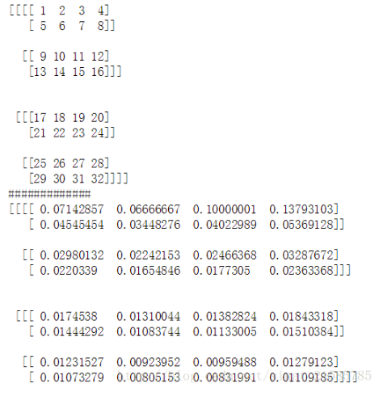
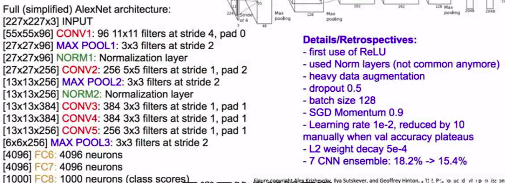

# AlexNet(2012)

2012年，Alex Krizhevsky发表了[AlexNet](https://papers.nips.cc/paper/4824-imagenet-classification-with-deep-convolutional-neural-networks.pdf)，相对比LeNet它的网络层次更加深，从LeNet的5层到AlexNet的7层，更重要的是AlexNet还赢得了2012年的ImageNet竞赛的第一。AlexNet不仅比LeNet的神经网络层数更多更深，并且可以学习更复杂的图像高维特征。

## 小结

* 使用ReLU函数作为激活函数，降低了Sigmoid类函数的计算量
* 利用dropout技术在训练期间选择性地剪掉某些神经元，避免模型过度拟合
* 引入max-pooling技术
* 利用双GPU NVIDIA GTX 580显著减少训练时间


## 论文概要

我们训练了一个最大的卷积神经网络来标记ILSVRC-2010 和 ILSVRC-2012比赛的数据集，并且实现了到目前为止在这些数据集上的最好结果。

> 在ImageNet上，通常报告两类错误率：top-1和top-5，top5错误率表示测试图片的标签不在模型所认为的五种标签之内。

我们写了一个实现2D卷积的高度优化的GPU和其他的一些公开的训练卷积神经网络的固有操作。

我们的网络包含大量新的和不寻常特点，这些特点提高了网络的效率并且减少了训练时间，详细介绍在第三部分。

我们的网络规模解决了过拟合这个重要问题，即使有1200万被标记的训练图片，我们使用了大量有效的技巧来防止过拟合，这将在第四部分详细介绍。

我们最终的网络包含5个卷积层和三个全连接层，而且这个深度似乎是非常重要的：我们发现移除任何一个卷积层(每层包含的参数不足整个模型的1%)都会导致非常差的效果。

最后，网络的大小主要由当前GPU的可用内存数量和我们所能忍受的训练时间所限制。我们的网络在两块3G的GTX 580GPU上训练了五六天的时间。所有的实验表明，我们的结果还能通过更快的GPU和更大的可用数据集来进一步提高。

## 预处理

ImageNet包含的图片分辨率是变化的，然而我们的系统需要的输入维数是一个常量。因此，我们采样这些图片一个固定的像素值256X256。给定一张矩形的图片，我们首先**重置这张图片的短边长度为256**，然后**从得到的图片中裁剪出中心的256X256**。除了**从每一个像素中减去平均值**外，我们没有做任何其他的操作。

> 原文是*subtracting the mean activity over the training set from each pixel*，通过谷歌，觉得比较靠谱的解释是将训练集每个图像对应像素的R、G、B三个值分别求平均数，然后每个图像的每个像素的R值减去R平均，G值减去G平均，B值减去B平均。如有知友知道正确解释请在评论处指出，非常感谢。

所以，我们在像素的原始RGB值(**裁剪出的中心部分**)上训练我们的网络。

## 新奇点

### 激活函数ReLU

一般的方法是将神经元的输出作为函数$f(x)=tanh(x)$ 或$f(x)=(1+e^{-x})^{-1}$的输入x 。

依据梯度下降的时间，这些饱和非线性函数是比不饱和非线性函数$f(x)=max(0,x)$更慢的。根据Nair和Hinton，我们参考非线性的神经元Rectified Linear Units (ReLUs).

**用RELUs训练的深层卷积神经网络比用tanh等价的神经网络快很多倍**。

我们不是第一个考虑在CNNs中替换传统神经模型的。

例如，Jarrett et al. [11]宣称非线性函数$f(x)=|tanh(x)|$在Caltech-101数据集上对比度归一化后局部平均池化的效果是非常好的。

然而，在训练Caltech-101数据集首要的问题是**防止过拟合**，所以他们所谓的“良好效果”与我们报告的通过使用Relus来获得**加速拟合**训练集能力的结果是不一样的。更快的学习对大数据集上的大模型有非常重大的影响。

### 多GPU处理

采用的并行机制, 基本上每块GPU设置了一半的核函数(神经元)，一个额外的小技巧：GPU 的交流仅仅在某些层。意思是说，例如，第三层神经元的输入来自第二层的所有神经元。但是，第四层的神经元仅仅来自同一块GPU上第三层的神经元。选择这种连接方式对于交叉验证是一个问题，但是这允许我们精确地调整连接的数量直到计算数值是一个可以接受的值。

最后我们搭建的架构有一些类似Ciresan等人[5]提出的“柱状”CNN，不过我们的CNN网络的**columns**之间是非独立的。这个机制分别减小了我们的top1错误率1.7% 和 top5错误率1.2%，和每个卷积层许多神经元在同一块GPU上训练像比较起来，两块GPU网络比一块GPU花费更少的时间。

（单GPU模型和双GPU模型的神经元数量其实差不多，因为神经网络大部分的参数集中在第一个全连接层，其接收的是最后一个卷积层的输出结果。所以为了使两种模型具有大致相同数量的参数，我们没有将最后一个卷积层的规模减半，其后的全连接层也不用。这样的处理导致两者的分类效果对比其实是有利于单GPU模型的，因为它的神经元数量比双GPU模型的“一半”多一些。）

> 译者注：**columns**的解释我查阅了一篇名为*Multi-column Deep Neural Networks for Image Classification*的论文，也是Ciresan写的，里面有提到一个column就是一个DNNmodel，在此文中我推测是**指单个GPU里的神经网络**。而**非独立就是指两个GPU上的网络之间是有连接层**的。
>
> 在文中引用的“柱状”CNN from reference[5] *High-Performance Neural Networksfor Visual Object Classification*里没有直接提到independent column，但估计是指其GPU的implementation是相互独立的。另外一个推测依据是后文对two-GPU和one-GPU的描述，以及文中提到这是新颖的特征。

### 局部响应归一化

核函数的顺序在开始训练之前都是任意的而且是确定的。受真实神经元的启发，响应归一化的顺序实现了**单侧抑制**（lateral inhibition）的形式，**为使用不同核函数计算的神经元输出创造了竞争**。

> lateral inhibition:相近的神经元彼此之间发生的抑制作用，即在某个神经元受指刺激而产生兴奋时，再刺激相近的神经元，则后者所发生的兴奋对前者产生的抑制作用。

常量k,n，阿尔法，贝塔，是超参数，它的值使用一个验证集来确定，我们使$k=2,n=5,\alpha=10^{-4},\beta=0.75$.

我们在一些层**应用ReLu非线性变换之后，采用这个归一化**。

> Normalization是CNN里一个很重要的层，尤其是运用ReLUs的CNN，因为其没有boundary。而LRN的一个优点就是文中提到的侧抑制。我找到一篇对LRN的解释比较易懂的文献。[What Is Local Response Normalization In Convolutional Neural Networks](https://link.zhihu.com/?target=https%3A//prateekvjoshi.com/2016/04/05/what-is-local-response-normalization-in-convolutional-neural-networks/)。大致意思就是，真实的神经元利用侧抑制这一性质可以强化局部对比度从而强化识别能力。

这个机制和局部常量归一化有一些相似。但是我们的更准确的说是“亮度归一化”，因为我们没有减去平均值。

> https://blog.csdn.net/sinat_21585785/article/details/75087768?utm_source=copy 
>
> https://blog.csdn.net/hduxiejun/article/details/70570086


**公式**


**公式解释** 

这个公式中的a表示**卷积层（包括卷积操作和池化操作）后的输出结果**，这个输出结果的结构是一个四维数组`[batch,height,width,channel]`。

这里可以简单解释一下，batch就是批次数(每一批为一张图片)，height就是图片高度，width就是图片宽度.

channel就是通道数,**可以理解成一批图片中的某一个图片经过卷积操作后输出的神经元个数(或是理解成处理后的图片深度/卷积层的深度/切片数)**。

$a^{i}_{(x,y)}$表示在这个输出结构(输出的feature map)中的一个位置`[a,b,c,d]`，可以理解成在某一张图中的某一个通道下的某个高度和某个宽度位置的点，即第a张图的第d个通道下的高度为b宽度为c的点。

论文公式中的**N表示通道数(channel)**。

**$a,n/2,k,α,β$分别表示函数中的input, depth_radius, bias, alpha, beta**，其中$n/2,k,α,β$都是自定义的，特别注意一下$∑$叠加的方向是沿着通道方向的，即每个点值的平方和是沿着feature map的中对应第a批数据的结果的三个维度中的channel方向的，也就是**一个点同channel方向的前面n/2个通道（最小为第0个通道）和后n/2个通道（最大为第d-1个通道）的点的平方和(共n+1个点)**。

> 这个公式作用的结果就是导致: 若是当前通道的值偏大, 那么就会相对的减弱相邻通道的值的大小. 大值会抑制相邻通道的结果.


**实验代码**

```python
import tensorflow as tf
import numpy as np
x = np.array([i for i in range(1,33)]).reshape([2,2,2,4])
y = tf.nn.lrn(input=x, depth_radius=2, bias=0, alpha=1, beta=1)

with tf.Session() as sess:
    print(x)
    print('#############')
    print(y.eval())
```



**结果解释** 

这里要注意一下，如果把这个矩阵变成图片的格式是这样的 :


然后按照上面的叙述我们可以举个例子。比如26对应的输出结果0.00923952，计算如下

$26/(0+1*(25^2+26^2+27^2+28^2))^1$

### 重叠汇聚

在CNN中池化层汇总了同一个核函数下相邻神经元的输出。传统的，相邻池化单元并不重叠。为了更精确，一个池化层可以被认为是由相邻s个像素的池化网格所组成，每次汇总会汇聚池化单元中心像素的邻近zXz个单元。

* 如果我们假设s=z，我们获得CNN中传统的局部池化。
* 如果设s<z,我们获得重叠池化。

> 这里的s就是汇聚操作的步长

这是我们的网络里使用的参数，s=2, z=3。这个机制减小了top1错误率0.4%，top5错误率0.3%，和不重叠机制s=2,z=2比较起来,它**减小了等效面积的输出**。我们观察并发现，在训练有重叠池化的模型时, 不易过拟合。

### 分组卷积

群卷积最早出现于AlexNet中。是为了解决显存不够的问题，将网络部署在两张GTX 580显卡上训练，Alex认为group conv的方式能够增加 filter之间的对角相关性，而且能够减少训练参数，不容易过拟合，这类似于正则的效果。

我们假设上一层的输出feature map有N个，即通道数channel=N，也就是说上一层有N个卷积核。再假设群卷积的群数目M。那么该群卷积层的操作就是，先将channel分成M份。每一个group对应N/M个channel，与之独立连接。然后各个group卷积完成后将输出叠在一起（concatenate），作为这一层的输出channel。

> https://blog.csdn.net/hhy_csdn/article/details/80030468 
>
> https://www.leiphone.com/news/201709/AzBc9Sg44fs57hyY.html
>
> [变形卷积核、可分离卷积？卷积神经网络中十大拍案叫绝的操作。 - 知乎](https://zhuanlan.zhihu.com/p/28749411)

## 整体架构




* 第2,4,5卷积层的核函数仅仅和GPU上前一层的那些映射结果相连接, 第3层卷积层和第2层所有的映射结果相连接。

* 全连接层的神经元和前一层所有的神经元相连。

* 响应归一化层连接在第1,2卷积层后面。

* 最大池化层，如第3,4节描述的那样，连接在响应归一化层和第5卷基层后面。

* ReLu非线性函数应用在每一个卷积层和全连接层后面。

* 第1个卷积层用96个11X11X3的滤波器对224X224X3的图像以步长为4做滤波。

* 第2层卷积层以第1层卷积层(**LRN/池化**之后)的结果为输入，用256个5X5X48的滤波器做滤波。

* 第3,4,5卷积层互相连接没有任何池化/归一的干扰。

* 第3层卷积层有384个3X3X256 的核函数连接在第二层卷积层**LRN/池化**之后。

* 第4层卷积层有384个3X3X192核函数连接

* 第5层有256个3x3X192的核函数连接

* 全连接层各有4096个神经元。

* 最后一个全连接层的输出结果提供给1000-way softmax，并得出1000个分类标签的概率分布。

  > 上述原文是average across training cases of the log-probability of the correct label under the prediction distribution
  > 用公式表示为

## 防止过拟合的手段

### Data Augmentation(数据扩充)

最简单也最常见的减少过拟合的方法就是通过**保留标签转换**人为地扩大数据集。

我们运用两种数据增量方式，计算量都很小，所以转换得到的新图像不用存在硬盘中。我们的转换操作是在CPU上用python实现的，而GPU专门用于训练模型。所以实际训练中，数据增量操作对我们的CNN训练的总计算量没有影响。

1. 第一种数据增量方式是**图像变换(随机剪裁)和水平翻转**。具体操作是从原本大小为的图象中提取所有大小为的子图像（以及他们的水平翻转图像），然后将这些子图象作为我们CNN的输入图像。（这解释了为什么图二中我们模型的输入层的大小是）。经过如此操作，我们的训练数据集变为了原来的2048倍（  ）。虽然扩大后的数据之间的相关性非常大，但如果不这样操作，我们的网络会出现严重的过拟合现象，可能会迫使我们使用规模更小的网络。在测试的时候，模型对每个输入图像提取五个子图像（四个角落和中心）以及他们分别的水平翻转图像（总共10个），通过softmax层进行预测，并将10个预测值平均。

2. 第二种方式是调整训练图像的RGB各颜色通道强度(光照变换)。具体操作是，对训练数据集所有图像的每个像素RGB值分别进行主成分分析（PCA）。然后将原本的图像加上(主成分特征向量)与(特征值)和(一个随机量的乘积)。也就是对于某图像的每一个像素![I_{xy} = \left[ I_{xy} ^{R},I_{xy} ^{G},I_{xy} ^{B}\right]](https://www.zhihu.com/equation?tex=I_%7Bxy%7D+%3D+%5Cleft%5B+I_%7Bxy%7D+%5E%7BR%7D%2CI_%7Bxy%7D+%5E%7BG%7D%2CI_%7Bxy%7D+%5E%7BB%7D%5Cright%5D)加上以下算式的结果：

   ![\[ \left[\textbf{p}_{1},\textbf{p}_{2},\textbf{p}_{3}\right]\left[\alpha _{1}\lambda _{1},\alpha _{2}\lambda _{2},\alpha _{3}\lambda _{3}\right]^{T} \]](https://www.zhihu.com/equation?tex=%5C%5B+%5Cleft%5B%5Ctextbf%7Bp%7D_%7B1%7D%2C%5Ctextbf%7Bp%7D_%7B2%7D%2C%5Ctextbf%7Bp%7D_%7B3%7D%5Cright%5D%5Cleft%5B%5Calpha+_%7B1%7D%5Clambda+_%7B1%7D%2C%5Calpha+_%7B2%7D%5Clambda+_%7B2%7D%2C%5Calpha+_%7B3%7D%5Clambda+_%7B3%7D%5Cright%5D%5E%7BT%7D+%5C%5D)

   其中和是图像RGB值计算的协方差矩阵的第个**特征向量**和**特征值**，而就是前面提到的随机量，服从均值为0，标准差为0.1的正态分布。随机产生的一组将用于某张图的所有像素，直到该图再次被训练时才会重新产生新的。

   **这一调整是为了突出自然图像的一个重要性质，就是对物体图像的识别不应该受到其表面色彩的强度和颜色的影响。**

   通过该操作，我们CNN的Top1错误率降低了1个百分点。

### 随机失活

结合多个不同模型的预测结果可以降低测试错误率，但对于本身就需要数天时间训练的大型神经网络而言，这是很奢侈的。然而，还是有很高效的方法**能够结合模型的预测结果**，而且只耗费大约两倍的训练时间。

因此，**每一次训练一个图像时，神经网络就会随机生成一个新的架构，但这些架构中使用的权重是一样的**。通过随机失活减少了神经元之间复杂的互相适应性（co-adaptation），因为通过随机失活，神经元无法过分依赖于某个有输出结果的前一神经元（**译者注**：因为没有输出结果的神经元可能是因为被随机“失活”了，而不是因为其对输入特征解释能力不佳）。在随机神经元组的配合下，这个神经元也因此被迫去学习更加**鲁棒**且**有用**的特征。在测试时，我们使用所有的神经元，将他们的输出结果乘以0.5，这其实是由极多的经过随机失活的神经网络产生的平均分类结果的一个合理近似值。

我们在图中的**前两个全连接层运用随机失活**。否则，神经网络训练就会出现很严重的过拟合。但**随机失活几乎使得模型收敛所需要的循环翻倍**。

## 训练

### 细节

我们用随机梯度下降来训练模型，每一个批量有128个样本，动量为0.9，权值衰减为0.0005。

我们发现小权值衰减对模型的训练是很重要的。也就是说，**权值衰减在模型中不单单起到正则化作用；它还协助降低模型的训练错误率**。

权重的更新方法如下：

是循环序数，是动量参数，是学习率，是第个批量样本（128个）上**所有目标函数在处对权重的偏导数的均值**。

我们将每一个层级的权重初始化为**均值0，标准差0.01的正态随机量**。第二、四核五卷积层以及全连接层的**偏差系数（bias）设置为1**。这样可以在训练初期给ReLU单元提供正的输入值，从而加快训练速度。其他层级的偏差系数初始设为0。

所有的层级我们都使用相同的学习率，具体数值是我们在训练过程中不断调整得出的。主要调整方法是**每当模型在当前的学习率下验证错误率不再降低时，我们就把学习率除以10**。初始学习率是0.01，在完成训练过程中总共减少了三次。

### 结果

另一个探索神经网络视觉识别能力的方法是研究图像在最后一个层级，即维度为4096的隐含层上产生的特征激活状态（feature activation）（**译者注**：其实就是通过最后一个隐含层的输出结果）。

如果两个图像的**特征激活状态向量之间的欧式距离**比较小，那么就代表神经网络内部较高层次认为这两张图是类似的。(也就是送到最终输出的分类层上的输入近似的时候,也就更容易划分到一类)

也可以观察到，在**像素层面**上，返回的几张训练图像其实与第一列的测试图像的L2距离不是特别接近。

计算4096维实向量之间的欧式距离是很低效的，但可以**通过训练一个自动编码器将向量压缩成较短的二进制码，**从而提高效率。这应该产生一个相比把自编码器直接应用到原始的像素上更好的图像检索方法.因为**直接计算像素而不使用其标签会使得计算偏向于在图像边缘寻找模式的相似性**，不管它们实际图片内容上是否相似。

## 代码

```python
def alexnet_v2(inputs,
               num_classes=1000,
               is_training=True,
               dropout_keep_prob=0.5,
               spatial_squeeze=True,
               scope='alexnet_v2',
               global_pool=False):
  """AlexNet version 2.

  Described in: http://arxiv.org/pdf/1404.5997v2.pdf
  Parameters from:
  github.com/akrizhevsky/cuda-convnet2/blob/master/layers/
  layers-imagenet-1gpu.cfg

  Note: All the fully_connected layers have been transformed to conv2d layers.
        To use in classification mode, resize input to 224x224 or set
        global_pool=True. To use in fully convolutional mode, set
        spatial_squeeze to false.
        The LRN layers have been removed and change the initializers from
        random_normal_initializer to xavier_initializer.

  Args:
    inputs: a tensor of size [batch_size, height, width, channels].
    num_classes: the number of predicted classes. If 0 or None, the logits layer
    is omitted and the input features to the logits layer are returned instead.
    is_training: whether or not the model is being trained.
    dropout_keep_prob: the probability that activations are kept in the dropout
      layers during training.
    spatial_squeeze: whether or not should squeeze the spatial dimensions of the
      logits. Useful to remove unnecessary dimensions for classification.
    scope: Optional scope for the variables.
    global_pool: Optional boolean flag. If True, the input to the classification
      layer is avgpooled to size 1x1, for any input size. (This is not part
      of the original AlexNet.)

  Returns:
    net: the output of the logits layer (if num_classes is a non-zero integer),
      or the non-dropped-out input to the logits layer (if num_classes is 0
      or None).
    end_points: a dict of tensors with intermediate activations.
  """
  with tf.variable_scope(scope, 'alexnet_v2', [inputs]) as sc:
    end_points_collection = sc.original_name_scope + '_end_points'
    # Collect outputs for conv2d, fully_connected and max_pool2d.
    with slim.arg_scope([slim.conv2d, slim.fully_connected, slim.max_pool2d],
                        outputs_collections=[end_points_collection]):
      net = slim.conv2d(inputs, 64, [11, 11], 4, padding='VALID',
                        scope='conv1')
      net = slim.max_pool2d(net, [3, 3], 2, scope='pool1')
      net = slim.conv2d(net, 192, [5, 5], scope='conv2')
      net = slim.max_pool2d(net, [3, 3], 2, scope='pool2')
      net = slim.conv2d(net, 384, [3, 3], scope='conv3')
      net = slim.conv2d(net, 384, [3, 3], scope='conv4')
      net = slim.conv2d(net, 256, [3, 3], scope='conv5')
      net = slim.max_pool2d(net, [3, 3], 2, scope='pool5')

      # Use conv2d instead of fully_connected layers.
      with slim.arg_scope([slim.conv2d],
                          weights_initializer=trunc_normal(0.005),
                          biases_initializer=tf.constant_initializer(0.1)):
        net = slim.conv2d(net, 4096, [5, 5], padding='VALID',
                          scope='fc6')
        net = slim.dropout(net, dropout_keep_prob, is_training=is_training,
                           scope='dropout6')
        net = slim.conv2d(net, 4096, [1, 1], scope='fc7')
        # Convert end_points_collection into a end_point dict.
        end_points = slim.utils.convert_collection_to_dict(
            end_points_collection)
        if global_pool:
          net = tf.reduce_mean(net, [1, 2], keep_dims=True, name='global_pool')
          end_points['global_pool'] = net
        if num_classes:
          net = slim.dropout(net, dropout_keep_prob, is_training=is_training,
                             scope='dropout7')
          net = slim.conv2d(net, num_classes, [1, 1],
                            activation_fn=None,
                            normalizer_fn=None,
                            biases_initializer=tf.zeros_initializer(),
                            scope='fc8')
          if spatial_squeeze:
            net = tf.squeeze(net, [1, 2], name='fc8/squeezed')
          end_points[sc.name + '/fc8'] = net
      return net, end_points
alexnet_v2.default_image_size = 224
```

