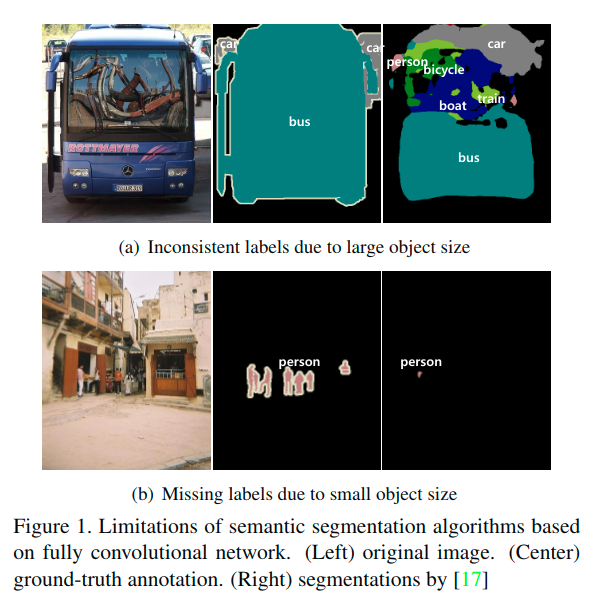
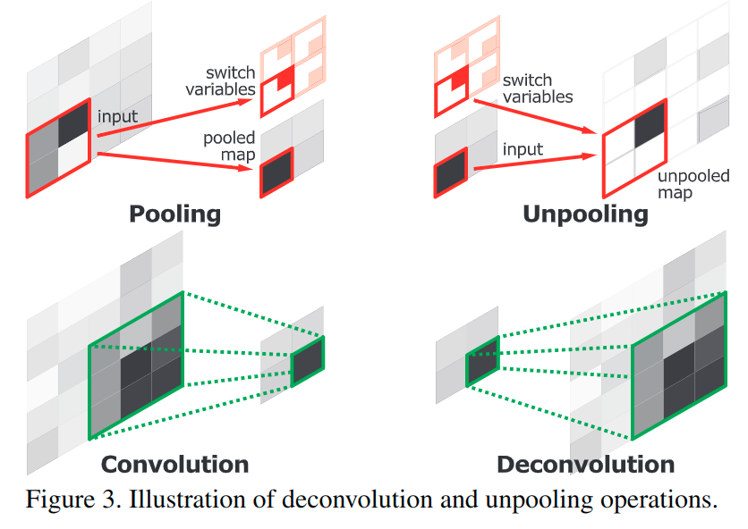
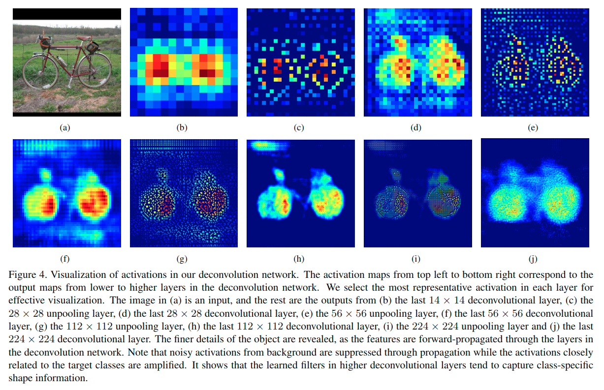
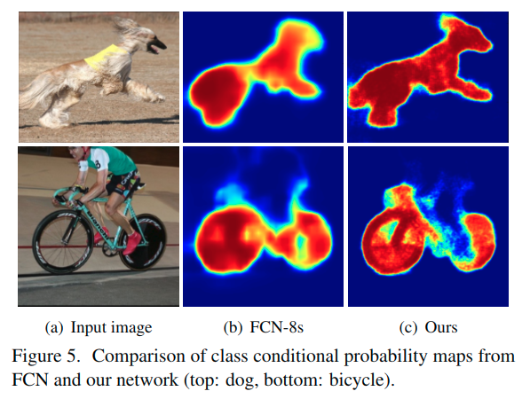
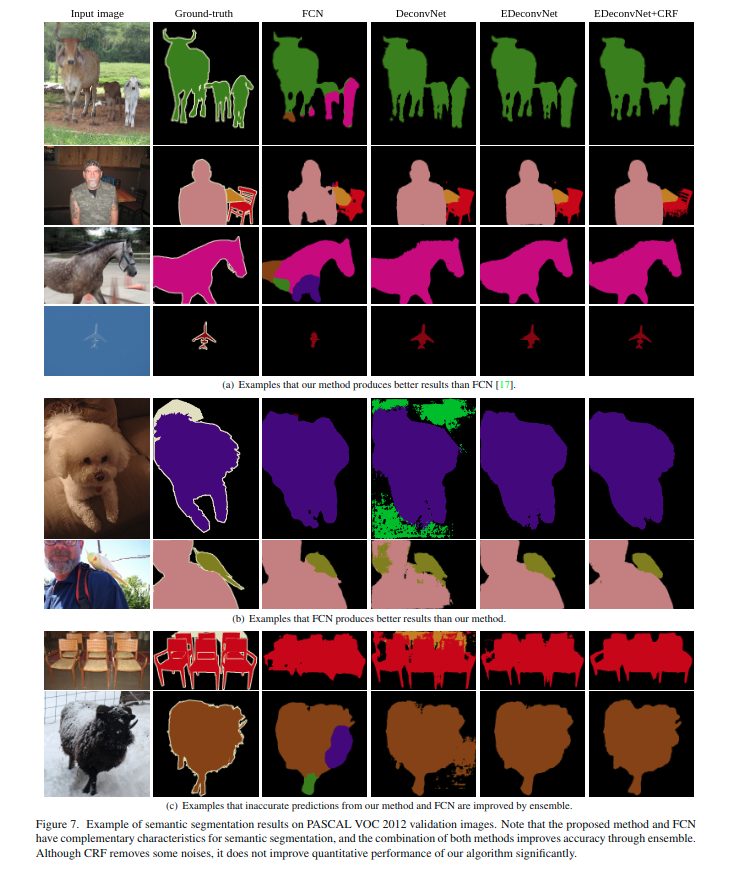

# Deconvolution Network(2015)

## 前言

> https://zhuanlan.zhihu.com/p/35549957

- 要解决什么问题？

  - 虽然FCN提出了使用卷积网络解决图像分割问题的具体思路，但还存在很多问题。

- 用了什么方法解决？

  - 与FCN相似，也使用了先卷积，后转置卷积的总体架构。
    - 相比FCN，DeconvNet使用了多层反卷积以及unpooling。
    - 在卷基层和转置卷积层后添加了BN，与FCN进行模型融合。

- 效果如何？

  - 在VOC数据集上，mean IU达到了72.5%，比FCN提高了10个百分点。
    - 在添加了CRF以及与FCN融合后，小物体的结果也更好了。

- 还存在什么问题？

  - 先说句题外话，在FCN笔记中已经提到了，Deconvolution是个不恰当的名字，应该改名为convolution transpose，即转置卷积。
    - 论文时间比较久远，效果一般
    - DeconvNet的层数是VGG的两倍，与看过的其他图像分割算法相比，参数数量应该多了不少。

## 系统架构

> 提议的完整架构, 在VGG-16的基础上构建, 在末尾换成了一个多层的反卷积网络来生成输入提议的准确语义分割图. 给出了从卷积网络中获取的特征表示, 通过多组反汇聚/反卷积/更正操作来构造密集的像素类别预测图.
>
> 网络的最终输出是**与输入图像具有相同大小的概率图**，表示属于某个预定义类的每个像素的概率。

我们训练的网络由两部分组成:卷积和反卷积网络。

* 卷积网络对应于将输入图像转换成多维特征表示的**特征提取器**
* 反卷积网络是**形状发生器**，其根据从卷积网络提取的特征产生对象分割

我们的卷积网络共有13个卷积层.

* 有时在卷积之间执行**整形和合并操作**
* 最后增加了2个完全连接的层，以强加类特定投影(impose class-specific projection)(就是实现标签映射)

* 我们的deconvolution network是卷积部分的镜像版本，并且具有多个系列的unpooling，deconvolution和整形(rectification)层
* 与通过前馈减小激活形状的卷积网络相反，反卷积网络通过unpooling and deconvolution操作的组合来扩大激活

---

> 1. 现有的工作
> 2. 存在的问题
> 3. 解决的方法
> 4. 本文方法的优缺点
> 5. 实际效果

## 现有的工作

CNN在许多视觉识别问题中非常流行，并且也被主动应用于语义分割。

我们首先总结了**基于监督学习的语义分割**的现有算法。

* 有几种基于分类的语义分割方法。

    * Mostajabi等人[18]和Farabet等[6]将多尺度超像素分类为预定义类别，并将像素级标注的分类结果组合在一起。

    * 一些算法[3,9,10]对区域提议进行分类，并在图像级分割图中对标签进行改进以获得最终分割。

    * 全卷积网络（FCN）[17]推动了基于深度学习的语义分割的最新突破。在这种方法中，**标准CNN中完全连接的层被解释为具有大容量感受野的卷积**，并且使用通过前馈输入图像获得的粗糙类分数图来实现分割。

        这项工作中一个有趣的想法是，一个简单的插值滤波器被用于反卷积，并且只有网络的CNN部分被调整以间接学习deconvolution。令人惊讶的是，输出网络在PASCAL VOC基准测试中表现出令人印象深刻的性能。

    * 陈等人[1]在FCN框架内获得更密集的分数图, 以预测像素级标签，并且使用完全连接的CRF[14]重新标记标签图。

* 除了基于监督学习的方法之外，已经提出了几种弱监督设置的语义分割技术。

    * 当对输入图像仅给出**边界框注释**时，[2，19]通过迭代过程来对注释进行精化，并获得准确的分割输出。
    * 另一方面，[20]在一个多实例学习框架中仅基于**图像级注释**进行语义分割。

语义分割涉及概念上的deconvolution，但学习deconvolution network并不常见。

在[25]中引入了deconvolution network来重建输入图像。由于max-pooling层对输入图像的重构很重要，它通过存储合并位置来实现unpooling操作。使用deconvoluton network，可以从其特征表示重建输入图像。

> 这种方法也被用来可视化训练过的CNN中的激活特征[24]，并更新网络架构以提高性能(performance enhancement)。这种可视化对于理解受过训练的CNN模型的行为很有用。

## 存在的问题

最近的语义分割算法通常被制定用于解决**基于CNN的结构化像素标签问题**。

他们将现有的用于分类的CNN体系结构转换为**完全卷积网络（FCN）**。他们通过对图像中的每个局部区域进行分类，从网络中获得粗略的标签映射，并执行简单的反卷积，该反卷积被实现为对像素标签的双线性插值. 条件随机场（CRF）可选地应用于输出映射以进行细分(fine segmentation)[14]。

基于FCN的方法的主要优点是**网络接受整个图像作为输入并执行快速和准确的推断**。

基于FCNs的语义分割[1,17]有一些关键的限制。

* 首先，由于固定大小的感受野，**网络只能处理图像中的单一尺度语义**。

    因此，*实质上大于或小于接受范围的对象可能被分割或错误标记*。换句话说，标签预测只用大型对象的局部信息完成，并且属于同一对象的像素可能具有不一致的标签，如图(a)所示。此外，小对象经常被忽略并被分类为背景，如图(b)所示。尽管[17]尝试用跳过架构来避开这个限制，但这不是一个基本的解决方案，性能增益也不是很重要。

* 其次，**对象的详细结构往往会丢失或平滑**，因为输入到反卷积层的标签映射太粗糙并且反卷积过程过于简单。

    请注意，在原始FCN [17]中，标签映射仅为16x16的大小，并被反卷积通过双线性插值在原始输入大小中生成分割结果。[1,17]中没有真正的反卷积，难以实现良好的性能。然而，最近的方法使用CRF改善(ameliorate)了这个问题[14]。

    > CRF 条件随机场
    >
    > 概率图模型学习笔记：HMM、MEMM、CRF - Scofield - 知乎
    > https://www.zhihu.com/question/35866596/answer/236886066

为了克服这些限制，我们采用完全不同的策略来执行基于CNN的语义分割。我们的主要贡献总结如下：

* 我们学习了一个多层去卷积网络，它由deconvolution, unpooling, and rectified linear unit (ReLU)层组成。学习deconvolution network进行语义分割是有意义的，但没有人尝试去完成它，但据我们所知(but no one has attempted to do it yet to our knowledge)。

* 将训练好的网络应用于单个对象提议，以获取实例级别的分段，这些分段被组合用于最终的语义分割; 它不存在基于FCN的方法中发现的规模问题，并可识别对象的细节。

* 我们使用仅在PASCAL VOC 2012数据集上训练的deconvolution network获得了出色的性能，通过利用我们的算法的异构和互补特性，基于FCN的方法，通过融合[17]来获得最佳精度。

我们相信所有这三项贡献都有助于实现PASCAL VOC 2012基准测试中的最新性能。

## 架构的新意

### unpooling

卷积网络中的pooling旨在通过用单个代表值抽象具有感受野的激活, 来过滤较低层中的噪声激活。虽然它通过仅保留上层的强大(robust)激活来帮助分类，但**在pooling期间，感受野内的空间信息会丢失**，这对于语义分割所需的精确定位非常重要。

为了解决这个问题, 我们在deconvoliution网络中使用unpooling层, 来实现对于pooling操作的恢复和重建激活的原始大小.

> https://blog.csdn.net/xiaxzhou/article/details/74012137

为了实现unpooling操作, 我们**在pooling采用max运算, 并记录最大激活位置到 switch variables，这些变量用于将每个激活放回其原始的位置**。这个策略在重构输入目标很管用.

### deconvolution

unpooling图层的输出是放大但稀疏的激活图。

deconvolution layers使得通过使用多个习得的滤波器进行类似卷积的运算的unpooling获得的稀疏激活变得密集。

然而，与卷积层相反，卷积层将滤波窗口内的多个输入激活连接到单个激活，而deconvolution layer则将单个输入激活与多个输出关联起来，如上图所示。deconvolution layer的输出是一个放大和密集的激活图。我们裁剪放大的激活图的边界以保持输出图的大小与preceding(前面的)unpooling layer的大小相同。

在deconvolution layer中**学习的滤波器对应于重构输入对象形状的基础**。

因此，类似于卷积网络，使用deconvolution layer的**分层结构来捕获不同级别的形状细节**。较低层的滤波器倾向于捕捉对象的整体形状，而类特定细节则编码在较高层的滤波器中。

通过这种方式，网络直接将类特定的形状信息考虑进来, 进行语义分割，这在其他仅基于卷积层[1,17]的方法中常常被忽略.

> 这里有个需要考虑的地方, 这个反卷积操作的实现?
>
> https://blog.csdn.net/ITleaks/article/details/80336825
>
> https://github.com/vdumoulin/conv_arithmetic
>
> (很好的一片介绍卷积的文章)https://arxiv.org/abs/1603.07285
>
> 反卷积主要是分数步长(可以看做输入像素中间插了0), 或者是外补0的卷积操作.
>
> 由于卷积核都是在训练过程中学习来的, 所以在一定程度上可以是实现较为良好的恢复效果.

在所提出的算法中，deconvolution网络是精确对象分割的关键组件。

与粗糙激活图上执行的简单deconvolution相反，我们的算法使用深度deconvolution网络生成目标分割掩模，其中通过unpooling和deconvolution和整形的连续操作, 来获得密集的像素级类概率图。

图中逐层显示来自网络的输出，这有助于理解我们的deconvolution网络的内部操作.

* 我们可以观察到，通过deconvolution layers中的传播来重建粗到细的对象结构

* 较低层倾向于捕获对象的整体粗略配置（例如位置，形状和区域），而在较高层中发现更复杂的模式
* 请注意，unpooling和deconvolution对构建分割蒙版起到不同的作用
* Unpooling通过将强激活的原始位置追溯到图像空间来捕获特定示例的结构。因此，它有效地重构了一个细致分辨率上对象的(d/e/i/j)更细致的结构
* 另一方面，deconvolution layers中习得的滤波器倾向于捕获类特定的形状。通过deconvolutions，与目标类别紧密相关的激活被放大，而来自其他区域的噪声激活被有效抑制
* 通过unpooling和deconvolution相结合，我们的网络可生成准确的分割图

> 显示了FCN-8和我们的网络的输出示例。与FCN-8的粗略激活图相比，我们的网络使用deconvolution网络构建密集且精确的激活。

### Overview

我们的算法把语义分割看作**实例分割**(instance-wise segmentation problem)问题。

也就是说，网络将一个可能包含对象(potentially containing objects)的子图像（我们之后将其称为实例）作为输入，并生成像素级类别预测作为输出。

根据我们的网络，整个图像的语义分割是通过**将网络应用于从图像中提取的每个候选提议并将所有提议的输出聚合到原始图像空间**而获得的。

与图像级预测相比，实例层面的分割具有一些优点。

* 它能有效的处理各种尺度的物体
* 能识别目标的细节

而具有固定大小的感受野的方法对这些问题有困难。

此外，它通过**减少预测的搜索空间**来减轻训练的复杂性，并减少了训练的内存需求。

## 实际效果

### 训练

1. BN: 由于内部协变量问题，深层神经网络很难优化[11]

    随着其先前层的参数被更新，每层中的输入分布在训练期间随迭代而改变。这在优化非常深的网络方面存在问题，因为**分布的变化通过跨层传播来扩大**。我们通过标准化每层的输入分布到标准高斯分布来执行批量归一化[11]以减少内部协变量偏移

    为此，在每个卷积和去卷积层的输出上添加批量归一化层

    我们观察到，批量标准化对优化我们的网络至关重要;如果没有批量标准化，结果会导致局部最优化

2. 两阶段训练: 虽然批量归一化有助于避免局部最优，但语义分割的空间与训练样例的数量相比仍然非常大，使用反卷积网络实例分割的优势将被抵消。

    我们采用两阶段训练方法来解决这个问题，我们**首先用简单的例子来训练网络，然后用更具挑战性的例子对训练好的网络进行细化**。

    * 为了构建第一阶段训练的训练样例，我们使用真实注释来裁剪目标实例，以便目标位于裁剪的边界框的中心。**通过限制对象位置和大小的变化，我们大大减少了语义分割的搜索空间**，并成功地用少得多的训练样例来训练网络。

    * 在第二阶段，我们利用目标提议来构建更具挑战性的例子。具体而言，**选择与真实分割充分重叠的候选提议来进行训练**。使用这些提议来构建训练数据, 使得网络对于测试中提议的错位更加稳健，但是由于训练实例中目标的位置和大小可能会有显着不同，所以使训练更具挑战性。

### 测试

**所提出的网络被训练为对各个实例执行语义分割**。

* 给定输入图像，我们首先生成足够数量的候选提议，并将训练好的网络用于获得单个提议的语义分割图。

* 然后，我们汇总所有提议的输出，以在整个图像上生成语义分割。

* 可选地，我们将我们的方法与FCN集成[17]以进一步提高性能。

#### 汇总实例分割图

由于一些提议可能会导致错误的预测，这是由于与对象不匹配或混乱的背景，我们应该在汇总期间抑制这种噪声。

对应于所有类别的得分图的像素层次最大值或平均值, 被证明足以获得稳健结果。

* 成为第i个提案的输出分数图, 其WxH和C分别表示提案的大小和类数。

* 我们首先将它放在图像空间上，在gi之外用零填充

* 我们在原始图像大小上, 用Gi表示对应于gi的分割图

* 我们通过汇总所有提案的输出来构建图像的像素级类分数图, 通过下面的方法:

    

    通过将softmax函数应用于汇总由等式1 or 2获得的图来在原始图像空间获得类条件概率图(Class conditional probability maps in the original image space are obtained by applying softmax function to the aggregated maps obtained by Eq..)。

* 最后，我们将完全连接的CRF [14]应用于最终像素标记的输出图，其中从像素级类条件概率图获得一元势(unary potential)。

    > https://blog.csdn.net/lansatiankongxxc/article/details/45590545
    >
    > 很多视觉问题可以表述成一个能量函数的形式，例如，图像的语义分割或者叫做image parsing问题可以表述成：
    > $$
    > \begin{equation}
    > E(f)=\sum_{p\in \mathcal{P}}D_p(f_p)+\sum_{(p,q)\in \mathcal{N}}W(f_p,f_q)
    > \end{equation}
    > $$
    > 我们的目标是求这个函数的最小值.
    >
    > 其中$\mathcal{P}$是图像的像素集合，$\mathcal{L}$是图像的像素所属的标签集合，这些标签对应着我们要求的像素的某些量值，例如**图像恢复问题中的原本的像素值**，或是更高级的**图像语义分割中像素所属于的类别**。
    >
    > 一个标注labeling f所做的就是给图像的每个像素一个标签，可以把f看成一个向量或是矩阵，对应分配给图像的每个像素$p\in \mathcal{P}$一个标签$f_p\in\mathcal{L}$.
    >
    > 然后我们**用一个能量函数衡量这个标注的好坏**。
    >
    > 大部分能量函数都是由两个部分组成，第一个一般叫**unary potential**，叫一元势函数，第二项一般叫**pairwise potential**，点对势函数(二元势函数)。
    >
    > * **一般一元势函数的作用是体现单个像素点似然标签，属于某个标签的概率高，那么这个值越小**，也有叫label cost，*将标签赋予该像素的损失*. 
    >
    >     例如在图像恢复里面，像素有很大的可能性是没有被noise更改的，这样可以设原本像素的unary potential小一些；或者根据在图像语义分割里面每个像素求到的类条件概率$D_p(f_p)=1-P(f_p|p)$，似然越高，label cost当然越小。
    >
    > * **一般点对势函数是衡量像素与像素之间的标签关系的**，例如MRF，只会考虑位置相邻的像素的标签关系. 
    >
    >     关于相邻标签关系:
    >
    >     * 一方面由于图像连续性，我们希望图像的相邻像素(特别是颜色纹理等特征相似的相邻像素)会有相同的标签
    >     * 另一方面，我们也希望在一些必要的地方，例如物体的边缘什么的位置，能够保持这种边缘关系，能够有不同的标签，不要都over smooth成一个标签了，一般这个叫做discontinuity  preserving property(非连续保留属性)。
    >
    > N在CV里面一般就是图像的像素构成四连接grid graph的边。
    >
    > 在[1] 中解释
    >
    > * 到$D_p(f_p)$是**将标签$f_p$分配给p的cost**
    > * $W(f_p,f_q)$是**分配两个相邻像素的标签为$f_p,f_q$的cost**，也叫不连续cost，
    >
    > 最小化这个函数和最大化MRF的后验概率是等价的。 

#### 集成FCN

我们基于去卷积网络的算法与依赖于FCN的方法具有互补性(complementary characteristics).

我们的反卷积网络**适合捕捉对象的细节**(fine-details)，而FCN通常**擅长提取对象的整体形状**。

另外，实例预测对于处理具有不同尺度的对象是有用的，而具有粗尺度的完全卷积网络可能有利于捕获图像的内容。利用这些异构属性(Exploiting these heterogeneous properties)可能会带来更好的结果，并且我们通过集成的方式来利用这两种算法的优势。

我们开发了一种简单的方法来组合两种算法的输出。

给定由所提出的方法和FCN独立计算的输入图像的两组类别条件概率图，我们计算两个输出图的均值并应用CRF以获得最终的语义分割。

### 实现细节

#### 网络配置

> 
>
> 建议网络的详细配置。“conv”和“deconv”分别表示卷积和反卷积网络中的层，而每个层名称旁边的数字表示网络中相应层的顺序。
>
> **为简洁起见，表中省略了ReLU层.**
>
> 我们的网络具有以第二完全连接层（fc7）为中心的卷积和反卷积网络的对称配置。**输入和输出层分别对应于输入图像和类条件概率图**。
>
> 该网络总共包含大约252M个参数。

#### 数据集

* 数据集我们使用PASCAL VOC 2012分割数据集[5]来训练和测试拟建的深度网络。

* 对于训练，我们使用[8]中的增强分割注释，其中所有训练和验证图像都用于训练我们的网络。
    * 我们网络的性能在测试图像上进行评估。
    * 请注意，在我们的实验中，只有PASCAL VOC 2012数据集中的图像用于训练，而一些最先进的算法[2,19]使用额外的数据来提高性能。

#### 训练数据构建

* 我们采用两阶段训练策略，并在每个阶段使用单独的培训数据集。

* 第一阶段

    * 我们绘制了一个紧密的边界框，**对应于训练图像中的每个注释对象**
    * 并将该框**扩展到1.2倍以包含对象周围的局部内容**。然后我们使用扩展边界框裁剪窗口以获得训练示例。**每个裁剪区域的类标签仅基于位于中心的对象提供**，而其他所有像素都标记为背景。

* 第二阶段

    * 每个训练样例都是从对象提案[26]中提取的，其中所有相关的类标签都用于注释。

    * 我们采用与第一阶段中使用的后处理(post-processing)相同的后处理来包含上下文。

        > 一般预处理与后处理都指些什么?

    * 对于这两个数据集，我们通过为样本数量有限的类添加冗余(redundant)示例来维护类之间样本数量的平衡。

    * 为了增加训练数据，我们将输入示例转换为250x250图像，并以与[22]类似的方式随机翻转, 将图像裁剪为224x224.

* 第一阶段和第二阶段训练样本的数量分别为0.2M和2.7M，这对于从头开始训练反卷积网络来说足够大。

#### 优化

* 基于Caffe [13]框架实现了所提出的网络。

* 标准动量随机梯度下降用于优化
* 初始学习率，动量和权重衰减分别设置为0.01,0.9和0.0005
* 使用在ILSVRC [4]数据集上预训练的VGG-16网络对卷积网络中的权值进行初始化
* 反卷积网络中的权重使用零均值高斯进行初始化
* 由于批量归一化，我们删除了dropout层
* 并且每当验证准确性无法提高时，就会将学习率降低一个数量级(reduce learning rate in an order of magnitude)。
* 尽管我们的最终网络是通过训练和验证数据集来学习的，但根据我们的经验，基于验证准确性的学习率调整仍然很有效。
* 在第一阶段和第二阶段训练中，网络在64样本小批次训练时, 大约20K和40K SGD迭代后分别得到收敛。
* 训练需要6天（第一阶段需要2天，第二阶段需要4天），只需要一个带有12G内存的Nvidia GTX Titan X GPU。

#### 推理

我们使用边框[26]来生成对象提议。

* 对于每个测试图像，我们生成大约2000个对象提议
* 根据其对象分数选择前50个提议. 

我们观察到，这个数字足以在实践中获得准确的分割。

为了获得整个图像的像素级类别条件概率图，我们计算**像素级最大值以聚合提议方面的预测**，如等式（1）。

> PASCAL VOC 2012测试装置的评估结果。（星号(Asterisk)表示使用附加数据训练的算法）
>
> > All numbers in this table are from the officially published papers, not from the leaderboard, including the ones in arXiv.
>
> 实例预测的好处: 我们按照其大小的递减顺序汇总提案, 该算法通过有效处理多尺度对象，通过迭代识别更精细的对象结构

#### Pascal VOC上的评估

我们根据PASCAL VOC 2012基准评估我们的网络[5]，其中包含1456个测试图像并涉及20个对象类别。我们采用comp6评估协议，根据真值与预测分割之间的IoU来评估分数

所提算法和竞争对手的定量结果见上表，其中我们的方法用DeconvNet表示

DeconvNet的性能与最先进的方法相比具有竞争力

* 作为后处理的CRF [14]将精度提高了约1％

* 我们通过与FCN-8集成进一步提高表现。FCN-8和我们的DeconvNet分别提高了10.3％和3.1％的平均IoU，考虑到FCN-8的准确度相对较低，这一点值得注意

    我们认为这是因为我们的方法和FCN具有第5.2节讨论的互补特性; 该属性将我们的算法与基于FCN的现有算法区分开来

    我们用EDeconvNet表示的FCN-8集成方法, 在仅通过PASCAL VOC数据进行训练的方法中达到了最佳精度

上图展示了精确分割的实例式预测的有效性。

* 我们按照大小递减的顺序汇总提案并观察细分的进度。

* 随着聚合建议数量的增加，算法会识别精细的对象结构，这些结构通常由小型提议捕获。	

### 小结

DeconvNet，FCN及其集合的定性结果(qualitative results)如图所示。

> PASCAL VOC 2012验证图像的语义分割结果示例。注意，所提出的方法和FCN具有语义分割的互补特性，并且两种方法的结合通过集合提高了准确性。尽管CRF消除了一些噪声，但它并没有显着提高我们算法的定量性能(quantitative performance)。

总体而言，DeconvNet产生与FCN相比的细分片段，并通过实例式预测有效处理多尺度对象。

* 由于其固定大小的接受域，FCN在标记太大或太小的对象时往往会失败（图7（a））。
* 当提案错位或位于背景区域时，我们的网络有时会返回嘈杂的预测（图7（b））。
* 如图7（a）和7（b）所示，与FCN-8s的集成产生更好的结果。
* 有时可通过集成方法进行校正FCN和DeconvNet的不准确预测，如图7（c）所示。
* 将CRF添加到集合中可提高定量性能，但改进不显着。

建议的反卷积网络适合于生成密集准确的目标分割mask, 因为目标的粗糙到精细的结构被通过一系列去卷积操作逐步重建. 我们基于实例预测的算法通过消除完全卷积网络中固定大小的接受域的限制来处理对象尺度变化。