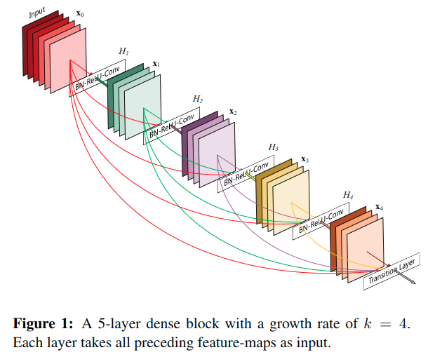

# DenseNet

## 核心: DenseBlock

### 结构图

在传统的卷积神经网络中，如果有L层，那么就会有L个连接，但是在DenseNet中，会有L(L+1)/2个连接。

**简单讲，就是每一层的输入来自前面所有层的输出。**

如下图：x0是input，H1的输入是x0（input），H2的输入是x0和x1（x1是H1的输出）……

### 数学表达

文章中只有两个公式，是用来阐述DenseNet和ResNet的关系，对于从原理上理解这两个网络还是非常重要的。

第一个公式是ResNet的。这里的l表示层，xl表示l层的输出，Hl表示一个非线性变换。所以对于ResNet而言，l层的输出是l-1层的输出加上对l-1层输出的非线性变换。

第二个公式是DenseNet的。[x0,x1,…,xl-1]表示将0到l-1层的输出feature map做concatenation。concatenation是做通道的合并，就像Inception那样。而前面resnet是做值的相加，通道数是不变的。Hl包括BN，ReLU和3*3的卷积。

所以从这两个公式就能看出DenseNet和ResNet在本质上的区别.

> 这就是DenseNet的核心内容.
>
> 所以, 基于此, 可以思考:
>
> 1. 以前的网络存在的问题?
> 2. 解决问题的思路?
> 3. DenseNet实现了怎样的思路?
> 4. DenseNet效果如何?
> 5. DenseNet有什么问题?
> 6. 可以的改进方向?

## 存在的问题

1. 梯度弥散。

    许多最近的研究致力于解决这个问题或相关的问题。

    * ResNet[5](https://alvinzhu.xyz/2017/10/07/densenet/#fn:11)和Highway Network[4](https://alvinzhu.xyz/2017/10/07/densenet/#fn:33)通过恒等连接将信号从一个层传递到另一层。
    * Stochastic depth[6](https://alvinzhu.xyz/2017/10/07/densenet/#fn:13)通过在训练期间随机丢弃层来缩短ResNets，以获得更好的信息和梯度流。
    * FractalNet[7](https://alvinzhu.xyz/2017/10/07/densenet/#fn:17)重复地将几个并行层序列与不同数量的约束块组合，以获得大的标称深度，同时在网络中保持许多短路径。

    虽然这些不同的方法在网络拓扑和训练过程中有所不同，但它们都具有一个关键特性：**它们创建从靠近输入的层与靠近输出的层的短路径。**