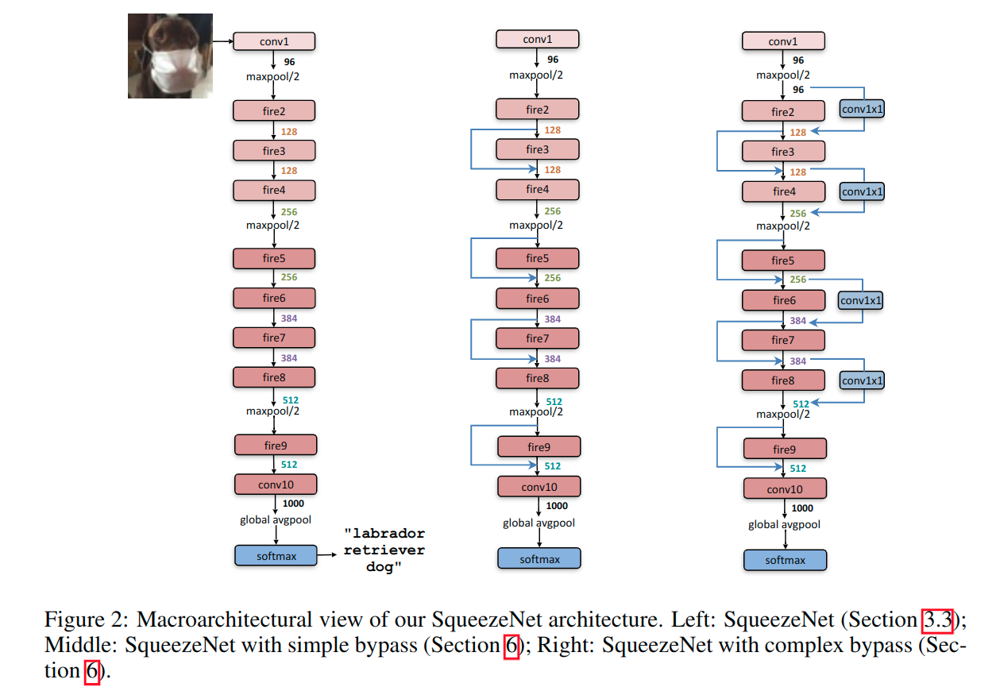

# SqueezeNet(2017)

翻译参考: https://zhuanlan.zhihu.com/p/35506370

论文参考: https://arxiv.org/abs/1602.07360

## 架构

### AlexNet

### SqueezeNet

主要有三种SqueezeNet模型.

* SqueezeNet是以一个独立的卷积层（conv1）为开端，跟着是8个fire模块（fire2-9），最后以一个最终的卷积层（conv10）结束。 

* 从网络的开始到结束逐渐增加每个fire模块的过滤器数量。 
* SqueezeNet在层conv1，fire4，fire8之后使用步长为2的max-pooling, 在conv10后使用了全局平均池化
* 这些相对较后的pooling安排是根据构建策略3。

我们在下表给出了完整的SqueezeNet架构。

> SqueezeNet架构尺寸。 （这张表的格式受到Inception2论文（Ioffe＆Szegedy，2015）的启发）

1. 为了使扩展模块的1x1和3x3滤波器的输出激活具有相同的高度和宽度，我们对输入到扩展模块的3x3滤波器的数据进行添加零填充的1个像素的边界。
2. ReLU（Nair＆Hinton，2010）被应用于挤压层和扩展层的激活。
3. 在fire9模块之后使用比率为50％的dropout（Srivastava等人，2014）。
4. 注意SqueezeNet没有全连接层; 这个设计选择是受到NiN启发。
5. 当训练SqueezeNet的时候，从0.04的学习率开始，然后在训练过程中线性地减少学习率，如（Mishkin et al。2016）所述。 
6. Caffe框架本身并不支持**包含多个滤波器分辨率的卷积层**（例如1x1和3x3）（Jia等人，2014）。为了解决这个问题，我们的**扩展层由两个独立的卷积层实现：**一个是滤波器为1x1的层和一个滤波器为3x3的层。然后，我们**在通道维中将这些层的输出连接在一起**。这在数值上等同于实现一个包含1x1和3x3滤波器的层。

### Fire module

> 微结构视图：在Fire模块中组织卷积过滤器。 
>
> 在这个例子中，$s_{1\times1} = 3，e_{1\times1} = 4，e_{3\times3} = 4$。
>
> 我们这里展示的是卷积滤波器不是激活。

我们对Fire模块定义如下。

* 包括挤压卷积层（它仅有1x1滤波器）

* 包括扩展层——挤压层被输入到该层，由**1x1和3x3卷积滤波器的混合组合**而成

    > 这里的扩展层是包含不同类型滤波器的卷积层

* 在fire模块中自由使用1x1过滤器是**构建策略1**的一个应用。

* 我们在Fire模块中公开了三个可调整维度（超参数）：，和 。

    *  是挤压层（所有1x1）的滤波器数量
    *  是扩展层中1x1滤波器的数量
    *  是扩展层中的3x3滤波器的数量。

    我们将$s_{1\times1}$设置为小于（  +  ），挤压层有助于限制3x3过滤器的输入通道数，如**构造策略2**所述。

## 论文动机

### 概述

最近对深度卷积神经网络（CNNs）的研究**主要集中在提高精度上**。

对于给定的准确度水平，通常存在多个实现该准确度水平的CNN架构。给定等效精度，具有较少参数的CNN架构具有若干优点:

* **更高效的分布式训练**。

    *服务器间的通信是分布式CNN训练的可扩展性的制约因素*。对于分布式的数据并行训练，通信开销与模型中的参数数量成正比（Iandola等，2016）。简言之，*小模型需要较少的通信所以训练得更快。*

* **传输模型到客户端的耗费较少**。

    对于自动驾驶，有些公司，例如特斯拉公司，会定期将新模型从服务器复制到客户的汽车，这种做法通常被称作空中（OTA）升级。 消费者报告指出特斯拉Autopilot的半自动驾驶功能的安全性随着近期的空中升级（消费者报告，2016）而逐渐增强。然而现今典型的CNN/DNN模型的空中升级需要大量的数据传输。例如更新AlexNet模型，需要从服务器传输240MB的通信量到汽车。*较小的模型需要的通信更少，这样使得频繁的更新变得更可行。*

* **可行的FPGA和嵌入式部署**。

    FPGA通常仅有小于10MB的片上存储器而且没有片外存储器。当FPGA实时地处理视频流时，一个足够小的模型能直接存放在FPGA上，而不会让存储带宽成为它的瓶颈（Qiu等，2016）。当在专用集成电路（ASIC）上部署CNN时，一个足够小的模型可以直接存储在芯片上，并使ASIC有可能配得上更小的管芯。

为了提供所有这些优势，我们提出了一个名为SqueezeNet的小型CNN架构。SqueezeNet在ImageNet上实现了AlexNet级别的精度，参数减少了50倍。另外，使用**模型压缩技术**，我们可以将SqueezeNet压缩到小于0.5MB（比AlexNet小510倍）。

### 相关的工作

我们工作的首要目标是**确定一个具有少量参数却同时能保持相当精度的模型**。

为了解决这个问题，一种明智的方法是**以有损的方式去压缩一个现有的CNN模型**。实际上，已经出现了一个关于模型压缩的研究社区，并且也已经提出了一些方法。

#### 模型压缩

> 关于模型压缩技术, 这里有篇总结性的文章: https://arxiv.org/abs/1710.09282

- Denton等人的一个很直接的方法是把应用奇异值分解（SVD）（Denton等人，2014）应用在预训练好的CNN模型。
- Han等人提出了网络修剪，该算法从预训练模型开始，然后把**低于某个阈值的参数替换为零**，形成了稀疏矩阵，最后对稀疏的CNN模型做几次迭代训练（Han等人，2015b）。
- Han等人近期扩展了他们的工作，通过将量化（到8位或更少）和huffman编码结合到网络修剪，创造了一种叫做**深度压缩 Deep Compression**的方法（Han等人，2015a），并进一步设计了叫做EIE的硬件加速器（Han等人，2016a ），该加速器直接作用在压缩过的模型上，获得了大幅度的加速和节能。

#### CNN MICROARCHITECTURE

我们使用术语CNN微结构来**指代各个模块的特定的组织和尺寸**。

在神经网络，卷积滤波器通常是3D的，它有作为关键维度的高度，宽度和通道。

当应用在图像时，CNN滤波器的第一层通常有3个通道（例如RGB），并且在其后的每一层Li，Li层滤波器的通道数目与Li-1层的滤波器的数量相同。

随着设计非常深的CNN的趋势，手动选择每层的滤波器尺寸变得麻烦。为了解决这个问题，已经出现了各种更高级别的构建块或模块，他们由具有特殊的固定组织的多个卷积层构成。

例如，GoogLeNet论文提出了Inception模块，该模块的滤波器包括多个不同尺寸，通常有1x1和3x3，再加上有时是5x5（Szegedy等人，2014），有时是1x3和3x1（Szegedy等人，2015）。多个这样的模块，可能再加上ad-hoc层，组合起来，形成完整的网络。

> ad hoc layer是什么?

#### CNN MACROARCHITECTURE

我们将CNN宏结构定义由**多个模块的系统级组织形成的端到端CNN架构**。

也许在最近的文献中，最广泛研究的CNN宏架构的主题是*网络中的深度（也就是层数）*的影响。

* Simoyan和Zisserman提出了具有12到19层的的VGG（Simonyan＆Zisserman，2014），并指出更深的网络在ImageNet-1k数据集上产生更高的精度（Deng等人，2009）
* K.He等人提出了具有多达30层的更深的CNN，获得更高的ImageNet精度（He等人2015a）

*跨越多个层或模块的连接*的设计选择是CNN宏架构研究的新兴领域。

* 残差网络（ResNet）（He等人2015b）和Highway Networks（Srivastava等人2015）分别提出了使用跨越多层的连接，例如将第3层的激活和第6层的激活相加连接起来，我们将这些连接称为旁路连接

#### NEURAL NETWORK DESIGN SPACE EXPLORATION

神经网络（包括深度和卷积神经网络）拥有具大的设计空间，微架构，宏架构，解算器和其它超参数的选择可以有很多个。

似乎自然而然人们会希望获得关于**这些因素如何影响神经网络的准确性（例如设计空间的形状）**的直观认识。

**自动化设计**

神经网络的设计空间探索（DSE）的大部分工作集中在设计一些自动化方法来寻找具有更高精度的神经网络架构。

这些自动化DSE方法包括贝叶斯优化（Snoek等人，2012），模拟退火（Ludermir等人，2006），随机搜索（Bergstra＆Bengio，2012）和遗传算法（Stanley和Miikkulainen，2002）。

这些论文各自都提出了一种情况，每篇论文所提出的DSE方法均生成了一个神经网络架构，每个架构与代表性的基准相比精度都更高。然而，这些论文**没有提供关于神经网络设计空间的形状的直观体现**。

在本文的后面，我们避开了自动化方法，相反，我们重构CNN，进行有原则的A/B比较，以研究CNN架构决策如何影响模型的大小和准确性.

在以下部分，我们首先提出SqueezeNet架构，并评估比较有使用模型压缩和没有模型压缩的SqueezeNet。然后，我们探讨SqueezeNet类的CNN架构的微架构和宏构架的设计选择。