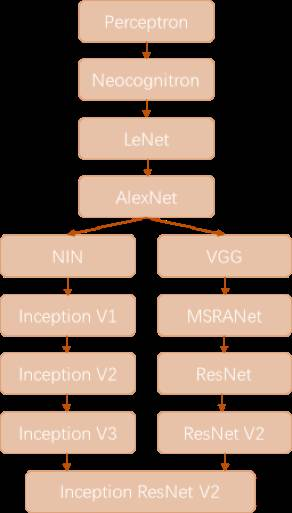

# 早期架构

## lenet5架构

是一个开创性的工作，因为图像的特征是分布在整个图像当中的，并且学习参数利用卷积在相同参数的多个位置中提取相似特性的一种有效方法。回归到1998年当时没有GPU来帮助训练，甚至CPU速度都非常慢。

因此，对比使用每个像素作为一个单独的输入的多层神经网络，Lenet5能够节省参数和计算是一个关键的优势。

lenet5论文中提到，全卷积不应该被放在第一层，因为图像中有着高度的空间相关性，并利用图像各个像素作为单独的输入特征不会利用这些相关性。

因此有了CNN的三个特性了：

1. 局部感知
2. 下采样
3. 权值共享


### 小结

* 每个卷积层包含三个部分：卷积、池化和非线性激活函数
* 使用卷积提取空间特征
* 降采样（Subsample）的平均池化层（Average?Pooling）
* 双曲正切（Tanh）或S型（Sigmoid）的激活函数
* MLP作为最后的分类器
* 层与层之间的稀疏连接减少计算复杂度

LeNet是卷积神经网络的祖师爷LeCun在1998年提出，用于解决手写数字识别的视觉任务。自那时起，CNN的最基本的架构就定下来了：卷积层、池化层、全连接层。如今各大深度学习框架中所使用的LeNet都是简化改进过的LeNet-5（-5表示具有5个层），和原始的LeNet有些许不同，比如把激活函数改为了现在很常用的ReLu。

跟当前常用的cnn结构已经基本一致了。目前的cnn一般是[CONV - RELU - POOL]，这里的[CONV - POOL - 
RELU]，不过基本没什么影响。文章的激活函数是sigmoid，目前图像一般用tanh，relu，leakly 
relu较多，实践证明，一般比sigmoid好。后面一般接全连接层FC，这里也是一致的。目前，多分类最后一层一般用softmax，文中的与此不太相同。

总的来说LeNet5架构把人们带入深度学习领域，值得致敬。从2010年开始近几年的神经网络架构大多数都是基于LeNet的三大特性。

### 代码

```python
def preprocess_image(image, output_height, output_width, is_training):
  """Preprocesses the given image.

  Args:
    image: A `Tensor` representing an image of arbitrary size.
    output_height: The height of the image after preprocessing.
    output_width: The width of the image after preprocessing.
    is_training: `True` if we're preprocessing the image for training and
      `False` otherwise.

  Returns:
    A preprocessed image.
  """
  image = tf.to_float(image)
  image = tf.image.resize_image_with_crop_or_pad(
      image, output_width, output_height)
  image = tf.subtract(image, 128.0)
  image = tf.div(image, 128.0)
  return image

def lenet(images, num_classes=10, is_training=False,
          dropout_keep_prob=0.5,
          prediction_fn=slim.softmax,
          scope='LeNet'):
  """Creates a variant of the LeNet model.

  Note that since the output is a set of 'logits', the values fall in the
  interval of (-infinity, infinity). Consequently, to convert the outputs to a
  probability distribution over the characters, one will need to convert them
  using the softmax function:

        logits = lenet.lenet(images, is_training=False)
        probabilities = tf.nn.softmax(logits)
        predictions = tf.argmax(logits, 1)

  Args:
    images: A batch of `Tensors` of size [batch_size, height, width, channels].
    num_classes: the number of classes in the dataset. If 0 or None, the logits
      layer is omitted and the input features to the logits layer are returned
      instead.
    is_training: specifies whether or not we're currently training the model.
      This variable will determine the behaviour of the dropout layer.
    dropout_keep_prob: the percentage of activation values that are retained.
    prediction_fn: a function to get predictions out of logits.
    scope: Optional variable_scope.

  Returns:
     net: a 2D Tensor with the logits (pre-softmax activations) if num_classes
      is a non-zero integer, or the inon-dropped-out nput to the logits layer
      if num_classes is 0 or None.
    end_points: a dictionary from components of the network to the corresponding
      activation.
  """
  end_points = {}

  with tf.variable_scope(scope, 'LeNet', [images]):
    net = end_points['conv1'] = slim.conv2d(images, 32, [5, 5], scope='conv1')
    net = end_points['pool1'] = slim.max_pool2d(net, [2, 2], 2, scope='pool1')
    net = end_points['conv2'] = slim.conv2d(net, 64, [5, 5], scope='conv2')
    net = end_points['pool2'] = slim.max_pool2d(net, [2, 2], 2, scope='pool2')
    net = slim.flatten(net)
    end_points['Flatten'] = net

    net = end_points['fc3'] = slim.fully_connected(net, 1024, scope='fc3')
    if not num_classes:
      return net, end_points
    net = end_points['dropout3'] = slim.dropout(
        net, dropout_keep_prob, is_training=is_training, scope='dropout3')
    logits = end_points['Logits'] = slim.fully_connected(
        net, num_classes, activation_fn=None, scope='fc4')

  end_points['Predictions'] = prediction_fn(logits, scope='Predictions')

  return logits, end_points
lenet.default_image_size = 28
```

## Dan Ciresan Net

2010年Dan Claudiu Ciresan和Jurgen Schmidhuber发表了一个[GPU神经网络](http://arxiv.org/abs/1003.0358)。论文里面证明了使用 NVIDIA GTX 280 GPU之后能够处理高达9层的神经网络。

从此之后，Nvidia公司的股价开始不断攀升，深度学习也越来越为人们所熟知。

## 后续几种网络的概要

> http://www.infoq.com/cn/articles/cnn-and-imagenet-champion-model-analysis



我们简单回顾卷积神经网络的历史，上图所示大致勾勒出最近几十年卷积神经网络的发展方向。

* Perceptron（感知机）于**1957年**由Frank?Resenblatt提出，而Perceptron不仅是卷积网络，也是神经网络的始祖。

* Neocognitron（神经认知机）是一种多层级的神经网络，由日本科学家Kunihiko Fukushima于**20世纪80年代**提出，具有一定程度的视觉认知的功能，并直接启发了后来的卷积神经网络。

* LeNet-5由CNN之父Yann?LeCun于**1997年**提出，首次提出了**多层级联的卷积结构**，可对手写数字进行有效识别。可以看到前面这三次关于卷积神经网络的技术突破，间隔时间非常长，需要十余年甚至更久才出现一次理论创新。

* 而后于**2012年**，Hinton的学生Alex依靠8层深的卷积神经网络一举获得了ILSVRC?2012比赛的冠军，瞬间点燃了卷积神经网络研究的热潮。AlexNet成功应用了**ReLU激活函数、Dropout、最大覆盖池化、LRN层、GPU加速**等新技术，并启发了后续更多的技术创新，卷积神经网络的研究从此进入快车道。

  > 在AlexNet之后，我们可以将卷积神经网络的发展分为两类，一类是网络结构上的改进调整（图6-18中的左侧分支），另一类是网络深度的增加（图18中的右侧分支）。
* 网络结构上的改进调整

  * **2013年**，颜水成教授的Network in Network工作首次发表，优化了卷积神经网络的结构，并推广了1*1的卷积结构。
  * 在改进卷积网络结构的工作中，后继者还有**2014年**的Google Inception Net V1，提出了Inception Module这个可以**反复堆叠的高效的卷积网络结构**，并获得了当年ILSVRC比赛的冠军。
  * **2015年**初的Inception V2提出了Batch Normalization，大大加速了训练过程，并提升了网络性能。
  * **2015年**年末的Inception V3则继续优化了网络结构，提出了Factorization in Small Convolutions的思想，分解大尺寸卷积为多个小卷积乃至一维卷积。

* 网络深度的增加
  * **2014年**，ILSVRC比赛的亚军VGGNet全程使用3*3的卷积，成功训练了深达19层的网络，当年的季军MSRA-Net也使用了非常深的网络。
  * **2015年**，微软的ResNet成功训练了152层深的网络，一举拿下了当年ILSVRC比赛的冠军，top-5错误率降低至3.46%。

我们可以看到，自AlexNet于2012年提出后，深度学习领域的研究发展极其迅速，基本上每年甚至每几个月都会出现新一代的技术。新的技术往往伴随着**新的网络结构，更深的网络的训练方法**等，并在图像识别等领域不断创造新的准确率记录。