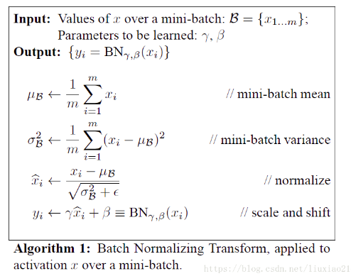
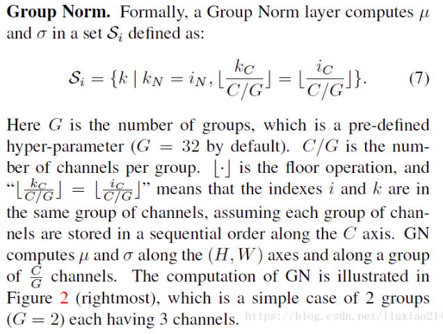
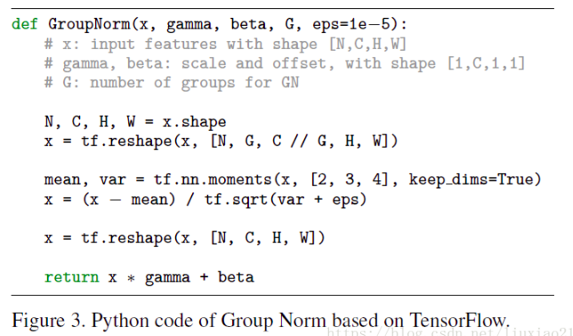
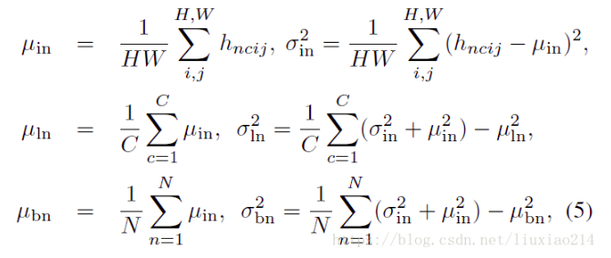
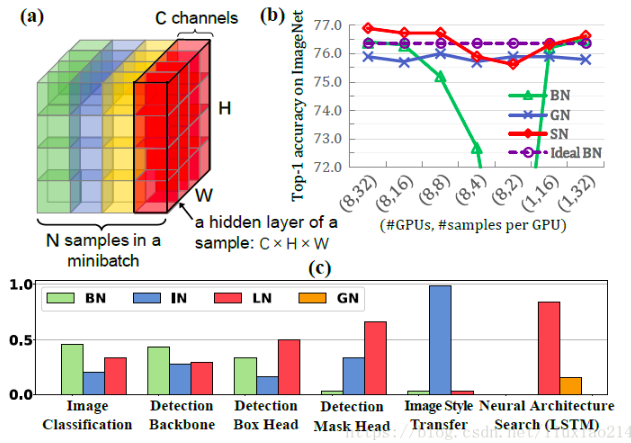
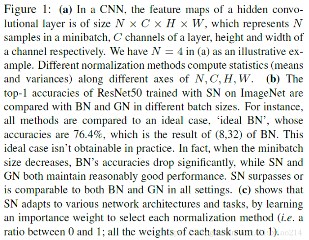

# 综述

## 论文链接

1、Batch Normalization

<https://arxiv.org/pdf/1502.03167.pdf>

2、Layer Normalizaiton

<https://arxiv.org/pdf/1607.06450v1.pdf>

3、Instance Normalization

<https://arxiv.org/pdf/1607.08022.pdf>

<https://github.com/DmitryUlyanov/texture_nets>

4、Group Normalization

<https://arxiv.org/pdf/1803.08494.pdf>

5、Switchable Normalization

<https://arxiv.org/pdf/1806.10779.pdf>

<https://github.com/switchablenorms/Switchable-Normalization>

## 介绍

深度神经网络模型训练之难众所周知，其中一个重要的现象就是 Internal Covariate Shift. Batch Norm 大法自 2015 年由Google 提出之后，就成为深度学习必备之神器。自 BN 之后， Layer Norm / Weight Norm / Cosine Norm 等也横空出世。

归一化层，目前主要有这几个方法，Batch Normalization（2015年）、Layer Normalization（2016年）、Instance Normalization（2017年）、Group Normalization（2018年）、Switchable Normalization（2018年）

将输入的图像shape记为`[N, C, H, W]`，这几个方法主要的区别就是在，

* batchNorm是在batch上，对NHW做归一化，对小batchsize效果不好；
* layerNorm在通道方向上，对CHW归一化，主要对RNN作用明显；
* instanceNorm在图像像素上，对HW做归一化，用在风格化迁移；
* GroupNorm将channel分组，然后再做归一化；
* SwitchableNorm是将BN、LN、IN结合，赋予权重，让网络自己去学习归一化层应该使用什么方法。


> BatchNorm：batch方向做归一化，`算N*H*W`的均值
>
> LayerNorm：channel方向做归一化，算`C*H*W`的均值
>
> InstanceNorm：一个channel内做归一化，算`H*W`的均值
>
> GroupNorm：将channel方向分group，然后每个group内做归一化，算`(C//G)*H*W`的均值
>
> 从左到右是BN，LN，IN，GN。
>
> 众所周知，深度网络中的数据维度一般是[N, C, H, W]或者[N, H, W, C]格式，N是batch size，H/W是feature的高/宽，C是feature的channel，压缩H/W至一个维度，其三维的表示如上图，假设单个方格的长度是1，那么其表示的是[6, 6，*, * ]
>
>要注意这里的channel不能单纯的理解为图形的RGB,对于卷积后的图像的特征图,也有所谓channel的概念,就是feature map的层数.所以可以不止三层.

## Batch Normalization

首先，在进行训练之前，一般要对数据做归一化，使其分布一致，但是在深度神经网络训练过程中，通常以送入网络的每一个batch训练，这样每个batch具有不同的分布；此外，为了解决internal covarivate shift问题，这个问题定义是随着batch normalizaiton这篇论文提出的，在训练过程中，数据分布会发生变化，对下一层网络的学习带来困难。

所以batch normalization就是强行将数据拉回到均值为0，方差为1的正太分布上，这样不仅数据分布一致，而且避免发生梯度消失。

此外，internal corvariate shift和covariate shift是两回事，前者是网络内部，后者是针对输入数据，比如我们在训练数据前做归一化等预处理操作。


### 公式



### 算法过程

* 沿着通道计算每个batch的均值u
* 沿着通道计算每个batch的方差σ^2
* 对x做归一化，x’=(x-u)/开根号(σ^2+ε)
* 加入缩放和平移变量γ和β ,归一化后的值，y=γx’+β

加入缩放平移变量的原因是：保证每一次数据经过归一化后还保留原有学习来的特征，同时又能完成归一化操作，加速训练。 这两个参数是用来学习的参数。

```python
import numpy as np

def Batchnorm(x, gamma, beta, bn_param):

    # x_shape:[B, C, H, W]
    running_mean = bn_param['running_mean']
    running_var = bn_param['running_var']
    results = 0.
    eps = 1e-5

    x_mean = np.mean(x, axis=(0, 2, 3), keepdims=True)
    x_var = np.var(x, axis=(0, 2, 3), keepdims=True0)
    x_normalized = (x - x_mean) / np.sqrt(x_var + eps)
    results = gamma * x_normalized + beta

    # 因为在测试时是单个图片测试，这里保留训练时的均值和方差，用在后面测试时用
    running_mean = momentum * running_mean + (1 - momentum) * x_mean
    running_var = momentum * running_var + (1 - momentum) * x_var

    bn_param['running_mean'] = running_mean
    bn_param['running_var'] = running_var

    return results, bn_param
```

## Layer Normalizaiton

batch normalization存在以下缺点：

* 对batchsize的大小比较敏感，由于每次计算均值和方差是在一个batch上，所以如果batchsize太小，则计算的均值、方差不足以代表整个数据分布；
* BN实际使用时需要计算并且保存某一层神经网络batch的均值和方差等统计信息，对于对一个固定深度的前向神经网络（DNN，CNN）使用BN，很方便；但对于RNN来说，sequence的长度是不一致的，换句话说RNN的深度不是固定的，不同的time-step需要保存不同的statics特征，可能存在一个特殊sequence比其他sequence长很多，这样training时，计算很麻烦。（参考于<https://blog.csdn.net/lqfarmer/article/details/71439314>）


与BN不同，**LN是针对深度网络的某一层的所有神经元的输入**按以下公式进行 normalize 操作。

### 公式


where H denotes the number of hidden units in a layer

### BN与LN的区别：

* LN中同层神经元输入拥有相同的均值和方差，不同的输入样本有不同的均值和方差；

* BN中则针对不同神经元输入计算均值和方差，同一个batch中的输入拥有相同的均值和方差。

  所以，LN不依赖于batch的大小和输入sequence的深度，因此可以用于batchsize为1和RNN中对边长的输入sequence的normalize操作。

LN用于RNN效果比较明显，但是在CNN上，不如BN。

```python
def ln(x, b, s):
    _eps = 1e-5
    output = (x - x.mean(1)[:,None]) / tensor.sqrt((x.var(1)[:,None] + _eps))
    output = s[None, :] * output + b[None,:]
    return output
```

用在四维图像上，

```python
def Layernorm(x, gamma, beta):

    # x_shape:[B, C, H, W]
    results = 0.
    eps = 1e-5

    x_mean = np.mean(x, axis=(1, 2, 3), keepdims=True)
    x_var = np.var(x, axis=(1, 2, 3), keepdims=True0)
    x_normalized = (x - x_mean) / np.sqrt(x_var + eps)
    results = gamma * x_normalized + beta
    return results
```

## Instance Normalization

BN注重对每个batch进行归一化，保证数据分布一致，因为判别模型中结果取决于数据整体分布。

但是图像风格化中，生成结果主要依赖于某个图像实例，所以对整个batch归一化不适合图像风格化中，因而对HW做归一化。可以加速模型收敛，并且保持每个图像实例之间的独立。

### 公式


### 代码

```python
def Instancenorm(x, gamma, beta):

    # x_shape:[B, C, H, W]
    results = 0.
    eps = 1e-5

    x_mean = np.mean(x, axis=(2, 3), keepdims=True)
    x_var = np.var(x, axis=(2, 3), keepdims=True)
    x_normalized = (x - x_mean) / np.sqrt(x_var + eps)
    results = gamma * x_normalized + beta
    return results
```

## Group Normalization

主要是针对Batch Normalization对小batchsize效果差，GN将channel方向分group，然后每个group内做归一化，算(C//G)×H×W的均值，这样与batchsize无关，不受其约束。

### 公式



### 伪代码



### 代码

```python
def GroupNorm(x, gamma, beta, G=16):

    # x_shape:[B, C, H, W]
    results = 0.
    eps = 1e-5
    x = np.reshape(x, (x.shape[0], G, x.shape[1]/16, x.shape[2], x.shape[3]))

    x_mean = np.mean(x, axis=(2, 3, 4), keepdims=True)
    x_var = np.var(x, axis=(2, 3, 4), keepdims=True0)
    x_normalized = (x - x_mean) / np.sqrt(x_var + eps)
    results = gamma * x_normalized + beta
    return results
```

## Switchable Normalization

本篇论文作者认为，

* 第一，归一化虽然提高模型泛化能力，然而归一化层的操作是人工设计的。在实际应用中，解决不同的问题原则上需要设计不同的归一化操作，并**没有一个通用的归一化方法能够解决所有应用问题**；
* 第二，一个深度神经网络往往包含几十个归一化层，通常**这些归一化层都使用同样的归一化操作**，因为手工为每一个归一化层设计操作需要进行大量的实验。

因此作者提出**自适配归一化方法——Switchable Normalization（SN）**来解决上述问题。与强化学习不同，SN使用可微分学习，为一个深度网络中的每一个归一化层确定合适的归一化操作。

### 公式




### 代码

```python
def SwitchableNorm(x, gamma, beta, w_mean, w_var):
    # x_shape:[B, C, H, W]
    results = 0.
    eps = 1e-5

    mean_in = np.mean(x, axis=(2, 3), keepdims=True)
    var_in = np.var(x, axis=(2, 3), keepdims=True)

    mean_ln = np.mean(x, axis=(1, 2, 3), keepdims=True)
    var_ln = np.var(x, axis=(1, 2, 3), keepdims=True)

    mean_bn = np.mean(x, axis=(0, 2, 3), keepdims=True)
    var_bn = np.var(x, axis=(0, 2, 3), keepdims=True)

    mean = w_mean[0] * mean_in + w_mean[1] * mean_ln + w_mean[2] * mean_bn
    var = w_var[0] * var_in + w_var[1] * var_ln + w_var[2] * var_bn

    x_normalized = (x - mean) / np.sqrt(var + eps)
    results = gamma * x_normalized + beta
    return results
```

### 结果比较





## 补充

> https://zhuanlan.zhihu.com/p/33173246

### 几个问题

1. 为什么需要 Normalization

   ——深度学习中的 Internal Covariate Shift 问题及其影响

2. Normalization 的通用框架与基本思想

   ——从主流 Normalization 方法中提炼出的抽象框架

3. 主流 Normalization 方法梳理

   ——结合上述框架，将 BatchNorm / LayerNorm / WeightNorm / CosineNorm 对号入座，各种方法之间的异同水落石出。

4. Normalization 为什么会有效？

   ——从参数和数据的伸缩不变性探讨Normalization有效的深层原因。

## 为什么需要 Normalization

### 独立同分布与白化

机器学习界的炼丹师们最喜欢的数据有什么特点？窃以为，莫过于“**独立同分布**”了，即*independent and identically distributed*，简称为 *i.i.d.* 

独立同分布并非所有机器学习模型的必然要求(比如 Naive Bayes 模型就建立在特征彼此独立的基础之上，而Logistic Regression 和 神经网络 则在非独立的特征数据上依然可以训练出很好的模型),但独立同分布的数据可以简化常规机器学习模型的训练、提升机器学习模型的预测能力，已经是一个共识。

因此，在把数据喂给机器学习模型之前，“**白化（whitening）**”是一个重要的数据预处理步骤。白化一般包含两个目的：

1. *去除特征之间的相关性* —> 独立；
2. *使得所有特征具有相同的均值和方差* —> 同分布。

白化最典型的方法就是PCA，可以参考阅读 [PCAWhitening](http://ufldl.stanford.edu/tutorial/unsupervised/PCAWhitening/)。

### 深度学习中的 Internal Covariate Shift

深度神经网络模型的训练为什么会很困难？其中一个重要的原因是，深度神经网络涉及到很多层的叠加，而每一层的参数更新会导致上层的输入数据分布发生变化，通过层层叠加，高层的输入分布变化会非常剧烈，这就使得高层需要不断去重新适应底层的参数更新。为了训好模型，我们需要非常谨慎地去设定学习率、初始化权重、以及尽可能细致的参数更新策略。

Google 将这一现象总结为 Internal Covariate Shift，简称 ICS. 什么是 ICS 呢？[@魏秀参](https://www.zhihu.com/people/b716bc76c2990cd06dae2f9c1f984e6d)在一个回答中做出了一个很好的解释：

> 大家都知道在统计机器学习中的一个经典假设是“源空间（source domain）和目标空间（target domain）的数据分布（distribution）是一致的”。如果不一致，那么就出现了新的机器学习问题，如 transfer learning / domain adaptation 等。而 covariate shift 就是分布不一致假设之下的一个分支问题，它是指源空间和目标空间的条件概率是一致的，但是其边缘概率不同，即：对所有,
>
> 
>
> 但是
>
> 
>
> 大家细想便会发现，的确，对于神经网络的各层输出，由于它们经过了层内操作作用，其分布显然与各层对应的输入信号分布不同，而且差异会随着网络深度增大而增大，可是它们所能“指示”的样本标记（label）仍然是不变的，这便符合了covariate shift的定义。由于是对层间信号的分析，也即是“internal”的来由。

### ICS 会导致什么问题？

简而言之，每个神经元的输入数据不再是“独立同分布”。

其一，上层参数需要不断适应新的输入数据分布，降低学习速度。

其二，下层输入的变化可能趋向于变大或者变小，导致上层落入饱和区，使得学习过早停止。

其三，每层的更新都会影响到其它层，因此每层的参数更新策略需要尽可能的谨慎。

## Normalization 的通用框架与基本思想

我们以神经网络中的一个普通神经元为例。神经元接收一组输入向量  

通过某种运算后，输出一个标量值：

由于 ICS 问题的存在  的分布可能相差很大。要解决独立同分布的问题，<u>“理论正确”的方法就是对每一层的数据都进行白化操作。然而标准的白化操作代价高昂，特别是我们还希望白化操作是可微的，保证白化操作可以通过反向传播来更新梯度。</u>

因此，以 BN 为代表的 Normalization 方法退而求其次，进行了简化的白化操作。基本思想是：在将  送给神经元之前，先对其做**平移和伸缩变换**， 将  的分布规范化成在固定区间范围的标准分布。

**通用变换框架**就如下所示：


我们来看看这个公式中的各个参数。

1.  是**平移参数**（shift parameter），  是**缩放参数**（scale parameter）。通过这两个参数进行 shift 和 scale 变换：

     

   得到的数据符合均值为 0、方差为 1 的标准分布。

2.   是**再平移参数**（re-shift parameter），  是**再缩放参数**（re-scale parameter）。将 上一步得到的  进一步变换为：

    

   最终得到的数据符合均值为  、方差为  的分布。

第一步都已经得到了标准分布，第二步怎么又给变走了？

答案是——**为了保证模型的表达能力不因为规范化而下降**。

我们可以看到，第一步的变换将输入数据限制到了一个全局统一的确定范围（均值为 0、方差为 1）。下层神经元可能很努力地在学习，但不论其如何变化，其输出的结果在交给上层神经元进行处理之前，将被粗暴地重新调整到这一固定范围。

为了尊重底层神经网络的学习结果，我们将规范化后的数据进行再平移和再缩放，使得每个神经元对应的输入范围是针对该神经元量身定制的一个确定范围（均值为  、方差为  ）。rescale 和 reshift 的参数都是可学习的，这就使得 Normalization 层可以学习如何去尊重底层的学习结果。

除了充分利用底层学习的能力，另一方面的重要意义在于保证获得非线性的表达能力。Sigmoid 等激活函数在神经网络中有着重要作用，通过区分饱和区和非饱和区，使得神经网络的数据变换具有了非线性计算能力。而第一步的规范化会将几乎所有数据映射到激活函数的非饱和区（线性区），仅利用到了线性变化能力，从而降低了神经网络的表达能力。而进行再变换，则可以将数据从线性区变换到非线性区，恢复模型的表达能力。

那么问题又来了——

**经过这么的变回来再变过去，会不会跟没变一样？**

不会。因为，再变换引入的两个新参数 g 和 b，可以表示旧参数作为输入的同一族函数，但是新参数有不同的学习动态。在旧参数中，  的均值取决于下层神经网络的复杂关联；但在新参数中，  仅由  来确定，去除了与下层计算的密切耦合。新参数很容易通过梯度下降来学习，简化了神经网络的训练。

那么还有一个问题——

**这样的 Normalization 离标准的白化还有多远？**

标准白化操作的目的是“独立同分布”。独立就不说了，暂不考虑。变换为均值为  、方差为 的分布，也并不是严格的同分布，只是映射到了一个确定的区间范围而已。（所以，这个坑还有得研究呢！）

## 主流 Normalization 方法梳理

在上一节中，我们提炼了 Normalization 的通用公式：


对照于这一公式，我们来梳理主流的四种规范化方法。

###  Batch Normalization —— 纵向规范化


Batch Normalization 于2015年由 Google 提出，开 Normalization 之先河。其规范化针对单个神经元进行，**利用网络训练时一个 mini-batch 的数据来计算该神经元  的均值和方差**，因而称为 Batch Normalization。


其中  是 mini-batch 的大小。

按上图所示，相对于一层神经元的水平排列，BN 可以看做一种纵向的规范化。由于 **BN 是针对单个维度定义**的，因此标准公式中的计算均为 **element-wise** 的。

BN 独立地规范化每一个输入维度  ，但**规范化的参数是一个 mini-batch 的一阶统计量和二阶统计量**。这就要求 每一个 mini-batch 的<u>统计量是整体统计量的近似估计</u>，或者说每一个 mini-batch 彼此之间，以及和整体数据，都应该是近似同分布的。**分布差距较小的 mini-batch 可以看做是为规范化操作和模型训练引入了噪声，可以增加模型的鲁棒性；但如果每个 mini-batch的原始分布差别很大，那么不同 mini-batch 的数据将会进行不一样的数据变换，这就增加了模型训练的难度**。

因此，BN 比较适用的场景是：**每个 mini-batch 比较大，数据分布比较接近**。在进行训练之前，要做好充分的 shuffle. 否则效果会差很多。

另外，由于 BN 需要在运行过程中统计每个 mini-batch 的一阶统计量和二阶统计量，因此不适用于动态的网络结构 和 RNN 网络。不过，也有研究者专门提出了适用于 RNN 的 BN 使用方法，这里先不展开了。

### Layer Normalization —— 横向规范化


层规范化就是针对 BN 的上述不足而提出的。与 BN 不同，LN 是一种横向的规范化，如图所示。它综合考虑一层所有维度的输入，**计算该层的平均输入值和输入方差**，然后用同一个规范化操作来转换各个维度的输入。

> 可以近似理解为对于输入的各个特征维度的整体均值方差来计算处理归一化


其中 ** 枚举了该层所有的输入神经元**。对应到标准公式中，四大参数 , , ,  均为标量（BN中是向量），所有输入共享一个规范化变换。

**LN 针对单个训练样本进行**，不依赖于其他数据，因此可以避免 BN 中受 mini-batch 数据分布影响的问题，**可以用于 小mini-batch场景、动态网络场景和 RNN，特别是自然语言处理领域**。此外，**LN 不需要保存 mini-batch 的均值和方差**，节省了额外的存储空间。

但是，BN 的转换是针对单个神经元可训练的——不同神经元的输入经过再平移和再缩放后分布在不同的区间，而 **LN 对于一整层的神经元训练得到同一个转换**——所有的输入都在同一个区间范围内。**如果不同输入特征不属于相似的类别（比如颜色和大小），那么 LN 的处理可能会降低模型的表达能力**。

###  Weight Normalization —— 参数规范化

前面我们讲的模型框架 

 

**经过规范化之后的 作为输入送到下一个神经元，应用以  为参数的 函数定义的变换**。最普遍的变换是线性变换，即 .

BN 和 LN 均将规范化应用于输入的特征数据  ，而 WN 则另辟蹊径，**将规范化应用于线性变换函数的权重 ** ，这就是 WN 名称的来源。


具体而言，WN 提出的方案是，**将权重向量  分解为向量方向  和向量模  两部分**：


其中  是与  同维度的向量， 是欧氏范数，因此 是单位向量，决定了  的方向； 是标量，决定了  的长度。由于  ，因此这一权重分解的方式**将权重向量的欧氏范数进行了固定**，从而实现了正则化的效果。

**乍一看，这一方法似乎脱离了我们前文所讲的通用框架？**

并没有。其实从最终实现的效果来看，异曲同工。我们来推导一下看。 


对照一下前述框架：


我们只需令：


就完美地对号入座了！

回忆一下，BN 和 LN 是用输入的特征数据的方差对输入数据进行 scale，而 WN 则是用神经元的权重的欧氏范式对输入数据进行 scale。**虽然在原始方法中分别进行的是特征数据规范化和参数的规范化，但本质上都实现了对数据的规范化，只是用于 scale 的参数来源不同。**

另外，我们看到这里的规范化**只是对数据进行了 scale，而没有进行 shift**，因为我们简单地令 . 但事实上，这里留下了与 BN 或者 LN 相结合的余地——那就是利用 BN 或者 LN 的方法来计算输入数据的均值  。

> 如何结合计算？难道说可以让$\mu \neq 0$？这里的意思应该是指，前面利用BN或者LN来计算shift操作，而利用WN实现scale操作。（平移，放缩）

WN 的规范化**不直接使用输入数据的统计量**，因此避免了 BN 过于依赖 mini-batch 的不足，以及 LN 每层唯一转换器的限制，同时也可以用于动态网络结构。

###  Cosine Normalization —— 余弦规范化

Normalization 还能怎么做？

我们再来看看神经元的经典变换.

对输入数据  的变换已经做过了，横着来是 LN，纵着来是 BN。

对模型参数  的变换也已经做过了，就是 WN。

好像没啥可做的了。

然而天才的研究员们盯上了中间的那个点，对，就是****。他们说，我们要对数据进行规范化的原因，是数据经过神经网络的计算之后可能会变得很大，导致数据分布的方差爆炸，而这一问题的根源就是我们的计算方式——点积，权重向量  和 特征数据向量  的点积。向量点积是无界（unbounded）的啊！

那怎么办呢？我们知道向量点积是衡量两个向量相似度的方法之一。哪还有没有其他的相似度衡量方法呢？有啊，很多啊！夹角余弦就是其中之一啊！而且关键的是，夹角余弦是有确定界的啊，[-1, 1] 的取值范围，多么的美好！仿佛看到了新的世界！

于是，Cosine Normalization 就出世了。他们不处理权重向量  ，也不处理特征数据向量  ，就改了一下线性变换的函数：


其中  是  和  的夹角。然后就没有然后了，所有的数据就都是 [-1, 1] 区间范围之内的了！

不过，回过头来看，CN 与 WN 还是很相似的。我们看到上式中，分子还是  和  的内积，而分母则可以看做用  和  二者的模之积进行规范化。对比一下 WN 的公式：


一定程度上可以理解为，**WN 用 权重的模  对输入向量进行 scale，而 CN 在此基础上用输入向量的模  对输入向量进行了进一步的 scale.**

CN 通过用余弦计算代替内积计算实现了规范化，但成也萧何败萧何。原始的内积计算，其几何意义是 输入向量在权重向量上的投影，**既包含 二者的夹角信息，也包含 两个向量的scale信息**。去掉scale信息，可能导致**表达能力的下降**，因此也引起了一些争议和讨论。具体效果如何，可能需要在特定的场景下深入实验。

## Normalization 为什么会有效？

我们以下面这个简化的神经网络为例来分析。


### Normalization 的权重伸缩不变性

**权重伸缩不变性（weight scale invariance）**指的是，当权重  按照常量  进行伸缩时，得到的规范化后的值保持不变，即：


其中  。

**上述规范化方法均有这一性质**，这是因为，当权重  伸缩时，对应的均值和标准差均等比例伸缩，分子分母相抵。


**权重伸缩不变性可以有效地提高反向传播的效率**。

由于


因此，权重的伸缩变化不会影响反向梯度的 Jacobian 矩阵，因此也就对反向传播没有影响，避免了反向传播时因为权重过大或过小导致的梯度消失或梯度爆炸问题，从而加速了神经网络的训练。

**权重伸缩不变性还具有参数正则化的效果，可以使用更高的学习率。**

由于 

因此，下层的权重值越大，其梯度就越小。这样，参数的变化就越稳定，相当于实现了参数正则化的效果，避免参数的大幅震荡，提高网络的泛化性能。

### Normalization 的数据伸缩不变性

**数据伸缩不变性（data scale invariance）**指的是，当数据  按照常量  进行伸缩时，得到的规范化后的值保持不变，即：


其中  。

**数据伸缩不变性仅对 BN、LN 和 CN 成立。**因为这三者对输入数据进行规范化，因此当数据进行常量伸缩时，其均值和方差都会相应变化，分子分母互相抵消。而 WN 不具有这一性质。

**数据伸缩不变性可以有效地减少梯度弥散，简化对学习率的选择**。

对于某一层神经元  而言，展开可得


每一层神经元的输出依赖于底下各层的计算结果。如果没有正则化，当下层输入发生伸缩变化时，经过层层传递，可能会导致数据发生剧烈的膨胀或者弥散，从而也导致了反向计算时的梯度爆炸或梯度弥散。

加入 Normalization 之后，不论底层的数据如何变化，对于某一层神经元  而言，其输入  永远保持标准的分布，这就使得高层的训练更加简单。从梯度的计算公式来看：


数据的伸缩变化也不会影响到对该层的权重参数更新，使得训练过程更加鲁棒，简化了对学习率的选择。

