# Deformable Convolutional Networks(2017)

> 论文: https://arxiv.org/abs/1703.06211
>
> 翻译: http://noahsnail.com/2017/11/29/2017-11-29-Deformable%20Convolutional%20Networks%E8%AE%BA%E6%96%87%E7%BF%BB%E8%AF%91%E2%80%94%E2%80%94%E4%B8%AD%E8%8B%B1%E6%96%87%E5%AF%B9%E7%85%A7/

## 主要贡献

卷积神经网络(CNN)由于其构建模块固定的几何结构天然地局限于建模几何变换. 在这项工作中, 我们引入了两个新的模块来**提高CNN的转换建模能力**, 即可变形卷积和可变形RoI池化.

两者都基于这样的想法: **增加模块中的空间采样位置以及额外的偏移量**, 并且从目标任务中**学习偏移量**, 而不需要额外的监督.

两个模块都轻量的. 它们为偏移学习增加了少量的参数和计算. 新模块可以很容易地替换现有CNN中的普通模块, 并且可以通过标准的反向传播便易地进行端对端训练, 从而产生*可变形卷积网络*. 大量的实验验证了我们方法的性能.

我们的方法与空间变换网络[26]和可变形部件模型[11]具有类似的高层精神. 它们都有内部的转换参数, **纯粹从数据中学习这些参数**. 可变形ConvNets的一个关键区别在于它们以简单, 高效, 深入和端到端的方式处理密集的空间变换.

我们首次证明了在深度CNN中学习**密集空间变换**对于复杂的视觉任务(如目标检测和语义分割)是有效的.

## 解决的问题

视觉识别中的一个关键挑战是**如何在目标尺度, 姿态, 视点和部件变形中适应几何变化或建模几何变换**.

一般来说, 有两种方法.

- 首先是建立具有足够期望变化的训练数据集. 这通常通过增加现有的数据样本来实现, 例如通过仿射变换. 鲁棒的表示可以从数据中学习, 但是通常以昂贵的训练和复杂的模型参数为代价.
- 其次是使用变换不变的特征和算法. 这一类包含了许多众所周知的技术, 如SIFT(尺度不变特征变换)[42]和基于滑动窗口的目标检测范例.

上述方法有两个缺点.

- 首先, **几何变换被假定是固定并且已知的**. 这样的先验知识被用来扩充数据, 并设计特征和算法. 这个假设阻止了对具有未知几何变换的新任务的泛化能力, 这些新任务没有被正确地建模.
- 其次, **手工设计的不变特征和算法对于过于复杂的变换可能是困难的或不可行的**, 即使在已知复杂变化的情况下.

最近, 卷积神经网络(CNNs)[35]在图像分类[31], 语义分割[41]和目标检测[16]等视觉识别任务中取得了显著的成功. 不过, 他们**仍然有上述两个缺点**.

它们**对几何变换建模的能力主要来自大量的数据增强, 大的模型容量以及一些简单的手工设计模块**(例如, 对小的平移具有不变性的最大池化[1]).

简而言之, CNN本质上局限于建模大型, 未知的转换.

**该限制源于CNN模块的固定几何结构**:

- 卷积单元在固定位置对输入特征图进行采样；
- 池化层以一个固定的比例降低空间分辨率；
- 一个RoI(感兴趣区域)池化层把RoI分成固定的空间组块等等.

缺乏处理几何变换的内部机制. 这会导致明显的问题.

- 举一个例子, **同一CNN层中所有激活单元的感受野大小是相同的**. 对于在空间位置上编码语义的高级CNN层来说, 这是不可取的. 由于**不同的位置可能对应不同尺度或形变的目标**, 所以对于具有精细定位的视觉识别来说, 例如**使用全卷积网络的语义分割[41], 尺度或感受野大小的自适应确定是理想的情况**.

- 又如, 尽管最近目标检测已经取得了显著而迅速的进展[16,52,15,47,46,40,7], 但所有方法仍然**依赖于基于特征提取的粗糙边界框**. 这显然是次优的, 特别是对于非刚性目标.

## 贡献介绍

CNN中的特征映射和卷积是3D的. 可变形卷积和RoI池化模块都在2D空间域上运行. 在整个通道维度上的操作保持不变.

### 可变形卷积(*deformable convolution*)

#### 概述

它将2D偏移添加到标准卷积中的常规网格采样位置上. 它可以使采样网格自由形变. 如下图所示. 偏移量通过附加的卷积层从前面的特征图中学习.

> 3×3标准卷积和可变形卷积中采样位置的示意图.
>
> (a)标准卷积的定期采样网格(绿点). (b)变形的采样位置(深蓝色点)和可变形卷积中增大的偏移量(浅蓝色箭头). (c)(d)是(b)的特例, 表明可变形卷积泛化到了各种尺度(各向异性)、长宽比和旋转的变换.

因此, 变形以局部的, 密集的和自适应的方式受到输入特征的限制.

#### 过程

在2D的角度进行分析.

卷积的过程就是

1. 用规则的网格$\mathcal{R}$在输入特征映射$\mathbf{x}$上采样；
2. 对$\mathbf{w}$加权的采样值求和.

网格$\mathcal{R}$定义了感受野的大小和扩张(size and dilation). 例如, $\mathcal{R}=\lbrace (-1, -1), (-1, 0), \ldots, (0,1), (1, 1)\rbrace$定义了一个扩张大小为1的$3 \times 3$卷积核.

> 关于扩张参数, 可以看这里: https://github.com/lartpang/ML_markdown/blob/master/%E5%8D%B7%E7%A7%AF%E7%BD%91%E7%BB%9C.md#%E6%89%A9%E5%BC%A0%E5%8D%B7%E7%A7%AF%E7%A9%BA%E6%B4%9E%E5%8D%B7%E7%A7%AFdilated-convolutionatrous-convolution

对于输出特征映射$\mathbf{y}$上的每个位置$\mathbf{p}_0$, 我们有

$\mathbf{y}(\mathbf{p}_0)=\sum_{\mathbf{p}_n\in\mathcal{R}}\mathbf{w}(\mathbf{p}_n)\cdot \mathbf{x}(\mathbf{p}_0+\mathbf{p}_n) \tag{1}$

 其中$\mathbf{p}_n$枚举了$\mathcal{R}$中的位置.

在可变形卷积中, 规则的网格$\mathcal{R}$通过偏移$\lbrace \Delta \mathbf{p}_n|n=1,…,N\rbrace$增大, 其中$N=|\mathcal{R}|$. 方程变为

$\mathbf{y}(\mathbf{p}_0)=\sum_{\mathbf{p}_n\in\mathcal{R}}\mathbf{w}(\mathbf{p}_n)\cdot \mathbf{x}(\mathbf{p}_0+\mathbf{p}_n+\Delta \mathbf{p}_n).\tag{2}$

在原本卷积的基础上进行了一个额外的偏移.

现在, 采样是在不规则且有偏移的位置$\mathbf{p}_n + \Delta \mathbf{p}_n$上. 由于偏移$\Delta \mathbf{p}_n$通常是小数, 方程(2)可以通过双线性插值实现

$\mathbf{x}(\mathbf{p})=\sum_\mathbf{q} G(\mathbf{q},\mathbf{p})\cdot \mathbf{x}(\mathbf{q}), \tag{3}$

其中$\mathbf{p}$表示任意(小数)位置(公式(2)中$\mathbf{p}=\mathbf{p}_0+\mathbf{p}_n+\Delta \mathbf{p}_n$, 也就是输入特征图上, 在进行变形卷积计算的时候感受野上所对应的坐标), $\mathbf{q}$枚举了特征映射$\mathbf{x}$中所有整体空间位置(也就是输入特征图的所有的坐标), $G(\cdot,\cdot)$是双线性插值的核. 注意$G$是二维的. 它被分为两个一维核

$G(\mathbf{q},\mathbf{p})=g(q_x,p_x)\cdot g(q_y,p_y), \tag{4}$

其中$g(a,b)=max(0,1-|a-b|)$. 方程(3)可以快速计算因为$G(\mathbf{q},\mathbf{p})$仅对于一些$\mathbf{q}$是非零的.

> 上面公式可能理解起来有些不够直观, 但是可以按照如下的流程理解. 公式(3)中的双线性插值, 指的是由于预测后的结果对应的索引是小数, 也就是说对应的坐标位置是一个小数位置, 这在实际图片中是不存在的, 但是我们又需要使用这个值, 那我们该怎么办? 这里就是利用这个坐标对应点的所在的(由真实像素构成的)网格的四个坐标点像素值双线性插值而来. 得到这个值后, 对原始输入没有影响, 只是用来作为输入作用在卷积核上的.
>
> 注意: 这里使用过普通卷积获得的偏移量, 与后面的可变形池化不同, 使用的是全连接层.
>
> 1. 原始图片batch(大小为b\*h\*w\*c), 记为U(图中的最左边的输入特征图), **经过一个普通卷积**(下图中的conv), 卷积填充为same, 即输出输入大小不变, 对应的输出结果为(b\*h\*w\*2c), 记为V(吉图中的offset filed), **输出的结果是指原图片batch中每个像素(图中的offsets)的偏移量**(x偏移与y偏移, 因此为2c)
> 2. 将**U中图片的像素索引值(即坐标)与V(坐标偏移量)相加**, 得到偏移后的position(即在原始图片U中的坐标值), 需要将position值限定为图片大小以内, position的大小为(b\*h\*w\*2c), 但position只是一个坐标值, 而且还是float类型的, 我们需要这些float类型的坐标值获取像素.
> 3. 例, 取一个坐标值(a,b), 将其转换为四个整数, floor(a), ceil(a), floor(b), ceil(b), 将这四个整数进行整合, 得到四对坐标(floor(a),floor(b)),  ((floor(a),ceil(b)),  ((ceil(a),floor(b)),  ((ceil(a),ceil(b)). 这四对坐标每个坐标都对应U中的一个像素值, 而**我们需要得到(a,b)的像素值, 这里采用双线性差值的方式计算**(一方面得到的像素准确, 另一方面可以进行反向传播)
> 4. 在**得到position的所有像素后, 即得到了一个新图片M, 将这个新图片M作为输入数据输入到别的层中**, 如普通卷积.
>
> 原文: https://blog.csdn.net/mykeylock/article/details/77746499

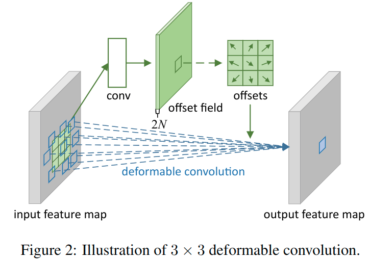

> 3×3可变形卷积的说明.

如图2所示, 通过在相同的输入特征映射上应用卷积层来获得偏移. 卷积核具有与当前卷积层相同的空间分辨率和扩张(例如, 在图2中也具有扩张为1的$3\times 3$). 输出偏移域与输入特征映射具有相同的空间分辨率.

通道维度2N(注释: 偏移的通道维度, 包括**x方向的通道维度和y方向的通道维度**)对应于N个2D偏移量. 在训练过程中, 同时学习用于生成输出特征的卷积核和偏移量.

为了学习偏移量, 梯度通过方程(3)和(4)中的双线性运算进行反向传播.

---

可变形卷积能够自适应地学习感受野, 如图5, 6和表2所示.

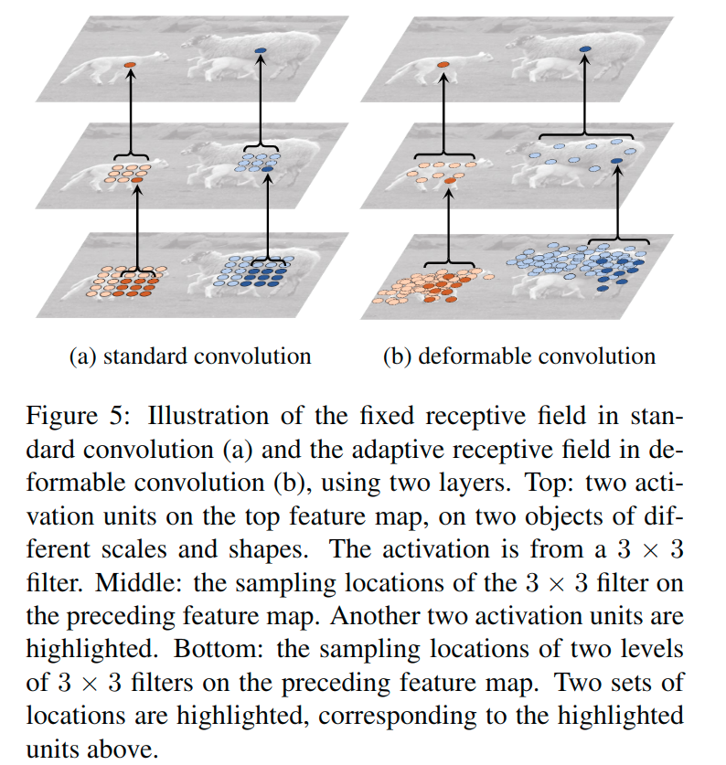

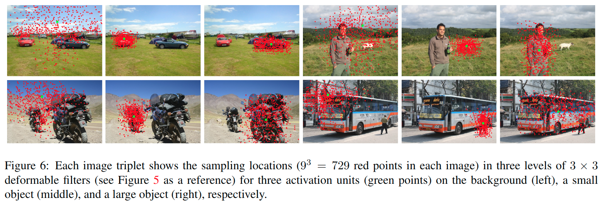

### 可变形RoI池化

#### ROI池化

在所有基于区域提出的目标检测方法中都使用了RoI池化[16,15,47,7]. 它将任意大小的输入矩形区域转换为固定大小的特征.

给定输入特征映射$\mathbf{x}$、RoI的大小$w\times h$和左上角$\mathbf{p}_0$, RoI池化将ROI分到$k\times k$(k是一个自由参数)个组块(bin)中, 并输出$k\times k$的特征映射$\mathbf{y}$. 对于第$(i,j)$个组块$(0\le i,j < k)$, 我们有

$\mathbf{y}(i,j)=\sum_{\mathbf{p}\in bin(i,j)} \mathbf{x}(\mathbf{p}_0+\mathbf{p})/n_{ij},\tag{5}$

其中$n_{ij}$是组块中的像素数量, 这里表示了是一个平均池化.

第$(i,j)$个组块的跨度为$\lfloor i \frac{w}{k} \rfloor \le p_x < \lceil (i+1)\frac{w}{k}\rceil$和$\lfloor j \frac{h}{k}\rfloor \le p_y < \lceil (j+1)\frac{h}{k} \rceil$.

> 缩放比例是w/k, 也就是kxk个输出bin中, 每一个对应于w/k个长度的输入, 再输入上的跨度就是 i\*w/k~(i+1)\*w/k, 上下取整这里是为了保证边界为整数, 而且尽量大的选择输入区域的范围, 于是下界下取整, 上界上取整.

类似于方程(2), 在可变形RoI池化中, 将偏移$\{\Delta \mathbf{p}_{ij}|0\le i,j < k\}$加到空间组块的位置上. 方程(5)变为

$\mathbf{y}(i,j)=\sum_{\mathbf{p}\in bin(i,j)} \mathbf{x}(\mathbf{p}_0+\mathbf{p}+\Delta \mathbf{p}_{ij})/n_{ij}. \tag{6}$

通常, $\Delta \mathbf{p}_{ij}$是小数. 方程(6)通过双线性插值方程(3)和(4)来实现.

> 这里双线性插值的方式和前面的可变形卷积过程基本类似, 因为, 主要是确定了插值结果后, 作为池化的输入值, 在进行后续的池化操作.

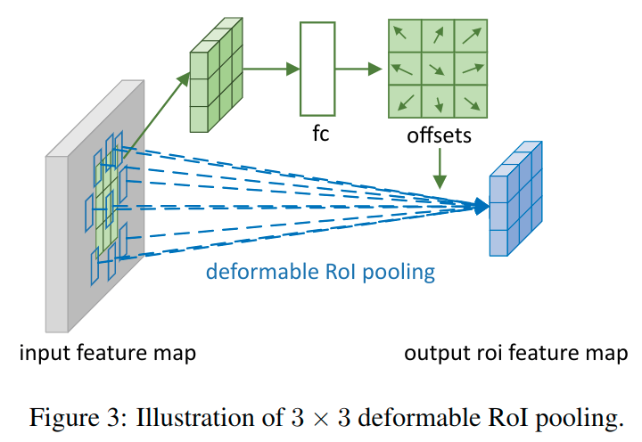

> 阐述3×3的可变形RoI池化.

图3说明了如何获得偏移量.

1. 首先, RoI池化(方程(5))生成池化后的特征图

    > :question:
    >
    > 这里有些疑惑, 这里实际上没有池化的结果吧, 池化后还怎么调整原始坐标, 应该是按照上图那样, 这次池化要处理一个3x3的位置, 所以这里先把这九个点的坐标取出来, 在进行坐标偏移的预测, 针对九个坐标各自生成一个组偏移值, 这样才能方便的和原本的坐标进行求和处理.
    >
    > 尚待研究, 估计需要看看代码

2. 从特征图中, 进过一个fc层产生各个点对应的*归一化*偏移量$\Delta \widehat{\mathbf{p}}_{ij}$

3. 然后通过与RoI的宽和高进行逐元素的相乘将其转换为方程(6)中的偏移量$\Delta \mathbf{p}_{ij}$

4. 获得偏移量后, 将索引与原本的输入索引相加, 利用双线性插值, 获得最终的输入像素值, 进而进行池化操作.

    > 如: $\Delta \mathbf{p}_{ij} = \gamma \cdot \Delta \widehat{\mathbf{p}}_{ij} \circ (w, h)$.
    >
    > 这里$\gamma$是一个预定义的标量来调节偏移的大小. 它经验地设定为$\gamma=0.1$.
    >
    > 为了使偏移学习对RoI大小具有不变性, 偏移归一化是必要的.
    >
    > fc层是通过反向传播学习.

它为前面的RoI池化的常规bin分区中的每个bin位置添加一个偏移量[15,7]. 类似地, 从前面的特征映射和RoI中学习偏移量, 使得具有不同形状的目标能够自适应的进行部件定位.

#### 位置敏感(PS)的RoI池化

> 这个理解可以借助R-FCN的论文

它是全卷积的, 不同于RoI池化.

通过一个卷积层, 所有的输入特征映射首先被转换为每个目标类的$k^2$个*分数映射*(对于C个目标类, 总共C+1个, 这里是应该计算了背景类), 如图4的底部分支所示.

不需要区分类, 这样的**分数映射**被表示为$\lbrace \mathbf{x}_{i,j}\rbrace$, 其中$(i,j)$枚举所有的组块. 池化是在这些分数映射上进行的. 第$(i,j)$个组块的输出值是通过对分数映射$\mathbf{x}_{i,j}$对应的组块求和得到的.

简而言之, 与方程(5)中RoI池化的区别在于, 通用特征映射$\mathbf{x}$被特定的位置敏感的分数映射$\mathbf{x}_{i,j}$所取代.

$\mathbf{y}(i,j)=\sum_{\mathbf{p}\in bin(i,j)} \mathbf{x}_{i,j}(\mathbf{p}_0+\mathbf{p})/n_{ij}. \tag{7}$

在可变形PS RoI池化中, 方程(6)中唯一的变化是$\mathbf{x}$也被修改为$\mathbf{x}_{i,j}$.

$\mathbf{y}(i,j)=\sum_{\mathbf{p}\in bin(i,j)} \mathbf{x}_{i,j}(\mathbf{p}_0+\mathbf{p}+\Delta \mathbf{p}_{ij})/n_{ij}. \tag{8}$

但是, 偏移学习是不同的. 它遵循[7]中的“全卷积”精神, 如下图所示. 在顶部分支中, 一个卷积层生成完整空间分辨率的偏移量字段. 对于每个RoI(也对于每个类), 在这些字段上应用PS RoI池化以获得*归一化*偏移量$\Delta \widehat{\mathbf{p}}_{ij}$, 然后以上面可变形RoI池化中描述的相同方式将其转换为实数偏移量$\Delta \mathbf{p}_{ij}$.

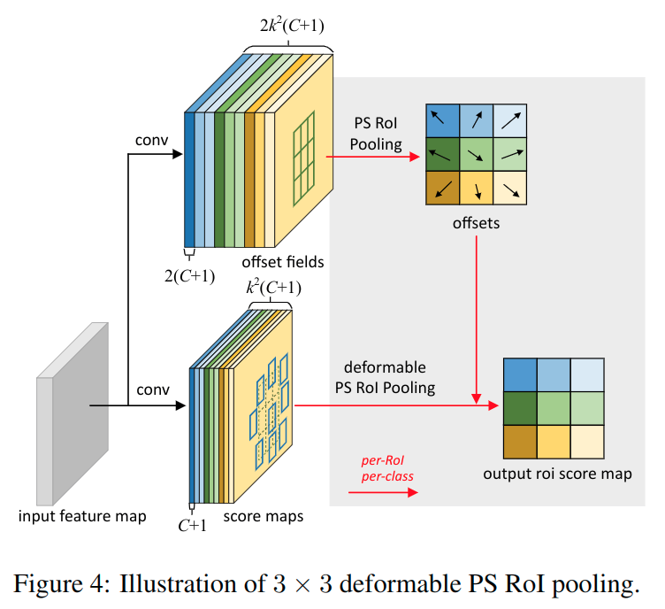

对于上面的得分图可以按照下面的引用介绍来进行了解, 这里是在原始的得分图的基础上, 外加了一个可变形池化分支, 进而对于原本的池化进行调整. 这里的池化和位置有着紧密关联, 可见下文, 所以称为位置敏感的池化.

> https://zhuanlan.zhihu.com/p/30867916
>
> R-FCN会在共享卷积层的最后再接上一层卷积层, 而该卷积层就是“位置敏感得分图position-sensitive score map”, 该score map是什么意义呢？
>
> 首先它就是一层卷积层, 它的height和width和共享卷积层的一样, 但是它的channels=  , 如上图所示。
>
> 那么C表示物体类别种数再加上1个背景类别, 每个类别都有 个score maps.
>
> 现在我们先只针对其中的一个类别来讨论, 假设是人这个类别, 那么其有  个score maps.
>
> * 每一个score map表示“**原图image中的哪些位置含有人的某个一个部位**”
>
> * 而该score map会在含有“该score map对应的人体的某个部位”的位置有“高响应值”, **也就是说每一个score map都是用来“描述人体的其中一个部位出现在该score map的何处, 而在出现的地方就有高响应值”**
>
>     > 也就是说, 以3\*3这样一个划分的区域为例, 第5格子主要关注各类别下第5个score map的第5个格子所对应的位置的相应.
>     >
>     > 这里实际上就基于前面提到的"它的height和width和共享卷积层的一样(这里有点说的不太清楚, 个人理解, 应该是指的输出特征图大小的宽高是保持原本的不变的)", 所以特征图上的位置和原本输入上是有对应关系的. 如下图.
>
> * 那么好了既然是这样, 那么我们只要将RoI的各个子区域对应到“属于人的每一个score map”上然后获取它的响应值不就好了.
>
>     对, 就是这样. 但是要注意, 由于一个score map都是只属于“一个类别的一个部位”的, 所以**RoI的第  个子区域一定要到第  张score map上去找*对应区域的响应值***, 因为RoI的第  的子区域需要的部位和第  张score map**关注的部位是一样**的, 所以就是这样的对应关系.
>
> * 那么现在该RoI的  个子区域都已经分别到“属于人的  个score maps”上找到其响应值了, 那么如果这些响应值都很高, 那么就证明该RoI是人呀~对吧.
>
>     不过, 当然这有点不严谨, 因为我们只是在“属于人的  个score maps”上找响应值, 我们还没有到属于其它类别的score maps上找响应值呢, 万一该RoI的各个子区域在属于其它类别的上的score maps的响应值也很高, 那么该RoI就也有可能属于其它类别呢？是吧, 万一2个类别的物体本身就长的很像呢？
>
>     所以呢, 当然就是看哪个类别的响应值更高了.
>
> 注意, 这里没有提到, **如何去找这个响应值**. 这里就是涉及到了这一部分的“位置敏感RoI池化操作了（Position-sensitive RoI pooling）”, 字面意思理解就是“池化操作是位置敏感的”, 现在就来解释“池化操作是怎么个位置敏感法”.
>
> 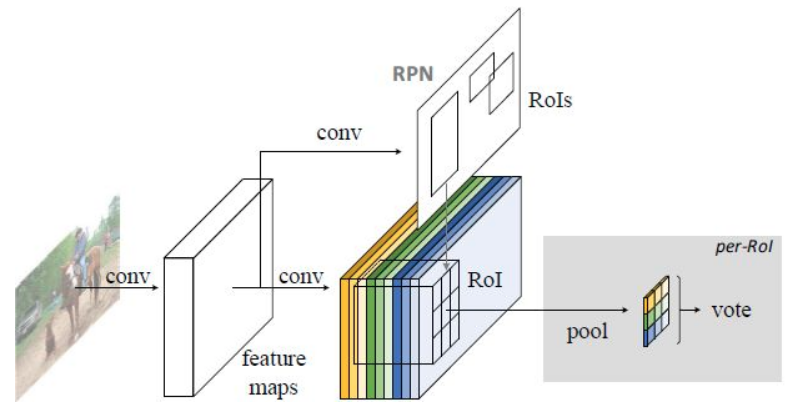
>
> 看这图, 通过RPN提取出来的RoI区域, 其是包含了“坐标、长宽”的4值属性的, 也就是说不同的RoI区域能够对应到score map的不同位置上, 而一个RoI会分成  个bins（也就是子区域. 每个子区域bin的长宽分别是  和  ）, **每个bin都对应到score map上的某一个区域**（上图已经很明显的画出来了）.
>
> 那么好既然该RoI的每个bin都对应到score map上的某一个子区域, 那么池化操作就是在该bin对应的score map上的子区域执行, 且执行的是平均池化. 我们在上一部分已经讲了, 第  个bin应对在第  个score map上找响应值, 那么也就是在**第  个score map上的“该第  个bin对应的位置”上进行池化操作**, 且池化是**取“bin这个范围内的所有值的平均值”**.
>
> 并且由于有  个类别, 所以每个类别都要进行相同方式的池化.
>
> 下图很清楚的表述了得分图与对应的bin的对应关系, 以及对应类别判定的计算方式.
>
> 
>
> 对于每个类别, 它都有  个score maps, 那么按照上述的池化方式, 可以RoI针对该类别可以得到  个值, 那么一共有  个类别, 那么一个RoI就得到  个值, 就是上图的“channels=  , size=  ”的特征图.
>
> 那么**对于每个类别, 该类别的  个值都表示该RoI属于该类别的响应值, 那么将这  个数相加就得到该类别的score**, 那么一共有  个scores, 那么将这  个数使用简单的softmax函数就可以得到属于各个类别的概率了.
>
> > 这里对于每个类别, 这里提到的$k^2$个值(上图中间的特征图), 是如何取出来的呢? 有两种考虑:
> >
> > 1. 是对于一类而言, 有着对应的$k^2$个得分图, 是从中选择(第i个bin对应的)第i个得分图上的RoI的第i个区域的池化结果(一个值)作为最后的合并结果里的第i个位置的输出(也就是上图中间的特征图的第i个位置), 而且这里不再考虑第i个得分图的第$j(j \ne i)$个区域对应的池化结果(也就是对于中间特征图而言的一个通道来说, <u>特征图的第i个位置</u>的结果只和<u>这个类别下的第i个得分图的第i个位置</u>有关)?
> >
> > 2. 还是说, 对于第i个bin对应的第i个得分图上的这$k^2$个区域, 进行池化得到的$k^2$个结果, 都要进行考虑. 也就是说, 对于一类中的$k^2$个得分图, 每一个都要得到$k^2$个输出, 最后将这$k^2$组$k^2$个输出, 对应位置相加求和, 进而得到上图中中间的$k^2$特征图?
> >
> > 但是按照前面的的公式$\mathbf{y}(i,j)=\sum_{\mathbf{p}\in bin(i,j)} \mathbf{x}_{i,j}(\mathbf{p}_0+\mathbf{p})/n_{ij}$来讲, 这里输出里的第(i,j)个位置上的元素仅和第(i,j)个得分图上的第(i,j)个bin里对应的数据有关系, 也就是应该是按照第1点来理解的.
>
> （注意, 这里不需要使softmax分类器了, 只需要使用简单的softmax函数, 因为这里就是通过简单的比大小来判断最终的类别的, 下图的2个公式已经写的很清楚了）
>
> 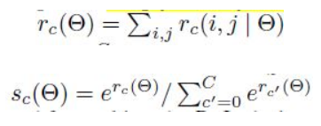

## 实现的效果

### 配置

#### 语义分割

我们使用PASCAL VOC[10]和CityScapes[6].

- 对于PASCAL VOC, 有20个语义类别. 遵循[19,41,4]中的协议, 我们使用VOC 2012数据集和[18]中的附加掩模注释. 训练集包含10,582张图像. 评估在验证集中的1,449张图像上进行.
- 对于CityScapes, 按照[5]中的协议, 对训练数据集中的2,975张图像和验证集中的500张图像分别进行训练和评估. 有19个语义类别加上一个背景类别.

为了评估, 我们使用在图像像素上定义的平均交集(mIoU)度量, 遵循标准协议[10, 6]. 我们在PASCAl VOC和Cityscapes上分别使用mIoU@V和mIoU@C.

在训练与推断中, PASCAL VOC中图像的大小调整为较短边有360个像素, Cityscapes较短边有1,024个像素. 在SGD训练中, 每个小批次数据中随机抽取一张图像. 分别对PASCAL VOC和Cityscapes进行30k和45k迭代, 有8个GPU每个GPU上处理一个小批次数据. 前$\frac {2} {3}$次迭代和后$\frac{1}{3}$次迭代的学习率分别设为$10^{-3}, 10^{-4}$.

#### 目标检测

我们使用PASCAL VOC和COCO[39]数据集.

- 对于PASCAL VOC, 按照[15]中的协议, 对VOC 2007 trainval和VOC 2012 trainval的并集进行培训. 评估是在VOC 2007测试集上.
- 对于COCO, 遵循标准协议[39], 分别对trainval中的120k张图像和test-dev中的20k张图像进行训练和评估.

为了评估, 我们使用标准的平均精度均值(MAP)得分[10,39]. 对于PASCAL VOC, 我们使用0.5和0.7的IoU阈值报告mAP分数. 对于COCO, 我们使用mAP@[0.5: 0.95]的标准COCO度量, 以及mAP@0.5.

在训练和推断中, 图像被调整为较短边具有600像素. 在SGD训练中, 每个小批次中随机抽取一张图片.

对于*class-aware RPN*, 从图像中采样256个RoI. 对于*Faster R-CNN*和*R-FCN*, 对区域提出和目标检测网络分别采样256个和128个RoI. 在ROI池化中采用$7\times 7$的组块.

为了促进VOC的消融实验, 我们遵循[38], 并且利用预训练的和固定的RPN提出来训练Faster R-CNN和R-FCN, 而区域提出和目标检测网络之间没有特征共享. RPN网络是在[47]中过程的第一阶段单独训练的.

对于COCO, 执行[48]中的联合训练, 并且训练可以进行特征共享. 在8个GPU上分别对PASCAL VOC和COCO执行30k次和240k次迭代. 前$\frac {2} {3}$次迭代和后$\frac{1}{3}$次迭代的学习率分别设为$10^{-3}, 10^{-4}$.

### 验证

我们进行了广泛的消融研究来验证我们方法的功效性和有效性.

#### 可变形卷积

表1使用ResNet-101特征提取网络评估可变形卷积的影响. 当使用更多可变形卷积层时, 精度稳步提高, 特别是*DeepLab*和*class-aware RPN*. 当DeepLab使用3个可变形层时, 改进饱和, 其它的使用6个. 在其余的实验中, 我们在特征提取网络中使用3个.

我们经验地观察到, 可变形卷积层中学习到的偏移量对图像内容具有高度的自适应性.

为了更好地理解可变形卷积的机制, 我们为可变形卷积滤波器定义了一个称为*有效扩张*的度量标准. 它是滤波器中所有采样位置的相邻对之间距离的平均值. 这是对滤波器的感受野大小的粗略测量.

我们在VOC 2007测试图像上应用R-FCN网络, 具有3个可变形层(如表1所示). 根据真实边界框标注和滤波器中心的位置, 我们将可变形卷积滤波器分为四类: 小, 中, 大和背景.

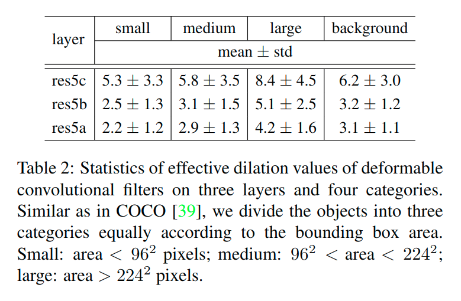

表2报告了有效扩张值的统计(平均值和标准差). 它清楚地表明:

1. *可变形滤波器的感受野大小与目标大小相关, 表明变形是从图像内容中有效学习到的；*
2. *背景区域上的滤波器大小介于中, 大目标的滤波器之间, 表明一个相对较大的感受野是识别背景区域所必需的.*

> 可以从图中的均值看出来, 前两个较小, 第三个较大, 第四个处于中等, 也是上述分析得出的依据

这些观察结果在不同层上是一致的.

默认的ResNet-101模型在最后的3个3×3卷积层使用扩张为的2空洞卷积. 我们进一步尝试了扩张值4, 6和8, 并在表3中报告了结果. 它表明:

1. 当使用较大的扩张值时, 所有任务的准确度都会增加, 表明默认网络的感受野太小； (相较于默认的2来说)
2. 对于不同的任务, 最佳扩张值是不同的, 例如, 6用于DeepLab, 4用于Faster R-CNN；
3. *可变形卷积具有最好的精度.*

这些观察结果证明了滤波器变形的自适应学习是有效和必要的.

#### 可变形RoI池化

它适用于Faster R-CNN和R-FCN.

如表3所示, 单独使用它已经产生了显著的性能收益, 特别是在严格的mAP@0.7度量标准下. 当同时使用可变形卷积和RoI池化时, 会获得显著准确性改进.

#### 模型复杂性和运行时间

表4报告了所提出的可变形ConvNets及其普通版本的模型复杂度和运行时间.

可变形ConvNets仅增加了很小的模型参数和计算量. 这表明显著的性能改进来自于建模几何变换的能力, 而不是增加模型参数.

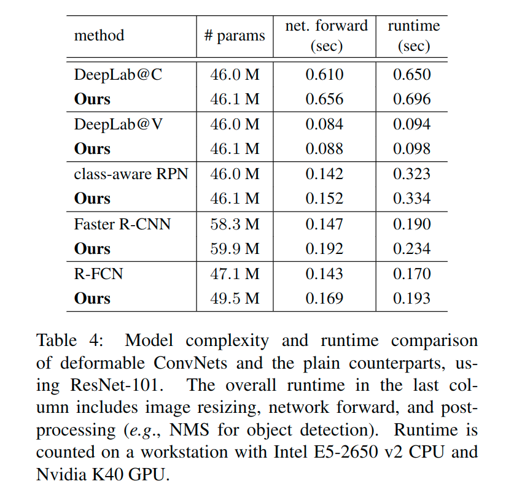

### COCO的目标检测

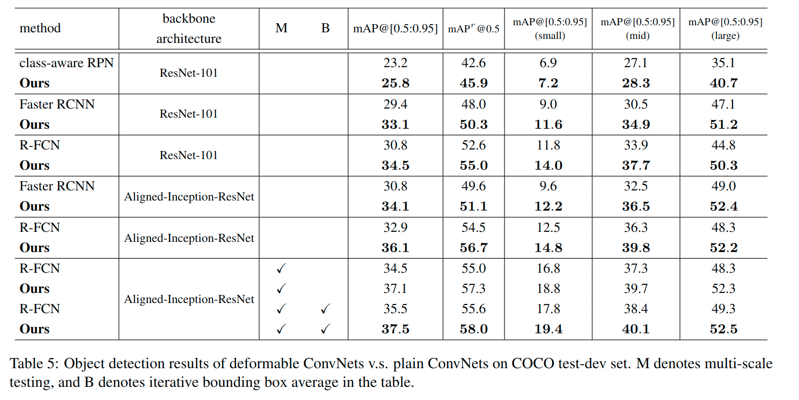

在表中, 我们在COCO test-dev数据集上对用于目标检测的可变形ConvNets和普通ConvNets进行了广泛的比较. 我们首先使用ResNet-101模型进行实验.

class-aware RPN, Faster CNN和R-FCN的可变形版本分别获得了25.8%, 33.1%和34.5%的mAP@[0.5: 0.95]分数, 分别比它们对应的普通ConvNets相对高了11%, 13%和12%.

通过在Faster R-CNN和R-FCN中用Aligned-Inception-ResNet取代ResNet-101, 由于更强大的特征表示, 它们的普通ConvNet基线都得到了提高. 而可变形ConvNets带来的有效性能收益也是成立的. 通过在多个图像尺度上(图像较短边在[480,576,688,864,1200,1400]内)的进一步测试, 并执行迭代边界框平均[14], 对于R-FCN的可变形版本, mAP@[0.5: 0.95]分数增加到了37.5％.

请注意, 可变形ConvNets的性能增益是对这些附加功能的补充.

## 相关的工作

### 空间变换网络*STN*[26]

这是在深度学习框架下从数据中学习空间变换的第一个工作. *它通过全局参数变换扭曲特征映射, 例如仿射变换*. 这种扭曲是昂贵的, 学习变换参数是困难的. STN在小规模图像分类问题上取得了成功. 反STN方法[37]通过**有效的变换参数传播来代替昂贵的特征扭曲**.

可变形卷积中的偏移学习可以被认为是STN中极轻的空间变换器[26]. 然而, *可变形卷积不采用全局参数变换和特征扭曲. 相反, 它以局部密集的方式对特征映射进行采样.* 为了生成新的特征映射, 它有加权求和步骤, STN中不存在.

可变形卷积很容易集成到任何CNN架构中. 它的训练很简单. 对于要求密集(例如语义分割)或半密集(例如目标检测)预测的复杂视觉任务来说, 它是有效的. 这些任务对于STN来说是困难的(如果不是不可行的话)[26,37].

> 关于STN: https://blog.csdn.net/qq_39422642/article/details/78870629
>
> 据说STN和本文关系紧密, 所以在上文的基础上, 稍作总结, 记录在<STN总结(2015)>中.

### 主动卷积*Active Convolution*[27]

还通过偏移来增加卷积中的采样位置, 并通过端到端的反向传播学习偏移量. 它对于图像分类任务是有效的. 与可变形卷积的两个关键区别使得这个工作不那么一般和适应(less general and adaptive).

* 首先, 它在所有不同的空间位置上共享偏移量.
* 其次, 偏移量是每个任务或每次训练都要学习的静态*模型参数*.

他们对图像中的密集空间变换进行建模, 对于(半)密集的预测任务(如目标检测和语义分割)是有效的.

### 有效的感受野[43]

已被发现感受野中的所有像素并不都贡献平等的输出响应. 中心附近的像素影响更大. 有效感受野只占据理论感受野的一小部分, 并具有高斯分布. 虽然理论上的感受野大小随卷积层数量线性增加, 但令人惊讶的结果是, 有效感受野大小随着数量的*平方根*线性增加, 因此, 感受野大小以比我们期待的*更低的速率*增加.

这一发现表明, 即使是深层CNN的顶层单元也可能没有足够大的感受野. 这部分解释了为什么空洞卷积[23]被广泛用于视觉任务. 它表明了自适应感受野学习的必要.

可变形卷积能够自适应地学习感受野.

### 空洞卷积[23]

它将正常滤波器的步长增加到大于1, 并保持稀疏采样位置的原始权重. 这增加了感受野的大小, 并保持了相同的参数和计算复杂性. 它已被广泛用于语义分割[41,5,54](在[54]中也称扩张卷积), 目标检测[7]和图像分类[55].

可变形卷积是空洞卷积的推广, 如文章开头图(c)所示. 表3给出了大量的与空洞卷积的比较.

### 可变形部件模型(DPM)[11]

可变形RoI池化与DPM类似, 因为两种方法都可以学习目标部件的空间变形, 以最大化分类得分. 由于不考虑部件之间的空间关系, 所以可变形RoI池化更简单.

DPM是一个浅层模型, 其**建模变形能力有限**. 虽然其推理算法可以通过将距离变换视为一个特殊的池化操作转换为CNN[17], 但是它的训练不是端到端的, 而是涉及启发式选择, 例如选择组件和部件尺寸. 相比之下, **可变形ConvNets是深层的并进行端到端的训练**. 当多个可变形模块堆叠时, 建模变形的能力变得更强.

### **DeepID-Net**[44]

它引入了一个变形约束池化层, 它也考虑了目标检测的部分变形. 因此, 它与可变形RoI池化共享类似的精神, 但是要复杂得多. 这项工作是高度工程化并基于RCNN的[16]. 目前尚不清楚如何以端对端的方式将其应用于最近的最先进目标检测方法[47,7].

### RoI池化中的空间操作

空间金字塔池化[34]在尺度上使用手工设计的池化区域. 它是计算机视觉中的主要方法, 也用于基于深度学习的目标检测[21,15].

很少有学习池化区域空间布局的研究. [28]中的工作从一个大型的超完备集合中学习了池化区域的一个稀疏子集. 大数据集是手工设计的并且学习不是端到端的.

可变形RoI池化第一个在CNN中端到端学习池化区域的方法. 虽然目前这些区域规模相同, 但像空间金字塔池化[34]那样扩展到多种尺度, 很简单.

### 变换不变特征及其学习

在设计变换不变特征方面已经进行了巨大的努力. 值得注意的例子包括尺度不变特征变换(SIFT)[42]和ORB[49](O为方向). 在CNN的背景下有大量这样的工作. **CNN表示**对**图像变换**的不变性和等价性在[36]中被研究. 一些工作学习关于不同类型的变换(如[50], 散射网络[3], 卷积森林[32]和TI池化[33])的不变CNN表示. 有些工作专门用于对称性[13,9], 尺度[29]和旋转[53]等特定转换.

如第一部分分析的那样, 在这些工作中, **转换是先验的**. 使用知识(比如参数化)来手工设计特征提取算法的结构, 或者是像SIFT那样固定的, 或者用学习的参数, 如基于CNN的那些. 它们无法处理新任务中的未知变换.

相反, 我们的可变形模块概括了各种转换(见图1). 从目标任务中学习变换的不变性.

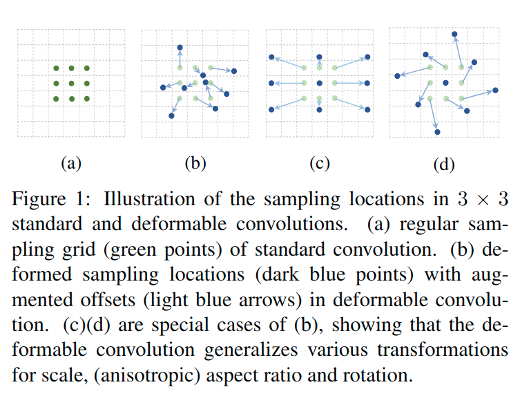

### 动态滤波器[2]

与可变形卷积类似, 动态滤波器也是依据输入特征并在采样上变化. 不同的是, 只**学习滤波器权重**, 而不是像我们这样采样位置. 这项工作适用于视频和立体声预测.

### 低级滤波器的组合

高斯滤波器及其平滑导数[30]被广泛用于提取低级图像结构, 如角点, 边缘, T形接点等. 在某些条件下, 这些滤波器形成一组基, 并且它们的线性组合在同一组几何变换中形成新的滤波器, 例如*Steerable Filters*[12]中的多个方向和[45]中多尺度. 我们注意到尽管[45]中使用了*可变形内核*这个术语, 但它的含义与我们在本文中的含义不同.

大多数CNN从零开始学习所有的卷积滤波器. 最近的工作[25]表明, 这可能是没必要的. 它通过低阶滤波器(高斯导数达4阶)的加权组合来代替自由形式的滤波器, 并学习权重系数. 通过对滤波函数空间的正则化, 可以提高训练小数据量时的泛化能力.

上面的工作与我们有关, 当多个滤波器, 尤其是不同尺度的滤波器组合时, 所得到的滤波器可能具有复杂的权重, 并且与我们的可变形卷积滤波器相似. 但是, **可变形卷积学习采样位置而不是滤波器权重**.

## 阅读中的疑惑

1. 在深度CNN中学习**密集空间变换**对于复杂的视觉任务(如目标检测和语义分割)是有效的?
2. 关于公式3, 4这里怎么理解, 或者说怎么推导呢?
3. RoI可变性池化中的第一步是怎样的?(见前面的标注)

## 参考链接

详解R-FCN https://zhuanlan.zhihu.com/p/30867916
