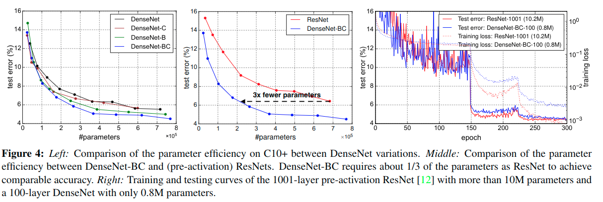
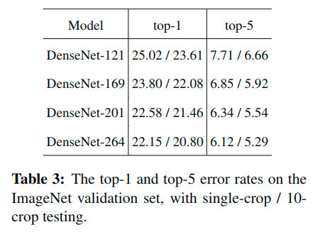
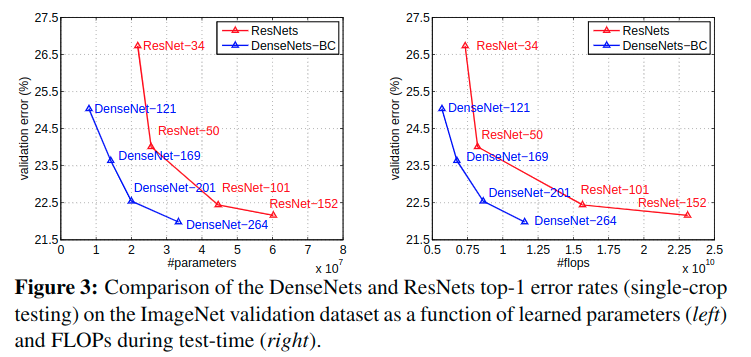

# DenseNet(2017)

我们提出了一个新的卷积网络架构, 我们称之为密集卷积网络（DenseNet）。

* 它引入了具有相同特征图大小的任意两个层之间的直接连接.
* 我们发现, DenseNet**可以轻易地扩展到数百层, 而没有优化困难**.
* 在我们的实验中, DenseNet**趋向于在不断增加的参数数量上提高准确性, 没有任何性能下降或过度拟合的迹象**.
* 在多种不同的超参数设置下, 在多个竞争激烈的数据集上获得了领先的结果.
* 此外, DenseNet需要更少的参数和更少的计算来达到领先的性能.
* 因为我们**在研究中采用了针对残差网络优化的超参数设置**, 我们认为, 通过更详细地调整超参数和学习速率表, 可以获得DenseNet的精度进一步提高.

* 虽然遵循简单的连接规则, DenseNet**自然地整合了恒等映射, 深度监督和多样化深度的属性**(identity mappings, deep supervision, and diversified depth).
* 它们允许在整个网络中进行**特征重用**, 从而可以学习**更紧凑更准确的模型**.
* 由于其紧凑的内部表示和减少了特征冗余, DenseNet可能是建立在卷积特征上的各种计算机视觉任务的良好特征提取器, 例如[39](https://alvinzhu.xyz/2017/10/07/densenet/#fn:4) [40](https://alvinzhu.xyz/2017/10/07/densenet/#fn:5).
* 我们计划在未来的工作中使用DenseNets研究这种特征的转移.

## 核心: DenseBlock

### 结构图

在传统的卷积神经网络中, 如果有L层, 那么就会有L个连接, 但是在DenseNet中, 会有L(L+1)/2个连接.

**简单讲, 就是每一层的输入来自前面所有层的输出. **每个层从所有先前层中获得额外的输入, 并将其自身的特征图传递给所有后续层.

DenseNet有几个优点：它们可以**减轻梯度弥散问题, 加强特征传播, 鼓励特征重用, 大大减少参数数量**.

如下图：x0是input, H1的输入是x0（input）, H2的输入是x0和x1（x1是H1的输出）……

> 5层的密集连接块, 增长率k=4, 每一层都把先前层的输出作为输入, 图中的彩色x表示输出的特征图, 亦或可以看做BN的输入. 这里用的是BN->ReLU->Conv的顺序.
>
> 注意, 这里跳接的是输出的xl.

### 结构分析

考虑在一个卷积网络中传递的单独图像x0. 这个网络包含L层, 每层都实现了一个非线性变换Hℓ(⋅), 其中ℓ表示层的索引. Hℓ(⋅)可以是诸如批量归一化(BN)[27](https://alvinzhu.xyz/2017/10/07/densenet/#fn:14)、线性整流单元(ReLU)[28](https://alvinzhu.xyz/2017/10/07/densenet/#fn:6)、池化(Pooling)[2](https://alvinzhu.xyz/2017/10/07/densenet/#fn:19)或卷积(Conv)等操作的复合函数. 我们将***第ℓ层输出表示为xℓ***.

#### ResNet

这里的l表示层, xl表示l层的输出, Hl表示一个非线性变换. 所以对于ResNet而言, l层的输出是l-1层的输出加上对l-1层输出的非线性变换. 使用恒等函数跳过非线性变换.

ResNets的一个优点是**梯度可以通过从后续层到先前层的恒等函数直接流动**. 然而, 恒等函数与Hℓ的输出是通过**求和组合, 这可能阻碍网络中的信息流**.

> 强行加和在一起, 可能会阻碍信息流, 后面层对于前面层的信息流的读取会被限制.

#### DenseNet

#### 基本

[x0,x1,…,xl-1]表示将0到l-1层的输出feature map做concatenation(输出的**特征图的串联**). 而前面resnet是做**值的相加**, 通道数是不变的.

> 公式(2)与公式(1)的区别仅仅是输入被串联而不是相加

Hl包括BN, ReLU和3*3的卷积. 为了便于实现, 我们将公式中的Hℓ(⋅)的多个输入**连接起来变为单张量**

#### 复合函数

受到[17](https://alvinzhu.xyz/2017/10/07/densenet/#fn:12)的启发, 我们将Hℓ(⋅)定义为进行三个连续运算的复合函数：先批量归一化(BN)[27](https://alvinzhu.xyz/2017/10/07/densenet/#fn:14), 然后是线性整流单元(ReLU)[28](https://alvinzhu.xyz/2017/10/07/densenet/#fn:6), 最后接一个3×3的卷积(Conv).

> 实际的DenseBlock中, 为多个H的级联, 如下图的块中有五个小黑圈, 表示有图1中的x0~x4, 五个圈中的箭头, 表示H1~H4这样的四个复合函数.
>
> x0也就是过渡层的输出, 或者对于原始输入卷积处理后的输出, 具体取决于位置.

#### 过渡层

当特征图的大小变化时, 公式中的级串联运算是不可行的.

所以, 卷积网络的一个必要的部分是**改变特征图尺寸的下采样层**. 为了便于我们的架构进行下采样, 我们将网络分为多个密集连接的密集块, 如图所示（一个有三个密集块的DenseNet. 两个相邻块之间的层被称为过渡层, 并**通过卷积和池化来改变特征图大小**）.

我们将块之间的层称为**过渡层**, 它们进行卷积和池化. 我们实验中使用的过渡层由**一个批量归一化层(BN), 一个1×1的卷积层和一个2×2平均池化层**组成.

#### 增长率

如果每个Hℓ函数输出k个特征图, 那么第ℓ层有$k_0+k \times (ℓ−1)$个输入特征图, 其中***k0是输入层的通道数***.

> 也就是从前面l-1层, 每个层输出的特征图取k个
>
> 过渡层输出后, 进入下一个块. 在最后的输出之前不用过渡层, 改为分类层. 进入分类层之前, 已经将本DenseBlock的所有输出特征图都汇聚了.
>
> 

与其它网络架构的一个重要的区别是, DenseNet可以有非常窄的层, 比如k=12. 我们将超参数k称为网络的**增长率**.

在实验中可以看到, 一个相对小的增长率已经可以在我们测试的数据集上达到领先的结果.

对此的一个解释是, **每个层都可以访问其块中的所有先前的特征图, 即访问网络的“集体知识”**. 可以将特征图视为网络的全局状态. **每个层都将自己的k个特征图添加到这个状态**. 增长率*调节每层对全局状态贡献多少新信息*.

与传统的网络架构不同的是, 一旦写入, *从网络内的任何地方都可以访问全局状态, *无需逐层复制.

#### 瓶颈层(B标记)

尽管每层**只产生k个输出特征图**, 但它通常具有更多的输入.

在[19](https://alvinzhu.xyz/2017/10/07/densenet/#fn:36) [5](https://alvinzhu.xyz/2017/10/07/densenet/#fn:11)中提到, 一个1×1的卷积层可以被看作是瓶颈层, 放在一个3×3的卷积层之前可以起到减少输入数量的作用, 以提高计算效率.

我们发现这种设计对DenseNet尤其有效, 我们的网络也有这样的瓶颈层, 比如另一个名为`DenseNet-B`版本的Hℓ是这样的：BN-ReLU-Conv(1×1)-BN-ReLU-Conv(3×3), 在我们的实验中, 我们让1×1的卷积层输出**4k个特征图**.

> 需要看下densenet的具体架构细节

#### 压缩(C标记)

为了进一步提高模型的紧凑性, 我们可以在过渡层减少特征图的数量.

如果密集块包含m个特征图, 我们让后续的过渡层输出$⌊θm⌋$个特征图, 其中θ为压缩因子, 且0<θ≤1. 当θ=1时, 通过过渡层的特征图的数量保持不变. 我们将θ<1的DenseNet称作`DenseNet-C`, 我们在实验设置θ=0.5. 我们将同时使用瓶颈层和压缩的模型称为`DenseNet-BC`.

#### 实现细节

在除ImageNet之外的所有数据集上

* 我们实验中使用的DenseNet具有三个密集块, 每个具有相等层数.

* 在进入第一个密集块之前, 对输入图像执行卷积, 输出16（`DenseNet-BC`的增长率的两倍）通道的特征图.
* 对于卷积核为3×3的卷积层, 输入的每一边都添加1像素宽度的边, 以0填充, 以**保持特征图尺寸不变**.
* 在两个连续的密集块之间, 我们使用一个1×1的卷积层接一个2×2的平均池化层作为过渡层.
* 在最后一个密集块的后面, 执行全局平均池化, 然后附加一个softmax分类器.
* 三个密集块的特征图尺寸分别是32×32, 16×16和8×8.
* 在实验中, `基础版本的DenseNet`超参数配置为：L=40,k=12, L=100,k=12和L=100,k=24.
* `DenseNet-BC`的超参数配置为：L=100,k=12, L=250,k=24和L=190,k=40.

在ImageNet上的实验

* 我们使用的DenseNet-BC架构包含4个密集块
* 输入图像大小为224×224.
* 初始卷积层包含2k个大小为7×7, 步长为2的卷积.
* 其它层的特征图数量都由超参数k决定.

具体的网络架构如下表所示（用于ImageNet的DenseNet网络架构. 所有网络的增长率都是k=32. 注意, 表格中的**Conv层表示BN-ReLU-Conv的组合**）

> input -> conv + pool
>
> [-> denseblock -> transition layer(conv + avg-pooling)] * 3 ->
>
> dense block([dense connection ==>> BN -> ReLU -> conv] * 16 ...) ->
>
> classification layer(avg-pooling + fully-connected-softmax)
>
> B/C型架构略有不同.
>
> B: Hl = BN-ReLU-Conv(1×1)-BN-ReLU-Conv(3×3)
>
> C: 让后续的过渡层输出$⌊θm⌋$个特征图

**这就是DenseNet的核心内容**.

> 所以, 基于此, 可以思考:
>
> 1. 以前的网络存在的问题?
> 2. 解决问题的思路?
> 3. 现有的工作
> 4. DenseNet有什么其他的优点?
> 5. DenseNet有什么问题, 可以的改进方向?
> 6. 实际效果如何?

## 存在的问题: 梯度弥散

许多最近的研究致力于解决这个问题或相关的问题.

* ResNet[5](https://alvinzhu.xyz/2017/10/07/densenet/#fn:11)和Highway Network[4](https://alvinzhu.xyz/2017/10/07/densenet/#fn:33)通过恒等连接将信号从一个层传递到另一层.
* Stochastic depth[6](https://alvinzhu.xyz/2017/10/07/densenet/#fn:13)通过在训练期间随机丢弃层来缩短ResNets, 以获得更好的信息和梯度流.
* FractalNet[7](https://alvinzhu.xyz/2017/10/07/densenet/#fn:17)重复地将几个并行层序列与不同数量的约束块组合, 以获得大的标称深度, 同时在网络中保持许多短路径.

虽然这些不同的方法在网络拓扑和训练过程中有所不同, 但它们都具有一个关键特性：**它们创建从靠近输入的层与靠近输出的层的短路径. **

## 解决的思路: 密集的快捷连接

提出了一种将这种关键特性(短路径)简化为简单连接模式的架构：为了确保网络中各层之间的最大信息流, 我们将所有层（匹配的特征图大小）直接连接在一起. 为了保持前馈性质, 每个层从所有先前层中获得额外的输入, 并将其自身的特征图传递给所有后续层.

## 结构的其他优点: 参数效率/训练效率

### 模型紧凑型

DenseNet有几个优点：它们可以减轻梯度弥散问题, **加强特征传播, 鼓励特征重用, 大大减少参数数量**.

这种密集连接模式的可能的反直觉效应是, 它比传统卷积网络需要的参数少, 因为不需要重新学习冗余特征图.

传统的前馈架构可以被看作是具有状态的算法, 它是从一层传递到另一层的. 每个层从上一层读取状态并写入后续层. 它**改变状态, 但也传递需要保留的信息**. ResNet[5](https://alvinzhu.xyz/2017/10/07/densenet/#fn:11)通过加性恒等转换使此信息保持明确.

ResNet的最新变化[6](https://alvinzhu.xyz/2017/10/07/densenet/#fn:13)表明, **许多层次贡献很小**, 实际上可以在训练过程中随机丢弃. 这使得ResNet的状态类似于（展开的）循环神经网络(recurrent neural network)[8](https://alvinzhu.xyz/2017/10/07/densenet/#fn:21), 但是ResNet的参数数量太大, 因为每个层都有自己的权重.

我们提出的DenseNet架构**明确区分添加到网络的信息和保留的信息**.  DenseNet层非常窄（例如, 每层12个卷积核）, 仅将一小组特征图添加到网络的“集体知识”, 并保持剩余的特征图不变.

最终分类器基于网络中的所有特征图. 作为输入串联的直接结果, 任何DenseNet层学习的特征图可以由所有后续层访问. 这有助于整个网络中的特征重用, 并产生**更紧凑的模型**.

除了更好的参数效率, DenseNet的一大优点是它**改善了整个网络中信息流和梯度流**, 从而使其易于训练.

**每个层都可以直接从损失函数和原始输入信号中获取梯度**, 从而进行了深入的监督[9](https://alvinzhu.xyz/2017/10/07/densenet/#fn:20). 这有助于训练更深层的网络架构.

此外, 我们还观察到**密集连接具有正则化效应**, 这减少了具有较小训练集大小的任务的过拟合.

### 隐性深度监督

密集卷积网络提高精度的一个可能的解释是, **各层通过较短的连接从损失函数中接收额外的监督**.

可以认为DenseNet执行了一种“深度监督”. 在深度监督的网络（DSN[9](https://alvinzhu.xyz/2017/10/07/densenet/#fn:20)）中显示了深度监督的好处, 其中每个隐藏层都附有分类器, 迫使中间层去学习不同的特征.

密集网络以一种简单的方式进行类似的深度监督：**网络上的单一分类器通过最多两个或三个过渡层对所有层进行直接监督**.

然而, DenseNet的损失函数和形式显然不那么复杂, 因为所有层之间共享相同的损失函数.

### 随机连接与确定连接

* 密集卷积网络与残差网络的随机深度正则化之间有一个有趣的联系[6](https://alvinzhu.xyz/2017/10/07/densenet/#fn:13).

* 在随机深度中, 通过层之间的直接连接, 残差网络中的层被随机丢弃.

* 由于池化层不会被丢弃, 网络会产生与DenseNet类似的连接模式：

    如果所有中间层都是随机丢弃的, 那么在相同的池化层之间的**任何两层直接连接的概率很小**, 尽管这些方法最终是完全不同的, 但DenseNet对随机深度的解释可以为这种正规化的成功提供线索.

    > 所有中间层都是随机丢弃的, 那么在相同的池化层之间的任何两层直接连接的概率很小?
    >
    > 怎么理解?

### 特征重用

通过设计, DenseNet允许层访问来自其所有先前层的特征映射（尽管有时通过过渡层）.

我们进行实验, 探查训练后的网络是否利用了这一特性. 我们首先在C10+上, 使用超参数：L=40,k=12训练了一个DenseNet.

> 图5显示了所有三个密集块的热度图. 平均绝对权重反映了层之间的依赖性. 在坐标(s,ℓ)上的红点表示层ℓ高度依赖前s层生成的特征图(表示l的输出对于各个输入的特征图的权重依赖).
>
> 
>
> 第一行表示上一层过渡层为源层, 对于**过渡层的输出x0**也参与到denseblock的快捷连接结构中. 而过度层的输入来源于本DenseBlock的所有部分的输出. 包括上一个过渡层的输出.
>
> 从图中可以看出：
>
> 1. 任一层都在同一密集块内的许多输入上更新它们的权重. 这表明, 在同一密集块中, 由先前层提取的特征实际上被后续层直接使用.
> 2. 过渡层也在先前密集块内的所有层的输出上更新它的权重, 这表明, 信息从DenseNet的第一层到最后层仅通过很少的间接传播. (大部分的红色集中在直接连接上)
> 3. 第二和第三密集块内的层一致地将最小的权重分配给**过渡层（三角形的顶行）**的输出, 表明过渡层输出许多冗余特征（平均权重较小）. 这与DenseNet-BC的强大结果保持一致, 其中这些输出被压缩.
> 4. 虽然最右边的分类层也在整个密集块中使用权重, 但似乎**集中在最终的特征图上**, 这表明最终的特征图中可能会出现更多的高级特征.

对于任一块内的每个卷积层ℓ, 我们计算分配给与层s连接的平均（绝对）权重. 如图所示

- 卷积层在训练后的DenseNet中的平均绝对卷积核权重.
- 像素(s,ℓ)表示在同一个密集块中, 连接卷积层s与ℓ的权重的平均L1范数（由输入特征图的数量归一化）.
- 由黑色矩形突出显示的三列对应于两个过渡层和分类层. 第一行表示的是连接到密集块的输入层的权重.

## DenseNet的不足

### Dense Connection 的显存占用大

DenseNet 理论上是省参数的却占用了更多的显存.

> 如何评价Densely Connected Convolutional Networks？ - 知乎用户的回答 - 知乎
> https://www.zhihu.com/question/60109389/answer/202777058
>
> 如何评价Densely Connected Convolutional Networks？ - Lyken的回答 - 知乎
> https://www.zhihu.com/question/60109389/answer/203099761

**显存占用对比**

在图中可以看到, DenseNet 100 层增长率 24 时（无 BottleNeck 的最早版）, parameter数量已接近 ResNet 1001三倍（WTF）. 小实验室的 titanx 根本塞不下更深的 DenseNet.

在作者Huang Gao 和 [@taineleau](http://www.zhihu.com/people/eb951d78163784a78a9ad5af911550f0) 的优化后, DenseNet 的显存问题已大有改善, 但 Flops 消耗问题仍令人头疼. 本来 DenseNet 的实时性尚还可以（拓扑序跟普通网络一样）, 但由于其过于 dense 的num_filters, 计算量就超过了很多卡的上限.

为了优化这两个问题, 论文中采用了 1x1 的 conv  bottleneck来大幅压缩 filters 数目, 效果尚可. 但从个人使用角度来看, 实时模型想要用上 DenseNet 怕是还有很长一段路要走.

> 解决的尝试
>
> https://arxiv.org/abs/1707.06990

## 现有的工作: 连接模式/网络宽度/架构创新

网络架构的探索一直是神经网络研究的一部分. 最近神经网络流行的复苏也使得这个研究领域得以恢复.

现代网络中越来越多的层扩大了架构之间的差异, 激发了对不同**连接模式**的探索和对旧的研究思想的重新审视.

* 类似于我们提出的**密集网络布局的级联结构**已经在20世纪80年代的神经网络文献中被研究[10](https://alvinzhu.xyz/2017/10/07/densenet/#fn:3). 他们的开创性工作着重于以逐层方式训练的全连接多层感知机.

* 最近, 用批量梯度下降训练的**全连接的级联网络**的方法被提出[11](https://alvinzhu.xyz/2017/10/07/densenet/#fn:39). 虽然对小数据集有效, 但这种方法只能扩展到几百个参数的网络.

* 在[12](https://alvinzhu.xyz/2017/10/07/densenet/#fn:9) [13](https://alvinzhu.xyz/2017/10/07/densenet/#fn:23) [14](https://alvinzhu.xyz/2017/10/07/densenet/#fn:30) [15](https://alvinzhu.xyz/2017/10/07/densenet/#fn:40)中, 通过**跳连接在CNN中利用多层次特征**已被发现对于各种视觉任务是有效的. 与我们的工作同时进行的, [16](https://alvinzhu.xyz/2017/10/07/densenet/#fn:1)为具有类似于我们的跨层连接的网络衍生了一个纯粹的理论框架.
    * Highway Network[4](https://alvinzhu.xyz/2017/10/07/densenet/#fn:33)是其中第一个提供了有效训练100多层的**端对端网络**的方案. 使用**旁路与门控单元**, 可以无困难地优化具有数百层深度的Highway Network. 旁路是使这些非常深的网络训练变得简单的关键因素.

    * ResNet[5](https://alvinzhu.xyz/2017/10/07/densenet/#fn:11)进一步支持这一点, 其中**纯恒等映射用作旁路**. ResNet已经在许多挑战性的图像识别, 定位和检测任务（如ImageNet和COCO对象检测）上取得了显著的创纪录的表现[5](https://alvinzhu.xyz/2017/10/07/densenet/#fn:11).

    * 最近, Stochastic depth被提出作为一种成功地训练1202层ResNet的方式[6](https://alvinzhu.xyz/2017/10/07/densenet/#fn:13). Stochastic depth通过在**训练期间随机丢弃层**来改善深层ResNet的训练. 具有预激活的ResNet还有助于对具有超过1000层的最先进网络的训练[17](https://alvinzhu.xyz/2017/10/07/densenet/#fn:12).

        > *这表明不是所有的层都是有必要存在的, 并且突显了在深层网络中存在大量的冗余*. 本文一定程度上受到了这一观点的启发.

另一种使网络更深的方法（例如, 借助于跳连接）是**增加网络宽度**.

* GoogLeNet[18](https://alvinzhu.xyz/2017/10/07/densenet/#fn:35) [19](https://alvinzhu.xyz/2017/10/07/densenet/#fn:36)使用一个“Inception模块”, 它连接由不同大小的卷积核产生的特征图.
* 在[20](https://alvinzhu.xyz/2017/10/07/densenet/#fn:37)中, 提出了具有宽广残差块的ResNet变体. 事实上, *只要深度足够, 简单地增加每层ResNets中的卷积核数量就可以提高其性能*[21](https://alvinzhu.xyz/2017/10/07/densenet/#fn:41).
* FractalNet也可以使用更宽的网络结构在几个数据集上达到不错的效果[7](https://alvinzhu.xyz/2017/10/07/densenet/#fn:17).

> DenseNet**不是通过更深或更宽的架构来获取更强的表示学习能力, 而是通过特征重用来发掘网络的潜力**, 产生易于训练和高效利用参数的浓缩模型.
>
> 由**不同层次学习的串联的特征图增加了后续层输入的变化并提高效率**. 这是DenseNet和ResNet之间的主要区别. 与Inception网络[18](https://alvinzhu.xyz/2017/10/07/densenet/#fn:35) [19](https://alvinzhu.xyz/2017/10/07/densenet/#fn:36)相比, 它也连接不同层的特征, DenseNet更简单和更高效.

还有其他显著的网络**架构创新**产生了有竞争力的效果.

* NIN[22](https://alvinzhu.xyz/2017/10/07/densenet/#fn:22)的结构包括将**微多层感知机插入到卷积层的卷积核**中, 以提取更复杂的特征.
* 在深度监督网络（DSN）[9](https://alvinzhu.xyz/2017/10/07/densenet/#fn:20)中, **隐藏层由辅助分类器直接监督**, 可以加强先前层次接收的梯度.
* 梯形网络[23](https://alvinzhu.xyz/2017/10/07/densenet/#fn:26) [24](https://alvinzhu.xyz/2017/10/07/densenet/#fn:25)**引入横向连接到自动编码器**, 在半监督学习任务上产生了令人印象深刻的准确性.
* 在[25](https://alvinzhu.xyz/2017/10/07/densenet/#fn:38)中, 提出了通过**组合不同基网络的中间层来提高信息流**的深度融合网络（DFN）.
* 通过**增加最小化重建损失路径**的网络也使得图像分类模型得到改善[26](https://alvinzhu.xyz/2017/10/07/densenet/#fn:42).

## 实际效果

### 训练

* SGD
* 在CIFAR和SVHN上
    * 我们训练批量为64, 分别训练300和40个周期.
    * 初始学习率设置为0.1, 在训练周期数达到50％和75％时除以10.
* 在ImageNet上
    * 训练批量为256, 训练90个周期.
    * 学习速率最初设置为0.1, 并在训练周期数达到30和60时除以10.
    * 由于GPU内存限制, 我们最大的模型(DenseNet-161)以小批量128进行训练.
    * 为了补偿较小的批量, 我们训练该模型的周期数为100, 并在训练周期数达到90时将学习率除以10.
* 根据[34](https://alvinzhu.xyz/2017/10/07/densenet/#fn:8), 我们使用的**权重衰减**为$10^{−4}$, Nesterov**动量**[35](https://alvinzhu.xyz/2017/10/07/densenet/#fn:34)为0.9且没有衰减.
* 我们采用[36](https://alvinzhu.xyz/2017/10/07/densenet/#fn:10)中提出的**权重初始化**.
* 对于没有数据增强的三个数据集, 即C10, C100和SVHN, 我们在每个卷积层之后（除第一个层之外）添加一个Dropout层[37](https://alvinzhu.xyz/2017/10/07/densenet/#fn:32), 并将Dropout率设置为0.2.
* 只对每个任务和超参数设置评估一次测试误差.

### CIFAR和SVHN上的分类结果

我们训练不同深度L和增长率k的DenseNet.

CIFAR和SVHN的主要结果如表所示：

* CIFAR和SVHN数据集的错误率(％).
* k表示网络的增长率.
* **超越所有竞争方法的结果以粗体表示, 整体最佳效果标记为蓝色**.
* “+”表示标准数据增强（翻转和/或镜像）.
* “*”表示我们的运行结果.
* 没有数据增强(C10, C100, SVHN)的DenseNets测试都使用Dropout.
* 使用比ResNet少的参数, DenseNets可以实现更低的错误率.
* 没有数据增强, DenseNet的表现更好.

#### 分析

**准确率**

* 可能最明显的趋势在表的底行, L=190, k=40的DenseNet-BC优于所有CIFAR数据集上现有的一流技术. 它的C10+错误率为3.46％, C100+的错误率为17.18％, 明显低于Wide ResNet架构的错误率[21](https://alvinzhu.xyz/2017/10/07/densenet/#fn:41).

* 我们在C10和C100（没有数据增强）上取得的最佳成绩更令人鼓舞：两者的错误率均比带有下降路径正则化[7](https://alvinzhu.xyz/2017/10/07/densenet/#fn:17)的FractalNet下降了接近30％.
* 在SVHN上, 在使用Dropout的情况下, L=100, k=24的DenseNet也超过Wide ResNet成为了当前的最佳结果.
* 然而, 相对于层数较少的版本, 250层DenseNet-BC并没有进一步改善其性能. 这可以解释为SVHN是一个相对容易的任务, 极深的模型可能会**过拟合**训练集.

**模型容量**

* 在没有压缩或瓶颈层的情况下, **总体趋势是DenseNet在L和k增加时表现更好**. 我们认为这主要是模型容量相应地增长.

* 从表2中C10+和C100+列可以看出. 在C10+上, 随着参数数量从1.0M, 增加到7.0M, 再到27.2M, 误差从5.24％, 下降到4.10％, 最终降至3.74％. 在C100+上, 我们也可以观察到类似的趋势.

* 这表明DenseNet可以利用更大更深的模型提高其表达学习能力. 也表明它们不会受到类似ResNet那样的过度拟合或优化困难[5](https://alvinzhu.xyz/2017/10/07/densenet/#fn:11)的影响.

    > 感觉这里是在说ResNet-1202的问题.
    >
    > 
    >
    > **Exploring Over 1000 layers**
    > 我们探索了一个超过1000层的极其深的模型. 我们设置n=200, 也就是1202层的网络模型, 按照上述进行训练. 我们的方法对103103层的模型并不难优化, 并且达到了<**0.1%**的训练错误率, 它的测试错误率也相当低(**7.93%**).
    >
    > 但是在这样一个极其深的模型上, 仍然存在很多问题. 1202层模型的测试结果比110层的结果要差, 尽管它们的训练错误率差不多. 我们认为这是过拟合导致的. 这样一个1202层的模型对于小的数据集来说太大了(19.4M). 在这个数据集上应用了强大的正则化方法, 如maxout或者 dropout, 才获得了最好的结果.
    >
    > 本文中, 我们并没有使用maxout/dropout, 只是简单的通过设计深层窄模型来进行正则化, 而且不用担心优化的难度. 但是通过强大的正则化或许能够提高实验结果, 我们会在以后进行研究.

**参数效率**

表中的结果表明, DenseNet比其它架构（特别是ResNet）更有效地利用参数. 具有压缩和瓶颈层结构的DenseNet-BC参数效率最高.

例如, 我们的250层模型只有15.3M个参数, 但它始终优于其他模型, 如FractalNet和具有超过30M个参数的Wide ResNet.

还需指出的是, 与1001层的预激活ResNet相比, 具有L=100, k=12的DenseNet-BC实现了相当的性能（例如, 对于C10+, 错误率分别为4.62％和4.51％, 而对于C100+, 错误率分别为22.71％和22.27％）但参数数量少90％.

> 左边两个图显示了一个实验的结果, 其目的是比较DenseNet（左）的所有变体的参数效率以及可比较的ResNet架构（中间）.
>
> 我们对C10+上的不同深度的多个小网络进行训练, 并将其测试精度作为网络参数量的函数进行绘制. 与其他流行的网络架构（如AlexNet [38](https://alvinzhu.xyz/2017/10/07/densenet/#fn:16)或VGG[3](https://alvinzhu.xyz/2017/10/07/densenet/#fn:28)）相比, 虽然具有预激活的ResNet使用更少的参数, 但通常会获得更好的结果[17](https://alvinzhu.xyz/2017/10/07/densenet/#fn:12). 因此, 我们将这个架构和DenseNet(k=12k=12)进行比较.
>
> 图表显示, DenseNet-BC始终是DenseNet最具参数效率的变体.

图中右图显示了这两个网络在C10+上的训练误差和测试误差. 1001层深ResNet收敛到了更低的训练损失, 但测试误差却相似.

**过拟合**

* 更有效地使用参数的一个好处是DenseNet不太容易过拟合. 我们发现, 在没有数据增强的数据集上, DenseNet相比其它架构的改善特别明显.

* 在C10上, 错误率从7.33％降至5.19％, 相对降低了29％. 在C100上, 错误率从28.20％降至19.64％, 相对降低约30％.

* 在实验中, 我们在单一环境中, 观察到了潜在的过拟合：在C10上, 通过将k=12增加到k=24使参数数量增长4倍, 导致误差略微地从5.77％增加到5.83％.

    > 参数增加, 但是测试准确率却降低.

* DenseNet-BC的压缩和瓶颈层似乎是抑制这一趋势的有效方式. (测试中, 没有观察到反弹的问题)

### ImageNet上的分类结果

我们在ImageNet分类任务上评估不同深度和增长率的DenseNet-BC, 并将其与最先进的ResNet架构进行比较.

* 为了确保两种架构之间的公平对比, 我们采用[Facebook](https://github.com/facebook/fb.resnet.torch)[34](https://alvinzhu.xyz/2017/10/07/densenet/#fn:8)提供的ResNet的Torch实现来消除数据预处理和优化设置之间的所有其他因素的影响.

* 我们只需将ResNet替换为DenseNet-BC, 并保持所有实验设置与ResNet所使用的完全相同.

在ImageNet上DenseNets的测试结果如下表所示（ImageNet验证集上的top-1和top-5错误率, 测试分别使用了single-crop和10-crop）

下图中显示的结果表明, 在DenseNet与最先进的ResNet验证误差相当的情况下, DensNet需要的参数数量和计算量明显减少.

* 例如, 具有20M个参数的DenseNet-201与具有超过40M个参数的101层ResNet验证误差接近.

* 从右图可以看出类似的趋势, 它将验证错误作为计算量的函数：DenseNet-201只需要与ResNet-50相当的计算量, 就能达到与ResNet-101接近的验证误差, 而ResNet-101需要2倍的计算量.

> 值得注意的是, 我们的实验设置意味着**我们使用针对ResNet优化的超参数设置, 而不是针对DenseNet**.

可以想象, 可以探索并找到更好的超参数设置以进一步提高DenseNet在ImageNet上的性能. （我们的DenseNet实现显存使用效率不高, 暂时不能进行超过30M参数的实验. ）

