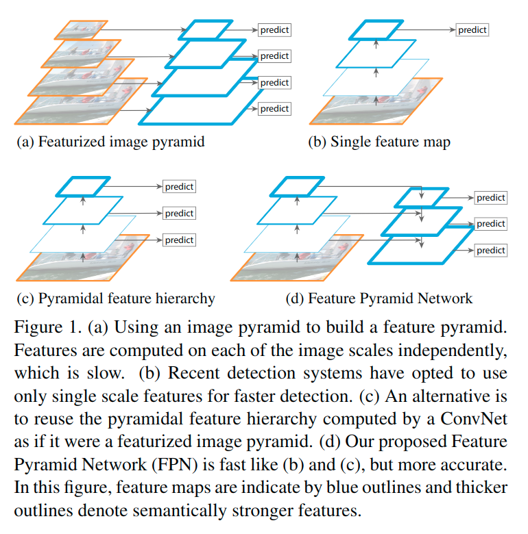
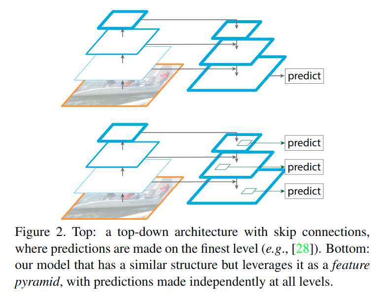
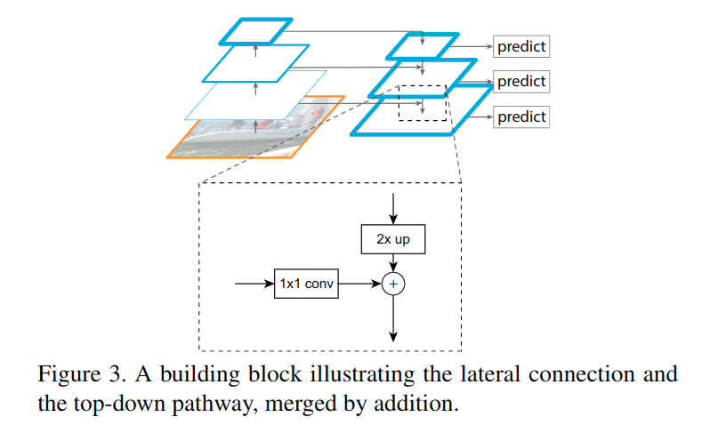
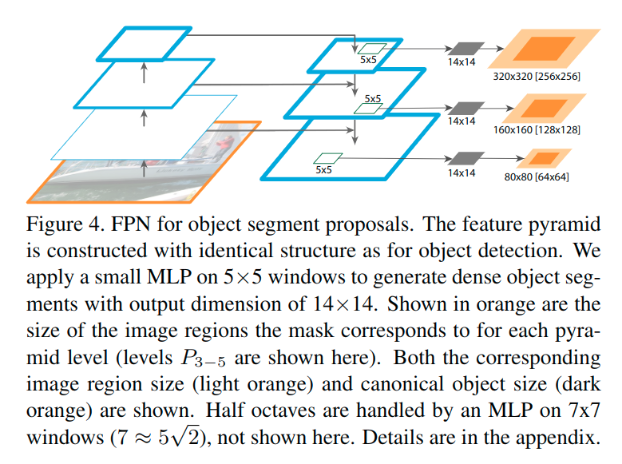
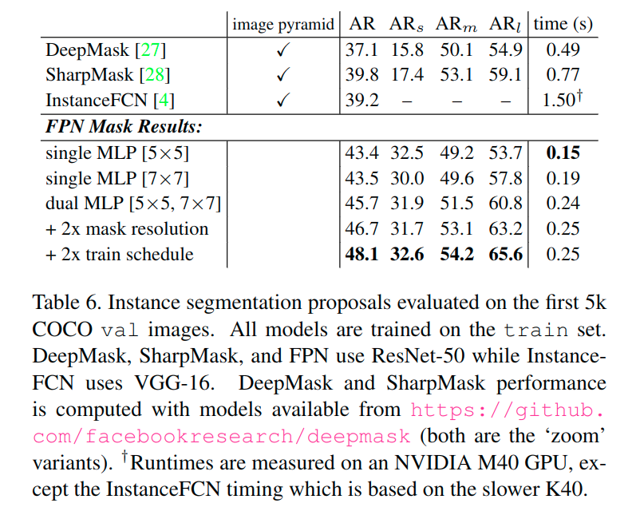
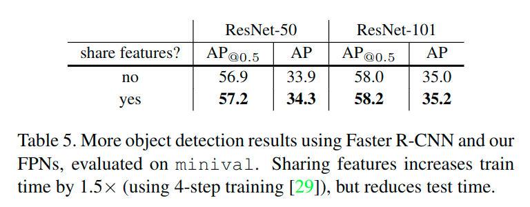

# FPN(2016)

> 论文: https://arxiv.org/abs/1612.03144
>
> 论文翻译: http://noahsnail.com/2018/03/20/2018-03-20-Feature%20Pyramid%20Networks%20for%20Object%20Detection%E8%AE%BA%E6%96%87%E7%BF%BB%E8%AF%91%E2%80%94%E2%80%94%E4%B8%AD%E8%8B%B1%E6%96%87%E5%AF%B9%E7%85%A7/

## 面对的问题

识别不同尺度的目标是计算机视觉中的一个基本挑战。目前主要有以下的一些方法.



> （a）使用图像金字塔构建特征金字塔. 每个图像尺度上的特征都是独立计算的, 速度很慢.
>
> (b)最近的检测系统选择只使用单一尺度特征进行更快的检测.
>
> (c)另一种方法是重用ConvNet计算的金字塔特征层次结构, 就好像它是一个特征化的图像金字塔.
>
> (d)我们提出的特征金字塔网络(FPN)与(b)和(c)类似, 但更准确.
>
> 在该图中, 特征映射用蓝色轮廓表示, 较粗的轮廓表示语义上较强的特征.

### 特征化*图像金字塔*

建立在图像金字塔之上的特征金字塔(我们简称为特征化图像金字塔)构成了标准解决方案的基础[1](图1(a)).

#### 优势

这些金字塔是尺度不变的, 因为目标的尺度变化是通过在金字塔中移动它的层级来抵消的. 直观地说, 该属性使模型能够通过在位置和金字塔等级上扫描模型来检测大范围尺度内的目标.

在ImageNet[33]和COCO[21]检测挑战中, 最近的所有排名靠前的输入都使用了针对**特征化图像金字塔**的**多尺度测试**.

对**图像金字塔的每个层次进行特征化**的主要优势在于它产生了多尺度的特征表示, 其中所有层次上在语义上都很强, 包括高分辨率层.

#### 局限

尽管如此, 特征化图像金字塔的每个层次都具有明显的局限性.

推断时间显著增加(例如, 四倍[11]), 使得这种方法在实际应用中不切实际. 此外, 在图像金字塔上端对端地训练深度网络在内存方面是不可行的, 所以如果被采用, 图像金字塔仅在测试时被使用[15, 11, 16, 35], 这造成了训练/测试时推断的不一致性.

出于这些原因, Fast和Faster R-CNN[11, 29]选择在默认设置下不使用特征化图像金字塔.

但是, 图像金字塔并不是计算多尺度特征表示的唯一方法.

### 单一尺度特征

深层ConvNet逐层计算特征层级, 而对于下采样层, **特征层级具有内在的多尺度金字塔形状**.

这种网内特征层级产生不同空间分辨率的特征映射, 但**引入了由不同深度引起的较大的语义差异**. 高分辨率映射**具有损害其目标识别表示能力的低级特征**.

### 金字塔特征层次结构

单次检测器(SSD)[22]是首先尝试使用ConvNet的金字塔特征层级中的一个, 好像它是一个特征化的图像金字塔(图1(c)).

理想情况下, SSD风格的金字塔将**重用正向传递中从不同层中计算的多尺度特征映射**, 因此是零成本的. 但为了避免使用低级特征, SSD放弃重用已经计算好的图层, 而从网络中的最高层开始构建金字塔(例如, VGG网络的conv4_3[36]), 然后添加几个新层. 因此它**错过了重用特征层级的更高分辨率映射的机会**.

我们证明这些对于检测小目标很重要.

### 特征金字塔网络

本文的目标是自然地利用ConvNet特征层级的金字塔形状, 同时创建一个**在所有尺度上都具有强大语义的特征金字塔**.

为了实现这个目标, 我们依赖于一种结构, 它将低分辨率的强语义特征, 和高分辨率的弱语义特征通过自顶向下的路径和横向连接相结合(图1(d)). 其结果是一个特征金字塔, **在所有级别都具有丰富的语义, 并且可以从单个输入图像尺度上进行快速构建**.

换句话说, 我们展示了如何创建网络中的特征金字塔, 可以用来**代替特征化的图像金字塔**, 而不牺牲表示能力, 速度或内存.

最近的研究[28, 17, 8, 26]中流行采用自顶向下和跳跃连接的类似架构.



他们的目标是 **生成具有高分辨率的单个高级特征映射, 并在其上进行预测**(图2顶部).

相反, 我们的方法利用这个架构作为特征金字塔, 其中预测(例如目标检测)在每个级别上独立进行(图2底部).

我们的模型反映了一个特征化的图像金字塔, 这在这些研究中还没有探索过.

## 主要的贡献

> 文章主要以ResNets来进行分析.

### 特征金字塔网络(FPN)结构

我们的方法以任意大小的单尺度图像作为输入, 并以全卷积的方式输出多层适当大小的特征映射. 这个过程独立于主卷积体系结构.



> 显示了建造我们的自顶向下特征映射的构建块.
>
> * 使用较粗糙分辨率的特征映射, 我们将空间分辨率上采样为2倍(为了简单起见, 使用最近邻上采样).
> * 然后通过按元素相加, 将上采样映射与相应的自下而上映射(其经过1×1卷积层来减少通道维度)合并.
> * 迭代这个过程, 直到生成最佳分辨率映射.
>
> 为了开始迭代, 我们只需在$C_5$上添加一个1×1卷积层来生成最粗糙分辨率映射.
>
> 最后, 我们**在每个<u>合并的映射</u>上添加一个3×3卷积来生成最终的特征映射**, 这是为了减少上采样的*混叠效应*.
>
> 这个最终的特征映射集称为$\lbrace P_2 , P_3 , P_4 , P_5 \rbrace$, 对应于$\lbrace C_2, C_3, C_4, C_5 \rbrace$, 分别具有相同的空间大小.

观察上图, 可以看出来FPN分为两条路径, 一条由下而上, 一条由上而下, 并且有横向连接. 这里分开介绍.

#### 由下而上

**自下向上的路径是主ConvNet的前馈计算**, 其计算由尺度步长为2的多尺度特征映射组成的特征层级. 通常有许多层产生相同大小的输出映射, 并且我们认为这些层位于相同的网络阶段.

对于我们的特征金字塔, 我们为每个阶段定义一个金字塔层. 我们**选择每个阶段的最后一层的输出作为我们的特征映射参考集**, 我们将丰富它来创建我们的金字塔. 这种选择是自然的, 因为每个阶段的最深层应具有最强大的特征. 具体而言, 对于ResNets[16], 我们使用**每个阶段的最后一个残差块输出的特征激活**. 对于conv2, conv3, conv4和conv5输出, 我们将这些最后残差块的输出表示为$\lbrace C_2, C_3, C_4, C_5 \rbrace$, 并注意相对于输入图像它们的步长为{4, 8, 16, 32}个像素.

#### 由上而下

**自顶向下的路径**通过上采样*空间上更粗糙但在语义上更强的来自较高金字塔等级的特征映射*来**幻化更高分辨率的特征**. 这些特征随后通过来自自下而上路径上的特征经由**横向连接进行增强**. 每个**横向连接合并来自自下而上路径和自顶向下路径的具有相同空间大小的特征映射**.

自下而上的特征映射具有较低级别的语义, 但其激活可以**更精确地定位**, 因为它被下采样的次数更少.

我们不会将庞大内存占用的conv1纳入金字塔.

> https://vision.cornell.edu/se3/wp-content/uploads/2017/07/fpn-poster.pdf
>
> **为什么FPN能够很好的处理小目标**
>
> - FPN可以利用经过top-down模型后的那些上下文信息(高层语义信息)
> - 对于小目标而言, FPN增加了特征映射的分辨率(即在更大的feature map上面进行操作, 这样可以获得更多关于小目标的有用信息)

#### 线性输出

由于金字塔的所有层都像传统的特征图像金字塔一样使用共享分类器/回归器, 因此我们在所有特征映射中固定特征维度(通道数记为d).

我们在本文中设置d=256, 因此所有额外的卷积层都有256个通道的输出.

在这些**额外的层中没有非线性**, 我们在实验中发现这些影响很小.

### 部分代码


> https://blog.csdn.net/WZZ18191171661/article/details/79494534

可以看出来, 这里主要是对多个特征图进行提取, 进行上采样和1x1卷积(调整维度), 相加, 进行获得新的特征图, 有着更强语义的特征.  图上没有画出来的是还有一个3x3的卷积施加在P2~P4上, P5上有一个2x2的最大池化方式的下采样.

> https://github.com/yangxue0827/FPN_Tensorflow/blob/master/libs/rpn/build_rpn.py
>
> 这里是一个tensorflow的fpn实现, 可以看这里针对ResNet的实现.
>
> ```python
> def get_feature_maps(self):
>     with tf.variable_scope('get_feature_maps'):
>         if self.net_name == 'resnet_v1_50':
>             feature_maps_dict = {
>                 'C2': self.share_net[
>                     'resnet_v1_50/block1/unit_2/bottleneck_v1'],  # [56, 56]
>                 'C3': self.share_net[
>                     'resnet_v1_50/block2/unit_3/bottleneck_v1'],  # [28, 28]
>                 'C4': self.share_net[
>                     'resnet_v1_50/block3/unit_5/bottleneck_v1'],  # [14, 14]
>                 'C5': self.share_net['resnet_v1_50/block4']  # [7, 7]
>             }
>         elif self.net_name == 'resnet_v1_101':
>             feature_maps_dict = {
>                 'C2': self.share_net[
>                     'resnet_v1_101/block1/unit_2/bottleneck_v1'],  # [56, 56]
>                 'C3': self.share_net[
>                     'resnet_v1_101/block2/unit_3/bottleneck_v1'],  # [28, 28]
>                 'C4': self.share_net[
>                     'resnet_v1_101/block3/unit_22/bottleneck_v1'],  # [14, 14]
>                 'C5': self.share_net['resnet_v1_101/block4']  # [7, 7]
>             }
>         else:
>             raise Exception('get no feature maps')
>
>         return feature_maps_dict
>
>
> def build_feature_pyramid(self):
>     feature_pyramid = {}
>
>     with tf.variable_scope('build_feature_pyramid'):
>         with slim.arg_scope([slim.conv2d],
>                             weights_regularizer=slim.l2_regularizer(
>                                 self.rpn_weight_decay)):
>             feature_pyramid['P5'] = slim.conv2d(
>                 self.feature_maps_dict['C5'], num_outputs=256,
>                 kernel_size=[1, 1], stride=1,
>                 scope='build_P5')
>             # 这里C5已经被处理了, 后面只需要执行三轮 upsample, 1x1, +, 并针对每个特征输出层
>             # 进行一个3x3的卷积就可以, 这里得到了P5, P5需要的事2x2的最大池化, 下采样为P6
>
>             feature_pyramid['P6'] = slim.max_pool2d(
>                 feature_pyramid['P5'], kernel_size=[2, 2], stride=2,
>                 scope='build_P6')
>
>             # P6 is down sample of P5
>
>             # 4,3,2
>             for layer in range(4, 1, -1):
>                 p, c = feature_pyramid['P' + str(layer + 1)], \
>                        self.feature_maps_dict['C' + str(layer)]
>
>                 up_sample_shape = tf.shape(c)
>                 up_sample = tf.image.resize_nearest_neighbor(
>                     p, [up_sample_shape[1], up_sample_shape[2]],
>                     name='build_P%d/up_sample_nearest_neighbor' % layer)
>
>                 c = slim.conv2d(
>                     c, num_outputs=256, kernel_size=[1, 1], stride=1,
>                     scope='build_P%d/reduce_dimension' % layer)
>                 p = up_sample + c
>                 p = slim.conv2d(
>                     p, 256, kernel_size=[3, 3], stride=1, padding='SAME',
>                     scope='build_P%d/avoid_aliasing' % layer)
>
>                 feature_pyramid['P' + str(layer)] = p
>
>     return feature_pyramid
> 	# 这里包含P2~P6
> ```

## 实际应用

### RPN的特征金字塔网络

通过用FPN替换单尺度特征映射来适应RPN.

在特征金字塔的每个层级上附加一个相同设计的头部(3x3 conv和两个1x1兄弟convs). 由于头部在所有金字塔等级上的所有位置密集滑动, 所以**不需要在特定层级上具有多尺度锚点**. 我们**为每个层级分配单尺度的锚点**.

> 在形式上, 我们定义锚点$\lbrace P_2, P_3, P_4, P_5, P_6 \rbrace$分别具有$\lbrace 32^2 , 64^2 , 128^2 , 256^2 , 512^2 \rbrace$个像素的面积. 正如在[29]中, 我们在每个层级上也使用了多个长宽比$\lbrace 1:2, 1:1, 2:1 \rbrace$的锚点. 所以在金字塔上总共有十五个锚点.

如[29], 我们**根据锚点和实际边界框的交并比(IoU)比例将训练标签分配给锚点**.

形式上, 如果一个锚点**对于一个给定的实际边界框具有最高的IoU或者与任何一个实际边界框的IoU超过0.7, 则给其分配一个正标签**, 如果其**与所有实际边界框的IoU都低于0.3, 则为其分配一个负标签**.

> 请注意, 实际边界框的尺度并未明确用于将它们分配到金字塔的层级；相反, **实际边界框与已经分配给金字塔等级的锚点相关联**. 因此, 除了[29]中的内容外, 我们不引入额外的规则.

我们注意到头部的参数在所有特征金字塔层级上共享；我们也评估了替代方案, 没有共享参数并且观察到相似的准确性. 共享参数的良好性能表明我们的金字塔的所有层级共享相似的语义级别. 这个优点类似于使用特征图像金字塔的优点, 其中可以将常见头部分类器应用于在任何图像尺度下计算的特征.

### Fast R-CNN的特征金字塔网络

Fast R-CNN[11]是一个基于区域的目标检测器, 利用感兴趣区域(RoI)池化来提取特征. Fast R-CNN通常在单尺度特征映射上执行. 要将其与我们的FPN一起使用, 我们需要为金字塔等级分配不同尺度的RoI.

将特征金字塔看作是从图像金字塔生成的.

因此, 当它们在图像金字塔上运行时, 可以适应基于区域的检测器的分配策略[15, 11]. 在形式上, 我们通过以下公式将宽度为w和高度为h(在网络上的输入图像上)的RoI分配到特征金字塔的级别$P_k$上(**判断ROI该用哪个层的输出**)：


> 这里224是规范的ImageNet预训练大小, 而$k_0$是大小为$w \times h=224^2$的RoI应该映射到的目标级别. 类似于基于ResNet的Faster R-CNN系统[16]使用$C_4$作为单尺度特征映射, 我们将$k_0$设置为4. 直觉上, 方程(1)意味着如果RoI的尺寸变小了(比如224的1/2), 它应该被映射到一个更精细的分辨率级别(比如k=3).

使用图像特征金字塔, **不同尺度的ROI, 使用不同特征层作为ROI pooling层的输入**, 大尺度ROI就用后面一些的金字塔层, 比如P4；小尺度ROI就用前面一点的特征层, 比如P3.

我们**在所有级别的所有RoI中附加预测器头部**(在Fast R-CNN中, *预测器头部是特定类别的分类器和边界框回归器*). 预测器头部都共享参数, 不管他们在什么层级.

> 在[16]中, ResNet的conv5层(9层深的子网络)被用作conv4特征之上的头部, 但我们的方法已经利用了conv5来构建特征金字塔. 因此, 与[16]不同, 我们只**是采用RoI池化提取7×7特征, 并在最终的分类层和边界框回归层之前附加两个隐藏单元为1024维的全连接(fc)层(每层后都接ReLU层)**.
>
> 这些层是随机初始化的, 因为ResNets中没有预先训练好的fc层. 请注意, 与标准的conv5头部相比, 我们的2-fc MLP头部更轻更快.

### 利用FPN构建Faster R-CNN检测器

1. 首先, 选择一张需要处理的图片, 然后对该图片进行预处理操作；
2. 然后, 将处理过的图片送入预训练的特征网络中(如ResNet等), 即构建所谓的bottom-up网络；
3. 接着, 如下图所示, 构建对应的top-down网络(即对层4进行上采样操作, 先用1x1的卷积对层2进行降维处理, 然后将两者相加(对应元素相加), 最后进行3x3的卷积操作；
4. 接着, 在图中的4、5、6层上面分别进行RPN操作, 即一个3x3的卷积后面分两路, 分别连接一个1x1的卷积用来进行分类和回归操作；
5. 接着, 将上一步获得的候选ROI分别输入到4、5、6层上面分别进行ROI Pool操作(固定为7x7的特征)；
6. 最后, 在上一步的基础上面连接两个1024层的全连接网络层, 然后分两个支路, 连接对应的分类层和回归层；

> 原文：https://blog.csdn.net/WZZ18191171661/article/details/79494534


### 分割提议

由于FPN是一个通用金字塔表示, 可用于除目标检测之外的其他应用, 可以利用到很多利用深度学习网络的方法中去, 包括目标检测、实例分割等.



如下表所示, 使用了FPN的DeepMask方法可以不仅可以获得性能的提升, 同时可以获得速度的提升.

不同的目标在不同的层上面生成对应的Mask.



## 目标检测

### 消融实验


> (d) 显示了没有自上而下路径的特征金字塔的结果
>
> (e) 显示了没有1×1横向连接的自顶向下特征金字塔的消融结果
>
> (f) 将头部附加到$P_2$的最高分辨率的强语义特征映射上(即我们金字塔中的最好层级), 而不采用金字塔表示. 与单尺度基线类似, 我们将所有锚点分配给$P_2$特征映射

- 单个更高级别的特征映射是不够的, 因为存在在较粗分辨率和较强语义之间的权衡
- 我们的金字塔表示大大提高了RPN对目标尺度变化的鲁棒性
- 更精确的特征位置可以通过横向连接直接从自下而上映射的更精细层级传递到自上而下的映射
- RPN是一个具有固定窗口大小的滑动窗口检测器, 因此在金字塔层级上扫描可以增加其对尺度变化的鲁棒性
- 大量的锚点本身并不足以提高准确率

### 使用Fast/Faster R-CNN的目标检测


> (a): 作为基于ResNet的Fast R-CNN基线, 遵循[16], 我们采用输出尺寸为14×14的RoI池化, 并将所有conv5层作为头部的隐藏层
>
> (b): 利用MLP头部的基线, 其具有2个隐藏的fc层, 类似于我们的架构中的头部. 表明2-fc头部没有给我们带来任何超过表2(a)中基线的正交优势
>
> (f): 我们在$P_2$的单个最好的尺度特征映射上采用了Fast R-CNN.

* 对于基于区域的目标检测器, 我们的特征金字塔优于单尺度特征
* 去除自上而下的连接或去除横向连接会导致较差的结果, 类似于我们在上面的RPN小节中观察到的结果


> (a)显示了我们再现[16]中描述的Faster R-CNN系统的基线.

我们发现以下实现有助于缩小差距：

1. 我们使用800像素的图像尺度, 而不是[11, 16]中的600像素
    1. 与[11, 16]中的64个ROI相比, 我们训练时每张图像有512个ROIs, 可以加速收敛
2. 我们使用5个尺度的锚点, 而不是[16]中的4个(添加32x32)
3. 在测试时, 我们每张图像使用1000个提议, 而不是[16]中的300个.

因此, 与表3中的He等人的ResNet-50 Faster R-CNN基线相比, 我们的方法将AP提高了7.6点个并且将AP@0.5提高了9.6个点.

> **共享特征**
>
> 在上面, 为了简单起见, 我们不共享RPN和Fast R-CNN之间的特征. 在表5中, 我们按照[29]中描述的4步训练评估了共享特征. 与[29]类似, 我们发现共享特征提高了一点准确率. 特征共享也缩短了测试时间.
>
> 

### 与COCO竞赛获胜者的比较


> 将我们方法的单模型结果与COCO竞赛获胜者的结果进行了比较, 其中包括2016年冠军G-RMI和2015年冠军Faster R-CNN+++.
>
> 没有添加额外的东西, 我们的单模型提交就已经超越了这些强大的, 经过严格设计的竞争对手. 在`test-dev`数据集中, 我们的方法在现有最佳结果上增加了0.5个点的AP(36.2 vs.35.7)和3.4个点的AP@0.5(59.1 vs. 55.7).
>
> 值得注意的是, 我们的方法不依赖图像金字塔, 只使用单个输入图像尺度, 但在小型目标上仍然具有出色的AP. 这只能通过使用前面方法的高分辨率图像输入来实现.
>
> 此外, 我们的方法没有利用许多流行的改进, 如迭代回归[9], 难例挖掘[35], 上下文建模[16], 更强大的数据增强[22]等. 这些改进与FPN互补, 应该会进一步提高准确度.

## 相关的工作

### 手工设计特征和早期神经网络

SIFT特征[25]最初是从尺度空间极值中提取的, 用于特征点匹配. HOG特征[5], 以及后来的SIFT特征, 都是在整个图像金字塔上密集计算的.

这些HOG和SIFT金字塔已在许多工作中得到了应用, 用于图像分类, 目标检测, 人体姿势估计等. 这对快速计算特征化图像金字塔也很有意义.

Dollar等人[6]通过先计算一个稀疏采样(尺度)金字塔, 然后插入缺失的层级, 从而演示了快速金字塔计算.

在HOG和SIFT之前, 使用ConvNet[38, 32]的早期人脸检测工作计算了图像金字塔上的浅网络, 以检测跨尺度的人脸.

### Deep ConvNet目标检测器

随着现代深度卷积网络[19]的发展, 像OverFeat[34]和R-CNN[12]这样的目标检测器在精度上显示出了显著的提高.

- OverFeat采用了一种类似于早期神经网络人脸检测器的策略, 通过在图像金字塔上应用ConvNet作为滑动窗口检测器.
- R-CNN采用了基于区域提议的策略[37], 其中每个提议在用ConvNet进行分类之前都进行了尺度归一化. SPPnet[15]表明, 这种基于区域的检测器可以更有效地应用于在单个图像尺度上提取的特征映射.
- 最近更准确的检测方法, 如Fast R-CNN[11]和Faster R-CNN[29]提倡**使用从单一尺度计算出的特征**, 因为它提供了精确度和速度之间的良好折衷.

然而, 多尺度检测性能仍然更好, 特别是对于小型目标.

### 使用多层的方法

一些最近的方法通过使用ConvNet中的不同层来改进检测和分割.

- FCN[24]将多个尺度上的每个类别的部分分数相加以计算语义分割.
- Hypercolumns[13]使用类似的方法进行目标实例分割.
- 在计算预测之前, 其他几种方法(HyperNet[18], ParseNet[23]和ION[2])将多个层的特征连接起来, 这相当于累加转换后的特征.
- SSD[22]和MS-CNN[3]可预测特征层级中多个层的目标, 而不需要组合特征或分数.

最近有一些方法利用**横向/跳跃连接将跨分辨率和语义层次的低级特征映射关联起来**

* 用于分割的U-Net[31]和SharpMask[28]
* 用于人脸检测的Recombinator网络[17]
* 用于关键点估计的Stacked Hourglass网络[26]
* Ghiasi等人[8]为FCN提出拉普拉斯金字塔表示, 以逐步细化分割

尽管这些方法采用的是金字塔形状的架构, 但它们不同于特征化的图像金字塔[5, 7, 34], 其中所有层次上的预测都是独立进行的, 参见图2.

事实上, 对于图2(顶部)中的金字塔结构, 图像金字塔仍然需要跨多个尺度上识别目标[28].

## 参考资料

https://vision.cornell.edu/se3/wp-content/uploads/2017/07/fpn-poster.pdf

https://blog.csdn.net/WZZ18191171661/article/details/79494534
