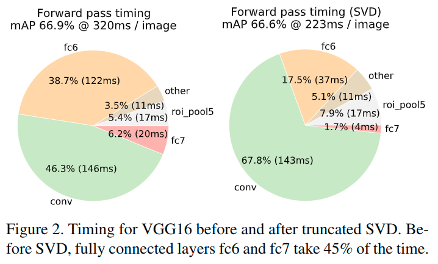

# Fast R-CNN(2015)

> 论文链接: https://arxiv.org/pdf/1504.08083
>
> 论文翻译: https://alvinzhu.xyz/2017/10/10/fast-r-cnn/
>
> (文中大多数图片来自这里)

## RCNN&SPP-Net缺点

基于区域的卷积网络方法（RCNN）通过使用深度卷积网络来分类目标候选框，获得了很高的目标检测精度。然而，R-CNN具有显着的缺点：

1. **训练过程是多级流水线。**R-CNN首先使用目标候选框对卷积神经网络使用log损失进行微调。然后，它将卷积神经网络得到的特征送入SVM。 这些SVM作为目标检测器，替代通过微调学习的softmax分类器。 在第三个训练阶段，学习检测框回归。
2. **训练在时间和空间上是的开销很大。**对于SVM和检测框回归训练，从每个图像中的每个目标候选框提取特征，并写入磁盘。对于非常深的网络，如VGG16，这个过程在单个GPU上需要2.5天（VOC07 trainval上的5k个图像）。这些特征需要数百GB的存储空间。
3. **目标检测速度很慢。**在测试时，从每个测试图像中的每个目标候选框提取特征。用VGG16网络检测目标每个图像需要47秒（在GPU上）。

R-CNN很慢**是因为它为每个目标候选框进行卷积神经网络正向传递，而不共享计算**。

SPPnet[5](https://alvinzhu.xyz/2017/10/10/fast-r-cnn/#fn:11)通过共享计算加速R-CNN。SPPnet[5](https://alvinzhu.xyz/2017/10/10/fast-r-cnn/#fn:11)计算整个输入图像的卷积特征图，然后使用从共享特征图提取的特征向量来对每个候选框进行分类。通过最大池化将候选框内的特征图转化为固定大小的输出（例如，6X6）来提取针对候选框的特征。多个输出被池化，然后连接成空间金字塔池[7](https://alvinzhu.xyz/2017/10/10/fast-r-cnn/#fn:15)。

SPPnet在测试时将R-CNN加速10到100倍。由于更快的候选框特征提取训练时间也减少3倍。

SPP网络也有显著的缺点。

* 像R-CNN一样，训练过程是一个**多级流水线**，涉及提取特征，使用log损失对网络进行微调，训练SVM分类器，最后拟合检测框回归。特征也写入磁盘。

* 但与R-CNN不同，在[5](https://alvinzhu.xyz/2017/10/10/fast-r-cnn/#fn:11)中提出的**微调算法不能更新在空间金字塔池之前的卷积层**。不出所料，这种限制（固定的卷积层）限制了深层网络的精度。

## 怎么做到的"Fast"

### 优点(准/单/快/轻)

我们提出一种新的训练算法，修正R-CNN和SPPnet的缺点，同时提高其速度和准确性。因为它能比较快地进行训练和测试，我们称之为Fast R-CNN。Fast RCNN方法有以下几个优点：

1. 比R-CNN和SPPnet具有更高的目标检测精度（mAP）。

    > 实验结果可知

2. 训练是使**用多任务损失的单阶段训练**。

    > 合并了流程, 减少了多余的操作
    >
    > 改进了RCNN的缺点1/2/3
    >
    > 因为Fast R-CNN将分类误差和定位误差合并在一起训练，定位误差采用smooth L1 而不是R-CNN中的L2。这里说点题外话，就是R-CNN训练是多管道的，除了对CNN模型预训练，R-CNN还先对CNN模型funetuning，使用的是softmax分类器，但是最后却又训练SVM分类器（原因可以见原论文），直觉上感觉有点多此一举，所以现在Fast R-CNN直接采用softmax分类器了。(https://cloud.tencent.com/developer/article/1080385)

3. 训练可以更新所有网络层参数。

    > 这里是对于上述SPP-Net缺点2的改进?

4. 不需要磁盘空间缓存特征。

    > 改进了RCNN的缺点2

5. 使用截断的SVD来**进行更快的检测**(这属于论文中提到的一个小技巧, 并没有放在更为概括性的优点总结中, 我放在这里, 当个总结)

    > 对于整体图像分类，与卷积层相比，计算全连接层花费的时间较小。
    >
    > 而对于检测，要处理的RoI的数量很大，并且接近一半的正向传递时间用于计算全连接层（参见下图）。
    >
    > 大的全连接层容易通过用截短的SVD压缩来加速。
    >
    > 
    >
    > > 图2示出了如何使用来自VGG16的fc6层中的25088×4096矩阵的顶部1024个奇异值和来自fc7层的4096×4096矩阵的顶部256个奇异值减少运行时间，而在mAP中几乎没有损失。
    > >
    > > 如果在压缩之后再次微调，则可以在mAP中具有更小的下降的情况下进一步加速。
    >
    > 在这种技术中，层的u×v权重矩阵W通过SVD被近似分解为：$W≈UΣ_tV^T$
    >
    > 在这种分解中，U是一个u×t的矩阵，包括W的前t个左奇异向量，$Σt$是t×t对角矩阵，其包含W的前t个奇异值，并且V是v×t矩阵，包括W的前t个右奇异向量。
    >
    > 截断SVD将参数计数从uv减少到t(u+v)个，如果t远小于min(u,v)，则SVD可能是重要的。 
    >
    > 为了压缩网络，**对应于W的单个全连接层由两个全连接层替代**，在它们之间没有非线性。
    >
    > 这些层中的第一层使用权重矩阵$Σ_tV^T$（没有偏置），并且第二层使用U（其中原始偏置与W相关联）。
    >
    > > 这里是怎样的连接方式?
    >
    > 当RoI的数量大时，这种简单的压缩方法给出良好的加速。

### 架构(分类/回归)

Fast R-CNN架构。输入图像和多个感兴趣区域（RoI）被输入到完全卷积网络中。网络首先使用几个卷积层（conv）和最大池化层来处理整个图像，以产生卷积特征图, 每个RoI汇集到一个固定大小的特征映射中(RoI池化层从特征图中提取固定长度的特征向量)，然后通过完全连接的层（FC）映射到特征向量, 其最终分支成两个同级输出层。

> Fast R-CNN的分类与回归预测. 来源：https://tryolabs.com/blog/

一个输出K个类别加上1个背景类别的**Softmax概率估计**，另一个为K个类别的**每一个类别输出四个实数值**。每组4个值表示K个类别的一个类别的检测框位置的修正。

### 细节(RoI映射/池化)

> RoI pooling原理图，特征图大小为8x8，候选区域为5x7，输出2x2. 来源：https://blog.deepsense.ai/region-of-interest-pooling-explained/

RoI被映射到特征图中, **这个类似于SPP-Net的处理**, 但是**RoI pooling layer实现了怎样的操作**? 

* RoI池化的理解: 鉴于是受到SPP-Net的启发, 这里有可能是类似于SPP-Net的SPP架构的一个东西, 参考论文中介绍RoI池化层的部分, 可以理解这里使用的池化层, 就是1-level的一个SPP(也就是只有一种池化操作).

* RoI的数据格式: 每个RoI由指定其左上角(r,c)及其高度和宽度(h,w)的四元组(r,c,h,w)定义.

* RoI的池化流程: RoI池化通过将大小为hxw的RoI窗口分割成HxW个bins(也就是HxW个网格), 对每个网格进行**最大池化**, 最终得到的是HxW个池化输出. 这个输出是固定的, 和SPP中的流程是一致的.

    > 这个过程是可导的（见RoI pooling层的[Caffe官方实现](https://github.com/rbgirshick/caffe-fast-rcnn/blob/bcd9b4eadc7d8fbc433aeefd564e82ec63aaf69c/src/caffe/layers/roi_pooling_layer.cpp)，RoI pooling层在大部分深度学习框架中是没有官方实现的，需要自己扩展，Tensorflow上的开源实现可以参考[deepsense-ai/roi-pooling](https://github.com/deepsense-ai/roi-pooling)，但是在TensorFlow中可以基于一种crop+resize+pooling的方式，可以看一下[Luminoth上的实现](https://github.com/tryolabs/luminoth/blob/master/luminoth/models/fasterrcnn/roi_pool.py)）

* RoI池化的作用: **RoI池化层使用最大池化将任何有效的RoI内的特征转换成具有H×W（例如，7×7）的固定空间范围的小特征图**，其中H和W是层的超参数，独立于任何特定的RoI。

* RoI池化的对象: 各个RoI在特征图上的投影. 

    > 这里理解了RoI的池化的操作后, 可以回想SPP-Net, 其中提到为了避免对各个区域提案来分别进行卷积而导致大量的冗余运算, 要整图片一次运算完后, 在对特征图进行各个提案区域的提取处理.
    >
    > > 对每个候选窗口，我们使用一个4级空间金字塔（1×1, 2×2, 3×3, 6×6, 总共50块）。每个窗口将产生一个12800（256×50）维的表示。
    >
    > 这里如何确认区域提案对应的特征图区域呢? 使用如下公式:
    >
    > - 左上边界: $x' = \lfloor x/S \rfloor + 1$
    > - 右下边界: $x' = \lceil x/S \rceil - 1$
    >
    > 因此，以$(x_0, y_0)$为中心的响应，其在图像域中的有效感受野以$(x, y)=(Sx_0, Sy_0)$为中心，其中$S$是所有之前操作的步长的乘积。

* RoI池化的后续: 这里可以算出对应的特征图区域分别使用RoI池化, 获得匹配全连接网络的输入要求的数据大小. 经过两层全连接, 得到最终的RoI特征向量. 再分别进行分类和框回归的处理.

* RoI池化的反向传播: 见后"微调-3"

## 究竟有多好

> 三个主要结果支持该论文的贡献：
>
> 1. VOC07，2010和2012的**最高的mAP**。
> 2. 相比R-CNN，SPPnet，**更快速训练和测试**。
> 3. 在VGG16中**微调卷积层**改善了mAP。

### VOC07，2010和2012的最高的mAP

#### 实验配置

我们的实验使用了三个经过预训练的ImageNet网络模型. 

* 第一个是来自R-CNN[3](https://alvinzhu.xyz/2017/10/10/fast-r-cnn/#fn:9)的CaffeNet（实质上是AlexNet）。我们将这个CaffeNet称为模型**S**，即小模型。
* 第二网络是来自[14](https://alvinzhu.xyz/2017/10/10/fast-r-cnn/#fn:3)的VGG_CNN_M_1024，其具有与**S**相同的深度，但是更宽。我们把这个网络模型称为**M**，即中等模型。
* 最后一个网络是来自[15](https://alvinzhu.xyz/2017/10/10/fast-r-cnn/#fn:20)的非常深的VGG16模型。由于这个模型是最大的，我们称之为**L**。

所有实验都使用单尺度训练和测试（s=600，详见[尺度不变性：暴力或精细？](https://alvinzhu.xyz/2017/10/10/fast-r-cnn/#%E5%B0%BA%E5%BA%A6%E4%B8%8D%E5%8F%98%E6%80%A7%EF%BC%9A%E6%9A%B4%E5%8A%9B%E6%88%96%E7%B2%BE%E7%BB%86%EF%BC%9F)）。

#### VOC 2010和2012数据集结果

> VOC 2010测试检测平均精度（％）。 
>
> BabyLearning使用基于Network in network的网络。所有其他方法使用VGG16。
>
> 训练集：
>
> * 12：VOC12 trainval
> * Prop.：专有数据集
> * 12+seg：12具有分割注释
> * 07++12：VOC07 trainval，VOC07测试和VOC12 trainval的联合。

在VOC10上，SegDeepM [6](https://alvinzhu.xyz/2017/10/10/fast-r-cnn/#fn:25)获得了比Fast R-CNN更高的mAP（67.2％对比66.1％）。

SegDeepM使用12+seg训练，它被设计为通过使用马尔可夫随机场推理R-CNN检测和来自$O_2P$[17](https://alvinzhu.xyz/2017/10/10/fast-r-cnn/#fn:1)的**语义分割方法的分割来提高R-CNN精度**。

Fast R-CNN可以替换SegDeepM中使用的R-CNN，这可以导致更好的结果。

当使用07++12训练集时，Fast R-CNN的mAP增加到68.8％，超过SegDeepM。

> VOC 2012测试检测平均精度（％）。 
>
> BabyLearning和NUS_NIN_c2000使用基于NiN的网络。所有其他方法使用VGG16。
>
> 训练设置：见上表. 其中Unk.表示未知。

Fast R-CNN在VOC12上获得最高结果，mAP为65.7％（加上额外数据为68.4％）。它也比其他方法快两个数量级，这些方法都基于比较“慢”的R-CNN网络。

#### VOC 2007数据集上的结果

在VOC07数据集上，我们比较Fast R-CNN与R-CNN和SPPnet的mAP。所有方法从相同的预训练VGG16网络开始，并使用边界框回归。 

VGG16 SPPnet结果由[5](https://alvinzhu.xyz/2017/10/10/fast-r-cnn/#fn:11)的作者提供。SPPnet在训练和测试期间使用五个尺度。Fast R-CNN对SPPnet的改进说明，即使Fast R-CNN使用单个尺度训练和测试，卷积层微调仍然可以在mAP中提供大的改进（从63.1％到66.9％）。R-CNN的mAP为66.0％。 

作为次要点，SPPnet在PASCAL中没有使用被标记为“困难”的样本进行训练。除去这些样本，Fast R-CNN 的mAP为68.1％。所有其他实验都使用了被标记为“困难”的样本。

### 更快速训练和测试

> 比较了Fast RCNN，R-CNN和SPPnet之间的训练时间（小时），测试速率（每秒图像数）和VOC07上的mAP。
>
> Fast R-CNN使用单尺度模式。SPPnet使用[5](https://alvinzhu.xyz/2017/10/10/fast-r-cnn/#fn:11)中指定的五个尺度，由[5](https://alvinzhu.xyz/2017/10/10/fast-r-cnn/#fn:11)的作者提供在Nvidia K40 GPU上的测量时间。
>
> 注意计算方式: 如Fast RCNN(S) 的训练提速倍率: 22/1.2

快速的训练和测试是我们的第二个主要成果。

* 对于VGG16，没有截断SVD的Fast R-CNN处理图像比R-CNN快146倍，有截断SVD的R-CNN快213倍。训练时间减少9倍，从84小时减少到9.5小时。与SPPnet相比，没有截断SVD的Fast RCNN训练VGG16网络比SPPnet快2.7倍（9.5小时对25.5小时），测试时间快7倍，有截断SVD的Fast RCNN比的SPPnet快10倍。 

    > 注意, 这里的SVD截断只在测试阶段使用, 训练的时候仍然是正常的.

* 截断的SVD可以将检测时间减少30％以上，同时在mAP中只有很小（0.3个百分点）的下降，并且无需在模型压缩后执行额外的微调。如果在压缩之后再次微调，则可以在mAP中具有更小的下降的情况下进一步加速。

* Fast R-CNN还不需要数百GB的磁盘存储，因为它**不缓存特征**。

    > 不缓存特征的主要原因是因为数据量减少了.
    >
    > 个人理解是因为原本的图片输入都要进行调整, 会导致很多的放缩的出现, 有很多被扩充进来的像素数据, 这会无形中增加数据量. 而且对于所有RoI的放缩都要进行卷积, 这更增加了数据量. 
    >
    > 这样看来, 一次卷积是及其有利的.

### 在VGG16中微调卷积层改善了mAP

对于在SPPnet论文[5](https://alvinzhu.xyz/2017/10/10/fast-r-cnn/#fn:11)中考虑的不太深的网络，仅微调全连接层似乎足以获得良好的精度。

**我们假设这个结果不适用于非常深的网络。**

为了**验证微调卷积层对于VGG16的重要性**，我们使用Fast R-CNN微调，但**冻结十三个卷积层**，以便只有全连接层学习。这种消融**模拟单尺度SPPnet训练**，将mAP从66.9％降低到61.4％。

> 限制哪些层对VGG16进行微调产生的影响。微调≥fc6模拟单尺度SPPnet训练算法[5](https://alvinzhu.xyz/2017/10/10/fast-r-cnn/#fn:11)。 
>
> SPPnet L是使用五个尺度，以显著（7倍）的速度成本获得的结果。

这个实验验证了我们的假设：通过RoI池化层的训练(也就是对于前面的卷积层也要考虑训练)对于非常深的网络是重要的。

**这是否意味着所有卷积层应该微调？没有。**

在较小的网络（S和M）中，我们发现conv1（第一个卷积层）是通用的和任务独立的（一个众所周知的事实[1](https://alvinzhu.xyz/2017/10/10/fast-r-cnn/#fn:14)）。允许conv1学习或不学习，对mAP没有很有意义的影响。

对于VGG16，我们发现只需要更新conv3_1及以上（13个卷积层中的9个）的层。这种观察是实用的：

* 从conv2_1更新使训练变慢1.3倍（12.5小时对比9.5小时）, mAP仅为增加0.3个点（上表最后一列）。
* 从conv1_1更新GPU内存不够用。

所有Fast R-CNN在本文中结果都使用VGG16微调层conv3_1及以上的层，所有实验用模型S和M微调层conv2及以上的层。

## 如何训练与测试

### 训练细节

#### 从预训练网络初始化

我们实验了三个预训练的ImageNet[9](https://alvinzhu.xyz/2017/10/10/fast-r-cnn/#fn:4)网络, 见"实验配置"小节。当预训练网络初始化fast R-CNN网络时，其经历三个变换。

首先，最后的最大池化层由RoI池层代替，其将H和W设置为与网络的第一个全连接层兼容的配置（例如，对于VGG16，H=W=7）。

然后，网络的最后一个全连接层和Softmax（其被训练用于1000类ImageNet分类）被替换为前面描述的两个同级层（全连接层和K+1个类别的Softmax以及类别特定的检测框回归）。

最后，网络被修改为采用两个数据输入：图像的列表和这些图像中的RoI的列表。

#### 微调

用反向传播训练所有网络权重是Fast R-CNN的重要能力。首先，让我们阐明**为什么SPPnet无法更新低于空间金字塔池化层的权重**。

根本原因是当每个训练样本（即RoI）来自不同的图像时，通过SPP层的反向传播是非常低效的，这正是训练R-CNN和SPPnet网络的方法。低效的部分是因为每个RoI可能具有非常大的感受野，通常跨越整个输入图像。由于正向传播必须处理整个感受野，训练输入很大（通常是整个图像）。

我们提出了一种更有效的训练方法，利用训练期间的特征共享。在Fast RCNN网络训练中，随机梯度下降（SGD）的小批量**是被分层采样的**，首先采样N个图像，然后从每个图像采样R/N个 RoI。关键的是，来自同一图像的RoI在向前和向后传播中共享计算和内存。减小N，就减少了小批量的计算。

例如，当N=2和R=128时，得到的训练方案比从128幅不同的图采样一个RoI（即R-CNN和SPPnet的策略）快64倍。

这个策略的一个令人担心的问题是它可能导致训练收敛变慢，因为来自相同图像的RoI是相关的。这个问题似乎在实际情况下并不存在，当N=2和R=128时，我们使用比R-CNN更少的SGD迭代就获得了良好的结果。

除了分层采样，Fast R-CNN使用了一个精细的训练过程，**在微调阶段联合优化Softmax分类器和检测框回归**，而不是分别在三个独立的阶段训练softmax分类器，SVM和回归器。 

下面将详细描述该过程（损失，小批量采样策略，通过RoI池化层的反向传播和SGD超参数）。

1. 多任务损失 

    Fast R-CNN网络具有两个同级输出层。 第一个输出在K + 1个类别上的离散概率分布（每个RoI），$p =(p_0,…,p_K)$。 通常，通过全连接层的K + 1个输出上的Softmax来计算p。第二个输出层输出检测框回归偏移，$t^k = (t^k_x, t^k_y, t^k_w, t^k_h)$，对于由k索引的K个类别中的每一个。 我们使用[3](https://alvinzhu.xyz/2017/10/10/fast-r-cnn/#fn:9)中给出的t^k的参数化，其中t^k指定相对于候选框的尺度不变转换和对数空间高度/宽度移位。

    每个训练的RoI用类真值u和检测框回归目标真值v标记。我们对每个标记的RoI使用多任务损失L以联合训练分类和检测框回归：
    $$
    L(p, u, t^u, v) = L_{cls}(p, u) + \lambda \lbrack u \ge 1 \rbrack L_{loc}(t^u, v)
    $$
    其中$L_{cls}(p, u) = -\log p_u$，是类真值u的log损失。

    对于类真值u，第二个损失$L_{loc}$是定义在检测框回归目标真值元组$u, v = (v_x, v_y, v_w, v_h)$和预测元组$t^u = (t^u_x, t^u_y, t^u_w, t^u_h)$上的损失。 Iverson括号指示函数$\lbrack u \ge 1 \rbrack$当$u \ge 1$的时候为值1，否则为0。按照惯例，背景类标记为u = 0。对于背景RoI，没有检测框真值的概念，因此$L_{loc}$被忽略。对于检测框回归，我们使用损失
    $$
    L_{loc}(t^u, v) = \sum_{i \in \lbrace x, y, w, h \rbrace}smooth_{L_1}(t^u_i - v_i)
    $$
    其中
    $$
    smooth_{L_1}(x) = \left\{\begin{matrix} 0.5x^2 & if \vert x \vert \lt 1\\ \vert x \vert - 0.5 & otherwise \end{matrix}\right.
    $$
    是鲁棒的L_1损失，对于异常值比在R-CNN和SPPnet中使用的$L_2$损失更不敏感。当回归目标无界时，具有$L_2$损失的训练可能需要仔细调整学习速率，以防止爆炸梯度。公式(3)消除了这种灵敏度。

    公式中的超参数$\lambda$控制两个任务损失之间的平衡。我们将回归目标真值$v_i$归一化为具有零均值和单位方差。所有实验都使用$\lambda = 1$。

1. 小批量采样

    Fast R-CNN训练采用mini-batch sampling，每个mini-batch大小为128，从N=2个图片中(均匀地随机选择)构建，其中25%来自正样本（IoU>=0.5, 即u>=1）,75%从负样本中抽样得到（背景, 用u=0标记，IoU属于 [0.1,0.5)），这里的**IoU阈值属于超参数**。

    0.1的阈值下限似乎在充当难样本训练的启发式算法[11](https://alvinzhu.xyz/2017/10/10/fast-r-cnn/#fn:8)。在训练期间，图像以概率0.5水平翻转。不使用其他数据增强。

    > 在图像分类中，当我们说batch_size=32时，是指的是32个图片，在Fast R-CNN中并不是这样，因为一个图片含有很多RoIs，**每个batch使用的图片非常少（内存限制），所以有时候你会看到Fast R-CNN训练时直接从一个图片中构建batch**，这实现起来更容易一些。(https://cloud.tencent.com/developer/article/1080385)

1. 通过RoI池化层的反向传播

    反向传播通过RoI池化层。为了清楚起见，我们假设每个小批量(N = 1)只有一个图像，扩展到N > 1是显而易见的，因为前向传播独立地处理所有图像。

    令$x_i \in \mathbb{R}$是到RoI池化层的第i个激活输入，并且令$y_{rj}$是来自第r个RoI层的第j个输出。RoI池化层计算$y_{rj} = x_{i ^*(r, j)}$，其中$i^*(r, j) = argmax_{i’ \in \mathcal{R}(r, j)}x_{i’}$。$\mathcal{R}(r, j)$是输出单元$y_{rj}$最大池化的**子窗口中的输入的索引集合**。单个$x_i$可以被分配给几个不同的输出$y_{rj}$。

    RoI池化层反向传播函数通过遵循argmax switches来计算关于每个输入变量x_i的损失函数的偏导数：
    $$
    \frac{\partial L}{\partial x_i} = \sum_r \sum_j \lbrack i = i^{\ast}(r, j) \rbrack \frac{\partial L}{\partial y_{rj}}
    $$
    这个公式实际上就是对于RoI池化层第i个激活输入而言, 反向传播的偏导数, 等于所有使用了这个值的池化输出所对应的反向传播的偏导数的累和.

    换句话说，对于每个小批量RoI r和对于每个池化输出单元$y_{rj}$，如果i是$y_{rj}$通过最大池化选择的argmax，则将这个偏导数$\frac{\partial L}{\partial y_{rj}}$累和下来。在反向传播中，偏导数$\frac{\partial L}{\partial y_{rj}}$已经由RoI池化层顶部的层的反向传播函数计算。

2. SGD超参数

    - 用于Softmax分类和检测框回归的全连接层的权重分别使用具有方差0.01和0.001的零均值高斯分布初始化。偏置初始化为0。
    - 所有层的权重为1倍的全局学习率，偏置为2倍的全局学习率，全局学习率为0.001。
    - 当对VOC07或VOC12 trainval训练时，我们运行SGD进行30k次小批量迭代，然后将学习率降低到0.0001，再训练10k次迭代。当我们训练更大的数据集，我们运行SGD更多的迭代。使用0.9的动量和0.0005的参数衰减（权重和偏置）。

#### 尺度不变性

我们探索两种实现尺度不变对象检测的方法：

- 通过“brute force”学习
- 通过使用图像金字塔

在“brute force”(蛮力)方法中，**在训练和测试期间以预定义的像素大小处理每个图像**。网络必须直接从训练数据学习尺度不变性目标检测。

相反，**多尺度方法通过图像金字塔向网络提供近似尺度不变性**。在测试时，图像金字塔用于大致缩放-规范化每个候选框。在多尺度训练期间，我们在每次图像采样时随机采样金字塔尺度，遵循[5](https://alvinzhu.xyz/2017/10/10/fast-r-cnn/#fn:11)，作为数据增强的形式。由于GPU内存限制，我们只对较小的网络进行多尺度训练。

### 测试细节

一旦Fast R-CNN网络被微调完毕，检测相当于运行前向传播（假设候选框是预先计算的）。**网络将图像（或图像金字塔，编码为图像列表）和待计算概率的R个候选框的列表作为输入**。

在测试的时候，R通常在2000左右，虽然我们将考虑将它变大（约45k）的情况。

当使用图像金字塔时，每个RoI被缩放，使其最接近[5](https://alvinzhu.xyz/2017/10/10/fast-r-cnn/#fn:11)中的$224^2$个像素。

> 这里指的是将金字塔池化的输出弄成224x224的吧?
>
> SPP-Net中提到了这个小技巧.

- 对于每个测试的RoI r，正向传播输出**类别后验概率分布p**和**相对于r的预测的检测框框偏移集合**（K个类别中的每一个获得其自己的精细检测框预测）。

- 我们使用估计的概率$Pr(class = k \vert r) \triangleq p_k$为**每个对象类别k分配r的检测置信度**。

- 然后，我们使用R-CNN算法的设置和对**每个类别独立执行非最大抑制**[3](https://alvinzhu.xyz/2017/10/10/fast-r-cnn/#fn:9)。
- 使用截断的SVD来**进行更快的检测**(具体阐述课件开头的优点)

## 哪里还不够"Fast"

对于Fast R-CNN，其仍然需要selective search方法来生产候选区域，这是非常费时的。

> 最近的Fast R-CNN[2](https://alvinzhu.xyz/2017/10/12/faster-r-cnn/#fn:2)用非常深的网络[3](https://alvinzhu.xyz/2017/10/12/faster-r-cnn/#fn:3)实现了近实时检测的速率，注意它忽略了生成区域提案框的时间。现在，**提案框是最先进的检测系统中的计算瓶颈**。
>
> https://alvinzhu.xyz/2017/10/12/faster-r-cnn/

## 额外: 设计评估

### 多任务训练有用吗？

多任务训练是方便的，因为**它避免管理顺序训练任务的流水线**。但它也有可能改善结果，因为**任务通过共享的表示（ConvNet）相互影响**。

多任务训练能提高Fast R-CNN中的目标检测精度吗？

> https://link.springer.com/content/pdf/10.1023%2FA%3A1007379606734.pdf

> 我们训练仅使用公式中的分类损失$L_{cls}$（即设置$\lambda = 0$）的基准网络。这些基线是表6中每组的第一列。请注意，这些模型**没有检测框回归**。
>
> 每组的第二列是我们采用多任务损失（公式中$\lambda = 1$）训练的网络，但是我们在测试时禁用检测框回归。
>
> 在所有三个网络中，我们观察到**多任务训练相对于单独的分类训练提高了纯分类精度**。改进范围从+0.8到+1.1 个mAP点，显示了多任务学习的一致的积极效果。
>
> 最后，我们采用基线模型（**仅使用分类损失进行训练**），再加上检测回归层，并使用$L_{loc}$训练它们，同时保持所有其他网络参数冻结。
>
> 每组中的第三列显示了这种逐级(stage-wise)训练方案的结果：mAP相对于第一列改进，但**逐级训练表现不如多任务训练**（每组第四列）。

### 尺度不变性：暴力或精细？

我们比较**两个策略实现尺度不变物体检测**：暴力学习（单尺度）和图像金字塔（多尺度）。在任一情况下，我们将图像的尺度s定义为其最短边的长度。

所有单尺度实验使用s = 600像素，对于一些图像，s可以小于600，因为我们保持横纵比缩放图像，并限制其最长边为1000像素。

所有单尺度实验使用s = 600像素，对于一些图像，s可以小于600，因为我们保持横纵比缩放图像，并限制其最长边为1000像素。选择这些值使得VGG16在微调期间不至于GPU内存不足。较小的模型占用显存更少，所以可受益于较大的s值。然而，每个模型的优化不是我们的主要的关注点。我们注意到PASCAL图像是384×473像素的，因此单尺度设置通常以1.6倍的倍数上采样图像。因此，RoI池化层的平均有效步进为约10像素。

> 1.6 = 600/384 这里是将原始输入放大到600.
>
> 但是, 这里的RoI池化层的平均有效步进如何计算? 
>
> ~~应该是输入除以输出的向下取整. 输出应该是7x7. 对于原本224输入, 池化输出为7x7, 前面的缩小倍数为$2^4$(VGG), 这样的话, 600/7/16~~

在多尺度设置中，我们使用[5](https://alvinzhu.xyz/2017/10/10/fast-r-cnn/#fn:11)中指定的相同的五个尺度（$s \in \lbrace 480, 576, 688, 864, 1200 \rbrace$）以方便与SPPnet进行比较。但是，我们以2000像素为上限，以避免GPU内存不足。

> 显示了当使用一个或五个尺度进行训练和测试时的模型S和M的结果。也许在[5](https://alvinzhu.xyz/2017/10/10/fast-r-cnn/#fn:11)中最令人惊讶的结果是单尺度检测几乎与多尺度检测一样好。我们的研究结果能证明他们的结果：深度卷积网络擅长直接学习尺度不变性。多尺度方法消耗大量的计算时间仅带来了很小的mAP增加.
>
> 由于单尺度处理提供速度和精度之间的最佳折衷，特别是对于非常深的模型，本小节以外的所有实验使用单尺度训练和测试，s = 600像素。

### 我们需要更多训练数据吗？

当提供更多的训练数据时，好的目标检测器应该会得到改善。

### SVM分类是否优于Softmax？

Fast R-CNN在微调期间使用softmax分类器学习，而不是如在R-CNN和SPPnet中训练线性SVM。

为了理解这种选择的影响，我们在Fast R-CNN中实施了具有难负采样训练(raining with hard negative mining)的SVM。我们使用与R-CNN中相同的训练算法和超参数。

> 对于所有三个网络，Softmax略优于SVM，mAP分别提高了0.1和0.8个点。这种效应很小，但是它表明与先前的多级训练方法相比，“一次性”微调是足够的。我们注意到，Softmax，不像SVM那样，在分类RoI时引入类之间的竞争。

### 更多的候选区域更好吗？

存在（广义地）两种类型的目标检测器：

使用候选区域的稀疏集合（例如，选择性搜索[21](https://alvinzhu.xyz/2017/10/10/fast-r-cnn/#fn:21)）和使用密集集合（例如DPM[11](https://alvinzhu.xyz/2017/10/10/fast-r-cnn/#fn:8)）。

* 分类稀疏提案是级联的一种类型[22](https://alvinzhu.xyz/2017/10/10/fast-r-cnn/#fn:22)，其中提案机制首先拒绝大量候选者，让分类器来评估留下的小集合。

* 当应用DPM检测时，该级联提高了检测精度[21](https://alvinzhu.xyz/2017/10/10/fast-r-cnn/#fn:21)。我们发现提案分类器级联也提高了Fast R-CNN的精度。

使用选择性搜索的质量(quality)模式，我们扫描每个图像1k到10k个候选框，每次重新训练和重新测试模型M. 如果候选框纯粹扮演计算的角色，增加每个图像的候选框数量不应该损害mAP。

我们发现mAP上升，然后随着候选区域计数增加而略微下降（实蓝线）。这个实验表明，用更多的候选区域没有帮助，甚至稍微有点伤害准确性。

如果不实际运行实验，这个结果很难预测。用于测量候选区域质量的最先进的技术是平均召回率(AR)[23](https://alvinzhu.xyz/2017/10/10/fast-r-cnn/#fn:12)。

当对每个图像使用固定数量的候选区域时，AR与使用R-CNN的几种候选区域方法良好地相关。

图示出**了AR（实红线）与mAP不相关**，因为每个图像的候选区域数量是变化的。AR必须小心使用，由于更多的候选区域更高的AR并不意味着mAP会增加。

幸运的是，使用模型M的训练和测试需要不到2.5小时。因此，FastR-CNN能够高效，直接地评估object proposal mAP，这比代理度量更好。

我们还调查Fast R-CNN当**使用密集生成框**（在缩放，位置和宽高比上），大约45k个框/图像。这个密集集足够丰富，当每个选择性搜索框被其最近（IoU）密集框替换时，mAP只降低1个点（到57.7％，图3，蓝色三角形）。

密集框的统计数据与选择性搜索框的统计数据不同。从2k个选择性搜索框开始，我们在添加$1000 \times \lbrace 2, 4, 6, 8, 10, 32, 45 \rbrace$的随机样本密集框时测试mAP。

对于每个实验，我们重新训练和重新测试模型M。当添加这些密集框时，mAP比添加更多选择性搜索框时下降得更强，最终达到53.0％。

我们还训练和测试Fast R-CNN只使用密集框（45k/图像）。此设置的mAP为52.9％（蓝色菱形）。最后，我们检查是否需要使用难样本重训练的SVM来处理密集框分布。 

SVM做得更糟：49.3％（蓝色圆圈）。

### MS COCO初步结果

我们将fast R-CNN（使用VGG16）应用于MS COCO数据集[24](https://alvinzhu.xyz/2017/10/10/fast-r-cnn/#fn:18)，以建立初步基线。我们对80k图像训练集进行了240k次迭代训练，并使用评估服务器对“test-dev”集进行评估。 

PASCAL标准下的mAP为35.9％; 新的COCO标准下的AP（也平均）为19.7％。