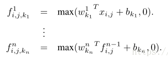
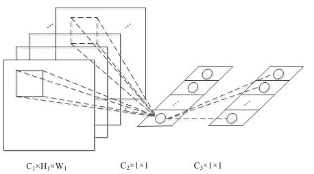

# Network-in-network(2013)

2013年年尾, Min Lin提出了在卷积后面再跟一个1x1的卷积核对图像进行卷积, 这就是[Network-in-network](https://arxiv.org/abs/1312.4400)的核心思想了. NiN在每次卷积完之后使用, 目的是为了在进入下一层的时候**合并更多的特征参数**. 同样NiN层也是违背LeNet的设计原则（浅层网络使用大的卷积核）, 但却有效地合并卷积特征, 减少网络参数、同样的内存可以存储更大的网络.

根据Min Lin的NiN论文, 他们说这个“网络的网络”(NIN)**能够提高CNN的局部感知区域**. 例如没有NiN的当前卷积是这样的：3x3 256 [conv] -> [maxpooling], 当增加了NiN之后的卷积是这样的：3x3 256 [conv] -> 1x1 256 [conv] -> [maxpooling].


MLP多层感知的厉害之处就在于它把卷积特征结合起来成为一个更复杂的组合, 这个思想将会在后面ResNet和Inception中用到.

NIN的第一个N指mlpconv,第二个N指整个深度网络结构, 即整个深度网络是由多个mlpconv构成的.

### 论文概要

我们提出了一种新型的深度网络结构, 称为“Network In Network”(NIN), 它可以增强模型在[感受野(receptive field)](https://link.jianshu.com?t=https%3A%2F%2Fblog.csdn.net%2Fbaidu_32173921%2Farticle%2Fdetails%2F70049186)内对局部区域(local patches)的辨别能力. 传统的卷积层使用线性滤波器来扫描输入, 后面接一个非线性激活函数. 而我们则构建了一些结构稍复杂的微型神经网络来抽象receptive field内的数据.

我们用多层感知器实例化微型神经网络, 这是一种有效的函数逼近器.

特征图可以通过微型神经网络在输入上滑动得到, 类似于CNN；接下来特征图被传入下一层. 深度NIN可以通过堆叠上述结构实现. 通过**微型网络增强局部模型**, 我们就可以在分类层中利用所有特征图的全局平均池化层(GAP), 这样更容易解释且比传统的全连接层**更不容易过拟合**.

mlpconv层更好地模型化了局部块, GAP充当了防止全局过度拟合的结构正则化器.

使用这两个NIN组件, 我们在CIFAR-10、CIFAR-100和Svhn数据集上演示了最新的性能.

通过特征映射的可视化, 证明了NIN最后一个mlpconv层的特征映射是类别的置信度映射, 这就激发了通过nin进行目标检测的可能性.

### 新奇点

#### MLP Convolution Layers(MLP卷积层)

CNN的卷积滤波器是底层数据块的广义线性模型(generalized linear model /GLM), 而且我们认为它的抽象程度较低. 这里的**抽象较低是指该特征对同一概念的变体是不变的**.

用更有效的非线性函数逼近器代替GLM可以增强局部模型的抽象能力. 当样本的隐含概念(latent concept)线性可分时, GLM可以达到很好的抽象程度, 例如：这些概念的变体都在GLM分割平面的同一边, 而**传统的CNN就默认了这个假设——认为隐含概念(latent concept)是线性可分的**.

> 传统的CNN用超完备滤波器来提取潜在特征：使用大量的滤波器来提取某个特征, 把所有可能的提取出来, 这样就可以把想要提取的特征也覆盖到. 这种通过增加滤波器数量的办法会增大网络的计算量和参数量.

使用MLP来增强conv的原因: 然而, 同一概念的数据通常是非线性流形的(nonlinear manifold), 捕捉这些概念的表达通常都是输入的高维非线性函数. 在NIN中, GLM用“微型网络”结构替代, 该结构是一个非线性函数逼近器.

最终结构我们称为“mlpconv”层, 与CNN的比较见图.


线性卷积层包含线性滤波器, 而mlpconv层包含的是微型网络(本文选择多层感知器). 两种层都将局部感受野映射到了隐含概念的置信度值.

线性卷积层和mlpconv层都从局部感受野(receptive field)映射到了输出特征向量. mlpconv 层将局部块的输入通过一个**由全连接层和非线性激活函数组成的多层感知器(MLP)**映射到了输出的特征向量,  从图上可以看到, 每个局部感受野的神经元进行了更复杂的运算.

MLP在所有局部感受野中共享. 特征图通过用像CNN一样的方式在输入上滑动MLP得到, **NIN的总体结构是一系列mplconv层的堆叠**. 被称作“Network In Network”(NIN), 因为内部含有MLP.

------

由于没有关于潜在概念分布的先验信息, 使用通用函数逼近器来提取局部块的特征是可取的, 因为它能够逼近潜在概念的更抽象的表示. 径向基网络和多层感知器是两种著名的通用函数逼近器.

我们在这项工作中选择多层感知器有两个原因.

* 首先, MLP的参数可以使用BP算法训练, 与CNN高度整合；
* 第二, MLP可自行深度化(可以增加Hidden layer), 符合特征复用的思想.

MLP在CNN基础上的进步在于：

* 将feature map由多通道的线性组合变为非线性组合, 提高特征抽象能力；
* 通过1x1卷积核及GAP代替fully connected layers实现减小参数.

**多个1x1的卷积核级联就可以实现对多通道的feature map做非线性的组合**, 再配合激活函数, 就可以实现MLP结构, 同时通过1x1的卷积核操作还可以实现卷积核通道数的降维和升维, 实现参数的减小化. 通过MLP微结构, 实现了不同filter得到的不同feature map之间的整合, 可以使网络学习到复杂和有用的跨特征图特征. MLP中的每一层相当于一个卷积核为1x1的卷积层.

> 1\*1卷积核, 可以在保持feature map尺度不变的(即不损失分辨率)的前提下, 对局部视野下的神经元进行更加复杂的运算, 大幅增加非线性特性(利用后接的非线性激活函数), 把网络做的很深.
>
> https://blog.csdn.net/haolexiao/article/details/77073258

由mlpconv层执行的计算如下：



这里n是多层感知器中的层数. 在多层感知器中, 采用整流线性单元作为激活函数.

从跨信道(跨特征图--cross feature map)池的角度看, 方程2等价于正规卷积层上的**级联跨信道参数池化( cascaded cross channel parametric pooling)**.

每个池层对输入特征映射执行加权线性重组, 然后通过整流线性单元. 跨信道参数池功能映射在下一层中一次又一次地跨信道参数池. 这种级联的跨信道参数池结构允许复杂且可学习的交叉信道信息交互.

> 因为一般卷积操作可以看成特征的提取操作, 而一般卷积一层只相当于一个线性操作(CNN的卷积滤波器是底层数据块的广义线性模型(generalized linear model /GLM)), 所以其只能提取出线性特征.
>
> 所以该作者在卷积层后也加入一个MLP使得每层卷积操作能够提取非线性特征.
>
> **其实这里的MLP, 指的是同一层中, 不同特征层之间, 同一个位置上的值的MLP**
>
> 

> 使用1\*1卷积核, 实现降维和升维的操作其实就是channel间信息的线性组合变化, 3\*3, 64channels的卷积核后面添加一个1\*1, 28channels的卷积核, 就变成了3\*3, 28channels的卷积核, 原来的64个channels就可以理解为跨通道线性组合变成了28channels, 这就是通道间的信息交互.
>
> 注意：只是在channel维度上做线性组合, W和H上是共享权值的sliding window

> MLPConv是一组非线性映射的级联,Maxout则是整体进行了一个非线性映射,跨多个仿射特征映射执行max池化,
> $$
> y_{Maxout}=max\left\{\begin{matrix}w_1x+b_1\\ ...\\w_kx+b_k\end{matrix}\right.\\
> y_{Mlpconv}=max(w_k*max(...max(w_1x+b_1,0)...)+b_k,0)
> $$
> Mlpconv层与Maxout层的不同之处在于, **凸函数逼近器被一个通用函数逼近器所代替**, 它在建模各种隐性概念分布方面具有更强的能力.

**跨信道参数池层**也等价于具有1x1卷积核的卷积层. 这一解释使得理解NiN的结构更为直观.

> 为什么可以这么理解?
>
> NIN与1×1卷积核的关系: 因为NIN中的MLP层可以用两层1×1卷积核来代替.
>
> 比如当前这一层是54×54×96的图像层, 然后过一个1×1×96的卷积核, 还是一个54×54×96的卷积层, 然后再过一个1×1×96的卷积核, 还是一个54×54×96的卷积层.
>
> 这样看最开始那个96个特征层的图像同一个位置不同层之间的像素点, 相当于过了一个96×96×96的MLP网络.
>
> https://blog.csdn.net/haolexiao/article/details/77073258

#### 全局平均池化(GAP)层输出作为可信度

我们不采用在CNN中传统的完全连通层进行分类, 而是通过全局平均池层(global average pooling
layer)直接输出最后一个mlpconv层的特征映射的空间平均值**作为类别的可信度**, 然后将得到的向量输入到Softmax层.

在传统的CNN中, 很难解释如何将来自分类层(objective cost layer)的分类信息传递回前一个卷积层, 因为全连接层像一个黑盒一样. 相反, 全局平均池化更有意义和可解释, 因为它**强制特征映射和类别之间的对应**, 这是通过使用微型网络进行更强的局部建模而实现的.

此外, **完全连接层容易过度拟合(特征组合过多), 严重依赖于Dropout正则化(随机丢失特征), 而全局平均池本身就是一个结构正则化(压缩特征), 这在本质上防止了对整体结构的过度拟合**, 以此取代CNN中传统的全连通层.

其思想是**为最后一个mlpconv层中的分类任务的每个对应类别生成一个特征映射**. 我们没有在特征映射的顶部添加完全连通的层, 而是取每个特征映射的平均值, 并将得到的向量直接输入到Softmax层.

GAP取代完全连通层上的一个优点是, 通过**增强特征映射和类别之间的对应关系, 它更适合于卷积结构**.

因此, **特征映射可以很容易地解释为类别信任映射**(categories confidence maps).

另一个优点是在全局平均池中没有优化参数, 从而避免了这一层的过度拟合. 此外, 全局平均池**综合了空间信息**, 从而对输入的空间平移具有更强的鲁棒性.

我们可以看到GAP是一个结构正则化器, 它显式地将特征映射强制为概念(类别)的信任映射. 这是由Mlpconv层实现的, 因为它们比GLMs更接近置信度图(confidence map).

> **confidence map**, 可以翻译为**置信图**, 是一个图像中所有像素所满足的分布(他原话说的是一个图像上的概率密度函数)
>
> https://stackoverflow.com/questions/21086082/what-is-consistency-map-confidence-map

> 全局平均池层与完全连接层相似, 因为它们都执行矢量化特征映射的线性转换. **差别在于变换矩阵**. 对于GAP, 变换矩阵是前缀的( prefixed),  并且**仅在共享相同值的块对角线元素上是非零的**. 完全连通的层可以有密集的变换矩阵, 并且这些值要经过反向传播优化.

> GAP的出现,也使得输入图像的大小可以不用受限,因为可以通过固定GAP的层数,但是对于W/H而言,都是1X1,不管输入多少,它都可以进行调整.不同于之前使用全连接,因为是压平了(Flatten),导致输入大小必须固定.

### 构思细节

经典卷积神经元网络由交替叠加的卷积层和空间汇聚层组成. 卷积层通过线性卷积滤波器和非线性激活函数(整流器(rectifier)、Sigmoid、tanh等)生成特征映射. 以线性整流器(ReLU:Rectified Linear Units)为例, 可以按以下方式计算特征图：

这里的(i, j)是特征图像素的索引, xij代表以位置(i, j)为中心的输入块, k用来索引特征图的通道.

当隐性概念( the latent concepts )的实例是线性可分的时, 这种线性卷积就足以进行抽象. 然而, **实现良好抽象的表示通常是输入数据的高度非线性函数**.  在传统的CNN中, 这可以通过利用一套完整的滤波器来弥补, 覆盖所有隐含概念的变化. 也就是说, 可以学习独立的线性滤波器来检测同一概念的不同变化. 然而, 对单个概念有太多的过滤器会给下一层带来额外的负担, (因为)下一层需要考虑上一层的所有变化组合.

> https://arxiv.org/pdf/1301.5088.pdf

在CNN中,  来自更高层的滤波器会映射到原始输入的更大区域. **它通过结合下面层中的较低级别概念来生成更高级别的概念**. 因此, 我们认为, 在将每个本地块(local patch)合并为更高级别的概念之前, 对每个本地快进行更好的抽象是有益的.

在最近的Maxout网络[8]中, **特征映射的数目通过仿射特征映射上的最大池化来减少**(仿射特征映射是线性卷积不应用激活函数的直接结果). 线性函数的极大化使分段线性逼近器( piecewise linear approximator)能够逼近任意凸函数.

>  因为是对一个神经单元的输出进行了一种多种可能的权重测试,选择输出最大的一种作为最后的输出,相当于是一种比ReLU更为复杂的多分段激活函数, 这也使得它有更强大的能力.

与进行线性分离的传统卷积层相比, 最大输出网络更强大, 因为它能够分离凸集中的概念.  这种改进使maxout网络在几个基准数据集上有最好的表现.

> [关于maxout](https://blog.csdn.net/hjimce/article/details/50414467)

但是, Maxout网络强制**要求潜在概念的实例存在于输入空间中的凸集中, 这并不一定成立**. 当隐性概念的分布更加复杂时, **需要使用更一般的函数逼近器**. 我们试图通过引入一种新颖的“Network In Network”结构来实现这一目标, 即在每个卷积层中引入一个微网络来计算局部块的更抽象的特征.

在以前的一些工作中, 已经提出了在输入端滑动一个微网络. 例如, 结构化多层感知器(SMLP)[9]在输入图像的不同块上应用共享多层感知器；在另一项工作中, 基于神经网络的滤波器被训练用于人脸检测[10]. 然而, 它们都是针对特定的问题而设计的, 而且都只包含一层滑动网络结构. **NIN是从更一般的角度提出的, 将微网络集成到CNN结构中, 对各个层次的特征进行更好的抽象**.

### 训练细节

* 正则化
  * 作为正则化器, 除最后一个mlpconv层外, 所有输出都应用了**Dropout**.
  * 除非具体说明, 实验部分中使用的所有网络都使用**GAP**, 而不是网络顶部完全连接的层.
  * 另一个应用的正则化方法是Krizhevsky等人使用的权重衰减[4].
  * 图2说明了本节中使用的nin网络的总体结构. 补充材料中提供了详细的参数设置.

* 网络

  * 我们在AlexKrizhevsky[4]开发的超快Cuda-ConvNet代码上实现我们的网络.

* 预处理

  * 数据集的预处理、训练和验证集的分割都遵循GoodFelt等人的观点[8], 即使用局部对比度归一化(local contrast normalization).

    >  全局对比度归一化旨在通过从每个图像中减去其平均值, 然后重新缩放其使得其像素上的标准差等于某个常数s来防止图像具有变化的对比度.  局部对比度归一化确保对比度在每个小窗口上被归一化, 而不是作为整体在图像上被归一化.
    >
    > https://applenob.github.io/deep_learning_12.html#12.-Application

* 参数

  * 我们采用Krizhevsky等人使用的训练过程[4]. 也就是说, 我们**手动设置适当的初始化权值和学习率**. 该网络是使用规模为128的小型批次进行训练的.
  * 训练过程从初始权重和学习率开始, **一直持续到训练集的准确性停止提高, 然后学习率降低10**. 这个过程被重复一次, (因此)最终的学习率是初始值的百分之一.

### 训练结果

1. CIFAR-10数据集

   * 数据处理

     对于这个数据集, 我们应用了古德费罗等人使用的相同的全局对比规范化和ZCA白化(global
     contrast normalization and ZCA whitening). 我们使用最后10000张培训集的图像作为验证数据.

   * 实验结果

     通过提高模型的泛化能力, NIN中的MLpconv层之间使用Dropout可以提高网络的性能.

     在mlpconv层间引用dropout层错误率减少了20%多. 这一结果与Goodfellow等人的一致, 所以本文的所有模型mlpconv层间都加了dropout. 没有dropout的模型在CIFAR-10数据集上错误率是14.5%, 已经超过之前最好的使用正则化的模型(除了maxout). 由于没有dropout的maxout网络不可靠, 所以本文只与有dropout正则器的版本比较.

     为了与以前的工作相一致, 我们还对CIFAR-10数据集的平移和水平翻转增强的方法进行了评估. 我们可以达到8.81%的测试误差, 这就达到了新的最先进的性能.

2. CIFAR-100

   * 调整

     对于CIFAR-100, 我们不调优超参数, 而是使用与CIFAR-10数据集相同的设置.

     唯一的区别是最后一个mlpconv层输出100个功能映射.

   * 效果

     CIFAR-100的测试误差为35.68%, 在不增加数据的情况下, 其性能优于目前的最佳性能.

3. MNIST[1]数据集

   * 调整

     对于这个数据集, 采用了与CIFAR-10相同的网络结构.

     但是, 从每个mlpconv层生成的特征映射的数量减少了. 因为mnist是一个比CIFAR-10更简单的数据集, 所以需要更少的参数.

     我们在这个数据集上测试我们的方法而不增加数据.

   * 效果

     我们得到了0.47%的表现, 但是没有当前最好的0.45%好, 因为MNIST的错误率已经非常低了.

### 架构代码

NIN文章使用的网络架构如图(总计4层)：3层的mlpconv + 1层global_average_pooling.


```python
#coding:utf-8
import tensorflow as tf

def print_activation(x):
  print(x.op.name, x.get_shape().as_list())

def inference(inputs,
              num_classes=10,
              is_training=True,
              dropout_keep_prob=0.5,
              scope='inference'):

  with tf.variable_scope(scope):
    x = inputs
    print_activation(x)
    with tf.variable_scope('mlpconv1'):
      x = tf.layers.Conv2D(192, [5,5], padding='SAME', activation=tf.nn.relu, kernel_regularizer=l2_regularizer(0.0001))(x)
      print_activation(x)
      x = tf.layers.Conv2D(160, [1,1], padding='SAME', activation=tf.nn.relu, kernel_regularizer=l2_regularizer(0.0001))(x)
      print_activation(x)
      x = tf.layers.Conv2D(96, [1,1], padding='SAME', activation=tf.nn.relu, kernel_regularizer=l2_regularizer(0.0001))(x)
      print_activation(x)
      x = tf.nn.max_pool(x, [1,3,3,1], [1,2,2,1], padding='SAME')
      print_activation(x)
    if is_training:
      with tf.variable_scope('dropout1'):
        x = tf.nn.dropout(x, keep_prob=0.5)
        print_activation(x)
    with tf.variable_scope('mlpconv2'):
      x = tf.layers.Conv2D(192, [5,5], padding='SAME', activation=tf.nn.relu, kernel_regularizer=l2_regularizer(0.0001))(x)
      print_activation(x)
      x = tf.layers.Conv2D(192, [1,1], padding='SAME', activation=tf.nn.relu, kernel_regularizer=l2_regularizer(0.0001))(x)
      print_activation(x)
      x = tf.layers.Conv2D(192, [1,1], padding='SAME', activation=tf.nn.relu, kernel_regularizer=l2_regularizer(0.0001))(x)
      print_activation(x)
      x = tf.nn.max_pool(x, [1,3,3,1], [1,2,2,1], padding='SAME')
      print_activation(x)
    if is_training:
      with tf.variable_scope('dropout2'):
        x = tf.nn.dropout(x, keep_prob=0.5)
        print_activation(x)
    with tf.variable_scope('mlpconv3'):
      x = tf.layers.Conv2D(192, [3,3], padding='SAME', activation=tf.nn.relu, kernel_regularizer=l2_regularizer(0.0001))(x)
      print_activation(x)
      x = tf.layers.Conv2D(192, [1,1], padding='SAME', activation=tf.nn.relu, kernel_regularizer=l2_regularizer(0.0001))(x)
      print_activation(x)
      x = tf.layers.Conv2D(10, [1,1], padding='SAME', activation=tf.nn.relu, kernel_regularizer=l2_regularizer(0.0001))(x)
      print_activation(x)
    with tf.variable_scope('global_average_pool'):
      x = tf.reduce_mean(x, reduction_indices=[1,2])
      print_activation(x)
      x = tf.nn.softmax(x)
      print_activation(x)
  return x

if __name__ == '__main__':
  x = tf.placeholder(tf.float32,[None,32,32,3])
  logits = inference(inputs=x,
                     num_classes=10,
                     is_training=True)
```
