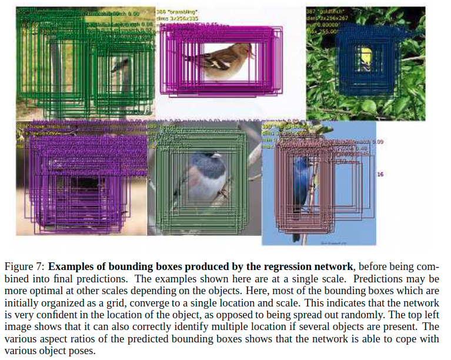
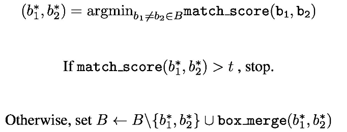
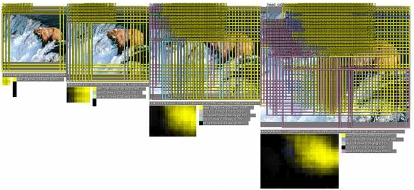

# OverFeat(2014)

## 前言

卷积网络的主要优势是提供end-to-end解决方案；劣势就是对于标签数据集很贪婪。所以在大的数据集上面取得了很大的突破, 但是在小的数据集上面突破不是很大。

ImageNet数据集上的分类图片, 物体大致分布在图片中心,但是感兴趣的物体常常在尺寸和位置（以滑窗的方式）上有变化.

解决这个问题的第一个想法想法就是在不同位置和不同缩放比例上应用卷积网络. 但是滑窗的可视窗口可能只包涵物体的一个部分, 而不是整个物体；对于分类任务是可以接受的, 但是对于定位和检测有些不适合.

第二个想法就是训练一个卷积网络不仅产生类别分布, 还**产生一个物体位置的预测和bounding box的尺寸**.

第三个想法就是积累在每个位置和尺寸对应类别的置信度.

在多缩放尺度下以滑窗的方式利用卷积网络用了侦测和定位很早就有人提出了, 一些学者直接训练卷积网络进行预测物体的相对于滑窗的位置或者物体的姿势. 还有一些学者通过基于卷积网络的图像分割来定位物体.

## 概要

提出了一种**利用卷积网络进行分类、定位和检测的集成框架**. 我们展示了如何在 ConvNet 中有效地实现多尺度和滑动窗口方法. 通过学习预测对象边界, 我们还引入了一种新的深度学习方法来定位. 因此, 为了提高检测的可信度, 边界框将被累积而不是被抑制. 我们表明, 可以使用单个共享网络同时学习不同的任务. 该集成框架是 ImageNet 大规模视觉识别挑战 2013 (ILSVRC2013) 定位任务的赢家, 为检测和分类任务获得了非常有竞争力的结果. 在后竞争的工作中, 我们为检测任务建立了新的技术状态. 最后, 我们发布了一个特征提取器从我们最好的模型称为 OverFeat.

ConvNets 对许多识别主导对象的类别任务的主要优点是, 整个系统都经过训练, 从原始像素到最终类别, 从而减轻了手动设计合适的特征抽取器的要求. 主要的缺点是他们对标记训练样本的贪婪胃口.

* 本文的重点是**对卷积网络进行同时分类、定位和检测图像中的对象的训练, 可以提高所有任务的分类精度和检测和定位精度**. 提出了一种用一个卷积网络集成物体检测、识别和定位的新方法.

* 本文还介绍了一种**通过累积预测边界盒来进行定位和检测的新方法**. 我们建议, 通过结合许多定位预测, 可以在没有背景样本的训练的情况下进行检测, 并且有可能避免耗时和复杂的引导训练通过. 没有在后台进行训练, 也让网络只专注于真实的等级, 以提高准确性.

虽然 ImageNet 分类数据集中的图像主要被选择为包含一个以粗略为中心的对象来填充大部分图像, 但感兴趣的对象有时在图像中的大小和位置上有很大的差异.

* 解决此事的第一个想法是在图像中的多个位置应用一个 ConvNet, 在滑动窗口中, 并在多个尺度上. 尽管如此, **许多查看窗口可能包含对象的一个完全可识别的部分 (如狗的头部), 但不是整个对象, 甚至不是对象的中心**. 这导致了分类效果不错, 但缺乏定位和检测的准确度.
* 因此, 第二个想法是训练系统, 不仅为每个窗口的类别生成分布, 而且还可以对包含对象相对于窗口的边界框的位置和大小产生预测.
* 第三个想法是为每个类别在每个位置和大小积累证据.

许多作者建议在多个尺度上使用 ConvNets 的检测和定位的一个滑动窗口. More recently, ConvNets have been shown to yield state of the art performance on text detection in natural images(最近, 卷积网络已经证明在自然图像上的文本检测表现出了最先进的性能).

一些作者还建议训练 ConvNets 直接预测要定位的对象的实例化参数, 例如相对于查看窗口的位置或对象的姿态.

最简单的方法是训练ConvNet将其观察窗口的中心像素（或体素图像的体素）分类为区域之间的边界与否[13]. 但是, **当区域必须进行分类时, 最好进行语义分割**. 其主要思想是训练 ConvNet 将查看窗口的中心像素与它所属对象的类别进行分类, 并使用窗口作为决策的上下文. 这种方法的优点是, 边**界轮廓不必是矩形, 并且区域不需要有良好的界限对象. 缺点是它需要密集的像素级标签进行训练**. 这种分割预处理或对象提议步骤最近在传统计算机视觉中得到普及, 以减少用于检测的位置, 比例和纵横比的搜索空间[19,2,6,29]. 因此, 可以在搜索空间中的最佳位置处应用昂贵的分类方法, 从而提高识别精度. 此外, [29, 1] 建议这些方法通过大幅度减少不太可能的对象区域来提高准确性, 从而减少潜在的误报(potential false positives). 但是, 我们的密集滑动窗口方法能够胜过 ILSVRC13 检测数据集上的对象建议方法.

AlexNet虽然展示了令人印象深刻的定位表现, 但是没有已发表的作品描述他们的方法. Our paper is thus the first to provide a clear explanation how ConvNets can be used for localization and detection for ImageNet data.

本文研究了三种计算机视觉任务的增加难度顺序: (一) 分类(二) 定位 (三) 检测.

每个任务都是下一个任务的子任务. 虽然使用单个框架和共享功能学习库(a single framework and a shared feature le arning base)解决了所有任务, 但我们将在以下部分中单独描述它们.

1. 分类任务的指标: 在五个猜测里考察是否存在正确的结果(Top5错误率)

2. 定位任务的指标: Top5错误率 + 每个猜测要返回对应的边界框(为了考察正确程度, 预测框必须至少匹配真实框的50% using the PASCAL criterion of union over intersection(IoU Intersection over Union))(IoU只是一个评估指标. 可以使用IoU评估任何提供预测边界框作为输出的算法)

    > https://www.pyimagesearch.com/2016/11/07/intersection-over-union-iou-for-object-detection/

    

    ```python
    def bb_intersection_over_union(boxA, boxB):
    	# determine the (x, y)-coordinates of the intersection rectangle
    	xA = max(boxA[0], boxB[0])
    	yA = max(boxA[1], boxB[1])
    	xB = min(boxA[2], boxB[2])
    	yB = min(boxA[3], boxB[3])

    	# compute the area of intersection rectangle
    	interArea = max(0, xB - xA + 1) * max(0, yB - yA + 1)

    	# compute the area of both the prediction and ground-truth
    	# rectangles
    	boxAArea = (boxA[2] - boxA[0] + 1) * (boxA[3] - boxA[1] + 1)
    	boxBArea = (boxB[2] - boxB[0] + 1) * (boxB[3] - boxB[1] + 1)

    	# compute the intersection over union by taking the intersection
    	# area and dividing it by the sum of prediction + ground-truth
    	# areas - the interesection area
    	iou = interArea / float(boxAArea + boxBArea - interArea)

    	# return the intersection over union value
    	return iou
    ```

3. 检测任务的指标: (每个图像中都可以有任意数量的对象, 也可以没有)使用平均精度(mAP)来度量.

## 模型

### OverFeat

发布了一个特征抽取器取名为”OverFeat“, 以便为计算机视觉研究提供强有力的特征. 提供了2个模型, 一个快速版本一个精确版本. 每一个结构都在表1和表3中描述. 我们在表4中关于参数和连接方面比较了他们的尺寸. 我们准确模型比快速模型更准确（14.18%的分类错误率对比于16.39%的错误率, 在表2中可以看到）, 然而它需要几乎两倍多的连接. 使用7个精确模型的连合可以达到13.6%的分类误差, 如图4所示.


**快速模型结构**

特征映射的空间大小取决于输出图像大小, 在我们的推理步骤时会有改变. 在这里我们展示了训练的空间大小. 第5层是顶层卷积层. 后续层次是全连接层, 并在测试的时候以滑动窗口的方式应用. 全连接层也可以看成空间中的1\*1的卷积. )

Input（231,231,3）→96F（11,11,3, s=4）→max-p（2,2,s=2）→256F(5,5,96,1) →max-p(2,2,2) →512F(3,3,512,1) →1024F(3,3,1024,1) →1024F(3,3,1024) →max-p(2,2,2) →3072fc→4096fc→1000softmax

1. 不使用LRN；

1. 不使用over-pooling使用普通pooling；

1. 第3,4,5卷基层特征数变大, 从Alex-net的384→384→256；变为512→1024→1024.

1. fc-6层神经元个数减少, 从4096变为3072

1. 卷积的方式从valid卷积变为维度不变的卷积方式, 所以输入变为231*231


> 这里第一层的输入为231,经过11的卷积,4的步长,2的步长的2的迟化,结果不是24.
>
> ((231-11)/4+1)/2=28
>
> 但是这里为什么是24?

**精确模型改进**

Input（231,231,3）→96F（7,7,3, s=2）→max-p（3,3,3）→256F(7,7,96,1)→max-p(2,2,2) →512F(3,3,512,1) →512F(3,3,512,1) →1024F(3,3,1024,1) →1024F(3,3,1024,1) →max-p(3,3,3) →4096fc→4096fc→1000softmax

1. 不使用LRN；

1. 不使用over-pooling使用普通pooling, 更大的pooling间隔S=2或3

1. 第一个卷基层的间隔从4变为2（accurate 模型）, 卷积大小从11\*11变为7*7；第二个卷基层filter从5\*5升为7\*7

1. 增加了一个第三层, 是的卷积层变为6层；从Alex-net的384→384→256；变为512→512→1024→1024.


> 它与快速模型的不同之处主要在第一个卷积层的步长, 阶段的数量, 和特征映射层的数量上.

### 分类

- 我们的模型在训练期间使用与 Krizhevsky等人相同的固定输入大小的方法, 但是转向多尺度分类, 如下一节中所述. 每个图像都被下采样, 使得最小的维度是256个像素.
- 然后, 我们提取了5个大小为$221*221$个像素的随机剪裁（及其水平翻转）, 并将这些图像以大小为128的小批量呈现给网络.
- 这些网络中的权重用$（μ, σ）=（0, 1∗10^{−2}）$.
- 它们用随机梯度下降算法更新, momentum系数是0.6, 并且l2权重衰减系数为$1∗10^{−5}$.
- 学习率最初设为$5∗10^{−2}$, 并且在（30, 50, 60, 70, 80）次训练次数之后依次减小0.5倍.
- 在分类器中的全连接层（第6和第7）上dropout设为0.5.

#### 多尺度卷积(FCN)

训练完网络之后, 在测试阶段, 我们不再是用一张221*221大小的图片了作为网络的输入, 而是用了6张大小都不相同的图片, 也就是所谓的多尺度输入预测, 如下表格所示.


> 测试阶段网络输入图片大小分别是245\*245,281\*317……461\*569.

1. **全卷积是什么：** 上图中后三层的全连接层实际上使用的是全卷积, 全连接层是可以转为全卷积的, 举例来说, 全连接层的输入shape为5\*5\*1024的feature map, 输出为4096的话, 参数个数就是5\*5\*1024\*4096, 这个时候转为全卷积层, 那么卷积的参数就是, 卷积核大小为5\*5\*1024, 卷积核个数为4096, 二者的参数量是一样的.
2. **全卷积导致了什么：** 如下图所示, 对14\*14的图像进行卷积操作, 在得到5\*5的feature map后的这一步, 如果使用全连接, 就会把它压平再全连接, 这样**就破坏了feature map的图像位置关系**, 直接转为一列特征. 但是如果使用的是全卷积, 最后会得到1\*1\*C的feature map, C是channel数, 也是类别的大小. 这个时候如果来了一张16\*16的图像, 经过全卷积后就会得到2\*2\*C的feature map, 这个时候可以对这个2\*2的4个值做一个取最大或平均, 就会变成一个值了, 以此类推, 来了更大的图像, 最后得到的feature map就是3\*3\*C, 4\*4\*C, 5\*5\*C的大小, 输出的大小和输入的大小相关, 但总是可以对这个**输出map池化（取最大）来得到这个类别的值**.
3. **全卷积的好处：** 第一个图是训练时用14\*14的图像, 最后产生一个输出, 下面的图是测试时, 可以用16\*16的图像产生了“2\*2”个输出, 以此类推我们可以在测试时使用更大的图像（使用多scale）, 产生“更多”的输出进行（取最大）预测. 这个做法相对于传统的滑动窗口（用14\*14大小, 步长为2的滑动窗口在16*16的图像上执行4次卷积操作进行分类）的优点是, 只需要执行一次, **保证了效率同时可以建模用各种不同尺度图像**, 不局限于固定的裁剪翻转方式（相对于AlexNet测试阶段的做法）, 而且消除了很多冗余计算, 提高了模型的鲁棒性又保证了效率.


> 注意到我们的结构的最后一层是全连接线性层. **在测试的时候, 这些层次被1*1空间范围内的卷积核操作有效地替换**. 然后, 整个ConvNet仅仅是卷积, 最大池化层和阈值操作层的序列.

#### 多尺度分类(offset池化)


传统的检测/定位算法是固定输入图像不变, 采用不同大小的滑窗来支持不同尺度的物体. **对于CNN来说, 滑窗的大小就是训练时输入图像的大小, 是不可以改变的. 那么, CNN支持多尺度的办法就是, 固定滑窗的大小, 改变输入图像的大小**.

网络结构在训练完后, 参数的个数、结构是固定的, 而这一步的算法并没有改变网络的结构, 也更不肯可能去改变网络参数.

我们知道AlexNet预测的方法是输入一张图片256\*256, 然后进行multi-view裁剪, 也就是从图片的四个角进行裁剪, 还有就是一图片的中心进行裁剪, 这样可以裁剪到5张224\*224的图片. 然后把原图片水平翻转一下, 再用同样的方式进行裁剪, 又可以裁剪到5张图片. 把这10张图片作为输入, 分别进行预测分类, 在后在softmax的最后一层, 求取个各类的总概率, 求取平均值.

然而Alexnet这种预测方法存在两个问题：

* 首先这样的裁剪方式, 把图片的很多区域都给忽略了, 说不定你这样的裁剪, 刚好把图片物体的一部分给裁剪掉了, 比如ground truth在中间偏右, 但是此方法并没有检测这个框.
* 另外一方面, 只关注了一个scale导致结果的置信度不高. 裁剪窗口重叠存在很多冗余的计算, 像上面我们要分别把10张图片送入网络, 可见测试阶段的计算量还是蛮大的.

> 对其的改进是使用了multi-scale, 通过在每个位置和多个尺寸上密集地运行网络来探索整个图像. 将ConvNet卷积在任意大小的图像上的结果是C维向量的空间映射. 然而, 在上面描述的网络中的完整的下采样率是2∗3∗2∗3, 或者说是36. 因此当被密集应用时, 该结构仅能够在沿着每个轴的输入维度中每36个像素产生一个分类向量. 这种输出的粗分布减少了性能, 因为网络窗口**不能与图像中的目标很好的对准**. 网络窗口和对象对齐的更好, 网络响应的置信度越高. 为了解决这个问题, 我们采取了类似于Giusti等人的方法[9], 并且在每个偏移处应用最后的下采样操作. 这消除了该层的分辨率损失, 产生了x12而不x36的总的下采样率.
>
> 采样的间隔（也就是滑窗的 stride）等于执行所有卷积和pooling操作后图像缩小的倍数, 也就是所有 卷积层 和 pooling层 的 stride 的乘积
>
> 可以看上面的精确模型, 所有的stride(padding+conv)也就是2个2,以及2个3

在这里我们以输入一张图片为例(6张图片的计算方法都相同), 讲解layer 5 后面的整体过程, 具体流程示意图如下：


> 用于分类的输出映射计算的1维示例, 使用来自表中的scale 2的y维作为示例.

这边需要注意的是我们需要把f6这一层, 看成是卷积核大小为5\*5的卷积层, 总之就是需要把网络看成我们前面所学的FCN模型, 没有了全连接层的概念, 因为在测试阶段我们可不是仅仅输入221\*221这样大小的图片, 我们在测试阶段要输入各种大小的图片.

（a）对于一个给定尺寸的图像, 我们从未经池化的第5层特征映射开始, 20个像素的未经池化的第5层特征图.

（b）使用size=3, stride=3(不重叠)的最大池化来处理特征图. 使用迟化操作起始的偏移为∆ ={0, 1, 2}个像素（各自表示为红色, 绿色, 蓝色）. 重复3∗3次. （X方向3次, Y方向也是3次, 组合起来就是9次）.

（c）对于不同的Δ, 得到池化后的映射, 一种情况有6个输出值. 一共有9种结果.

（d）5像素的分类器（6, 7, 8层）有一个固定的5\*5的输入大小, 并且在池化后的映射中的每一个位置都会产生一个C维(最终的类别维度)的输出向量. 分类器以滑动窗口的方式应用到池化后的映射图上, 产生了C维的输出映射的结合（对于一个给定的（Δx, Δy）, 产生2个像素的C个映射.

（e）对于不同的（Δx, Δy）的结合的输出映射图被重新形成一个单独的3维的输出映射图（两个空间维\*C个类别）.


从layer-5 pre-pool到layer-5 post-pool：这一步的实现是通过池化大小为(3,3)进行池化, 然后△x=0、1、2,△y=0、1、2, 这样我们可以得到对于每一张特征图, 我们都可以得到9幅池化结果图. 以上面表格中的sacle1为例, layer-5 pre-pool大小是17\*17, 经过池化后, 大小就是5\*5, 然后有3\*3张结果图(不同offset得到的结果).

从layer-5 post-pool到classifier map(pre-reshape)：我们知道在训练的时候, 从卷积层到全连接层, 输入的大小是4096\*(5\*5), 然后进行全连接, 得到4096\*(1\*1). 但是我们现在输入的是各种不同大小的图片, 因此接着就采用FCN的招式, 让网络继续前向传导. 我们从layer-5 post-pool到第六层的时候, 如果把全连接看成是卷积, 那么其实这个时候卷积核的大小为5\*5, 因为训练的时候, layer-5 post-pool得到的结果是5\*5. 因此在预测分类的时候, 假设layer-5 post-pool 得到的是7\*9(上面表格中的scale 3), 经过5\*5的卷积核进行卷积后, 那么它将得到(7-5+1)\*(9-5+1)=3\*5的输出.

> 当网络前向传导到layer 5的时候, 就使出了前面我们所讲的FCN、offset pooling这两招相结合的招式.

然后我们就只需要在后面把它们拉成一维向量摆放就ok了, 这样在一个尺度上, 我们可以得到一个C\*N(上面的3*5)个预测值矩阵, 每一列就表示图片属于某一类别(全卷积层输出的**通道维度**就是所谓的类别维度)的概率值, 然后我们求取每一列的最大值, 作为**本尺度的每个类别的概率值**.

最后我们一共用了6种不同尺度(文献好像用了12张, 另外6张是水平翻转的图片), 做了预测, 然后把这六种尺度结果再做一个平均, 作为最后的结果. 在通过比较具体类别之间的概率, 来确定最后的类别.

OK, 至此overfeat图片分类的任务就结束了, 从上面过程, 我们可以看到整个网络分成两部分：layer 1~5这五层我们把它称之为特征提取层；layer 6~output我们把它们称之为分类层.


其中coarse stride表示$Delta=0$, fine stride表示$Delta=0,1,2$.

1. 使用fine stride可以提升模型表现, 但是提升不大, 说明实际上offset-pooling在这里的作用不大.
2. 使用多scale, 增加scale可以提升模型表现.
3. 最后多模型融合, 又提升了表现

### 定位

从训练的分类网络开始, 我们用**回归网络替换分类层并且训练它在每一个空间位置和尺寸上预测对象边界框**. 然后我们将回归预测结合在一起, 连同每个位置的分类结果.

为了生成对象边界框的预测值, 我们在所有的位置和尺寸上运行分类器和回归网络. 因为它们**共享相同的特征提取层**, 因此在**计算了分类网络之后, 仅需要计算最后的回归层**.

在每个位置处的类c的最终softmax层的输出提供了类c的对象存在（但不一定完全包含）在对应视场中的置信得分. 因此, 我们可以为每个边界框分配置信度.

回归层最后是1000个版本（类）, 下图中只是表示了一个类.


以尺度2对于第5层的特征应用回归网络.

1. 对于（3\*3）Δx, Δy偏移中的每一个, 在这个尺寸下, 回归器的输入是6∗7个像素, 空间上具有256个通道.

2. 回归网络中的第一层的每个单元连接到层5映射中的5∗5的领域上, 以及所有的256个通道. 移动5∗5的领域会产生2∗3的空间范围的映射, 对于层中4096通道中的每一个, 以及对于（3*3）Δx, Δy偏移中的每一个.

    >  也就是针对九组特征图的处理

3. 第二个回归层有1024个单元并且是全连接的（即, 紫色元素仅仅连接到(b)中的紫色元素, 跨所有的4096个通道）. (这里并不改变W\*H的维度大小)

4. 回归网络的输出在2∗3的映射上的每一个位置上都是一个4个数的向量（指定边界框的边界）, 以及（3∗3）Δx, Δy偏移中的每一个.

    > (c)的输出是大小为(3x3)x(2x3x4)的张量, 针对一张图
    >
    > 那这里的 3x3x2x3 的框要怎么处理?怎么合到一起?

我们固定住分类网络中的特征抽取值（1-5）, 并且使用**每个例子的预测和真实边界框之间的l2损失训练**回归网络. **最后的回归层是类特定的, 有1000个不同的版本, 每个类一个**.

我们使用与第3节中描述的相同的配置来训练这个网络. 我们比较每个空间位置处的回归网络的预测值与真实值, 并且转移到卷积内的回归器的平移偏移参考系中.

然而, 我们不在与输入视场小于50%重叠的边界框上训练回归器：因为对象大部分在这些位置之外, 所以将更好的通过包含对象的回归窗口来处理.

**以多尺度的方式训练回归器对于跨尺度预测组合是重要的**. 在单个尺度上的训练将在该尺度上表现良好, 并且在其他尺度上仍表现合理. 然而, **多尺度训练将使预测在尺度上正确匹配, 并且以指数方式增加合并预测的置信度**. 反过来, 这允许我们只用几个尺度就可以表现的良好, 而不是通常在检测中的情况下的许多尺度.

在行人检测中, 从一个刻度到另一个刻度的典型比率是大约1.05到1.1, 但是在这里我们使用大约1.4的大比率（由于尺度被调整以适合我们的网络的步幅, 因此每个刻度的该比率是不同的）, 这使得我们能够更快地运行我们的系统.

#### 组合预测

我们通过应用于回归器边界框的**贪婪合并策略**来组合各个预测（参见图7）.



> 回归网络产生的边界框的例子, 在被合并成最终的预测之前.
>
> 这里显示的示例是单一比例的. 这主要取决于对象, 预测在其他尺度上可能更优化.
>
> 在这里, 大多数最初组织为网格的边界框会**聚到一个位置并缩放**. 这表明网络在物体的位置的判断上非常稳定, 而不是随机分布.
>
> 左上角的图像显示, 如果存在多个对象, 它也可以正确识别多个位置.
>
> 预测的边界框的各种纵横比表明网络能够处理各种对象姿势.

使用以下算法：

1. Assign to Cs the set of classes in the top k for each scale $s ∈ 1 . . . 6$, found by taking the maximum detection class outputs across spatial locations for that scale. 在6个缩放比例上运行分类网络, 在每个比例下基于top-k标准, 找到的可能类别, 这就是给每个图片进行**类别标定**Cs

    > 为什么选择6个? 因为在测试阶段, 我们不再是用一张221*221大小的图片了作为网络的输入, 而是用了6张大小都不相同的图片, 也就是所谓的多尺度输入预测, 如下表格所示.
    >
    > 

2. Assign to Bs the set of bounding boxes predicted by the regressor network for each class in Cs, across all spatial locations at scale s. 令Bs为Cs中这些类别的预测框, 在每个比例上运行**预测boundingbox网络**, 产生每个类别对应的bounding box集合Bs

3. Assign B ← Us Bs 然后合并所有scale的bounding box得到集合B

    > 这里是怎么合并的呢?

4. Repeat merging until done. 融合bounding box.

    找B集合里面两个框的**中心距离和相交面积之和最小**的一对, 如果和大于给定阈值t, 则结束, 否则从B中删去两个框(这时,中心距离和相交面积之和在阈值之上, 也就是距离较远, 或者相交面积之和较大), 合并这一对, **用他们的均值构成新的一个框**, 加入B

    > 这里的疑惑:
    >
    > 融合的框的置信度如何确定?
    >
    > 最后融合完后, 应该还有一个置信度的阈值的判定, 去掉过低的置信度的类别?

    

    其中

    * $match\_score(b_1, b_2)$使用两个边界框的中心之间的距离和框的交叉区域之和来计算匹配分数, 当它大于某个阈值时算法停止;

        > :question:
        >
        > 这里应该是与距离成正比,与交集区域成反比才对?
        >
        > 这样的重复才会将不连续的, 置信度确实低的框剔除

    * $box\_merge(b_1^*, b_2^*)$计算的是两个box坐标的平均值.

5. 最后的预测是通过采用**具有最大类分数的合并边界框**来给出.

具体融合过程见下图：

1. 不同的缩放比例上, 预测结果不同, 例如在原始图像上预测结果只有熊, 在放大比例后（第三, 第四个图）, 预测分类中不仅有熊, 还有鲸鱼等其他物体

    

2. 通过offset和sliding window的方式可以有更多的**类别预测**

    

3. 在每个比例上**预测bounding box**, 放大比例越大的图片, 预测的bounding box越多

    

4. 融合bouding box


在最终的分类中, 鲸鱼预测和其他的物体消**失不仅使因为更低的置信度, 还有就是他们的bounding box集合Bs不像熊一样连续, 具有一致性, 从而没有持续的置信度积累**.

通过这种方式**正确的物体持续增加置信度, 而错误的物体识别由于缺少bounding box的一致性和置信度, 最终消失**.

这种方法对于错误的物体具有鲁棒性（但是图片中确实有一些鱼, 虽然不是鲸鱼；但是系统并没有识别出来；也可能是类别中有鲸鱼, 但是没有此种鱼的类别）.

在这个例子中, 一些乌龟和鲸鱼边框出现在中间的多尺度步骤中, 但在最终检测图像中消失. 这些边界框不仅具有较低的分类置信度（分别至多为0.11和0.12）, 它们的收集并不像熊边框那样一致, 以获得显着的置信度. 熊的边框具有较强的置信度（平均每个规模约为0.5）和高匹配分数. 因此, 合并后, 许多熊绑定框被融合成一个具有高置信度的边界, 而错误的负样本在**检测阈值**以下, 因为它们缺乏边界框的一致性和置信度. 这个分析表明, 我们的方法**自然地比纯传统的非最大抑制方法更有利于增强分类模型的假阳性**, 通过奖励边界框的一致性.

> 假阳性: 被当真了
>
> 假阴性: 被误解了
>
> 
>
> https://www.shuxuele.com/data/probability-false-negatives-positives.html

我们将网络应用到Imagenet 2012验证集中, 使用为竞赛指定的定位标准.


令人惊讶的是, 仅使用所有类别共享的单一网络反而要比每个类别的回归网络中为每类使用不同的顶层（Per-Class Regressor（PCR））表现效果更好（44.1％对31.3％）.

这可能是因为训练集中用边界框注释的每个类的例子相对较少, 而网络的顶层参数多了1000倍, 导致训练不足. 可以通过仅在类似类别之间共享参数来改善该方法（例如, 针对所有类型的狗训练一个网络, 针对车辆训练一个网络等）.

### 检测

检测训练类似于分类训练, 但是以空间方式. 可以同时训练图像的多个位置. 由于模型是卷积的, 所有权重都在所有位置之间共享.

**与定位任务的主要区别是当没有对象存在时, 必须预测背景类. **

传统上, 负样本最初是随机的训练. 然后将最有罪的负面错误添加到bootstrapping passes中的训练集中.

Independent bootstrapping 通过渲染训练的负样本集和训练时间之间的复杂和潜在风险不匹配. 另外, 需要调整自举通行的大小, 以确保训练不会在一小组上过度使用. 为了规避所有这些问题, 我们通过选择一些有趣的负样本, 例如随机的或最令人讨厌的, 来进行负样本训练. 这种方法在计算上更昂贵, 但是使程序更简单. 并且由于特征提取最初是用分类任务训练的, 所以检测微调不是很长.

在图11中, 我们报告了ILSVRC 2013比赛的结果, 我们的检测系统排名第三, 平均精度为19.4％（mAP）. 之后, 以24.3％的mAP建立了新的检测状态.

请注意, 前3名方法与其他队伍之间存在巨大差距（第4种方法产生11.5％的mAP）. 此外, 我们的方法与使用初始分段步骤将候选窗口从大约20万到2000减少的前2个其他系统有很大不同.

这种技术加速了推理, 并大大减少了潜在的假阳性数量. [29, 1]表明, 当使用密集滑动窗口时, 检测精度下降, 而不是选择性搜索, 从而丢弃不太可能的对象位置, 从而减少误报. 结合我们的方法, 我们可以观察到类似的改进, 如传统密集方法和基于分割的方法之间所见. 还应该指出的是, 我们没有对NEC和UvA的检测验证集进行微调. 验证和测试集分布与培训集中的差异显着不足, 单独将测试结果提高约1个点. 图11中**两个OverFeat结果之间的改善是由于更长的训练时间和上下文的使用, 即每个刻度也使用较低的分辨率刻度作为输入**.


### 总结

> https://blog.csdn.net/buwan86658/article/details/78054081#t15

(该论文内容细节与只直接的分类网络以往不同, 这个总结部分要仔细理解.)

* 我们提出了一种可以**用于分类, 定位和检测的多尺度滑动窗口方法**. 我们将其应用于ILSVRC 2013数据集, 目前在分类中排名第四, 定位第一, 检测第一.

* 本文的第二个重要贡献是**解释了ConvNets如何有效地用于检测和定位任务**. 这些从未在[15]中得到解决, 因此我们是第一个解释如何在ImageNet 2012的背景下进行的. 我们提出的方案涉及到对分类设计的网络的大量修改, 但清楚地表明, ConvNets有能力应对这些更具挑战性的任务.

    我们的定位方法赢得了2013年的ILSVRC比赛, 并且明显优于2012和2013年的所有方法. 检测模式在比赛中名列前茅, 排名第一.

    我们提出了一个完整的方法, **可以在共享一个共同的特征提取基础时执行不同的任务**, 直接从像素学到.

我们的方法在一下几个方面任需要继续改善.

1. 对于定位, 我们目前并不支持整个网络; 这样做可能会提高性能.
2. 在测试性能的时候, 我们使用L2损失, 而不是直接优化IOU. 交换损失应该是可能的, 因为IOU仍然是可以区分的, 只要有一些重叠. (Swapping the loss to this should be possible since  IOU is still differentiable, provided there is some overlap.)
3. 边界框的替代参数化可能有助于将输出关联起来, 这将有助于网络训练. (Alternate parameterizations of the bounding box may help to decorrelate the outputs, which will aid network training)

---

1. 本文使用一个CNN来集成三个任务, 分类, 定位和检测（共享前层的特征）.
2. 第一次具体解释了CNN是如何被用于定位和检测的.
3. 提出了一个多尺度的, 滑动窗口的方法, 能够提升任务的表现.
4. 在多尺度分类这一块, **在feature map上滑窗, 相比于传统的原始图像滑窗（用一个滑窗对整幅图像进行密集采样, 然后处理每一个采样得到的图像, 再组合结果）, 大大提高了效率**.

训练时:

* 前面5层的参数由 classification network 给定, 只需要训练后面的两个全连接层.
* 这个 regressor network 的输出就是一个 bounding box , 也就是说, 如果将一幅图像或者一个图像块送到这个regressor network中, 那么, 这个 regressor network **输出一个相对于这个图像或者图像块的区域, 这个区域中包含感兴趣的物体**.
* 这个 regressor network 的最后一层是class specific的, 也就是说, 对于每一个class, 都需要训练单独最后一层.
* 这样, 假设类别数有1000, 则这个 regressor network 输出1000个 bounding box , 每一个bounding box 对应一类.

定位问题:

* 测试时, 在每一个尺度上同时运行 classification network 和 regressor network .
* 对于每一个尺度来说,  classification network 给出了图像块的类别的概率分布, regressor network 进一步为每一类给出了一个 bounding box, 这样, 对于每一个 bounding box, 就有一个置信度与之对应.
* 最后, 综合这些信息, 给出定位结果.
