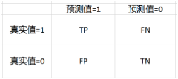

# R-CNN(2014)

## 针对任务: 目标检测

### 目标检测任务概述

> https://blog.csdn.net/u012538490/article/details/55259984
>
> https://blog.csdn.net/Katherine_hsr/article/details/79266880

给定一个图像，**找到其中的目标，找到它们的位置，并且对目标进行分类**。目标检测模型通常是在一组固定的类上进行训练的，所以模型只能定位和分类图像中的那些类。此外，目标的位置通常是边界矩阵的形式。所以，目标检测需要涉及图像中目标的位置信息和对目标进行分类。


> https://zhuanlan.zhihu.com/p/33981103

在深度学习正式介入之前，传统的「目标检测」方法都是 `区域选择`、`提取特征`、`分类回归` 三部曲，这样就有两个难以解决的问题；其一是区域选择的策略效果差、时间复杂度高；其二是手工提取的特征鲁棒性较差。

云计算时代来临后，「目标检测」算法大家族主要划分为两大派系，一个是 `R-CNN` 系两刀流，另一个则是以 `YOLO` 为代表的一刀流派。下面分别解释一下 `两刀流` 和 `一刀流`。

**两刀流** 顾名思义，两刀解决问题：

1. 生成可能区域（Region Proposal） & CNN 提取特征
2. 放入分类器分类并修正位置

这一流派的算法都离不开 `Region Proposal` ，即是优点也是缺点，主要代表就是 `R-CNN`系。

**一刀流** 顾名思义，一刀解决问题，直接对**预测的目标物体进行回归**。
回归解决问题简单快速，但是太粗暴了，主要代表是 `YOLO` 和 `SSD` 。

#### 性能指标

目标检测问题同时是一个回归和分类问题。

对于二分类，AP（Average Precision）是一个重要的指标，这是信息检索中的一个概念，基于precision-recall曲线计算出来，详情见(https://en.wikipedia.org/w/index.php?title=Information_retrieval&oldid=793358396#Average_precision)。

> 计算AP/mAP的流程.
>
> > https://blog.csdn.net/u011447369/article/details/78206057
> >
> > 这篇文章中介绍了多标签图像分类任务的评价方法
> >
> > https://zhuanlan.zhihu.com/p/37910324
> >
> > 这篇文章详细介绍了目标检测任务的mAP的计算过程
>
> 1. 目标检测任务按照RCNN的套路, 先要分类, 再做回归.
>
>     > 尚不够肯定, 待完善
>
> 2. 对于任何算法，评估指标需要知道ground truth（真实标签）数据。我们只知道训练、验证和测试数据集的ground truth。对于目标检测问题，ground truth包括图像中**物体的类别以及实际物体数量以及该图像中每个物体的真实边界框**。
>
> 3. 下面让我们动一下手，去看如何计算mAP。这里我们不谈论不同的目标检测算法，假定我们已经有了一个**训练好的模型**，现在只需要在验证集上评估其性能。
>
> 4. 训练好的目标检测模型会**给出大量的预测结果**，但是其中大多数的预测值都会有非常低的**置信度（confidence score）**，因此我们只考虑那些**置信度高于某个阈值的预测结果**。
>
>     > 这里的置信度指的是什么?
>     >
>     > **分类网络对于确定的框内预测目标的类别预测概率/得分**.
>     >
>     > 一张图片上的不同框内的目标部分对于不同类别有着不同的概率, 也就是不同的置信度.
>
> 5. 将原始图片送入训练好的模型，在经过置信度阈值筛选之后，目标检测算法给出带有边界框的预测结果(此时保留下来的边界是认为positive结果)
>
> 6. 现在，由于我们人类是目标检测专家，我们可以知道这些检测结果大致正确。但我们如何量化呢？我们首先需要判断每个检测的正确性。**这里采用IoU（Intersection over Union），它可以作为评价边界框正确性的度量指标(确定True&False的依据)**。
>
> 7. 计算precision和recall，与所有机器学习问题一样，我们必须鉴别出**TPs**（真正例）、**FPs**（假正例）、**TN**（真负例）和 **FN**（假负例）。为了获得TPs and FPs，我们需要使用IoU。
>
> 8. **使用IoU来确定一个检测结果（Positive）是正确的（True）还是错误的（False）**。最常用的阈值是0.5，即如果IoU > 0.5，则认为它是TP，否则认为是FP。
>
> 9. 计算Recall(TP, FN):
>
>     TP即为IoU大于阈值的预测框结果(同一个目标的应该算一个)
>
>     FN即为真实框中, 我们没有框出来的目标的数目
>
>     > 由于图片中我们**没有预测到物体的每个部分都被视为Negative**，因此计算TN(我们没有框到, 而真是"非该类目标"的部分)比较难办。
>     >
>     > 但是我们可以只计算FN，即ground truth中的目标, 我们没有检测到的没有框到的。
>
> 10. 计算Precision(TP, FP):
>
>     TP即为IoU大于阈值的预测框结果(同一个目标的应该算一个)
>
>     FP即为IoU小于阈值的预测框结果(同一个目标的应该算一个)
>
>     
>
>     > 圆圈内（TPs + FPs）是我们选出的元素,它对应于分类任务中我们取出的结果, 也就是我们预测为真(positives)的样本
>
>     >二元混淆矩阵(实际描述的就是预测值与真实值的相符问题):
>     >
>     >
>     >
>     >预测与实际相符: True; 不符: False
>     >
>     >预测为真: Positive; 预测为假: Negative
>     >
>     >Precision: 预测为真的**确实为真的比例**, 所谓准确率, 也就是**预测为真的正确比例**
>     >
>     >Recall: 真实为真的样本实际**被预测为真的比例**, 所谓召回率, 也就是真是为**真的样本在预测中被召回的比例**
>
> 11. 另外一个需要考虑的因素是**模型所给出的各个检测结果的置信度**。通过改变置信度阈值，我们可以改变一个预测框是Positive还是Negative(即对于该类框的一个过滤, 再送到处理IoU的部分)，即改变预测值的正负性(不是box的真实正负性，**是预测正负性**)。
>
>      基本上，阈值以上的所有预测（Box + Class）都被认为是Positives，并且低于该值的都是Negatives。
>
> 12. 我们可以计算每个Positive预测框与ground truth的IoU值，**并取最大的IoU值，认为该预测框检测到了那个IoU最大的ground truth**。
>
> 13. 然后根据IoU阈值，我们可以计算出一张图片中各个类别的正确检测值（True Positives, TP）数量以及错误检测值数量（False Positives, FP）。
>
>      > 根据Ground truth可以得知没有检测出来的目标的数量FN
>
> 14. 为了得到precision-recall曲线，首先要对模型预测结果进行排序（ranked output，按照各个预测值**置信度**降序排列）。那么给定一个rank，**Recall和Precision仅在高于该rank值的预测结果中计算**，改变rank值会改变recall值。
>
>      这里共选择11个不同的recall（[0, 0.1, ..., 0.9, 1.0]），可以认为是选择了11个rank，由于按照置信度排序，所以实际上**等于选择了11个不同的置信度阈值**。那么，AP就定义为在这11个recall下precision的平均值，其可以表征整个precision-recall曲线（曲线下面积）。
>
> 15. 另外，在计算precision时采用一种插值方法（interpolate）, 及对于某个recall值r，precision值取所有recall>=r中的最大值（这样保证了p-r曲线是单调递减的，避免曲线出现摇摆）
>
>     不过这里VOC数据集在2007年提出的mAP计算方法，而在2010之后却使用了所有数据点，而不是仅使用11个recall值来计算AP
>
> 16. 对于各个类别，分别按照上述方式计算AP，取所有类别的AP平均值就是mAP。这就是在目标检测问题中mAP的计算方法。
> 17. 下面是部分代码:
>
> ```python
> # 按照置信度降序排序
> sorted_ind = np.argsort(-confidence)
> BB = BB[sorted_ind, :]   # 预测框坐标
> image_ids = [image_ids[x] for x in sorted_ind] # 各个预测框的对应图片id
> 
> # 遍历预测框，并统计TPs和FPs
> nd = len(image_ids)
> tp = np.zeros(nd)
> fp = np.zeros(nd)
> for d in range(nd):
>     R = class_recs[image_ids[d]] # ground truth
>     bb = BB[d, :].astype(float) # 预测框坐标
>     ovmax = -np.inf
>     BBGT = R['bbox'].astype(float)  # ground truth
> 
>     # 计算第d个预测框和所有真实框的IoU
>     if BBGT.size > 0:
>         # intersection
>         ixmin = np.maximum(BBGT[:, 0], bb[0])
>         iymin = np.maximum(BBGT[:, 1], bb[1])
>         ixmax = np.minimum(BBGT[:, 2], bb[2])
>         iymax = np.minimum(BBGT[:, 3], bb[3])
>         iw = np.maximum(ixmax - ixmin + 1., 0.)
>         ih = np.maximum(iymax - iymin + 1., 0.)
>         inters = iw * ih
>         # union
>         uni = ((bb[2] - bb[0] + 1.) * (bb[3] - bb[1] + 1.) +
>                (BBGT[:, 2] - BBGT[:, 0] + 1.) *
>                (BBGT[:, 3] - BBGT[:, 1] + 1.) - inters)
>         overlaps = inters / uni
>         
>         # 取最大的IoU
>         ovmax = np.max(overlaps)
>         # 最大iou对应的真实框的索引, 也就是认为这个预测框对应于这个索引对应的目标
>         jmax = np.argmax(overlaps)
>         
>     if ovmax > ovthresh:  # 是否大于阈值
>         if not R['difficult'][jmax]:  # 非difficult物体
>             if not R['det'][jmax]:    # 未被检测
>                 tp[d] = 1.
>                 R['det'][jmax] = 1    # 标记已被检测
>             else:
>                 fp[d] = 1.
>     else:
>         fp[d] = 1.
> 
> # 计算precision recall
> fp = np.cumsum(fp)
> tp = np.cumsum(tp)
> rec = tp / float(npos)
> # avoid divide by zero in case the first detection matches a difficult
> # ground truth
> prec = tp / np.maximum(tp + fp, np.finfo(np.float64).eps)
> 
> # 这里最终得到一系列的precision和recall值，并且这些值是按照置信度降低排列统计的
> # 可以认为是取不同的置信度阈值（或者rank值）得到的。然后据此可以计算AP
> def voc_ap(rec, prec, use_07_metric=False):
>     """
>     Compute VOC AP given precision and recall. 
>     If use_07_metric is true, uses
>     the VOC 07 11-point method (default:False).
>     """
>     if use_07_metric:  # 使用07年方法
>         # 11 个点
>         ap = 0.
>         for t in np.arange(0., 1.1, 0.1):
>             if np.sum(rec >= t) == 0:
>                 p = 0
>             else:
>                 p = np.max(prec[rec >= t])  # 插值
>             ap = ap + p / 11.
>     else:  
>         # 新方式，计算所有点
>         # correct AP calculation
>         # first append sentinel values at the end
>         mrec = np.concatenate(([0.], rec, [1.]))
>         mpre = np.concatenate(([0.], prec, [0.]))
> 
>         # compute the precision 曲线值（也用了插值）
>         for i in range(mpre.size - 1, 0, -1):
>             mpre[i - 1] = np.maximum(mpre[i - 1], mpre[i])
> 
>         # to calculate area under PR curve, look for points
>         # where X axis (recall) changes value
>         i = np.where(mrec[1:] != mrec[:-1])[0]
> 
>         # and sum (\Delta recall) * prec
>         ap = np.sum((mrec[i + 1] - mrec[i]) * mpre[i + 1])
>     return ap
> ```
>
> 这里可以看出来, 先对于某一类别置信度进行排序, 排好序后, 遍历计算所有的预测框各自对于所有真实框的一个IoU.
>
> 选择每个预测框中对于的所有真实框中IoU最大的, 判定这个预测框预测的是这个真实框对应的目标.
>
> 判定IoU阈值, **若是大于阈值(这里忽略了"difficult"目标), 则认为这个预测结果是TP**的(这里只对一个目标计算一次, **多个满足要求的预测框对应同一个目标时, 则只算一次, 其余的都算在FP里. 当然, 小于阈值的也算在FP里**).
>
> 这样得到了针对某一类别的TP, FP, 可得到Precision. 再利用TP与真实框的数目进而可以得到Recall.

对于目标检测，mAP一般在某个固定的IoU阈值上计算，但是不同的IoU阈值会改变TP和FP的比例，从而造成mAP的差异。COCO数据集提供了[官方的评估指标](https://github.com/cocodataset/cocoapi)，它的AP是计算一系列IoU下（0.5:0.05:0.9，见(http://cocodataset.org/#detection-eval)）AP的平均值，这样可以消除IoU导致的AP波动。其实对于PASCAL VOC数据集也是这样，Facebook的Detection上的有比较清晰的实现(https://github.com/facebookresearch/Detectron/blob/05d04d3a024f0991339de45872d02f2f50669b3d/lib/datasets/voc_eval.py#L54)。

> 根据训练数据中各个类的分布情况，mAP值可能在某些类（具有良好的训练数据）非常高，而其他类（具有较少/不良数据）却比较低。所以你的mAP可能是中等的，但是你的模型可能对某些类非常好，对某些类非常不好。因此，建议在分析模型结果时查看各个类的AP值。这些值也许暗示你需要添加更多的训练样本。

除了检测准确度，目标检测算法的另外一个重要性能指标是速度，只有速度快，才能实现实时检测，这对一些应用场景极其重要。评估速度的常用指标是每秒帧率（Frame Per Second，FPS），即每秒内可以处理的图片数量。当然要对比FPS，你需要在同一硬件上进行。另外也可以使用处理一张图片所需时间来评估检测速度，时间越短，速度越快。

### 对于目标检测任务的疑惑

最终结果上有类别, 有框, 有实例, 有置信度. 所以问题就来了, 如何输出这些内容?

类别可以依赖于分类网络来处理, 那框怎么画? 实例如何区分? 置信度又是哪里来?

如果将一幅图像或者一个图像块送到这个regressor network中，那么，这个 regressor network **输出一个相对于这个图像或者图像块的区域，这个区域中包含感兴趣的物体**。这个 regressor network 的最后一层是class specific的，也就是说，**对于每一个class，都需要训练单独最后一层。**这样，假设类别数有1000，则这个 regressor network 输出1000个 bounding box ，每一个bounding box 对应一类。

对于每一个尺度来说， classification network 给出了图像块的类别的概率分布，regressor network 进一步为每一类给出了一个 bounding box, 这样，对于每一个 bounding box，就有一个置信度与之对应。

针对每一类来检测图像中的所有目标, 确定各个目标对于不同类别的各自的置信度. 对于置信度最高的物体标出其自己的回归得到的框, 以及判定的类别与置信度.

## 架构流程


