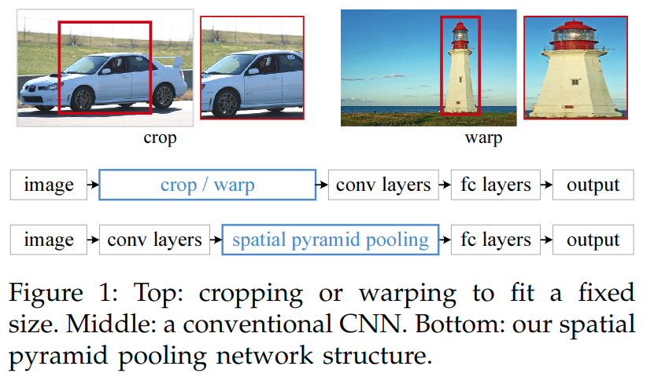
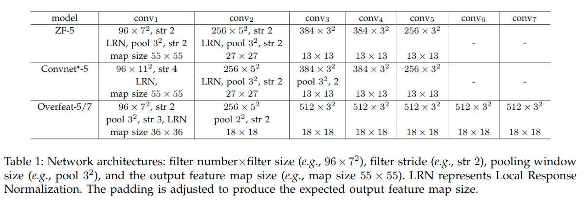

# SPP-Net(2014)

> 论文翻译: http://www.dengfanxin.cn/?p=403
>
> 论文解读: https://zhuanlan.zhihu.com/p/24774302
>
> 论文arxiv: https://arxiv.org/abs/1406.4729

对于RCNN来讲, 主要的流程是:

1. 对输入图像进行选择性搜索, 产生区域提案
2. 对于区域提案进行调整, 对其进行padding=16且再**各向异性变形**, 简单粗暴对图像就缩放至227×227
3. 对于放缩后的数据进行CNN提取特征
4. 输出经过SVM分类判定, 得到一些不同类别的置信度
5. 经过非极大值抑制处理筛选此时的保留的建议区域, 得到最终的置信度最高的不相邻的提案区域
6. 利用框回归处理, 进一步提升预测框的准确度.

> 一个思考:
>
> 不去思考细节, 我们可以思考, 对于一个检测任务而言, 输入的数据越真实, 亦或是越接近真实, 最终的效果才能越接近实际, 最后来得到的判断越具有准确性. 因为它有标框的要求, 也具有判定分类的要求, 这个和输入的形状是有直接的关联的, 对于调整好的图像输入, 目标的形状是发生了变化.
>
> RCNN在调整图像输入的时候, 进行了很多的策略的测试, 其中就包含各向同性的调整测试, 最终结果是, 各向异性变形的思路效果是最好的. 可见, 输入的形状即使发生变化, 对于最终的预测判定, 影响并不大.
>
> 但是这只能说明在这个流程下, 针对RCNN这种设计来说, 这种策略是有用的, 但是并不能说明, 这样形变后的输入数据, 对于最终的输出没有造成一定的限制. 也没有说明, 越真实的数据输入, 不能得到更为准确的结果.

所以, 第一个问题来了, RCNN不足在哪里?

## RCNN&SPP-Net的不足(来自Fast-RCNN论文)

> https://alvinzhu.xyz/2017/10/10/fast-r-cnn/

基于区域的卷积网络方法（RCNN）通过使用深度卷积网络来分类目标候选框, 获得了很高的目标检测精度。然而, R-CNN具有显着的缺点：

1. **训练过程是多级流水线. **R-CNN首先使用目标候选框对卷积神经网络使用log损失进行微调. 然后, 它将卷积神经网络得到的特征送入SVM.  这些SVM作为目标检测器, 替代通过微调学习的softmax分类器.  在第三个训练阶段, 学习检测框回归.
2. **训练在时间和空间上是的开销很大. **对于SVM和检测框回归训练, 从每个图像中的每个目标候选框提取特征, 并写入磁盘. 对于非常深的网络, 如VGG16, 这个过程在单个GPU上需要2.5天（VOC07 trainval上的5k个图像）. 这些特征需要数百GB的存储空间.
3. **目标检测速度很慢. **在测试时, 从每个测试图像中的每个目标候选框提取特征. 用VGG16网络检测目标每个图像需要47秒（在GPU上）.

R-CNN很慢是因为它为每个目标候选框进行卷积神经网络正向传递, 而不共享计算.

* **SPP-Net通过共享计算加速R-CNN. SPP-net计算整个输入图像的卷积特征图, 然后使用从共享特征图提取的特征向量来对每个候选框进行分类. **

* 通过最大池化将候选框内的特征图转化为固定大小的输出（例如, 6X6）来提取针对候选框的特征. 多个输出被池化, 然后连接成空间金字塔池[7](https://alvinzhu.xyz/2017/10/10/fast-r-cnn/#fn:15).

SPPnet在测试时将R-CNN加速10到100倍. 由于更快的候选框特征提取训练时间也减少3倍.

SPP网络也有显著的缺点.

* 像R-CNN一样, **训练过程是一个多级流水线, 涉及提取特征, 使用log损失对网络进行微调, 训练SVM分类器, 最后拟合检测框回归. 特征也写入磁盘. **

* 但与R-CNN不同, 在SPP-Net中提出的微调算法不能更新在空间金字塔池之前的卷积层. 不出所料, 这种限制（固定的卷积层）限制了深层网络的精度.

## SPP-Net做了什么

先看它的结构.

> 为了让我们的神经网络适应任意尺寸的图像输入, 我们用一个空间金字塔池化层替换掉了最优一个池化层(最后一个卷积层之后的pool5).

一张图片会有~2k个候选框, 每一个都要单独输入CNN做卷积等操作很费时. 所以, SPP-net提出, **能否在feature map上提取ROI特征, 这样就只需要在整幅图像上做一次卷积**.

虽然总体流程还是 Selective Search得到候选区域->CNN提取ROI特征->类别判断->位置精修, 但是由于**所有ROI的特征直接在feature map上提取**, 大大减少了卷积操作, 提高了效率.

> 红色框是selective search 输出的可能包含物体的候选框(ROI).
>
> 可见, SPP把原本RCNN的剪裁扭曲调整改成了`spp`操作.
>
> 这里可以思考, SPP主要是为了针对要求固定输入格式的全连接层而进行设计的一个结构.

这里可以看出来, SPP所做的, 就是取消了之前选择性搜索后将图片拆分成2000多个小样本, 调整形状后, 再分别送入CNN处理的这个过程, 改成了在选择出来后, 并没有做具体的拆分, 而是将整个图片输入到CNN中, 做一次整体的处理, 然后在对最终CNN获得的特征图进行区域提取.

那这么说来, 比较麻烦的一点, 也是比较容易疑惑的一点是, 如何确认提取的特征图区域与原始图像的区域的对应关系呢, 也就是<https://zhuanlan.zhihu.com/p/24774302>中提到的"**原始图像的ROI如何映射到特征图(一系列卷积层的最后输出)**"?

对于原本RCNN来说, 因为是直接输入的就是已经分割好的区域提案, 网络直接获得的就是各个提案区域的特征. 但是对于SPP来说, 得到的特征是整体图像的特征, 若想要在特征图上进行区域划分, 来代表提案区域的特征, 那这里就得确定一个对应的关系了.

同时<https://zhuanlan.zhihu.com/p/24774302>中所提到的问题"**ROI的在特征图上的对应的特征区域的维度不满足全连接层的输入要求怎么办(又不可能像在原始ROI图像上那样进行截取和缩放)**", 也是值得考虑的.

这些都是SPP-Net在目标检测任务中, 要解决的问题.

## 原始图像的ROI如何映射到特征图

在论文的结尾有提到如何映射.

在论文的实现中, 将窗口的角点投影到特征图中的像素上(图像域中的该角点最接近该特征图像素的感受野的中心). 所有卷积和池化层的填充使得映射变得复杂.

为了简化实现, 在部署期间, 论文对有着大小为$p$的滤波器层使用$padding = \left \lfloor \frac{p}{2} \right \rfloor pixels$. (如果$padding \neq \lfloor \frac{p}{2} \rfloor$, 则需要对与x添加一个合适的偏移量)

> 滤波器一般是奇数边长, 这样一来, 向下取整就变成了 (p-1)/2, 这样, 对于输入x, 得到的输出大小就是 (x - p + p-1)/s + 1 = (x - 1)/s + 1
>
> 注意, 下面的图片中, 不是采用的这样的padding方式.

因此, 以(x0, y0)为中心的响应, 其在图像域中的有效感受野以(x, y)=(Sx0, Sy0)为中心, 其中S是所有之前操作的步长的乘积.

在论文的模型中, 对于ZF-5的conv5, 有S=16, 对于Overfeat-5/7的conv5/7, 有S=12.

> 按照下图计算可以得到:
>
> ZF-5: (2x2)x(2x2)x1x1x1=16
>
> Overfeat-5/7: (2x3)x(1x2)x1x1x1=12

#### 给定图像域中的窗口的投影关系

* 左上边界: $x' = \lfloor x/S \rfloor + 1$
* 右下边界: $x' = \lceil x/S \rceil - 1$

> ZF-5：基于Zeiler和Fergus的“快速”模式[4]的网络架构. 数字5代表5层卷积网络
>
> Convnet*-5：基于Krizhevsky等人工作[3]的修改. 我们在conv2和conv3（而不是conv1和conv2）之后加入了两个池化层. 这样, 每一层之后的特征图就和ZF-5的尺寸一样了
>
> Overfeat-5/7：基于Overfeat论文[5], 使用了[6]的修改. 对比ZF-5/Convnet*-5, 这个架构在最后一个池化层产生了更大的特征图（18×18而不是13×13）. 还在conv3和后续的卷基层使用了更多的过滤器（512）. 我们也研究了7层卷积网络, 其中conv3和conv7结构一样.

## 特征图上区域的如何匹配全连接层的输入

这个就是SPP这个空间金字塔池化所做的事情了.

> https://zhuanlan.zhihu.com/p/24774302这里讲的很好:
>
> 对于难点2我们分析一下：
>
> - 这个问题涉及的流程主要有: 图像输入->卷积层1->池化1->...->卷积层n->池化n->全连接层.
> - 引发问题的原因主要有：全连接层的输入维度是固定死的, 导致池化n的输出必须与之匹配, 继而导致图像输入的尺寸必须固定.
>
> 不就是为了使一些列卷积层的最后输出刚维度好是全连接层的输入维度吗？聪明的你有没有好的解决办法？先思考几秒钟.
>
> 解决办法可能有：
>
> 1. 想办法让不同尺寸的图像也可以使池化产生固定的输出维度. （**打破图像输入的固定性**）
> 2. 想办法让全连接层（罪魁祸首）可以接受非固定的输入维度. （**打破全连接层的固定性, 继而也打破了图像输入的固定性**）
> 3. 其它方法（肯定不止这两个解决办法, 读者有新想法欢迎交流）

这个图在一定程度上描述了这个SPP的处理方式.

对于conv5的输出特征图的里, 有着256个通道, 要进过SPP的处理.

对于这幅图来说, 共采用了3种池化视图, 分别是{4∗4, 2∗2, 1∗1}, 但是他们步长和窗口大小由输入图片决定.

假设经过最后一层卷积得到的**feature map的大小为a∗a**, 我们**想得到的池化视图(输出)大小为n∗n**, 那么窗口$win=⌈a/n⌉$, 步长$stride=⌊a/n⌋$.

这里, 我们假设卷积层的输出的map大小为13x13, 256表示的是map的个数, 所以, SPP得到的输出的特征数量为(4∗4 + 2∗2 + 1∗1) ∗ 256 = 5376(注意, 这里是池化, 通道数和特征图的通道数是一样的), 不管最开始输入的图片多大, 经SPP输出后的特征数量都为5376.

> 上面这小部分理解, 出自这篇文章:
>
> https://blog.csdn.net/sinat_29552923/article/details/72638795

论文中描述这里的时候, 有些不好理解, 在表述池化块类型数目时, 使用了"level". 而描述池化输出的元素的数目, 使用了"bin".

为了实现一个nxn(bins)大小的输出的池化, 需要对于axa大小输入采用参数为 $win=\lceil a/n \rceil, str=\lfloor a/n \rfloor$ 的池化操作, 上图就是一个 3-level 的金字塔池化(3x3, 2x2, 1x1).

要注意, 这里提到的poolnxn中的nxn表示的是池化输出大小bins, 而非滑动窗口的大小.

不同level的输出组合在一起, 这里看前面的图可以知道, 应该是直接的拼接在了一起, 在实现对于全连接层的固定输入.

## 实际测试预处理和效果

> 和RCNN流程基本一致, 训练的时候, SVM与框回归分开各自训练.
>
> 但是测试的时候, SVM处理完后剩下的框, 框回归会进一步的处理调整.

### 预处理

使用了减去图像均值的预处理.

224x224裁剪的训练/测试图像通过减去每像素平均值进行预处理[3].

当输入图像为任何尺寸时, 固定尺寸的平均图像不能直接应用. 在ImageNet数据集中, 我们将224x224平均图像变形到所需大小, 然后将其减去.

在Pascal VOC2007和Caltech101中, 我们在所有实验中使用常数均值(128).

### 效果

#### 图像分类

我们在1000类别的Image2012训练集上训练了网络. 我们的训练算法参照了前人的实践工作[3][4][36]. 图像会被缩放, 以便较小的维度是256, 再从中间获得四个角裁出224×224. 图像会通过水平翻转和颜色变换[3]进行数据增强.

最后两层全连接层会使用Dropout[3]. learning rate起始值是0.01, 当错误率停滞后就除以10. 我们的实现基于公开的cuda-convnet源代码[3]和Caffe[35]. 所有网络都是在单一GeForceGTX TitanGPU（6G内存）耗时二到四周训练的.

基准测试效果:

表2（b）中我们显示了使用单尺寸训练的结果. 训练和测试尺寸都是224×224.

这些网络中, 卷积网络都和他们的基准网络有相同的结构, 只是最后卷积层之后的池化层, 被替换成了SPP层.

表2中的结果我们使用了4层金字塔, 6x6, 3×3, 2×2, 1x1(总共50个块). 为了公平比较, 我们仍然使用标准的10-view预测法, 每个view都是一个224×224的裁切. 表2（b）中的结果显示了明显的性能提升.

表2（c）展示了多尺寸训练的结果. 训练尺寸是224和180, 测试尺寸是224. 我们还使用标准的10-view预测法. 所有架构的top-1/top-5错误率进一步下降. SPP-net(Overfeat-7)的Top-1 错误率降到29.68%, 比非SPP网络低了2.33%, 比单尺寸训练降低了0.68%.

除了使用180和224两个尺寸, 我们还随机选了[180, 224]之间多个尺寸. SPP-net(Overfeat-7)的top1/5错误率是30.06%/10.96%. Top-1错误率比两尺寸版本有所下降, 可能因为224这个尺寸（测试时用的尺寸）被更少的访问到. 但结果仍然比但尺寸版本要好.

之前的CNN解决方案[5][36]也处理了不同尺寸问题, 但他们主要是基于测试. 在Overfeat[5]和Howard的方法[36]中, 单一网络在测试接阶段被应用于不同的尺度, 然后将分支平均. Howard进一步在低/高两个分辨率图像区域上训练了两个不同的网络, 然后平均分支.

据我们所知, 我们是第一个用不同尺寸训练单一网络的方法.

接下来我们研究全图像视角的准确度. 我们将图像保持比例不变的情况下缩放到min(w, h)=256. SPP-net应用到一整张图像上. 为了公平比较, 我们也计算中央224×224裁切这单一视图（上述评估都用过）的准确度. 单视图比较的准确度见表3.

验证了ZF-5/Overfeat-7, top-1错误率在全视图表示中全部下降. 这说明保持完整内容的重要性. 即使网络训练时只使用了正方形图像, 却也可以很好地适应其他的比例.

对比表2和表3我们发现, 结合多种视图大体上要好于全图像视图.

然而全视图图像的表示仍然有价值.

* 首先, 经验上看, 我们发现即使结合几十个视图, 额外增加两个全图像视角（带翻转）仍然可以提高准确度大约0.2%.
* 其次, 全图像视图从方法论上讲与传统方法[15][17][19]保持了一致, 这些方法中对整张图像进行编码的SIFT向量被池化在一起.
* 第三, 在其他一些应用中, 比如图像恢复[37], 相似度评分需要图像表示而不是分类得分. 一个全图像的表示就会成为首选.

#### 目标检测

R-CNN在一张图像的2000个窗口上反复应用深度卷积网络, 十分耗时. 在测试阶段的特征抽取是主要的耗时瓶颈.

我们将SPP-net应用于物体检测. 只在整张图像上抽取一次特征. 然后在每个特征图的候选窗口上应用空间金字塔池化, 形成这个窗口的一个固定长度表示. 因为只应用一次卷积网络, 我们的方法快得多. 我们的方法是从特征图中直接抽取特征, 而R-CNN则要从图像区域抽取. Overfeat也是从卷积特征图中抽取特征, 但需要预定义的窗口尺寸. 作为对比, 我们的特征抽取可以在任意尺寸的深度卷积特征图窗口上.

* 我们使用选择性搜索[20]的“fast”模式对每张图片产生2000个候选窗口. 然后缩放图像以满足$min(w, h) = s$, 并且从整张图像中抽取特征图. 我们暂时使用ZF-5的SPP-net模型（单一尺寸训练）.
* **对每个候选窗口, 我们使用一个4级空间金字塔**（1×1, 2×2, 3×3, 6×6, 总共50块）. 每个窗口将产生一个12800（256×50）维的表示.
* 这些表示传递给网络的全连接层(分类判定).
* 然后我们针对每个分类**训练一个二分线性SVM分类器**. 我们的SVN实现追随了[20][7]. **我们使用真实标注的窗口去生成正例. 负例是那些与正例窗口重叠不超过30%的窗口（使用IoU比例）**. **如果一个负例与另一个负例重叠超过70%就会被移除**. 我们使用标准的难负例挖掘算法（standard hard negative mining [23]）训练SVM. 这个步骤只迭代一次. 对于全部20个分类训练SVM小于1个小时.
* 测试阶段, 训练器用来对候选窗口打分. 然后在**打分窗口上使用最大值抑制**[23]算法（30%的阈值）.

通过多尺度特征提取, 我们的方法可以得到改进.

将图像缩放成$min(w, h) = s \in S = \{480, 576, 688, 864, 1200 \}$, 然后针对每个尺度计算conv5的特征图, 一个结合这些不同尺度特征的策略是逐个channel的池化.

> **关于多尺度特征提取的一个策略**
>
> 但我们从经验上发现另一个策略有更好的效果.
>
> **对于每个候选窗口, 我们选择一个单一尺度$s \in S$, 令缩放后的候选窗口接近与224×224, 然后我们从这个尺度抽取的特征图去计算窗口的特征. 如果这个预定义的尺度足够密集, 窗口近似于正方形. **
>
> 我们的方法*粗略地等效于*将窗口缩放到224×224, 然后再从中抽取特征.
>
> :question:
>
> 这里怎么理解?

但我们的方法在**每个尺度只计算一次特征图**, 不管有多少个候选窗口.

我们参照[7]对预训练的网络进行了调优. 由于对于任意尺寸的窗口, 我们都是从conv5的特征图中画出特征来, 为了简单起见, 我们只调优全连接层.

本例中, 数据层接受conv5之后的固定长度的池化后的特征, 后面跟着$fc_{6,7}​$和一个新的21路（有一个负例类别）fc8层. fc8的权重使用高斯分布进行初始化σ=0.01. 我们修正所有的learning rate为1e-4, 再将全部三层调整为1e-5. 调优过程中正例是与标注窗口重叠度达到[0.5, 1]的窗口, 负例是重叠度为[0.1, 0.5)的. 每个mini-batch, 25%是正例. 我们使用学习率1e-4训练了250k个minibatch, 然后使用1e-5训练50k个minibatch.

因为我们**只调优fc层**, 所以训练非常的快, 在GPU上只需要2个小时, 不包括预缓存特征图所需要的1小时.

另外, 遵循[7], 我们使用了约束框回归来后处理预测窗口. 用于回归的特征也是conv5之后的池化后的特征. **用于回归训练的是那些与标注窗口至少重叠50%的窗口**.

