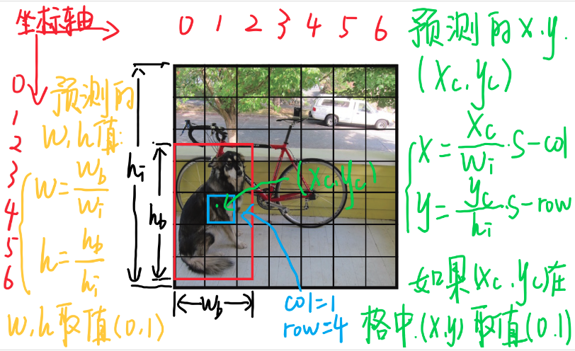
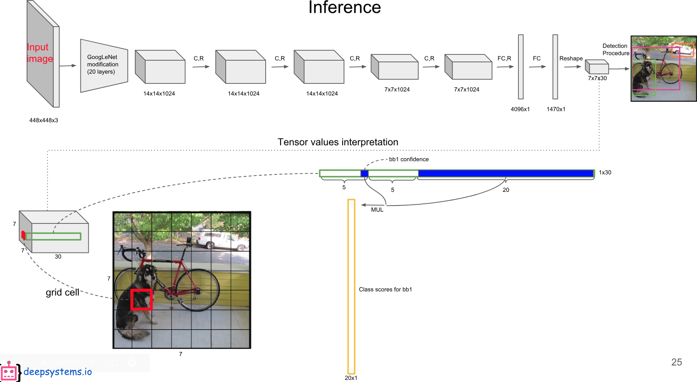
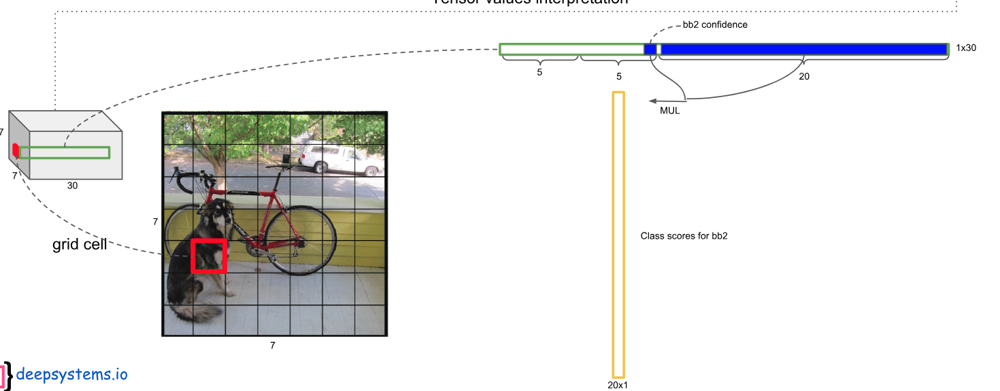
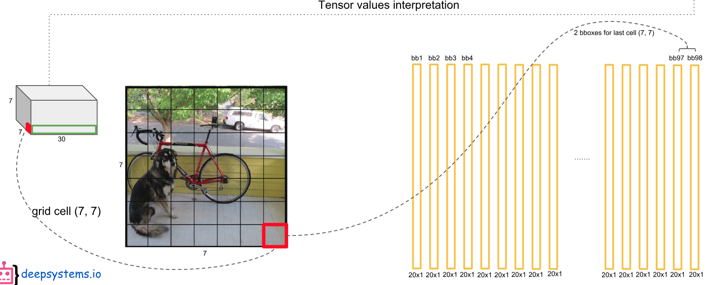
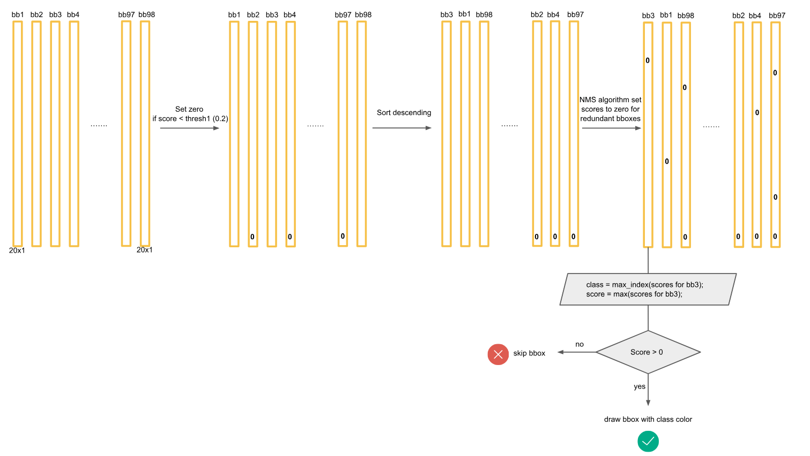
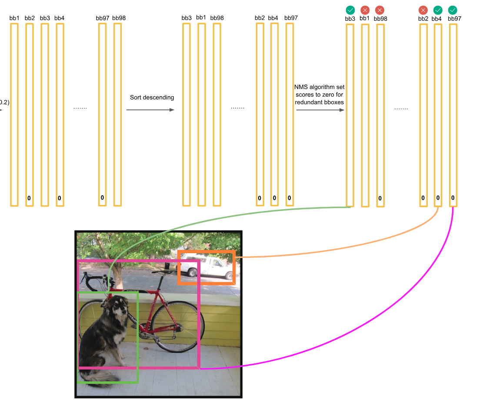
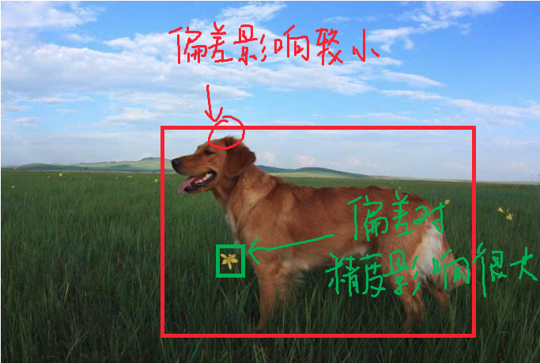

YOLOV1总结(2015)

> 论文arxiv: https://arxiv.org/abs/1506.02640
>
> 论文翻译: http://noahsnail.com/2017/08/02/2017-8-2-YOLO%E8%AE%BA%E6%96%87%E7%BF%BB%E8%AF%91%E2%80%94%E2%80%94%E4%B8%AD%E8%8B%B1%E6%96%87%E5%AF%B9%E7%85%A7/

## 优点与不足

### 背景

最近的方法，如R-CNN使用区域提出方法**首先在图像中生成潜在的边界框**，然后在这些提出的**框上运行分类器**。在分类之后，后处理用于细化边界框，消除重复的检测，并根据场景中的其它目标**重新定位边界框**[13]。这些复杂的流程很慢，很难优化，因为每个单独的组件都必须单独进行训练。

我们**将目标检测重新看作单一的回归问题**，直接从图像像素到边界框坐标和类概率。使用我们的系统，您只需要在图像上看一次（YOLO），以预测出现的目标和位置。

### 优点

YOLO很简单：单个卷积网络同时预测这些盒子的多个边界框和类概率。

YOLO在全图像上训练并直接优化检测性能。这种统一的模型比传统的目标检测方法有一些好处。

1. 首先，YOLO速度非常快。由于我们将检测视为回归问题，所以我们不需要复杂的流程。

    > 测试时我们在一张新图像上简单的运行我们的神经网络来预测检测。我们的基础网络以每秒45帧的速度运行此外，YOLO实现了其它实时系统两倍以上的平均精度。

2. 其次，YOLO在进行预测时，会对图像进行全面地推理。与基于滑动窗口和区域提出的技术不同，YOLO在训练期间和测试时会看到整个图像，所以**它隐式地编码了关于类的上下文信息以及它们的外观**。

    > 快速R-CNN是一种顶级的检测方法[14]，因为它看不到更大的上下文，所以在图像中会将背景块误检为目标。与快速R-CNN相比，YOLO的背景误检数量少了一半。

3. 第三，YOLO学习目标的泛化表示。由于YOLO具有高度泛化能力，因此在应用于新领域或碰到意外的输入时不太可能出故障。

    > 当在自然图像上进行训练并对艺术作品进行测试时，YOLO大幅优于DPM和R-CNN等顶级检测方法。

### 不足

YOLO在精度上仍然落后于最先进的检测系统。

虽然它可以快速识别图像中的目标，但它仍在努力精确定位一些目标，尤其是小的目标。

## 框架结构

我们将目标检测的单独组件集成到单个神经网络中。我们的网络使用整个图像的特征来预测每个边界框。它还可以同时预测一张图像中的所有类别的所有边界框。这意味着我们的网络全面地推理整张图像和图像中的所有目标。YOLO设计可实现端到端训练和实时的速度，同时保持较高的平均精度。

1. 将输入图像**分成SxS的网格**. 如果一个目标的中心落入一个网格单元, 该网格单元负责检测该目标

2. 每个网格单元**预测B个边界框和置信度分数**. 这些置信度分数反映了该模型对于框是否包含目标的信心, 以及预测盒子的准确度

    > 每个边界框包含5个预测值：$x，y，w，h$和置信度。
    >
    > **x,y就是bounding box的中心坐标，与grid cell对齐（即相对于当前grid cell的偏移值）, 使得范围变成0到1；w和h进行归一化（分别除以图像的w和h，这样最后的w和h就在0到1范围）**
    >
    > 
    >
    > **(x,y)到底代表啥意思?**
    >
    > 对于蓝色框的那个单元格(坐标为(x_{col}=1,y_{row}=4))，假设它预测的是红色框的bbox(即object是愚蠢的阿拉斯加),我们设bbox的中心坐标为(x_c,y_c),那么最终预测出来的(x,y)是经过归一化处理的，表示的时中心相对于单元格的offset，计算公式如下：$x = \frac{x_c}{w_i}S-x_{col}  ,   y = \frac{y_c}{h_i}S-y_{row}$
    >
    > **(w,h)又是啥意思?**
    >
    > 预测的bbox的宽高为w_b,h_b，(w,b)表示的是bbox的是相对于整张图片的占比，计算公式如下:$w=\frac{w_b}{w_i}   ,   h=\frac{h_b}{h_i}$
    >
    > **Confidence**
    >
    > 这个置信度有两个含义：**一是格子内是否有目标，二是bbox的准确度**。
    >
    > 我们定义置信度为$Pr(Object)*IOU_{pred}^{truth}$.
    >
    > - 如果格子内有物体，则Pr(Object)=1，此时置信度等于IoU
    > - 如果格子内没有物体，则Pr(Object)=0，此时置信度为0

3. 每个网格单元还**预测C个条件类别概率**$\Pr(\textrm{Class}_i | \textrm{Object})$。这些概率**以包含目标的网格单元**为条件。

    每个网格单元我们只预测的一组类别概率，而不管边界框的的数量B是多少(输出的种类概率值是针对网格的，不是针对bbox的).(简化了计算，但对于检测小object很不利)

4. 在测试的时候, 计算有$\Pr(\textrm{Class}_i | \textrm{Object}) * \Pr(\textrm{Object}) * \textrm{IOU}_{\textrm{pred}}^{\textrm{truth}} = \Pr(\textrm{Class}_i)*\textrm{IOU}_{\textrm{pred}}^{\textrm{truth}}$, 进而得到每个框特定类别的置信度分数. 这些分数编码了**该类出现在框中的概率以及预测框拟合目标的程度**. 这就是每个单元格的class-specific confidence scores，这即包含了预测的类别信息，也包含了对bbox值的准确度。

5. 我们可以设置一个阈值，把低分的class-specific confidence scores滤掉，剩下的塞给非极大值抑制，得到最终的标定框。

---

我们的系统将检测建模为回归问题。

它将图像分成$S \times S$的网格，并且每个网格单元预测$B$个边界框，这些边界框的置信度以及$C$个类别概率。**这些预测被编码为$S \times S \times (B*5 + C)$的张量**。

**我们将此模型作为卷积神经网络来实现**，并在Pascal VOC检测数据集[9]上进行评估。

网络的初始卷积层从图像中提取特征，而全连接层预测输出概率和坐标。

我们的网络架构受到GoogLeNet图像分类模型的启发[34]。我们的网络有24个卷积层，后面是2个全连接层。我们只使用$1 \times 1$降维层，后面是$3 \times 3$卷积层，这与Lin等人[22]类似，而不是GoogLeNet使用的Inception模块。

以在Pascal VOC上评估YOLO为例，我们使用$S=7，B=2$。Pascal VOC有20个标注类，所以$C=20$。我们最终的预测是$7\times 7 \times 30$的张量。

> 
>
> 这里可以注意到, **每个格子的预测并不是在局限在格子内部的大小, 而是外部一个更大的范围预测的结果**.
>
> 
>
> 
>
> 
>
> 即得到每个bounding box属于哪一类的confidence score的汇总。
>
> 也就是说最后会得到$20*(7*7*2）=20*98$的score矩阵，括号里面是bounding box的数量，20代表类别。
>
> 
>
> 接下来的操作都是20个类别轮流进行：在某个类别中（即矩阵的某一行），将得分少于阈值（0.2）的设置为0，然后**再按得分从高到低排序**。
>
> 最后再用**NMS(非极大值抑制)算法去掉重复率较大的bounding box**.
>
> 最后每个bounding box的20个score取最大的score，如果这个score大于0，那么这个bounding box就是这个socre对应的类别（矩阵的行），如果小于0，说明这个bounding box里面没有物体，跳过即可。
>
> 

对应使用的完整的网络如下图所示。

> 我们对最后一层使用线性激活函数，所有其它层使用下面的漏泄修正线性激活：$\phi(x) = \begin{cases}     x, if x > 0 \\     0.1x, otherwise \end{cases}$
>
> 我们还训练了**快速版本的YOLO**，旨在推动快速目标检测的界限。快速YOLO使用具有较少卷积层（9层而不是24层）的神经网络，在这些层中使用较少的滤波器。除了网络规模之外，YOLO和快速YOLO的所有训练和测试参数都是相同的。

经过上面的网络, 进而得到了对于对于原始图像实现的分成了7x7的网格单元.

每个网格单元预测2个边界框和置信度分数(2x(4+1)). 这些置信度分数反映了该模型对于框是否包含目标的信心, 以及预测盒子的准确度.

每个网格单元还预测20个条件类别概率$\Pr(\textrm{Class}_i | \textrm{Object})$。这些概率**以包含目标的网格单元**为条件。每个网格单元我们只预测的一组类别概率，而不管边界框的的数量是多少。

所以得到的是对应的7x7x(10+20)=7x7x30的结果.

## 损失函数

在训练期间，我们优化以下多部分损失函数：

关于损失函数的说明:

* loss的形式采用误差平方和的形式, 将回归进行到底

* 由于很多的grid cell没有目标物体存在，所以给有目标存在的bounding box和没有目标存在的bounding box设置了不同的比例因子进行平衡。具体来说，$\lambda_{\text{coord}} = 5，\lambda_{\text{noobj}} = 0.5$

    > 每个图片的每个单元格不一定都包含object，如果没有object，那么confidence就会变成0，这样在优化模型的时候可能会让梯度跨越太大，模型不稳定跑飞了。
    >
    > 为了平衡这一点，在损失函数中，设置两个参数$\lambda_{corrd}$和$\lambda_{noobj}$，其中$\lambda_{corrd}$控制bbox预测位置的损失，$\lambda_{noobj}$控制单个格内没有目标的损失。

* 直接使用w和h，这样大的box的差异在loss中占的比重会和小的box不平衡，所以这里使用$\sqrt{w}$和$\sqrt{h}$

    > 对于预测的bbox框，大的bbox预测有点偏差可以接受，而小的bbox预测有点偏差就比较受影响了，如下图. 对于这种情况，**使用先平方根再求均方误差，尽可能的缩小小偏差下的影响**.
    >
    > 

* 同一个grid cell会提出多个bounding box。**在training阶段，我们只想让一个bounding box对应object**。所以，我们计算每个bounding box和ground truth的**IoU，以此为标准得到最好的那个bounding box，其他的认为no obj**

* 其中$\mathbb{1}_i^{\text{obj}}$表示目标是否出现在网格单元i中，$\mathbb{1}_{ij}^{\text{obj}}$表示网格单元i中的第j个边界框预测器“负责”该预测.**在计算损失过程中，bbox与ground truth的IoU值最大的负责object。**

    > 第一个式子可以理解为, 对于每个包含了目标的预测的框的中心坐标计算和真实框的中心坐标的平方和误差, 对于所有的网格进行累加计算, 再分配一个权重.
    >
    > 第三个式子可以理解为, 对于每个包含了目标的预测的框的针对各个类别的概率判定的误差平方的累和.
    >
    > 第四个式子正好和第三个相反, 针对的是没有包含目标的预测框的各个类别的概率判定误差平方的累和.
    >
    > > 这里的C是多大的数值? 真实值的这个C表示的又是什么?
    >
    > 第五个式子, 表示对于所有出现了目标的网格单元的类别的预测概率与真实概率差值的平方和. 这里设定**每个单元格只负责一个object的预测**，所以我们不用考虑多个bbox了.

## 实际表现

### 准备

我们在ImageNet分类任务上**以一半的分辨率（$224 \times 224$的输入图像）预训练卷积层，然后将分辨率加倍来进行检测**。

1. 预训练。使用ImageNet 1000类数据训练YOLO网络的前20个卷积层+1个average池化层+1个全连接层。训练图像分辨率resize到224x224。

2. 用步骤1得到的前20个卷积层网络参数来初始化YOLO模型前20个卷积层的网络参数，然后用VOC 20类标注数据进行YOLO模型训练。为提高图像精度，在**检测模型**时，将输入图像分辨率resize到448x448。

### 效果

首先，我们在PASCAL VOC 2007上比较YOLO和其它的实时检测系统。

> 我们使用Hoiem等人[19]的方法和工具。对于测试时的每个类别，我们看这个类别的前N个预测。每个预测或者是正确的，或者根据错误类型进行分类：
>
> - Correct：正确的类别且IOU> 0.5。
> - Localization：正确的类别，0.1 < IOU < 0.5。
> - Similar：类别相似，IOU > 0.1。
> - Other：类别错误，IOU > 0.1。
> - Background：任何IOU < 0.1的目标。
>
> 图显示了在所有的20个类别上每种错误类型平均值的分解图。
>
> 
>
> 这些图显示了各种类别的前N个预测中定位错误和背景错误的百分比

YOLO努力地正确定位目标。定位错误占YOLO错误的大多数，比其它错误源加起来都多。Fast R-CNN使定位错误少得多，但背景错误更多。它的检测的13.6\%是不包含任何目标的误报。Fast R-CNN比YOLO预测背景检测的可能性高出近3倍。

---

为了理解YOLO和R-CNN变种之间的差异，我们探索了YOLO和R-CNN性能最高的版本之一Fast R-CNN[14]在VOC 2007上错误率。根据不同的误差曲线，我们显示YOLO可以用来重新评估Fast R-CNN检测，并减少背景假阳性带来的错误，从而显著提升性能。

>YOLO比Fast R-CNN的背景误检要少得多。
>
>通过使用YOLO消除Fast R-CNN的背景检测，我们获得了显著的性能提升。
>
>对于R-CNN预测的每个边界框，我们检查YOLO是否预测一个类似的框。如果是这样，我们根据YOLO预测的概率和两个边界框之间的重叠来对这个预测进行提升。

最好的Fast R-CNN模型在VOC 2007测试集上达到了$71.8\%$的mAP。当与YOLO结合时，其mAP增加了$3.2\%$达到了$75.0\%$。我们也尝试将最好的Fast R-CNN模型与其它几个版本的Fast R-CNN结合起来。这些模型组合产生了$0.3到0.6\%$之间的小幅增加，详见表。

> 我们检验了各种模型与Fast R-CNN最佳版本结合的效果。Fast R-CNN的其它版本只提供很小的好处，而YOLO则提供了显著的性能提升。

---

我们还展示了在VOC 2012上的结果，并与目前最先进的方法比较了mAP。

>截至2015年11月6日，YOLO与完整`comp4`（允许外部数据）公开排行榜进行了比较。显示了各种检测方法的平均精度均值和每类的平均精度。YOLO是唯一的实时检测器。Fast R-CNN + YOLO是评分第四高的方法，比Fast R-CNN提升了2.3％。
>
>我们联合的Fast R-CNN + YOLO模型是性能最高的检测方法之一。Fast R-CNN从与YOLO的组合中获得了$2.3\%$的提高，在公开排行榜上上移了5位。

---

最后，在两个艺术品数据集上我们显示了YOLO可以比其它检测器更好地泛化到新领域。

用于目标检测的学术数据集**以相同分布获取训练和测试数据**。在现实世界的应用中，很难预测所有可能的用例，而且测试数据可能与系统之前看到的不同[3]。

我们在Picasso数据集上[12]和People-Art数据集[3]上将YOLO与其它的检测系统进行比较，这两个数据集用于测试艺术品中的行人检测。

> Picasso和People-Art数据集上的泛化结果。

---

YOLO是一种快速，精确的目标检测器，非常适合计算机视觉应用。

我们将YOLO连接到网络摄像头，并验证它是否能保持实时性能，包括从摄像头获取图像并显示检测结果的时间。由此产生的系统是交互式和参与式的。

虽然YOLO单独处理图像，但当连接到网络摄像头时，其功能类似于跟踪系统，可在目标移动和外观变化时检测目标。

## 一些疑惑(自我理解)

1. 如何断定框之中包含目标?

    因为使用的CNN, 其中具有提取特征的能力, 对于物体的类别也有判定能力, 通过利用损失函数, 来迫使网络学习类别判定能力.

    这个类似于分类网络的能力.

2. 预测的框是如何确定形状的?

    同上, 迫使网络自我学习回归.

    这种形式后来进行了修改，引入了边界框先验（bounding box prior）的概念。我们**不再期望模型为每张新图像直接生成唯一的边界框描述量，而是定义一个边界框集合**，其中的边界框有不同的宽高比，这些宽高比嵌入了某些关于我们预计会检测到的目标的形状的先验信息。

    > Redmond 提供了一种用于发现最佳宽高比的方法，即在你的训练数据集中的所有边界框上执行 k-均值聚类（使用一个自定义的距离度量）。

---

因为网络是一次性完成的多个任务, 这就导致网络本身需要完成的任务有很多, 不如RCNN系列那样, 任务区分较为明确.

## 参考链接

https://blog.csdn.net/u014380165/article/details/72616238

http://hellodfan.com/2017/10/11/%E7%89%A9%E4%BD%93%E6%A3%80%E6%B5%8B%E8%AE%BA%E6%96%87-YOLO%E7%B3%BB%E5%88%97/

[看deepsystem.ai的PPT，讲的很详细，需要翻墙](https://docs.google.com/presentation/d/1aeRvtKG21KHdD5lg6Hgyhx5rPq_ZOsGjG5rJ1HP7BbA/pub?start=false&loop=false&delayms=3000&slide=id.p)

https://deepsystems.ai/reviews

https://www.jeremyjordan.me/object-detection-one-stage/(中文: https://www.sohu.com/a/245442820_129720)