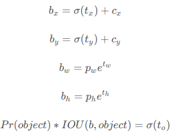
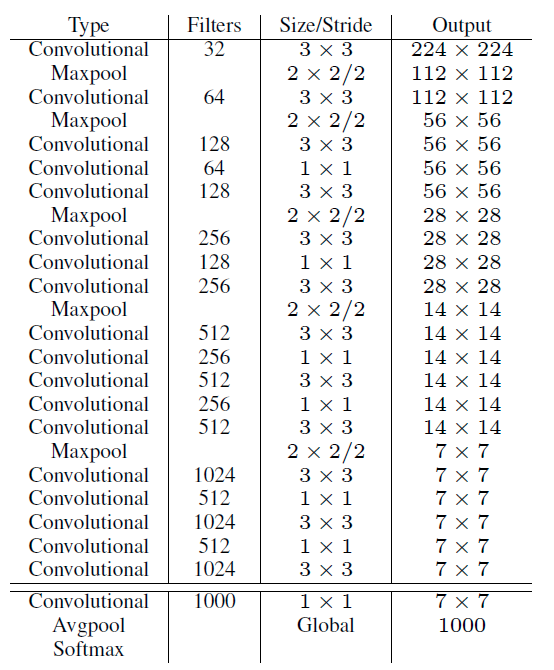
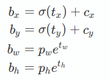

# YOLOV2/V3补充

## YOLOV2

> https://arxiv.org/abs/1612.08242

YOLO与Fast R-CNN相比有较大的定位误差, 与基于region proposal的方法相比具有较低的召回率. 因此YOLO v2主要改进是提高召回率和定位能力.

论文主要工作有两部分：

- 改进YOLO的多个部分, 整出一个YOLOv2
- 提出了一种层次性联合训练方法, 可以使用ImageNet分类数据集和COCO检测数据集同时对模型训练, 最终整出来个YOLO9000, 可以识别9000多种物体.

论文从Better, Faster, Stronger三个方面介绍了对YOLO的改进.

### Better

1. 在网络的每个卷积层后增加Batch Norm, 同时弃用了dropout, 网络的上升了2%mAP.

2. 直接使用448×448的输入, 在ImageNet上跑了10个epochs.让模型时间去适应更高分辨率的输入. 这使得模型提高了4%的mAP. 使用更大的特征图, 更多的anchors(13x13x9=1521)

3. 使用了K-means聚类对数据集的ground truth聚类来找出大部分bbox的形状, 进而来设定为anchor的形状.

    > 算法过程:
    >
    > 将每个bbox的宽和高相对整张图片的比例(wr,hr)进行聚类, 得到k个anchor box, 由于darknet代码需要配置文件中region层的anchors参数是绝对值大小, 因此需要将这个比例值乘上卷积层的输出特征的大小. 如输入是416x416,那么最后卷积层的特征是13x13.
    >
    > ---
    >
    > 神经网络在特征图（13 *13 ）的每个cell上预测5个bounding boxes（聚类得出的值）, 同时每一个bounding box预测5个坐值, 分别为 tx,ty,tw,th,to, 其中前四个是坐标, to是置信度.
    >
    > 如果这个cell距离图像左上角的边距为 (cx,cy)以及该cell对应box(bounding box prior)的长和宽分别为 (pw,ph), 那么预测值可以表示为：
    >
    > 

4. YOLOv2使用了一种不同的方法, 简单添加一个 pass through layer, 把浅层特征图(26x26)连接到深层特征图. 通过叠加浅层特征图相邻特征到不同通道(而非空间位置).

    > 关于passthrough layer, 具体来说就是特征重排(不涉及到参数学习), 前面26 * 26 * 512的特征图使用按行和按列隔行采样的方法, 就可以得到4个新的特征图, 维度都是13 * 13 * 512, 然后做concat操作, 得到13 * 13 * 2048的特征图, 将其拼接到后面的层, 相当于做了一次特征融合, 有利于检测小目标.

5. YOLOv2每隔几次迭代后就会微调网络的输入尺寸. 训练时每迭代10次, 就会随机选择新的输入图像尺寸. 因为YOLOv2的网络使用的downsamples倍率为32, 所以使用32的倍数调整输入图像尺寸{320,352, …, 608}. 训练使用的最小的图像尺寸为320 x 320, 最大的图像尺寸为608 x 608.  这使得网络可以适应多种不同尺度的输入.

### Faster

YOLO2是依赖于DarkNet-19的结构, 这个模型在ImageNet上能达到91%的top-5, 并且单张图片只需要5.58 billion 浮点运算. DarkNet的结构图如下：

可以看到DarkNet也是大量使用了3×3和1×1的小卷积核, YOLO2在DarkNet的基础上添加了Batch Norm保证模型稳定, 加速了模型收敛.

**针对分类训练**

论文以Darknet-19为模型在ImageNet进行了分类任务训练.

**针对检测训练**

在上面训练好的DarkNet-19的基础上, 把分类网络改成detect网络, 去掉原先网络的最后一个卷积层, 取而代之的是使用3个3x3x1024的卷积层, 并且每个新增的卷积层后面接1×1的卷积层, 数量是我们要detection的数量. 对于VOC数据集, 预测5种boxes, 每个box包含5个坐标值和20个类别, 所以总共是5\*(5+20)=125个输出维度.

### Stronger

论文提出了一种**联合训练的机制**：使用detection数据集训练模型detection相关parts, 使用classification数据集训练模型classification相关parts.

这样训练会有一些问题:detection datasets的标签更为“上层”, 例如狗, 船啊啥的. 而对应的classification datasets的标签就“下层”了很多, 比如狗就有很多种, 例如“Norfolk terrier”, “Yorkshire terrier”, and “Bedlington terrier”等等.

而我们一般在模型中分类使用的是softmax, softmax计算所有种类的最终的概率分布. softmax会假设所有种类之间是互斥的, 但是, 实际过程中, “上层”和“下层”之间是有对应的关系的. (例如中华田园犬, 博美都属于狗), 照着这样的思路, 论文整出了一个**层次性的标签结构**.

**层次式分类**

使用相同的训练参数, 层次式Darknet-19获得71.9%的top-1精度和90.4%top-5精度. 尽管添加了369个额外概念, 且让网络去预测树形结构, 精度只有略微降低. 按照这种方式执行分类有一些好处, 当遇到新的或未知物体类别, 预测精确度降低的很温和(没有突然巨幅下降). 例如：如果网络看到一张狗的图片, 但是不确定狗的类别, 网络预测为狗的置信度依然很高, 但是, 狗的下位词(“xx狗”)的置信度就比较低.

这个策略野同样可用于检测. 不在假设每一张图片都包含物体, 取而代之使用YOLOv2的物体预测器(objectness predictor)得到Pr(physical object)的值. 检测器预测一个bounding box和概率树(WordTree). 沿着根节点向下每次都走置信度最高的分支直到达到某个阈值, 最终预测物体的类别为最后的节点类别.

**联合训练分类和检测**

使用WordTree整合了数据集之后就可以在数据集(分类-检测数据)上训练联合模型. 我们想要训练一个检测类别很大的检测器所以使用COCO检测数据集和全部ImageNet的前9000类创造一个联合数据集. 为了评估我们使用的方法, 也从ImageNet detection challenge 中向整合数据集添加一些还没有存在于整合数据集的类别. 相应的WordTree有9418个类别. 由于ImageNet是一个非常大的数据集, 所以通过oversampling COCO数据集来保持平衡, 使ImageNet：COCO = 4：1.

使用上面的数据集训练YOLO9000. 采用基本YOLOv2的结构, anchor box数量由5调整为3用以限制输出大小.

当网络**遇到一张检测图片就正常反向传播**. 其中对于分类损失只在**当前及其路径以上对应的节点类别**上进行反向传播.

当网络**遇到一张分类图片仅反向传播分类损失**. 在该类别对应的所有bounding box中找到一个置信度最高的(作为预测坐标), 同样**只反向传播该类及其路径以上对应节点的类别损失**. 反向传播objectness损失基于如下假设：预测box与ground truth box的重叠度至少0.31IOU.

采用这种联合训练, YOLO9000从COCO检测数据集中学习如何在图片中寻找物体, 从ImageNet数据集中学习更广泛的物体分类.

## YOLOV3

> https://arxiv.org/abs/1804.02767

### 改进之处

- 多尺度预测 (类FPN)
- 更好的基础分类网络(类ResNet)和分类器

> Loss不同：将YOLO V3替换了V2中的Softmax loss变成Logistic loss, 而且每个GT只匹配一个先验框；
>
> Anchor bbox prior不同：V2用了5个anchor, V3用了9个anchor, 提高了IOU；
>
> Detection的策略不同：V2只有一个detection, V3设置有3个. 也就是说, V3的416版本已经用到了52的Feature map, 而V2把多尺度考虑到训练的data采样上, 最后也只是用到了13的Feature map, 这应该是对小目标影响最大的地方；
>
> backbone不同：V2的Darknet-19变成了V3的Darknet-53, 这与上一个有关.
>

### 分类器-类别预测

YOLOv3不使用Softmax对每个框进行分类, 主要考虑因素有两个：

1. Softmax使得每个框分配一个类别(score最大的一个), 而对于`Open Images`这种数据集, 目标可能有重叠的类别标签, 因此Softmax不适用于多标签分类.
2. Softmax可被**独立的多个logistic分类器替代**, 且准确率不会下降.
    分类损失采用binary cross-entropy loss.

### 多尺度预测

**每种尺度预测3个box**, anchor的设计方式仍然使用聚类,得到9个聚类中心,将其按照大小均分给**3种尺度**.也就是使用了9个anchors

- 尺度1: 在基础网络之后添加一些卷积层再输出box信息.
- 尺度2: 从尺度1中的倒数第二层的卷积层上采样(x2)再与最后一个16x16大小的特征图相加,再次通过多个卷积后输出box信息.相比尺度1变大两倍.
- 尺度3: 与尺度2类似,使用了32x32大小的特征图.

### 基础网络 Darknet-53

仿ResNet, 与ResNet-101或ResNet-152准确率接近,但速度更快.

### 边框预测

仍采用之前的logistic方式.

其中cx,cy是网格的坐标偏移量,pw,ph是预设的anchor box的边长.最终得到的边框坐标值是bx,y,w,h,而网络学习目标是tx,y,w,h.

### 优缺点

优点:

- 快速, pipline简单.
- 背景误检率低.
- 通用性强. YOLO对于艺术类作品中的物体检测同样适用. 它对非自然图像物体的检测率远远高于DPM和RCNN系列检测方法.

但相比RCNN系列物体检测方法, YOLO具有以下缺点：

- 识别物体位置精准性差.
- 召回率低. 在每个网格中预测固定数量的bbox这种约束方式减少了候选框的数量.

## 参考链接

V1/V2/V3都有: https://www.cnblogs.com/makefile/p/YOLOv3.html

对于细节分析的很好: https://blog.csdn.net/jesse_mx/article/details/53925356

最后介绍层次性标签结构可以看: https://zhuanlan.zhihu.com/p/25167153

https://blog.csdn.net/gzq0723/article/details/79936613
