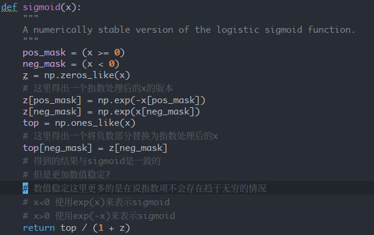

#  为什么我们要使用深度网络呢？

使用深度网络最主要的优势在于，它能以更加紧凑简洁的方式来表达比浅层网络大得多的函数集合。正式点说，我们可以找到一些函数，这些函数可以用  层网络简洁地表达出来（这里的简洁是指隐层单元的数目只需与输入单元数目呈多项式关系）。但是对于一个只有  层的网络而言，除非它使用与输入单元数目呈指数关系的隐层单元数目，否则不能简洁表达这些函数。

举一个简单的例子，比如我们打算构建一个布尔网络来计算  个输入比特的奇偶校验码（或者进行异或运算）。假设网络中的每一个节点都可以进行逻辑“或”运算（或者“与非”运算），亦或者逻辑“与”运算。如果我们拥有一个仅仅由一个输入层、一个隐层以及一个输出层构成的网络，那么该奇偶校验函数所需要的节点数目与输入层的规模  呈指数关系( $n^{n}$ )。但是，如果我们构建一个更深点的网络，那么这个网络的规模就可做到仅仅是  的多项式函数，可以多层逐级处理。

当处理对象是图像时，我们能够使用深度网络学习到“部分-整体”的分解关系。例如，第一层可以学习如何将图像中的像素组合在一起来检测边缘（正如我们在前面的练习中做的那样）。第二层可以将边缘组合起来检测更长的轮廓或者简单的“目标的部件”。在更深的层次上，可以将这些轮廓进一步组合起来以检测更为复杂的特征。

最后要提的一点是，大脑皮层同样是分多层进行计算的。例如视觉图像在人脑中是分多个阶段进行处理的，首先是进入大脑皮层的“V1”区，然后紧跟着进入大脑皮层“V2”区，以此类推。

梯度下降法（以及相关的L-BFGS算法等）在使用随机初始化权重的深度网络上效果不好的技术原因是：梯度会变得非常小。具体而言，当使用反向传播方法计算导数的时候，随着网络的深度的增加，反向传播的梯度（从输出层到网络的最初几层）的幅度值会急剧地减小。

> 注意，梯度和导数基本相关的概念

结果就造成了整体的损失函数相对于最初几层的权重的导数非常小。这样，当使用梯度下降法的时候，最初几层的权重变化非常缓慢，以至于它们不能够从样本中进行有效的学习。这种问题通常被称为“梯度的弥散”.

# 栈式自编码神经网络

是一个由多层稀疏自编码器组成的神经网络，其前一层自编码器的输出作为其后一层自编码器的输入。对于一个  层栈式自编码神经网络，我们沿用自编码器一章的各种符号，假定用  表示第  个自编码器对应的  参数，那么该栈式自编码神经网络的编码过程就是，按照从前向后的顺序执行每一层自编码器的编码步骤：

   

同理，栈式神经网络的解码过程就是，按照从后向前的顺序执行每一层自编码器的解码步骤：

  

其中， 是最深层隐藏单元的激活值，其包含了我们感兴趣的信息，这个向量也是对输入值的更高阶的表示。 通过将  作为softmax分类器的输入特征，可以将栈式自编码神经网络中学到的特征用于分类问题。 

一种比较好的获取栈式自编码神经网络参数的方法是采用逐层贪婪训练法进行训练。

即先利用原始输入来训练网络的第一层，得到其参数 ；然后网络第一层将原始输入转化成为由隐藏单元激活值组成的向量（假设该向量为A），接着把A作为第二层的输入，继续训练得到第二层的参数 ；最后，对后面的各层同样采用的策略，即将前层的输出作为下一层输入的方式依次训练。

对于上述训练方式，在训练每一层参数的时候，会固定其它各层参数保持不变。所以，如果想得到更好的结果，在上述预训练过程完成之后，可以通过反向传播算法同时调整所有层的参数以改善结果，这个过程一般被称作“微调（fine-tuning）”。 

实际上，使用逐层贪婪训练方法将参数训练到快要收敛时，应该使用微调。反之，如果直接在随机化的初始权重上使用微调，那么会得到不好的结果，因为参数会收敛到局部最优。 

如果你只对以分类为目的的微调感兴趣，那么惯用的做法是丢掉栈式自编码网络的“解码”层，直接把最后一个隐藏层的  作为特征输入到softmax分类器进行分类，这样，分类器（softmax）的分类错误的梯度值就可以直接反向传播给编码层了。 

> 那解码层有什么价值？
>
> 对于分类而言,有足以用来预测的特征即可,所以说也无需解码.解码可以用来重构输入.

栈式自编码神经网络具有强大的表达能力及深度神经网络的所有优点。 

更进一步，它通常能够获取到输入的“层次型分组”或者“部分-整体分解”结构。为了弄清这一点，回顾一下，自编码器倾向于学习得到能更好地表示输入数据的特征。因此，栈式自编码神经网络的第一层会学习得到原始输入的一阶特征（比如图片里的边缘），第二层会学习得到二阶特征，该特征对应一阶特征里包含的一些模式（比如在构成轮廓或者角点时，什么样的边缘会共现）。栈式自编码神经网络的更高层还会学到更高阶的特征。

 举个例子，如果网络的输入数据是图像，网络的第一层会学习如何去识别边，第二层一般会学习如何去组合边，从而构成轮廓、角等。更高层会学习如何去组合更形象且有意义的特征。例如，如果输入数据集包含人脸图像，更高层会学习如何识别或组合眼睛、鼻子、嘴等人脸器官。 

# 线性解码器

回想一下，输出层神经元计算公式如下： 

 

其中 *a*(3) 是输出. 在自编码器中, *a*(3) 近似重构了输入 *x* = *a*(1)。 

 S 型激励函数输出范围是 [0,1]，当 *f*(*z*(3)) 采用该激励函数时，就要对输入限制或缩放，使其位于 [0,1] 范围中。一些数据集，比如 MNIST，能方便将输出缩放到 [0,1] 中，但是很难满足对输入值的要求。比如， PCA 白化处理的输入并不满足 [0,1] 范围要求，也不清楚是否有最好的办法可以将数据缩放到特定范围中。 

设定 *a*(3) = *z*(3) 可以很简单的解决上述问题。从形式上来看，就是输出端使用恒等函数 *f*(*z*) = *z* 作为激励函数，于是有 *a*(3) = *f*(*z*(3)) = *z*(3)。我们称该特殊的激励函数为 **线性激励函数** （称为恒等激励函数可能更好些）。我们仅在输出层中使用线性激励函数。一个 S 型或 tanh 隐含层以及线性输出层构成的自编码器，我们称为**线性解码器**。在输出层激励函数为 *f*(*z*) = *z*, 这样 *f*'(*z*) = 1，所以在计算单元误差的时候，公式有所简化。

# 卷积

假设给定了  的大尺寸图像，将其定义为 $x_{large}$。首先通过从大尺寸图像中抽取的  的小尺寸图像样本$x_{small}$ 训练稀疏自编码，计算$ f = σ(W^{(1)} x_{small}+ b^{(1)})$（σ 是一个 sigmoid 型函数）得到了 *k* 个特征， 其中 *W*(1) 和 *b*(1) 是可视层单元和隐含单元之间的权重和偏差值。对于每一个  大小的小图像 *x~s~*，计算出对应的值 f~s~ = σ(*W*(1)x~s~ + *b*(1))，对这些 $f_{convolved}$ 值做卷积，就可以得到  个卷积后的特征的矩阵。 

96X96的图像将会被分成（96-8+1）X（96-8+1）,即89X89块，每一块的大小是8X8。将这些分出来的块输入到已经训练好的网路中，输入是：64(89X89个样本)，W1是100X64，W1输入，则隐含层的输出是100（89X89个集合），这也是教程中所说的将得到100个集合，每个集合中含有89X89特征的含义所在。就是对抽取的区域逐个运行训练过的稀疏自编码来得到特征的激活值。在这个例子里，显然可以得到 100 个集合，每个集合含有 89x89 个卷积特征。

## 更为清晰的流程

1. 卷积特征提取操作的时候，卷积核的得出是通过具有一定数目隐含单元单元的自编码网络来进行训练得到的，因为卷积核实际上就是一个映射参数的集合。所以计算“卷积”的时候，就是”.*”运算。

   1. 若输入8X8图像，实际上输入为64维向量。
   2. 隐含层为100个单元，则对应的W^(1)^ 大小为100X64。
   3. 隐含层输出为100维特征向量。
   4. 则对应的，如果8X8是96X96图像分割后的一部分，则最后是有89X89个100维的特征向量。
   5. 实际上组成了100个89X89大小的特征矩阵，该矩阵就是卷积特征矩阵。
   6. 卷积的时候，一个8X8大小的卷积核，扫描全部图像，获得的是对应于该隐含单元（针对这一个特征）的一个卷积特征矩阵。这里是89X89大小的。

2. 池化作用于获得的特征矩阵。

3. 该矩阵实际上和神经网络前两层的功能是类似的，实际上是利用部分联通实现了全联通。一个核对应一个特征（隐含单元激活值）。扫描检测图像上不同位置该特征的激活状态，也就是该特征的存在情况，不同特征的总体存在情况进行汇总，就反映出来整个图像。

4. 多个卷积层可以级联，实现更高维特征的检测。

5. 卷积核实际上是三维的，~~但是扫描是在自己高度的空间里扫描，其余高度的扫描算是另一个核的扫描结果，属于另一张卷积特征图~~。 

   > 这里理解有误，一般卷积核的高度和输入一致，一个卷积核对应输出一个特征图

   ------

   第一步，针对一个神经元，一幅640X360图像，一个神经元要对应640X360个像素点，即一个神经元对应全局图像，**全连接的话一个神经元就有640X360个参数**；

   第二步，然而，**图像的空间联系是局部的**，就像人是通过一个局部的感受野去感受外界图像一样，**每一个神经元都不需要对全局图像做感受，每个神经元只感受局部的图像区域**，然后在更高层，将这些不同局部的神经元**综合起来就可以得到全局信息**。假如每个局部感受野10X10，每个局部感受野只需要和10X10的局部图像连接，这样**一个神经元就只需要10X10个参数**；

   第三步，全局图像是640X360，但局部图像只有10X10大小，10X10个参数只针对局部图像，如果全局图像中各个局部图像之间权值共享的话，即10X10个参数在不同局部图像上参数应用相同的话，则在全局图像上通过全局共享则只需要10X10个参数；

   第四步，**10X10个参数只针对一个神经元**，要是有100万个神经元，则需要100万X10X10个参数，神经元多后，参数还是太大，如果**每个神经元的这10X10个参数相同**呢，这样就还是只需要10X10参数，因而经过局部感受野到权值共享再到每个神经元的10X10个参数相同，不管图像多大，不管每层神经元个数多少，而两层间连接还是只需要求解10X10个参数；

   第五步，由于只有一个滤波器，只提取了一种特征，特征也太少了。**一种滤波器也就是一种卷积核，提取图像一种特征**，例如某个方向的边缘。那么我们需要提取不同特征怎么办，多加几个滤波器不就行了。假设我们加到100种滤波器，**每种滤波器的参数不一样，表示提取输入图像不同特征**，例如不同边缘。这样不同滤波器去卷积图像就得到不同特征的放映，我们称之为Feature Map，所以100中卷积核就有100个Feature Map，这100个Feature Map就组成了一层神经元。我们这一层有多少个参数到这时候就明了吧，**100种卷积核，每种卷积核100个参数  = 100 * 100 = 10000个参数**。

   最后，刚才说**每一个隐藏层的参数个数和隐藏层的神经元个数无关，只和滤波器大小和滤波器种类数有关**，那么隐藏层的神经元个数怎么确定呢？它和原图像，也就是输入的大小（神经元个数）、滤波器的大小和滤波器在图像中的滑动步长都有关！假如我的图像是1000X1000像素的，而滤波器大小是10X10，假设步长为10，即滤波器没有重叠，这样隐藏层的神经元个数就是1000 X1000 / (10X10) = 100X100个神经元（如果步长为8，卷积核会重叠2个像素）（这里的神经元指的是**共享参数的一批神经元**，也就是同一个卷积核所对应的多个感受野——这一点很重要，实现代码的时候，有一种理解的思路就是利用卷积核对输入数据进行滑动计算卷积）。**这只是一种滤波器，也就是一个Feature Map的神经元个数哦**，如果100个Feature Map就是100倍了，   需要注意一点，上面的讨论都没有考虑每个神经元的偏置部分，所以权值个数需要加1，这也是同一种滤波器共享。如滤波器10X10，卷积核个数6，则参数个数为: (10*10 +1) * 6 = 606.

# 深度学习中的端到端

**端到端指的是输入是原始数据，输出是最后的结果**，非端到端的输入端不是直接的原始数据，而是在原始数据中提取的特征.

这一点在图像问题上尤为突出，因为图像像素数太多，数据维度高，会产生维度灾难，所以原来一个思路是手工提取图像的一些关键特征，这实际就是就一个降维的过程。

那么问题来了，特征怎么提？特征提取的好坏异常关键，甚至比学习算法还重要，举个例子，对一系列人的数据分类，分类结果是性别，如果你提取的特征是头发的颜色，无论分类算法如何，分类效果都不会好，如果你提取的特征是头发的长短，这个特征就会好很多，但是还是会有错误，如果你提取了一个超强特征，比如染色体的数据，那你的分类基本就不会错了。这就意味着，特征需要足够的经验去设计，这在数据量越来越大的情况下也越来越困难。

于是就出现了端到端网络，**特征可以自己去学习**，所以特征提取这一步也就融入到算法当中，不需要人来干预了。

# 指数计算的稳定性

