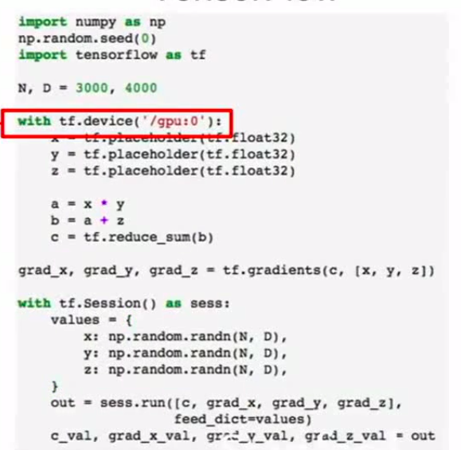
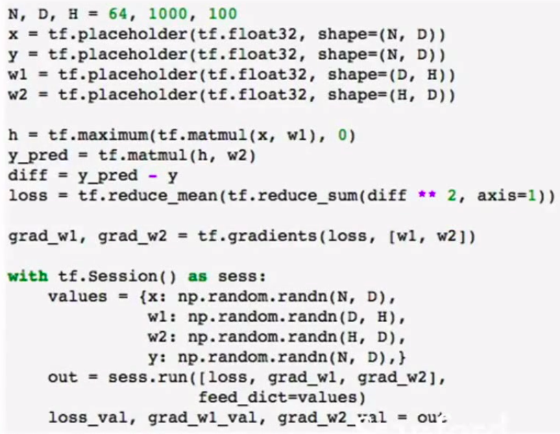
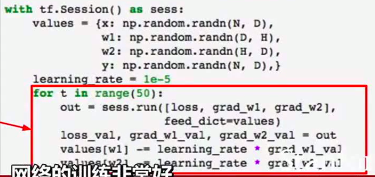
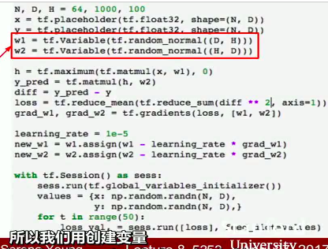
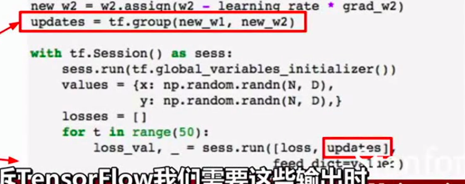
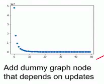
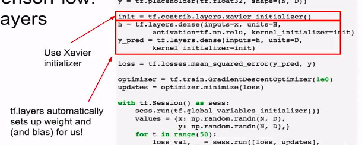
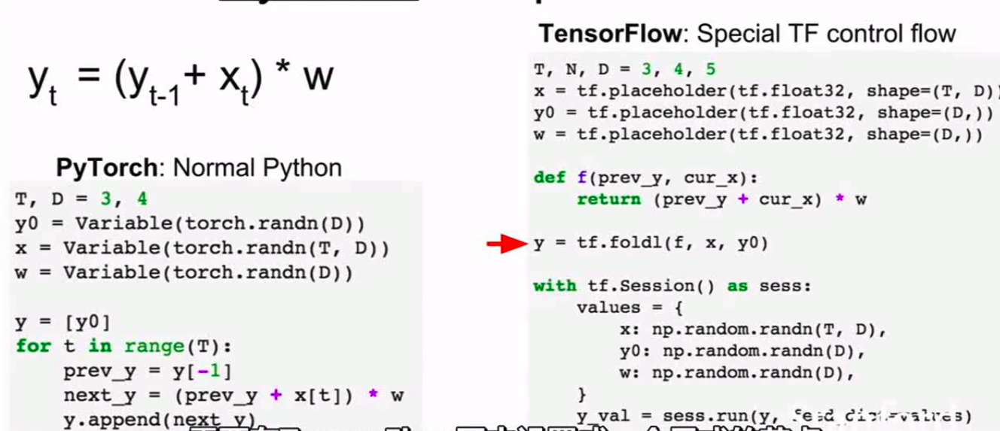

#  一些python代码细节

##  深浅拷贝的问题


## tensorflow的一些细节问题

TensorFlow是一个用于在Tensor对象上执行计算图的系统，具有对其变量执行反向传播的原生支持。在其中，我们使用Tensors，它们是n维数组，类似于numpy ndarray。

这意味着典型的TensorFlow程序分为两个不同的阶段：

1. 构建一个描述您要执行的计算的计算图。这个阶段实际上不执行任何计算；它只是建立了计算的符号表示。该阶段通常将定义一个或多个“占位符”对象，这些对象表示计算图的输入。 
2. 多次运行计算图。每次运行图形时，您将指定要计算的图形的哪些部分，并传递一个“feed_dict”字典，该字典将为图形中的任何“占位符”提供具体值

在TensorFlow中，卷积特征图的数据通常存储在形状 N x H x W x C 的张量中，其中：

* N是数据点的数量（小批量大小）
* H是要素图的高度
* W是要素图的宽度
* C是要素图中的通道数

**注意**：TensorFlow和PyTorch在默认的Tensor布局上有所不同; TensorFlow使用N x H x W x C，但PyTorch使用N x C x H x W.

### 示例



### 使用的基本流程

#### 导入模块（常用的几个）

```python
import tensorflow as tf
import numpy as np
import matplotlib.pyplot as plt
```

#### 定义计算图结构（以一个简单的全连接网络为例：affine->ReLU->affine）

```python
def two_layer_fc(x, params):
    """
    A fully-connected neural network; the architecture is:
    fully-connected layer -> ReLU -> fully connected layer.
    Note that we only need to define the forward pass here; TensorFlow will take
    care of computing the gradients for us.
    
    The input to the network will be a minibatch of data, of shape
    (N, d1, ..., dM) where d1 * ... * dM = D. The hidden layer will have H units,
    and the output layer will produce scores for C classes.

    Inputs:
    - x: A TensorFlow Tensor of shape (N, d1, ..., dM) giving a minibatch of
      input data.
    - params: A list [w1, w2] of TensorFlow Tensors giving weights for the
      network, where w1 has shape (D, H) and w2 has shape (H, C).
    
    Returns:
    - scores: A TensorFlow Tensor of shape (N, C) giving classification scores
      for the input data x.
    """
    w1, w2 = params  # Unpack the parameters
    # 数据塑型
    x = flatten(x)   # Flatten the input; now x has shape (N, D)
    # 自带具体网络的实现
    h = tf.nn.relu(tf.matmul(x, w1)) # Hidden layer: h has shape (N, H)
    # 矩阵相乘
    scores = tf.matmul(h, w2)        # Compute scores of shape (N, C)
    return scores
```

#### 执行计算

```python
def two_layer_fc_test():
    # TensorFlow 的默认计算图是全局变量，为了避免后续使用混乱，需要先清理先前构建的图
    # TensorFlow's default computational graph is essentially a hidden global
    # variable. To avoid adding to this default graph when you rerun this cell,
    # we clear the default graph before constructing the graph we care about.
    tf.reset_default_graph()
    hidden_layer_size = 42

    # Scoping our computational graph setup code under a tf.device context
    # manager lets us tell TensorFlow where we want these Tensors to be
    # placed.
    with tf.device(device):
        # Set up a placehoder for the input of the network, and constant
        # zero Tensors for the network weights. Here we declare w1 and w2
        # using tf.zeros instead of tf.placeholder as we've seen before - this
        # means that the values of w1 and w2 will be stored in the computational
        # graph itself and will persist across multiple runs of the graph; in
        # particular this means that we don't have to pass values for w1 and w2
        # using a feed_dict when we eventually run the graph.
        x = tf.placeholder(tf.float32)
        w1 = tf.zeros((32 * 32 * 3, hidden_layer_size))
        w2 = tf.zeros((hidden_layer_size, 10))
        
        # Call our two_layer_fc function to set up the computational
        # graph for the forward pass of the network.
        scores = two_layer_fc(x, [w1, w2])
    
    # Use numpy to create some concrete data that we will pass to the
    # computational graph for the x placeholder.
    x_np = np.zeros((64, 32, 32, 3))
    with tf.Session() as sess:
        # The calls to tf.zeros above do not actually instantiate the values
        # for w1 and w2; the following line tells TensorFlow to instantiate
        # the values of all Tensors (like w1 and w2) that live in the graph.
        sess.run(tf.global_variables_initializer())
        
        # Here we actually run the graph, using the feed_dict to pass the
        # value to bind to the placeholder for x; we ask TensorFlow to compute
        # the value of the scores Tensor, which it returns as a numpy array.
        scores_np = sess.run(scores, feed_dict={x: x_np})
        print(scores_np.shape)

two_layer_fc_test()
```

#### 卷积网络案例

1. A convolutional layer (with bias) with `channel_1` filters, each with shape `KW1 x KH1`, and zero-padding of two
2. ReLU nonlinearity
3. A convolutional layer (with bias) with `channel_2` filters, each with shape `KW2 x KH2`, and zero-padding of one
4. ReLU nonlinearity
5. Fully-connected layer with bias, producing scores for `C` classes.

```python
def three_layer_convnet(x, params):
    """
    A three-layer convolutional network with the architecture described above.
    
    Inputs:
    - x: A TensorFlow Tensor of shape (N, H, W, 3) giving a minibatch of images
    - params: A list of TensorFlow Tensors giving the weights and biases for the
      network; should contain the following:
      - conv_w1: TensorFlow Tensor of shape (KH1, KW1, 3, channel_1) giving
        weights for the first convolutional layer.
      - conv_b1: TensorFlow Tensor of shape (channel_1,) giving biases for the
        first convolutional layer.
      - conv_w2: TensorFlow Tensor of shape (KH2, KW2, channel_1, channel_2)
        giving weights for the second convolutional layer
      - conv_b2: TensorFlow Tensor of shape (channel_2,) giving biases for the
        second convolutional layer.
      - fc_w: TensorFlow Tensor giving weights for the fully-connected layer.
        Can you figure out what the shape should be?
      - fc_b: TensorFlow Tensor giving biases for the fully-connected layer.
        Can you figure out what the shape should be?
    """
    conv_w1, conv_b1, conv_w2, conv_b2, fc_w, fc_b = params
    scores = None
    # 对x补0操作
    x_padded = tf.pad(x, [[0, 0], [2, 2], [2, 2], [0, 0]], 'CONSTANT')
    # tf.nn.conv2d(
    # input,
    # filter,
    # strides,
    # padding,
    # use_cudnn_on_gpu=True,
    # data_format='NHWC',
    # dilations=[1, 1, 1, 1],
    # name=None
    # )
    # Computes a 2-D convolution given 4-D input and filter tensors.
    conv1 = tf.nn.conv2d(x_padded, conv_w1, [1, 1, 1, 1], padding='VALID') + conv_b1
    # 卷积后计算激活函数
    relu1 = tf.nn.relu(conv1)
    # 补0卷积
    conv1_padded = tf.pad(relu1, [[0, 0], [1, 1], [1, 1], [0, 0]], 'CONSTANT')
    conv2 = tf.nn.conv2d(conv1_padded, conv_w2, [1, 1, 1, 1], padding='VALID') + conv_b2
    relu2 = tf.nn.relu(conv2)
    # 调整计算得分
    conv2_flattened = flatten(relu2)
    fc1 = tf.matmul(conv2_flattened, fc_w) + fc_b
    scores = fc1
    
    return scores

def three_layer_convnet_test():
    tf.reset_default_graph()

    with tf.device(device):
        x = tf.placeholder(tf.float32)
        conv_w1 = tf.zeros((5, 5, 3, 6))
        conv_b1 = tf.zeros((6,))
        conv_w2 = tf.zeros((3, 3, 6, 9))
        conv_b2 = tf.zeros((9,))
        fc_w = tf.zeros((32 * 32 * 9, 10))
        fc_b = tf.zeros((10,))
        params = [conv_w1, conv_b1, conv_w2, conv_b2, fc_w, fc_b]
        scores = three_layer_convnet(x, params)

    # Inputs to convolutional layers are 4-dimensional arrays with shape
    # [batch_size, height, width, channels]
    x_np = np.zeros((64, 32, 32, 3))
    
    with tf.Session() as sess:
        sess.run(tf.global_variables_initializer())
        scores_np = sess.run(scores, feed_dict={x: x_np})
        print('scores_np has shape: ', scores_np.shape)

with tf.device('/cpu:0'):
    three_layer_convnet_test()
```

### 细节讲解



两个阶段。

**定义计算图**

定义输数据的输入节点：tf.placeholder()

定义计算过程，并未存入真正的数据。

通过tf.gradients(loss, [w1, w2 , ...])来计算各个权重方向上的梯度。

内存中会存放大量关于计算图结构的数据。

**运行（重复利用）计算图**

```python
with tf.Session() as sess:
	...
```

大多数时候从numpy数组里接收数据。

```python
out = sess.run([loss, grad_w1, ...], feed_dict=values)
```

运行计算图获取结果。

```python
loss_val, grad_w1_val, ... = out
```

解包结果。获得损失值和梯度。



也可以这样处理，多次使用一个计算图来运行。

但是这里的处理不合适，因为这里严重依赖cpu与gpu的数据传输，当权重数目很多时，会拖累运算。



变量也可以存在于计算图中，这里利用tf.Variable()来存放权重。但是这里的语句只是告诉了框架如何进行初始化，而并未真正的存放了值。


这里的更新参数的部分也成为了计算图的一部分。

但是这里的代码存在一些问题，实际结果中loss并未下降。


是因为需要明确的告诉框架，我们需要更新参数，而这里计算损失值，实际上并不要需要更新参数，所以他不会执行更新参数。

所以我们可以考虑添加new_w1，new_w2作为输出，但是这样需要注意，对于new_w2，new_w1都是很大的tensor，要作为输出的时候，cpu与gpu的沟通需要考虑到。



可以这样添加一个仿制节点（dummy node），伴随这些仿制数据的独立性，我们就可以说仿制节点的更新，拥有了new_w1，new_w2的数据依赖性。现在执行计算图时，我们同时计算loss和这个仿制节点，但这个仿制节点不返回任何值，因为我们放入节点这个数据依赖保证了当我们执行了更新操作后，我们使用了更新的权重参数值。

有了如下的结果。



要注意，实际上计算图中也可以存放上面的x，y，但是实际上，x，y是可变的输入，所以需要暴露在外，方便使用。

这里需要注意到tf.group的特殊之处。

> 创建一个操作，该操作可以对 TensorFlow 的多个操作进行分组。 
>
> 当这个操作完成后，所有 input 中的所有 ops 都已完成。这个操作没有输出。

tf框架里提供了一个优化器，来计算梯度和更新权重。


如上图中的`tf.train.GradientDescentOptimizer()`，以及`updates = optimizer.minimize(loss)`，自动完成了很多工作。


`sess.run(tf.global_variables_initialalizer())`表示在运行时初始化这里计算图中的变量为具体值。

`tf.losses.mean_squared_error(y_pred, y)`可以用来计算L2损失。

tf库也提供了更为便捷的层操作。



`tf.contrib.layers.xavier_initializer()`可以很好地给出一个较优的初始状态。

## PyTorch

主要的关键在于图的动态还是静态的问题。

tf算是一种静态图，而pytorch是一种动态图，对于处理分支结构的时候，pytorch有其直观的优势。


tf中，需要把条件分支存放到对应的节点中。对于任意的控制流操作，不能直接使用python的控制流，而是要使用tf自身的一些流操作来实现（如这里的tf.cond）。



这种情况下，也需要显示的设定节点在tf中。这里利用tf.foldl实现了特定的tf循环操作。

> tf几乎用自己的计算图重构了所有的编程语言，任何控制流的操作，任何数据结构都要合并在计算图中。
>
> 这就对你的编程范式有了一定的限制。