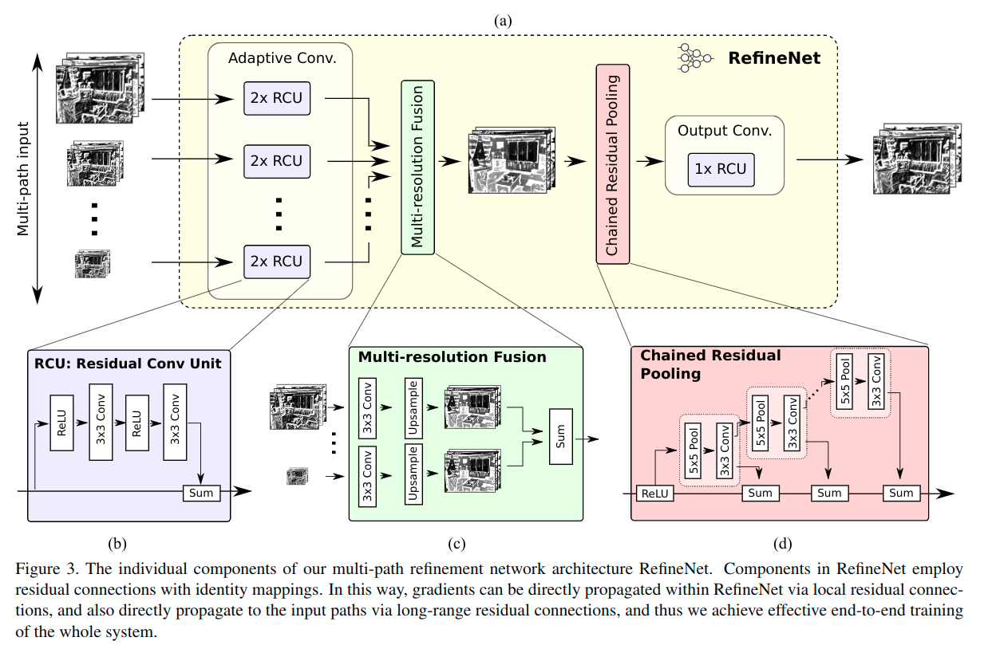
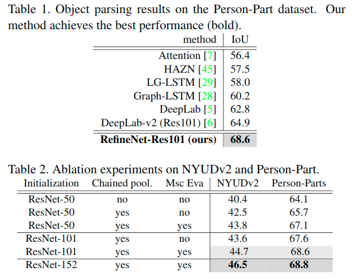
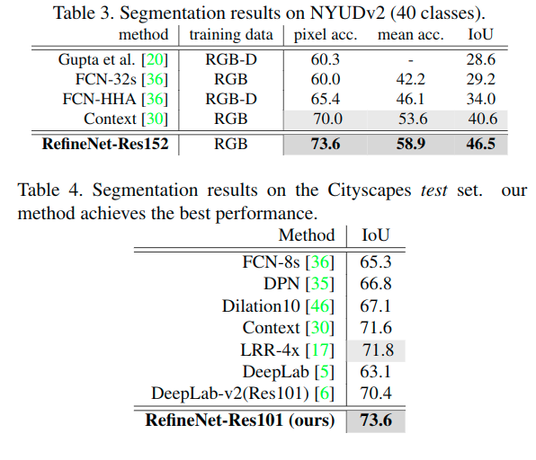
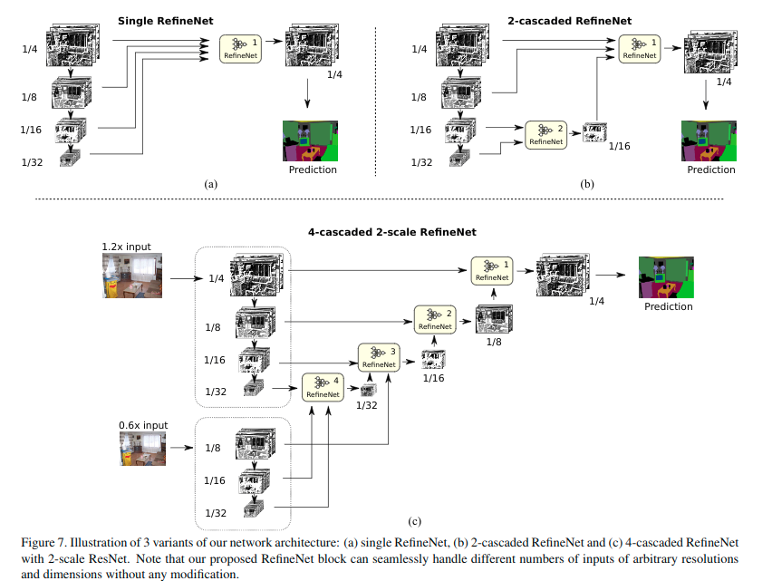

# RefineNet: Multi-Path Refinement Networks for High-Resolution Semantic Segmentation(2016)

## 概要

最近, 很深的卷积神经网络(CNN)在目标识别中有着出色的表现, 也成为了密集分类问题的首选, 例如语义分割等问题。然而, 在CNN中重复的下采样操作, 像池化或卷积, 导致显著降低了初始图像的分辨率。这里, 论文提出的RefineNet, 一个通用的多路径优化网络, 明确地沿着下采样流程, 利用所有可用的信息, 使高分辨率预测使用远距离残余链接。这样, 捕获高级语义特征的更深的层, 可以直接提炼使用来自早期卷积的细粒度特征。RefineNet的单个组件使用残余链接, 接在恒等映射之后, 它允许有效的端到端训练。进一步, 论文引入了链式残差池化(chained residual pooling), 来以一种有效方式捕捉丰富背景内容。

## 引言

语义分割是图像理解的一个重要组成部分, 这个任务是对图像的每个像素进行标签标定, 可以认为是一种密集分类问题. 所谓的对象解析的相关问题通常可以看作是语义分割。最近深度学习方法, 尤其是CNN,例如VGG, ResNet, 已经在识别任务显示出了卓越(remarkable)的表现, 然而，当涉及密集深度或正常估计[13,33,34]和语义分割[36,5]等任务中的密集预测时，这些方法表现出明显的局限性。空间池化和卷积步长的多个阶段通常在每个维度中将最终图像预测减少32倍，从而损失了大量更精细的图像结构。

解决此限制的几种方法:

* 一种方法是将反卷积滤波器学习为上采样操作[Learning deconvolution network for semantic segmentation, FCN]以生成高分辨率特征映射。反卷积操作**不能恢复在卷积前向阶段中的下采样操作之后丢失的低级视觉特征**。因此，它们无法输出准确的高分辨率预测。低级视觉信息对于准确预测边界或细节至关重要。最近提出的DeepLab方法采用了带洞（或扩张）卷积来实现较大的感受野而不缩小图像。DeepLab被广泛应用，代表了语义分割方面的最先进性能。这一战略虽然成功，但至少有两个局限:
    * 首先，它需要在大量详细（高分辨率）特征图上执行卷积，这些特征图通常具有高维特征，这些特征是计算上昂贵的。
    * 此外，大量高维和高分辨率的特征映射还需要巨大的GPU内存资源，尤其是在训练阶段。这妨碍了高分辨率预测的计算，并且通常将输出大小限制为1/8原始输入。
    * 其次，扩张的卷积引入了特征的粗略子采样，这可能导致重要细节的丢失。

* 另一种方法利用中间层的特征来生成高分辨率预测. FCN方法和[Hypercolumns for object segmentation and fine-grained localization]中的超列(Hypercolumns)。这些作品背后的直觉是，**中间层的特征有望描述目标部分的中级表示，同时保留空间信息**。这些信息虽然与早期卷积层的特征互补(后者对边缘，角落，圆等低级空间视觉信息进行编码)，并且还与来自编码高级语义信息的较深层的高级特征互补，包括对象或类别级证据，但缺乏强大的空间信息。

作者认为所有级别的特征都有助于语义分割。高级语义特征有助于图像区域的类别识别，而低级视觉特征有助于为高分辨率预测生成清晰, 详细的边界。**如何有效地利用中间层特征, 仍然是一个悬而未决的问题，值得更多关注**。为此，论文提出了一种新颖的网络架构，该架构**有效地利用多级特征来生成高分辨率预测**。

论文的主要贡献如下：

1. 提出了一种**多路径细化网络（RefineNet）**，它利用多级抽象的特征进行高分辨率语义分割。RefineNet以递归方式细化*具有细粒度低级特征*的低分辨率（粗略）语义特征，以生成高分辨率语义特征映射。模型非常灵活，可以通过各种方式进行级联和修改。
2. 级联RefineNets可以进行**端到端的有效训练**，这对于最佳预测性能至关重要。更具体地说，RefineNet中的所有组件都采用带有恒等映射的残余链接，这样梯度可以通过短程和长程残余连接直接传播，从而实现有效和高效的端到端训练。
3. 提出了一种新的网络组件，称之为**“链式残差池(chained residual pooling)”**，它能够从大图像区域捕获背景上下文。它通过有效地汇集具有多个窗口大小的特征, 并将它们与残余链接和可学习的权重融合在一起来实现。
4. 提出的RefineNet在7个公共数据集上实现了最新的最先进性能，包括PASCAL VOC 2012，PASCAL-Context，NYUDv2，SUN-RGBD，Cityscapes，ADE20K以及目标解析Person-Parts数据集。特别是，我们在PASCAL VOC 2012数据集上实现了IoU得分83.4，大大超过目前最佳方法DeepLab。

> https://github.com/guosheng/refinenet

## 相关工作

CNN成为近年来最成功的语义分割方法。[18,23]中的早期方法是基于区域提案的方法，其对区域提案进行分类以生成分割结果。最近基于全卷积网络（FCNN）的方法[36, 5, 10]显示了**有效的特征生成和端到端训练**，因此成为语义分割的最流行的选择。FCNN也被广泛应用于其他密集预测任务，例如深度估计[15,13,33]，图像恢复[14]，图像超分辨率[12]。这里提出的方法也基于全卷积网络。

基于FCNN的方法通常具有低分辨率预测的限制。有许多提出的技术可以解决这一限制，旨在产生高分辨率的预测。

* 基于**atrous convolution**的方法[5]中的DeepLab-CRF直接输出中分辨率分数图，然后应用密集CRF方法[27]通过利用颜色对比度信息来细化边界。

* CRF-RNN [Conditional random fields as recurrent neural networks]通过实施用于**密集CRF**和FCNN的端到端学习的循环层来扩展该方法。
* **反卷积方法**[38,2]学习反卷积层以对低分辨率预测进行上采样。
* **深度估计方法**[Learning depth from single monocular images using deep convolutional neural fields]采用超像素池化来输出高分辨率预测。

有几种现有方法, 利用中间层特征进行分割。

* [36]中的FCN方法将预测层添加到中间层以生成多个分辨率的预测分数。他们平均多分辨率分数以生成最终预测掩膜。他们的系统以阶段式方式而不是端到端式进行训练。
* Hypercolumn [22]方法合并了中间层的特征，并学习了密集的分类层。他们的方法采用阶段式而不是端到端训练。
* 方法SegNet [2]和U-Net [40]在反卷积体系结构中应用跳跃连接以利用中间层的特征。

虽然现有一些工作，但如何有效地利用中间层功能仍然是一个悬而未决的问题。论文提出了一种新颖的网络架构RefineNet来解决这个问题。RefineNet的网络架构明显不同于现有方法。RefineNet由许多专门设计的组件组成，这些组件能够通过**利用低级视觉功能来优化粗略的高级语义特征**。特别是，RefineNet采用带有恒等映射的短距离和长距离残余链接，可以对整个系统进行有效的端到端培训，从而有助于实现良好的性能。综合实证结果清楚地验证了这个新型网络架构对于利用中间层特征的有效性。

## 背景

在介绍之前，首先回顾语义分割中全卷积网络的结构，并详细讨论最近的扩张卷积技术，该技术专门用于生成高分辨率预测。

非常深的CNN在目标识别问题上表现出色。具体而言，最近提出的ResNet显示了相对于早期架构的步骤改进，并且预先训练于ImageNet识别任务的ResNet模型是公开可用的。因此，在下文采用ResNet作为语义分割的基本构建块。但请注意，将其替换为任何其他深层网络非常简单。

由于语义分割可以作为密集分类问题进行转换，因此可以轻松地为此任务修改ResNet模型。这是通过**用密集预测层替换单个标签预测层**来实现的，该密集预测层输出每个像素的每个类的分类置信度。该方法如图2a所示。可以看出，在ResNet中的前向传播期间，特征图（层输出）的分辨率降低，而特征深度，每层的特征图的数量（或通道）增加。前者是由卷积和池化操作期间的跨越引起的。

根据输出特征图的分辨率，ResNet层可以自然地分成4个块，如图2a所示。

通常，步幅设置为2，从而在从一个块传递到下一个块时将特征图分辨率降低到一半。这种连续的子采样有两个作用：

1. 首先它增加了更深层次的卷积感受区域，使滤波器能够捕获更高的全局和上下文信息，这对于高质量分类至关重要;
2. 第二，有必要保持训练的有效性和易处理性，因为每层包括大量的滤波器，因此产生具有相应通道数量的输出，因此在*通道的数量和特征图分辨率*之间存在折衷。

通常，最终特征图输出在每个空间维度上最终比原始图像小32倍（但是具有1000个通道）。这种低分辨率的特征图丢失了早期低级滤波器捕获的重要视觉细节，从而产生了相当粗糙的分割图。该问题是基于CNN的深度分割方法的众所周知的限制。

避免在保留大感受野的同时降低分辨率的另一种方法是使用扩张（带洞）卷积。[6]中介绍的这种方法在语义分割方面具有最先进的性能。移除子采样操作（步幅从2变为1），并且在第一个块之后的所有卷积层使用扩张卷积。这种扩张卷积（实际上是子采样卷积核）具有**增加滤波器的感受野大小而不增加必须学习的权重数量**的效果（参见图2b中的图示）。即便如此，存储的成本也很高，因为与图像子采样方法不同，必须以更高的分辨率保留大量的特征图。例如，如果将所有层中的所有通道保持为原始图像分辨率的至少1/4，并且将典型数量的滤波器通道视为1024，那么可以看到甚至高端GPU的存储容量被很深的网络迅速淹没。因此，在实践中，*当使用深网络时，扩张卷积方法通常具有不超过原始尺寸的1/8而不是1/4的分辨率预测*。

与扩张卷积方法相比，在本文中，提出了一种既能享受*存储*和*非解析的计算优势*的方法，又能够产生*有效和高效的高分辨率分割预测*。

## 提出的方法

提出了一个新的框架，它提供了多条路径，通过这些路径可以使用通用构建模块RefineNet来同化来自不同分辨率和通过潜在的远程连接的信息。图2c显示了构建块的一种可能的布置，以实现高分辨率语义分割的目标。

### Multi-Path Refinement

如前所述，目标是**利用多级特征进行长距离残余链接的高分辨率预测**。RefineNet提供了一种通用方法，可以**将粗略的高级语义特征与更细粒度的低级特征融合，从而生成高分辨率的语义特征映射**。设计的一个重要方面是确保梯度可以毫不费力地通过网络向后传播到远程残余链接上的早期低级层，确保整个网络可以端到端地进行训练。

对于论文的标准多路径架构，根据特征映射的分辨率将预先训练的ResNet（使用ImageNet训练）划分为4个块，并采用带有4个RefineNet单元的4个级联架构，每个单元直接连接到一个ResNet块的输出以及级联中的前一个RefineNet块。但请注意，这种设计并不是唯一的。事实上，灵活的架构允许简单探索不同的变体。例如，RefineNet块可以接受来自多个ResNet块的输入。

将在后面的分析2级联版本，单块方法以及2级7路径架构。

RefineNet-m表示作为连接到ResNet的block-m输出的RefineNet块。实际上，每个ResNet输出都通过一个卷积层来调整维度。**尽管所有RefineNets都具有相同的内部架构，但它们的参数并不相关**，因此可以更灵活地适应各个级别的细节。

按照图2c自下而上的图示:

1. 从ResNet的最后一个块开始，并将ResNet的block-4的输出连接到RefineNet-4。这里，RefineNet-4只有一个输入，并且**RefineNet-4则作为额外的一组卷积，使预先训练的ResNet权重适应手头的任务**，在这里的例子是语义分割。
2. 在下一阶段，RefineNet-4和ResNet的block-3的输出作为双路输入馈入RefineNet-3。RefineNet-3的目标是使用ResNet block-3的高分辨率特征, 来优化前一阶段RefineNet-4的低分辨率特征图输出。
3. 同样，RefineNet-2和RefineNet-1通过融合后一层的高级信息和早期的高分辨率但低级别的特征，重复这种阶段性的改进。
4. 作为最后一步，最终的高分辨率特征图被馈送到密集的softmax层，以便以密集得分图的形式进行最终预测。然后使用双线性插值对该得分图进行上采样以匹配原始图像。

整个网络可以有效地进行端到端的训练。值得注意的是，在ResNet和RefineNet模块中的块之间引入了远程残余链接。在前向传递期间，这些远程残余链接传达了编码视觉细节的低级特征，用于细化粗略的高级特征映射。在训练步骤中，远程残余链接允许直接将梯度传播到早期卷积层，这有助于有效的端到端训练。

### RefineNet

一个RefineNet块的体系结构如图3a所示。

> 注意, 这类描述的是一个RefineNet块, 不是整个残差网络所有块的输出作为输入, 而是针对单独RefineNet块的输入, 可能是一个输入, 也可能是多个输入.

在图2c所示的多路径概述中，RefineNet-1有一个输入路径，而所有其他RefineNet块有两个输入。但请注意，这个架构是通用的，每个Refine块都可以轻松修改，以接受任意数量的具有任意分辨率和深度的特征映射。

#### Residual convolution unit(RCU)

每个RefineNet块的第一部分都包含一个自适应卷积集，主要**对任务中的预训练ResNet权重进行微调**。为此，每个输入路径顺序通过两个RCU，这是原始ResNet中卷积单元的简化版本，其中批量标准化层被移除（图3b）。

对于RefineNet-4，每个输入路径的滤波器数量设置为512，对于实验中的其余输入路径，滤波器数量设置为256。

#### Multi-resolution fusion

通过多分辨率融合块, 将所有路径输入融合到高分辨率特征图中，如图3c所示。

* 该块首先应用于对输入自适应的卷积，其生成相同**特征维度**的特征图（输入中的最小的一个）
* 然后将所有（较小的）特征图上**采样到(可能有的多个中的)输入的最大分辨率**
* 最后，所有要素图都通过**求和融合**

该块中的**输入自适应还有助于沿不同路径适当地重新缩放特征值**，这对于随后的求和融合是重要的。如果只有一个输入路径（例如，图2c中的RefineNet-4的情况），输入路径将直接通过该块而不进行改变。

#### Chained residual pooling

然后输出特征图经过链式残差池化，如图3d所示。

所提出的链式残差池化**旨在从大图像区域捕获背景上下文。它能够有效地汇集多个窗口大小的特征，并使用可学习的权重将它们融合在一起**。

特别地，该组件被构建为多个池化块的链，每个池化块由一个最大池化层和一个卷积层组成。一个池化块将前一个池化块的输出作为输入。因此，当前池化块能够重新使用先前池化操作的结果，从而在不使用大的池化窗口的情况下从大区域访问特征。如果没有进一步说明，在实验中使用两个池化块，每个池化块都是步幅为1。

通过残余连接的加和，将所有池化块的输出特征图与输入特征图融合在一起。请注意，选择使用残余连接也会持续存在于此构建块中，这再次促进了训练期间的梯度传播。在一个汇集块中，每个汇集操作之后是卷积，其**用作求和融合的加权层**。预计该卷积层将学习在训练过程中适应池化块的重要性。

#### Output convolutions

每个RefineNet块的最后一步是另一个RCU。

这导致**每个block之间有一个三个RCU的序列**。为了在最后的RefineNet-1块中反映这种行为，在最终的*softmax预测步骤之前放置了两个额外的RCU*(softmax部分也认为算是一个block)。

这里的目标是**对多路径融合特征映射采用非线性运算，以生成用于进一步处理或最终预测的特征**。经过此块后，特征维度保持不变。

### Identity Mappings in RefineNet

请注意，RefineNet的所有卷积组件都是根据残余连接背后的思想精心构建的，并遵循恒等映射规则。这使得能够通过RefineNet有效地向后传播梯度，并促进级联多路径细化网络的端到端学习。

使用具有恒等映射的残余连接允许梯度直接从一个块传播到任何其他块. **此概念鼓励为快捷连接维护一个干净的信息路径，以便这些连接不会被任何非线性层或组件“阻止”。相反，非线性操作被放置在主信息路径的分支上**。这里遵循此指南来开发RefineNet中的各个组件，包括所有卷积单元。正是这种特殊的策略允许多级级联的RefineNet得到有效的训练。注意，在链式残差池中包括一个ReLU。文章观察到**这个ReLU对于后续池化操作的有效性很重要，并且它还使得模型对学习率的变化不太敏感**。文章观察到每个RefineNet块中的一个ReLU没有显着降低梯度流的有效性。

在RefineNet中同时具有短程和远程残余连接。

> 短程残余连接是指一个RCU或残余池组件中的局部快捷连接;
>
> 远程残余连接是指RefineNet模块与ResNet块之间的连接。

通过远程残余连接，梯度可以直接传播到ResNet中的早期卷积层，从而实现所有网络组件的端到端训练。

融合块融合了多个快捷路径的信息，**可以将其视为执行具有必要维度或分辨率自适应的多个残余连接的求和融合**。在这方面，这里多分辨率融合块的作用类似于ResNet中传统残余卷积单元中“求和”融合的作用。RefineNet中存在某些层，特别是在融合块内，执行线性特征变换操作，如*线性特征维度减小或双线性上采样*。这些图层放在快捷路径上, 这与ResNet中的情况类似。

与在ResNet中一样，当快捷连接跨越两个块时，它将在快捷路径中包含用于线性特征维度自适应的卷积层，这*确保特征维度与下一个块中的后续求和相匹配*。由于在这些层中仅采用线性变换，因此梯度仍然可以有效地传播通过这些层。

## 实验

正如文献中常见的那样，文章在训练期间应用简单的数据增强。

* 执行随机缩放（范围从0.7至1.3）
* 随机裁剪和水平翻转图像

如果没有进一步说明，文章测试时使用多尺度评估，这是分割方法中的常见做法[10, DeepLabv2]。

> 多尺度评估: 对不同尺度的同一图像的**预测进行平均以进行最终预测**。

文章还提供了一个消融实验，以检查各种组件的影响，以及模型的另一个2级联版本。系统建立在MatConvNet[MatConvNet – convolutional neural networks for matlab]上。

PASCAL VOC 2012的测试中, 使用在[27]中使用密集CRF方法对该数据集进行进一步细化，这在验证集上给出了边际改进0.1％。由于密集CRF仅对这里的高分辨率预测只是带来非常小的改进，因此不会将其应用于其他数据集。

## 改进版本

## 结论

介绍了RefineNet，这是一种用于语义分割和对象解析的新型多路径细化网络。级联架构能够有效地组合高级语义和低级功能，以生成高分辨率分段映射。设计选择受到恒等映射概念的启发，该概念有助于跨远程连接的梯度传播，从而实现有效的端到端学习。

在七个公共基准测试中表现优于所有先前的工作，为语义标签的最新技术设定了新标记。