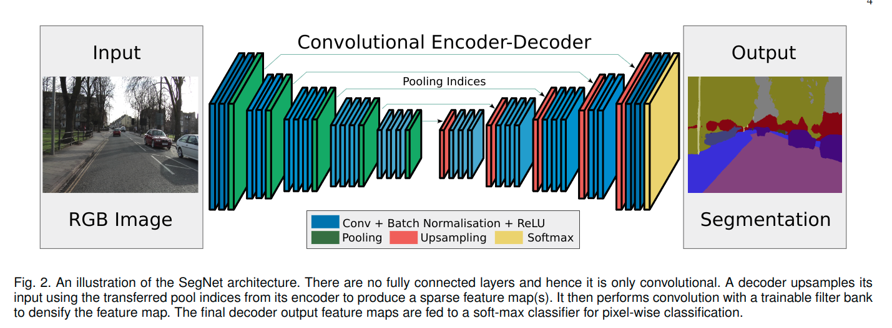
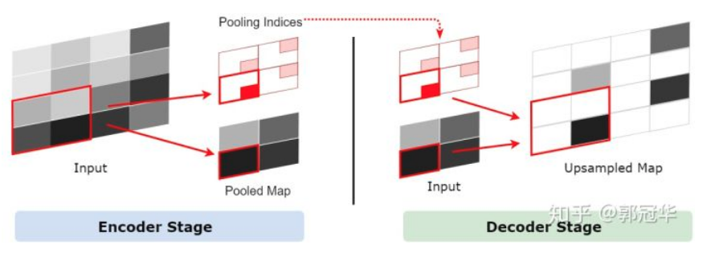

# SegNet: A Deep Convolutional Encoder-Decoder Architecture for Image Segmentation(2015)

## 结构

例如对于2x2的最大池化, 可以通过使用额外的2bits, 来存储对应的索引. 以这样的方式, 实现存储编码器对应的最大池化时使用的索引位置, 在解码的时候, 使用对应的索引进行恢复, 变成稀疏的特征图, 进而再通过进一步的可训练的卷积操作, 转化为对应的密集特征图. 最后的解码器部分, 对应于第一阶段的编码器, 它会产生一个多通道的特征图, 尽管对应的编码器输入是3通道, 这个解码器不同于之前的其他的解码器, 要产生与对应的编码器的输入有着相同大小形状的输出特征图. 最后的高维特征表示送到可训练的softmax分类器中, 进而对于每个像素进行独立的分类, 最终输出K通道的预测(K=num_classes), 最后进过选择最大概率确定对应与每个像素的类别预测结果.

重复使用max-pooling indices In decoding process 的好处：

1. 提高了边界刻画能力；
2. 减少端到端的训练参数；
3. 其他任何的encoder-decoder 结构都可以使用这种上采样形式（只需做小小的修改）.

这篇论文其中一个主要贡献是对SegNet和FCN的解码手法进行了分析. 如下图所示：

从上图可以看到，FCN存储了encoder feature map（memory占用大大提升，缺乏效率），然后与上采样结果相加得到decoder的输出；而对于SegNet，只需要存储max-pooling indices（需要的memory较少）. FCN进行上采样的方式是Deconvolution（可以是固定的双线性插值，也可以是能学习的核进行反卷积）.

## 训练

### 数据集

作者使用两个数据集来训练和测试SegNet：CamVid road scene segmentation（对自动驾驶有实际意义）和SUN RGB-D indoor scene segmentation（对AR有实际意义） .

我们使用CamVid道路场景数据集来对解码器变体的性能进行基准测试. 该数据集很小，包括367个训练和233个测试RGB图像（白天和黄昏场景）360×480解析度. 挑战是分割11类, 例如道路，建筑物，汽车，行人，标志，电线杆，人行道等等. 我们对RGB输入执行局部对比度归一化[54].

### 初始化

使用He等人描述的技术初始化编码器和解码器权重. [55]. 为了训练所有变量，我们使用随机梯度下降（SGD），固定学习率为0.1，动量为0.9 [17]，使用我们的Caffe实现SegNet-Basic [56]. 我们训练变种直到训练损失收敛. 在每个周期之前，对训练集进行混洗，然后挑选每个小批量（12个图像），从而确保每个图像在周期中仅使用一次.

我们选择在验证数据集上执行最高的模型.

### 损失

使用交叉熵损失作为目标函数. 我们使用交叉熵损失[2]作为训练网络的目标函数. 将小批量中的所有像素的损失求和. 当训练集中每个类别的像素数量存在较大变化时（例如，道路，天空和建筑物像素在CamVid数据集中占主导地位），则需要根据真实类别对损失进行不同的加权. 这被称为类别平衡.

> 我们使用中值频率平衡[13]，其中分配给损失函数中的类的权重是在整个训练集上计算的类频率的中值除以类频率的比率.

这意味着训练集中较大的类的权重小于1并且最小类的权重最高. 我们还尝试了不使用类平衡或等效使用固有频率平衡(*natural frequency balancing*)来训练不同的变体.

### 指标

为了比较不同解码器变体的定量性能，我们使用三种常用的性能测量：

* 全局准确度（G）测量在数据集中正确分类的像素百分比

* 类平均准确度（C）是预测准确度的平均值

* 所有类别的平均交并比mIoU

    > 被使用在PASCAL VOC挑战赛中, mIoU度量是比类平均准确度更严格的度量，因为它惩罚误报预测. 然而，mIoU度量没有直接通过类平衡交叉熵损失进行优化.
    >
    > mIoU度量（也称为Jacard Index）最常用于基准测试. 但是，Csurka等人[57]注意到该指标并不总是符合优质细分的人类定性判断（排名）. 他们用实例表明mIoU有利于区域平滑并且不评估边界精度，最近FCN的作者也提到了这一点[58]. 因此，他们建议用**基于通常用于评估无监督图像分割质量的伯克利轮廓匹配分数的边界测量补充mIoU度量**[59]. Csurka等[57]简单地将其扩展到语义分割，并表明与mIoU度量结合使用的语义轮廓精度的度量更符合人类对分割输出的排序.

* 计算语义轮廓得分的关键思想是评估F1测量[59]，其涉及在给定像素容差距离的情况下计算预测和地面真值类边界之间的精度和召回值.

    > 我们用图像对角线的0.75％的一个值作为公差距离. 对存在于真实标注测试图像中的每个类别的F1测量进行平均以产生图像F1测量. 然后我们计算整个测试集平均值，用图像F1测量的平均值表示边界F1-测量值（BF）.

## 测试

我们在CamVid验证集上进行1000次优化迭代直到训练损失收敛停止后, 测试每个架构变体.

批量大小为12，这对应于通过训练集测试大约每33个时期. 我们选择迭代其中全局准确度在验证集的评估中最高的模型. 我们在保持的CamVid测试集上报告此时的所有三项性能指标. 虽然我们在训练变体时使用类平衡，但实现高全局精度以实现整体平滑分割仍然很重要. 另一个原因是分割对自动驾驶的贡献主要是为了描绘诸如道路，建筑物，人行道，天空等类别. 这些类主导图像中的大多数像素，高全局精度对应于这些重要类的良好分割.

我们还观察到，当类平均值最高时报告数值性能通常可以对应于指示感知噪声分割输出的低全局准确度.

作者最后总结了几个点.

1. 当encoder feature maps被完整存储用于和decoder上采样结果相加时，表现得最好（从BF这个指标可以明显反映出来）；

2. 当内存受限时，无法存储完整的encoder feature maps，可以存储encoder feature maps的压缩形式（进行降维）或者max-pooling indices ，这样也能得到较好的表现；
3. 当encoder network固定时，decoder network越大，表现越好.

## 想法

用于语义分割的网络通常是将用于分类的网络进行全卷积化而来的. 这带来了**空间分辨率的下降（网络存在降采样）的问题**，产生较为粗糙的分割结果；而后需要**将低分辨率的结果上采样到原图大小**. 这个还原的过程即解码过程.

现今大部分的用于分割的网络都有相同或相似的encoder network，之所以会产生不同精度的分割结果，**关键在于decoder network的不同**（当然训练和预测所采用的方法也起着一定作用）.

因此，作者分析一些网络的解码过程，提出了SegNet这种网络结构.

1. 对网络中使用的卷积层改为残差块或者Inception块, 进一步加速信息流动加速特征的融合, 增加通道, 压缩信息.
2. 如果可以在保持形状的同时压缩信息, 那么是否可以直接取消后面的解码器部分.
3. 对编码解码器的对应层进行融合, 是否效果会好些.

## 参考

《SegNet: A Deep Convolutional Encoder-Decoder Architecture for Image Segmentation》论文笔记https://zhuanlan.zhihu.com/p/26485877
