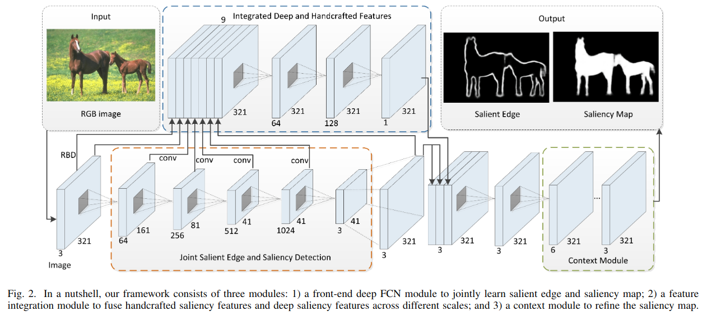
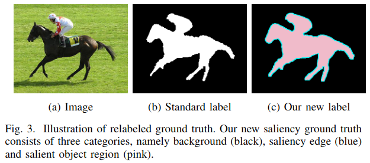
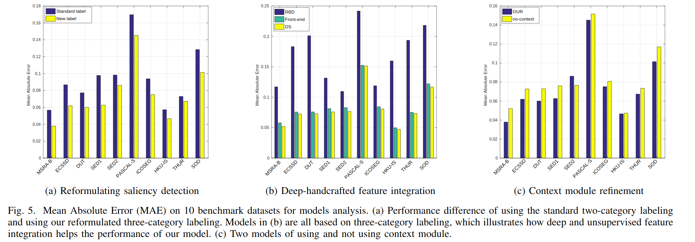
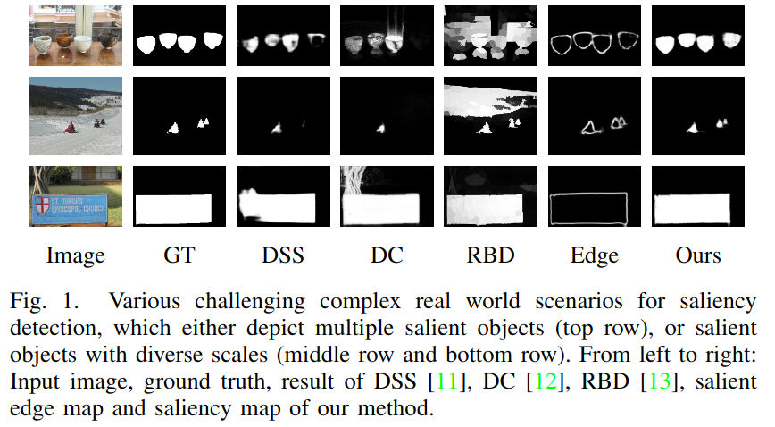
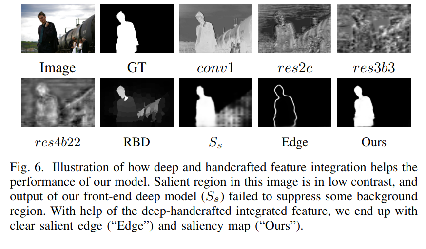
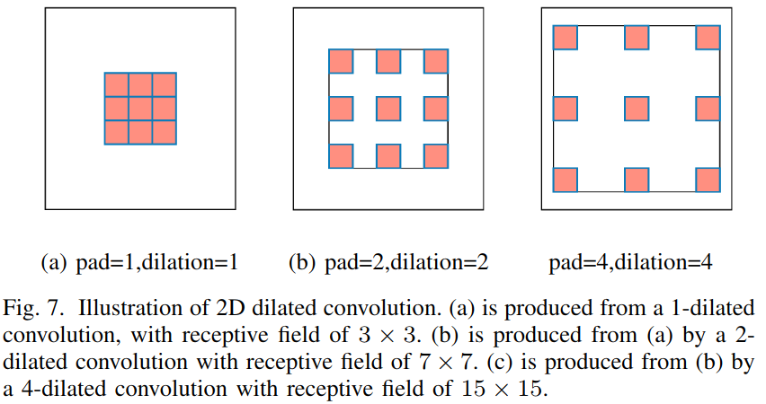
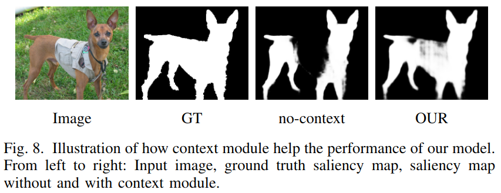

# Deep Edge-Aware Saliency Detection

> 论文: <https://arxiv.org/abs/1708.04366>

* [Deep Edge-Aware Saliency Detection](#deep-edge-aware-saliency-detection)
  * [摘要](#摘要)
  * [前言](#前言)
    * [Low-resolution output maps](#low-resolution-output-maps)
    * [Missing handcrafted yet pivotal features:](#missing-handcrafted-yet-pivotal-features)
    * [Archaic handling of multi-scale saliency:](#archaic-handling-of-multi-scale-saliency)
    * [提出的方法](#提出的方法)
  * [Joint Salient Edge and Saliency Detection](#joint-salient-edge-and-saliency-detection)
    * [Reformulating Saliency Detection](#reformulating-saliency-detection)
    * [Balanced Loss Function](#balanced-loss-function)
    * [FCN for Edge-Aware Saliency](#fcn-for-edge-aware-saliency)
    * [Effects of Reformulating Saliency Detection](#effects-of-reformulating-saliency-detection)
  * [Integrating Deep and Handcrafted Features](#integrating-deep-and-handcrafted-features)
    * [Handcrafted Saliency Features](#handcrafted-saliency-features)
    * [Deep Multi-scale Saliency Feature Extraction](#deep-multi-scale-saliency-feature-extraction)
    * [Deep-Shallow Model](#deep-shallow-model)
    * [Context Module for Saliency Refinement](#context-module-for-saliency-refinement)
  * [Experimental Results](#experimental-results)
    * [Evaluation metrics](#evaluation-metrics)
    * [消融实验](#消融实验)
      * [数据集的不同](#数据集的不同)
      * [Salient objects with diverse scales](#salient-objects-with-diverse-scales)
      * [Different numbers of salient objects](#different-numbers-of-salient-objects)
    * [执行时间](#执行时间)
  * [Conclusions](#conclusions)

## 摘要

由于深度学习架构，视觉显着性已经取得了长足的进步，然而，仍存在三个主要挑战，这些挑战阻碍了具有复杂构图，多个显着对象和不同尺度的显着对象的场景的检测性能。特别是，现有方法的输出图仍然保持较低的空间分辨率，由于步幅和汇集操作导致边缘模糊，网络经常忽略描述性统计和有可能补充显着性检测结果手工制作的先验，并且不同层次的深层特征主要保持不变, 等待被有效融合来处理多尺度显着对象。

在本文中，我们通过一个新的完全卷积神经网络来解决这些问题，该网络以端到端的方式共同学习显着边缘和显着性标签。我们的框架首先采用卷积层，将检测任务重新构造为密集标签问题，然后将手工显着特征以分层方式集成到深层网络的较低和较高层次，以利用可用信息进行多尺度响应，最终细化显着性通过强加上下文的扩张卷积。通过这种方式，有效地结合了显著性边缘先验，并且在保持低存储要求的同时显着提高了输出分辨率，从而导致更干净和更清晰的对象边界。

对十个基准测试的广泛实验分析表明，与最新的最新方法相比，我们的框架可以实现始终如一的卓越性能并获得复杂场景的稳健性。

## 前言

尽管由于深度学习架构而取得了深刻的进展，但仍然存在三个主要挑战，这些挑战阻碍了复杂现实场景下深度显着性方法的表现，特别是对于描绘多个显着对象和具有不同尺度的显着对象的场景：

### Low-resolution output maps

由于CNN架构中的步幅操作和汇集层，所得到的显着图的空间分辨率非常低，导致边缘模糊. 显着图的分辨率对于图像编辑和图像分割等几个视觉任务至关重要.

### Missing handcrafted yet pivotal features:

深度学习网络忽视了手工制作显着性方法中广泛使用的统计先验。这些特征通常基于人类直觉并适用于广泛的案例。其中手工制作的显着性方法优于深度显着性方法。这揭示了人类知识驱动和数据驱动方案的互补关系，并激励我们寻求更好的融合方法。

### Archaic handling of multi-scale saliency:

现有基于深度学习的显着性方法的实现不能有效地利用不同级别的特征。底层特征（有关细节的信息）通常被低估，顶级特征（语义线索）被高估。当显着对象非常小时，深度学习方法无法捕获整个显着区域的示例。

### 提出的方法

为了解决上述挑战，我们提出了一种完全卷积神经网络（FCN）和一种用于边缘感知显着性检测的端到端学习框架。

我们的模型包括三个模块：

1. 联合显着边缘和显着性检测模块
2. 多尺度深度特征和手工特征集成模块
3. 上下文模块。

首先，我们利用显着边缘来指导显着性检测，通过将显着性检测重新设计为三类密集标记问题（背景，显着边缘和显着对象），与现有的显着性检测方法形成对比。我们的显着图**突出显着边缘内的显着物体**。通过从我们的模型获得的显着边缘，与现有的深度显着方法相比，我们*恢复了更尖锐的显着物体边缘*。此外，由于我们的边缘提取具有尺度感知功能，因此我们的边缘感知显着性模型可以更好地处理具有小显着对象的场景。

其次，受CASENet的启发，我们在深层网络的较低阶段进行特征提取而不是特征分类，以抑制非显着背景区域并突出显着边缘。我们集成了多尺度深度特征和手工制作的特征，以获得更具代表性的显着特征。因此，我们**以多模态的方式利用手工和深度显着方法的互补性**，并实现多尺度显着性检测。

最后，我们使用具有扩张卷积的上下文模块来探索显着性的全局和局部上下文，从而产生具有更清晰边缘的更准确的显着性映射。

我们通过对现有手工显着性（特别是强大的背景检测）和标准化RGB彩色图像作为输入的响应来训练我们的深边缘感知显着性模型，并直接学习输入和输入之间的端到端映射。相应的显着图和显着边缘。在网络学习中实施了深度监督。

我们的主要贡献可归纳为：

1. 我们**将显着性检测重新定义为三类密集标记问题**，并提出一个统一的框架，以端到端的方式共同学习显着性图和显着边缘。
2. 我们**将深度特征和手工特征集成到深层浅层模型**中，以便在数据驱动的深度显着性和人类知识驱动的显着性中充分利用补充信息。
3. 我们在网络的**早期阶段执行特征提取而不是特征分类**，以抑制非显着像素，并提供具有用于显着性检测的结构信息的高保真边缘定位。
4. 我们**使用多尺度上下文来利用全局和局部上下文信息来生成具有更锐利边缘的图**。
5. 我们对10个基准数据集进行了广泛的性能评估，结果表明，与目前最先进的方法相比，我们的方法具有优越性。

## Joint Salient Edge and Saliency Detection

为了突出显着边缘以及更好地检测不同尺度的显着对象，我们将显着性检测重新设计为三类密集标记任务，并在我们的端到端框架内共同学习显着边缘和显着性图。此外，为了处理标签的不平衡，我们提出了一种新的损失函数。

### Reformulating Saliency Detection

给出真实显着图G，我们使用“Canny”边缘检测器来提取初始边缘图E。作为边缘图E倾向于非常薄（1或2像素宽度），执行膨胀操作。对于每个E中的像素，我们标记它3×3邻近区域作为边缘区域。因此，我们最终得到更厚的边缘区域。

我们通过以下方式生成*边缘引导显着性*的新标签：

1. 将所有像素标记为背景
2. 将凸出的边缘标签分配给加厚的边缘区域
3. 将显着对象标签分配给显着对象区域

通过这种方式，保持了显着对象的完整性以及显着对象边缘的准确性。我们比较了图3中的两类和三类标记策略，其中突出的边缘得到了极大的强调。

### Balanced Loss Function

对于典型图像，背景/显着边缘/显着区域像素的分布严重不平衡; 通常，整个图像的大约90％被标记为背景或显着对象，而小于整个图像的10％被标记为显着边缘。受HED和InstanceCut的启发，我们提出了一种简单而有效的策略，通过在每个像素的基础上引入类平衡权重来自动补偿三个类别之间的损失。

具体来说，我们在方程式中定义了以下类平衡softmax损失函数。：

$$\begin{aligned} \text {Loss} = - \beta _ { b } \sum _ { j \in Y _ { b } } \log P _ { r } \left( y _ { j } = 0 \right) - \beta _ { e } & \sum _ { j \in Y _ { e } } \log P _ { r } \left( y _ { j } = 1 \right) - \beta _ { s } \sum _ { j \in Y _ { s } } \log P _ { r } \left( y _ { j } = 2 \right) \end{aligned}$$

* 这里j索引整个图像的空间维度. $\beta _ { b } = \left( \left| Y _ { e } \right| + \left| Y _ { s } \right| \right) / | Y | , \beta _ { e } = \left( \left| Y _ { b } \right| + \left| Y _ { s } \right| \right) / | Y | , \beta _ { s } = \left( \left| Y _ { b } \right| + \left| Y _ { e } \right| \right) / | Y |$
* 要注意, 这里的b下标表示背景, s下标表示显著性目标(前景), e表示显著性目标边缘. $|Y_e|, |Y_s|, |Y_b|, |Y|$表示对应区域的像素数量.
* $P _ { r } \left( y _ { j } = 0 \right) = e ^ { b _ { j } } / \sum _ { n } e ^ { b _ { n } } \in [ 0,1 ]$使用softmax函数表示像素j被标记为背景的概率, 相应的有:
  * $P _ { r } \left( y _ { j } = 1 \right) = e ^ { b _ { j } } / \sum _ { n } e ^ { b _ { n } } \in [ 0,1 ]$
  * $P _ { r } \left( y _ { j } = 2 \right) = e ^ { b _ { j } } / \sum _ { n } e ^ { b _ { n } } \in [ 0,1 ]$

### FCN for Edge-Aware Saliency

我们的前端显着性检测网络建立在语义分割网络上，即DeepLab，其中最初设计用于图像分类的深度卷积神经网络（ResNet-101）被重新用于语义分割的任务。

* 将所有完全连接的层转换为卷积层
* 通过扩张的卷积层增加特征分辨率

在此框架下，输出特征图的空间分辨率增加了四倍。

与VGG不同，ResNet的层输入明确地学习残差函数，这使得更容易从更大的网络深度更高的精度进行优化。通过移除最终池化和全连接层以使其适应显着性检测，我们重建ResNet-101模型，并在我们的显着性检测网络中**添加四个扩张卷积层，增加感受野**，以更好地利用本地和全局上下文信息。

对于**标准化的RGB图像I**，通过利用重新改进的ResNet-101模型，我们**得到了一个三通道特征图小号$S _ { d e e p } = \left\{ S _ { b } , S _ { e } , S _ { s } \right\}$**

* 第一通道代表背景
* 第二通道代表显着边缘图
* 第三通道代表显着对象图

我们上采样$S_{deep}$到输入图像的分辨率大小，并使用插值特征图计算损耗和精度。注意，这种上采样操作也可以通过*去卷积*来实现，这导致更多的参数和更长的训练时间以及类似的性能。

在本文中，我们使用Caffe中提供的“Interp”层，因为它的效率。

### Effects of Reformulating Saliency Detection

我们比较了来自我们的模型的显着边缘和来自最先进的深边检测方法HED的边缘图。如图所示，我们的显着边缘图提供了丰富的语义信息，突出了显着的对象边缘并抑制了大部分背景边缘。

为了分析我们新的显着性检测公式的重要性，我们训练了一个额外的深度模型，将两类标记作为真值，即“标准标签”和我们使用重新标记的真值的模型被命名为“New Label”。

对于上述两种模型，我们使用相似的模型结构，唯一的区别是输出的通道数（标准标签为真值，“num_output：2”，我们的新标签为真值, “num_output：3”）。

上图显示十个基准数据集的平均绝对误差（MAE），这清楚地表明，通过我们的新标记策略，我们最终在所有十个基准数据集上的表现始终如一，平均MAE降低约2.5％，这清楚地证明了我们重新确定显着性的有效性。

## Integrating Deep and Handcrafted Features

基于深度学习的显着性检测方法通过利用大规模标记的显着性数据集来预测显着性图，这些数据集可能受到训练数据集的偏差。相比之下，手工制作的显着性检测方法建立在统计先验之上，这些统计先验用人类知识进行总结和提取，并且更通用并适用于一般情况。

目前的深度学习网络通常忽略了手工制作显着性方法中广泛使用的统计先验。在这里，我们建议将我们的前端深度模型获取的深度显着性和手工显着性的整合到边缘感知显着性检测中。

我们选择RBD（鲁棒背景检测）作为我们的手工显着性模型，因为它在所有手工显着性检测方法中排名第一。

我们添加一个浅模型（如图所示）来融合深度和手工制作的特征，这些特征采用了**原始的RGB图像I**，手工显着性$S_{RBD}$，从我们的前端模型获得的显着性图$S_{deep}$. 使用较低层网络得到的特征图$S_i, i=1,...,4$作为输入。

我们训练特征集成模型，以提取深度和手工特征之间的补充信息。最后，我们通过在我们的特征融合模型的末尾使用扩张卷积来插入上下文模块，以生成具有更清晰边缘的显着性映射。

### Handcrafted Saliency Features

我们选择RBD作为我们的手工显着性检测模型。RBD是基于统计观察开发的，即**自然图像中的对象和背景区域的空间布局非常不同，并且对象区域与图像边界的连接比背景区域少得多**。

定义背景连接以测量给定区域与图像边界的连接程度：

$$\operatorname { BndCon } ( p ) = \frac { L e n _ { b n d } ( p ) } { \sqrt { A r e a ( p ) } }$$

* $Len_{bnd}(p)$: 图像边界的长度
* $Area(p)$是对应的超像素p的跨度区域

基于这个测度, 背景概率$w^{bg}_i$被如下定义, 当边界连接很大的时候, 接近1, 很小的时候, 接近0:

$$\omega _ { i } ^ { b g } = 1 - \exp \left( - \frac { B n d C o n ^ { 2 } \left( p _ { i } \right) } { 2 \delta _ { b n d C o n } ^ { 2 } } \right)$$

这里使用了一个形如高斯函数函数的指数项.

此外, 加权对比度的背景被引入来计算对于给定区域p的显著性, 被定义为:

$$w C t r ( p ) = \sum _ { i = 1 } ^ { N } d _ { a p p } \left( p , p _ { i } \right) \omega _ { s p a } \left( p , p _ { i } \right) \omega _ { i } ^ { b g }$$

* $d_{app}(p,p_i)$是区域p和pi的在CIE-Lab色彩空间的平均颜色的欧氏距离.
* $w_{spa}(p, p_i)$是区域p和pi中心的空间距离.

> 这里具体可见[Saliency optimization from robust background detection]

RBD具有清晰的几何解释，使得边界连通性对图像外观变化具有鲁棒性并且在不同图像上稳定。此外，RBD中捕获的显着性线索与几何坐标具有很强的相关性，与外观的相关性较弱，这与数据驱动的深度显着性方法有本质的区别。

在图中，我们举例说明了RBD可以捕获显着对象的示例，而最先进的基于深度学习的方法无法定位显着对象。

### Deep Multi-scale Saliency Feature Extraction

已经表明，卷积网络中的较低层捕获丰富的空间信息，而上层编码目标级知识，但对姿势和外观等因素具有不变性。通常，较低层的感受野太有限，要求网络在早期阶段执行密集预测是不合理的。

为此，受CASENet的启发，我们在重新使用的ResNet-101的每个块的最后一层执行特征提取（分别在我们的论文中是conv1，res2c, res3b3 and res4b22）。

特别地, 一个1×1卷积层用于将上述四个侧输出中的每一个映射到单通道特征图, $S _ { i } , i = 1 , \dots , 4$，它代表了我们深层模型的不同尺度的细节信息, 可看上图. 例如，来自我们的前端模型的$S_s$被训练，没有深度手工制作的特征融合。

上图表明底部的侧输出通常是杂乱的，这使得它们不希望在这些阶段推断出密集预测。但是，由于较低级别的输出可以产生更多的细节信息，尤其是边缘，因此忽略它们将是一个巨大的浪费。

在本文中，我们**通过在早期阶段执行特征提取而不是特征分类来在保持细节信息和抑制非显着对象像素之间进行权衡**。那些提取的低级特征可以为我们在顶层的最终结果提供空间信息.

### Deep-Shallow Model

用显着性图$S_{RBD}$开始，输入图像I, 并从我们的前端深层模型输出$S_{deep}=\{S_b, S_e, S_s\}$，以及四个侧输出$S _ { i } , i = 1 , \dots , 4$.

我们训练一个三层浅卷积网络，以更好地探索统计信息和提取深度显着性和手工制作显着性之间的补充信息。

1. 首先，我们在通道维度中连接$I , S _ { s } , S _ { R B D }$ and $S _ { i } , i = 1 , \ldots , 4$, 并将其提供给我们的三层卷积模型，以将连接的特征图映射到单通道特征图$S_{ns}$。
2. 然后，背景图$S_b$，边缘图$S _ { e }$ and $S _ { n s }$被连接起来并送给另一个1×1卷积层, 来用最后的一个损失层形成我们的边缘感知显着图$S _ { D S }$。

虽然基于深度学习的方法优于RBD，但是前期阶段的特征图是不可取的，但十个基准数据集的实验结果表明，所提出的集成手工显着性和底层深度显着性的模型可以获得更好的性能，参见图6的例子。

为了说明深度手工显着性整合如何帮助我们模型的性能，我们在十个数据集上计算MAE, 可见图5.

* "RBD"代表使用手工RBD的性能
* "Front-end"表示通过训练没有深度手工制作的显著性的深度模型的表现
* "DS"代表我们提出的深浅模型的结果

如图5所示，在深度手工显着性整合的帮助下，我们的模型实现了始终如一的低MAE。

利用底部深部特征和RBD统计信息的详细信息，我们的模型可以有效地检测不同尺度的显着物体，我们模型的显着图变得更清晰，视觉效果更好，如图11所示。

### Context Module for Saliency Refinement

使用我们的深浅模型，我们生成一个密集的显着图。为了进一步提高显着性图的边缘清晰度，在深浅网络的末尾添加了一个上下文模块。通过系统地应用扩展卷积进行多尺度上下文聚合，上下文网络可以指数地扩展感知域而不会丢失分辨率或覆盖范围。

在这里，我们使用更大的上下文网络，在更深层中使用更多的特征映射，因为它实现了更好的图像语义分割性能。恒等初始化用于初始化上下文模块，其中设置所有过滤器，每个层简单地将输入直接传递给下一个。使用此初始化方案，上下文模型可帮助生成具有清晰语义的显着性映射。

图显示使用和不使用上下文模块的示例显着性映射。我们可以得出结论，在上下文模块的帮助下，感受野的大小越来越大，有助于产生更连贯的显着性图。

为了说明上下文模块如何提高我们的性能，我们训练有和没有上下文模块的模型，结果报告在图5c中，其中“无上下文”表示不使用上下文模块的模型。如图5c所示，我们在上下文模块的帮助下实现了更好的性能，在十分之九的基准数据集中减少了MAE，除了SED2数据集，其中超过一半的图像在这个数据集中是低对比的, 显着对象几乎分布在整个图像区域，这个属性阻碍了上下文模型的性能.

## Experimental Results

### Evaluation metrics

* mean absolute error (MAE)
* maximum F-measure 表示PR曲线的汇总统计量
* mean F-measure 表示最佳阈值以及检测器可以实现的最佳性
* PR curve

### 消融实验

#### 数据集的不同

为了验证不同的训练数据集如何影响性能，我们训练了两个具有不同训练数据集的额外模型。

* 对于第一个，我们选择MSRA10K作为训练数据集，即“MSRA10K”，其中包含10,000个图像。我们训练这个模型来分析更多的训练图像是否可以带来更好的表现。
* 对于第二个，我们使用HKU-IS数据集来训练我们的第二个模型，即“HKU-IS”，以验证在复杂训练数据集上训练的模型是否能够很好地泛化到其他场景。

从上表中，我们观察到我们用2,500个图像训练的模型优于使用整个MSRA10K数据集训练的模型。对于PASCAL-S和SOD数据集，我们的模型在平均F测量和最大F测量方面实现了2％以上的改进，并且与“MSRA10K”相比，MAE降低了2％以上模型，**证明我们来自MSRA-B的2,500个训练图像的训练数据集足够全面，可用于训练显着性模型**。

此外，与“HKU-IS”相比，我们的模型在相对简单的数据集上获得了更好的结果，并且当数据集变得复杂时，结果更糟，这鼓励我们使用更复杂场景的训练图像来训练模型。

#### Salient objects with diverse scales

根据表I，深度显着性检测方法和手工显着性方法对于相对简单的测试数据集(例如，MSRA-B数据集，其中超过一半的显着区域的图像占用超过20％)产生了较好的性能, 而对于具有多个小显着对象的数据集（例如，DUT数据集，其中超过一半的具有显着区域的图像占用小于10％图像）表现较差，这说明**小的显着物体检测对于基于深度学习的方法仍然具有挑战性**。

为了说明我们在简单场景上训练的方法可以很好地泛化到具有多个小显着对象的数据集，我们将十个测试数据集划分为大显着对象数据集和小显着对象数据集，其中前者包括18,455个图像，后者包括2,353张图片。我们定义的图像包括不到1/25部分显着区域为小显着物体图像。然后我们在这个重新划分的显着性数据集上计算每种方法的平均F-度量，最大F-度量和PR曲线，性能如图10a和b所示，其中“Our（b）”和"Our(s)"分别代表我们在大型和小型显着对象数据集上的表现，“平均F度量（b）”和“平均F度量(s)”代表分别在大小显着性目标数据集上的显著性方法的平均F度量。

我们可以从图10a和b得出两个结论。

1. 首先，**深度显着方法和手工显着性方法在大显着对象数据集上比在小显着对象数据集上更好地工作**。
2. 其次，通过集成底层特征和手工制作的特征，我们的方法始终如一地实现了两个数据集的最佳性能。

性能更好的原因在于两个部分：

1. 模型中的底侧特征具有较小的感受野，适用于小型显着物体
2. 我们的显著性边缘是尺度感知，这有助于检测显著性边缘内的小显著性物体

#### Different numbers of salient objects

我们在MSRA-B数据集上训练我们的模型，其中大多数图像具有单个显着的显着对象。为了说明我们的方法对多个显着对象数据集的泛化能力，我们将HKU-IS数据集分为两部分（我们选择了HKU-IS数据集，因为HKU-IS数据集中的大多数图像包含多个显着对象）：单个显着对象数据集和多个显着对象数据集，其中前者包含605个图像，后者包含3,842个图像。

我们相应地计算了我们方法的PR曲线和两个数据集的竞争方法，性能如图10c和d所示，其中c是单个显着对象数据集的性能，d是多个显着对象数据集的性能。我们可以从图10c和d中得出三个结论。

1. 首先，在这两种情况下，我们的方法始终如一地达到最佳性能，证明了我们模型的有效性。
2. 其次，与单个显着对象数据集相比，对于那些手工显着性方法，它们在多个显着对象数据集上获得了更好的性能，主要原因是**由于多个显着对象数据集中图像的显着区域占用较大**。
3. 第三，对显着区域的占用仍然是实现多尺度显着性检测的更好性能的关键因素。

### 执行时间

通常，以更长的运行时间为代价实现更准确的结果。但是，这不是我们的情况，因为我们在保持高效运行时的同时实现了最先进的性能。我们的方法维持每个图像大约0.25秒的合理运行时间。

## Conclusions

我们将显着性检测重新定义为三类密集标记问题，并引入了边缘感知模型。

我们证明了在我们的公式中，显着边缘作为约束，我们实现了更准确的显着图并保留了显着的边缘。

此外，我们设计了一种基于新型跳过架构的新型深浅全卷积神经网络，以集成深度和手工制作的特征。我们的方法将手工显着性检测和标准化彩色图像的响应作为输入，并直接学习从输入到显着图的映射。

我们在模型中添加了一个多尺度上下文模块，以进一步提高边缘清晰度和空间相干性。

我们使用10个基准数据集（文献中报道的最大评估研究）的实验分析以及与11种最先进方法的比较表明，我们的方法在很大程度上优于所有现有方法。

结果还表明，小型显着物体检测仍然是一项重大挑战。即使我们提高显着性检测的性能，仍然需要在这方面做更多的工作，因为在典型的图片中显着的对象通常很小。我们将这一方向作为未来的工作。
