# Learning to Promote Saliency Detectors

缩写标注:

* SD: Saliency Detection
* ZSL: Zero-Shot Learning

关键内容:

* 没有训练直接将图像映射到标签中的DNN。相反，将DNN拟合为一个嵌入函数，以**将像素和显著/背景区域的属性映射到度量空间**。显着/背景区域的属性被映射为度量空间中的锚点。然后，**在该空间中构造最近邻（NN）分类器，将最近的锚点的标签分配给对应的像素**.
* 保持分辨率的手段:
  1. 移除了最后两个卷积块的池化层, 使用扩张卷积来维持卷积滤波器的感受野
  2. 添加亚像素卷积层到每个VGG特征提取器的卷积块后, 来上采样每个卷积块的特征图到输入图像大小.
* 使用了迭代训练/测试的策略.
  * ~~这里没有提到训练迭代次数如何确定~~, 懵逼了, 这里就是实际的代码中的训练迭代次数
  * 测试的迭代次数是人工给定的

一些想法:

类似于R3Net, 最后的添加的结构都是反复迭代测试后才确定使用多少次, 而且按照相关的测试可以看出来, 一定次数后, 提升的效果就趋于饱和了, 只能说这里的提到的方法对于现有网络的提升具有一定的助益.

对于这里提到的, 这是类似于一种ZSL的方法, 也就是利用现有的SD算法产生的结果("过去的知识"), 添加的新结构, 不断利用过去的知识迭代, 实现对于最终"后处理"后结果的一个促进("来对现有的SD算法进行推广").

一些疑惑:

如何将这个方法应用到现有的架构呢? **如何改造现有架构**?

改造后的结构, 训练的时候也要按照文中那样, 随机翻转真值中的像素标签么?

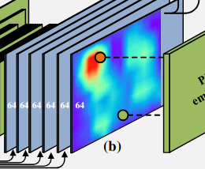

这里的第6层是哪里来的?是前面的5C通道的特征输出汇总来的?

## Abstract

The categories and appearance of salient objects varyfrom image to image, therefore, saliency detection is animage-specific task.  Due to lack of large-scale saliency training data, using deep neural networks (DNNs) with pre-training is difficult to precisely capture the image-specific saliency cues. To solve this issue, we formulate a **zero-shot learning** problem to promote existing saliency detectors.

Concretely, a DNN is trained as an embedding function to map pixels and the attributes of the salient/background regions of an image into the same metric space, in which an image-specific classifier is learned to classify the pixels.

Since the image-specific task is performed by the classifier, the DNN embedding effectively plays the role of a general feature extractor.

Compared with transferring the learning to a new recognition task using limited data, this formulation makes the DNN learn more effectively from small data.

Extensive experiments on five data sets showthat our method significantly improves accuracy of existing methods and compares favorably against state-of-the-art approaches.

显着对象的类别和外观因图像而异，因此，显着性检测是特定于图像的任务。由于缺乏大规模显着性训练数据，使用具有预训练的深度神经网络（DNN）难以精确捕获图像特定显着性线索。为了解决这个问题，我们制定了一个**零次学习**问题来推广现有的显着性检测器。

具体地，DNN被训练为一个嵌入函数，以将像素和图像的显着/背景区域的属性映射到相同的度量空间，其中, 图像特定的分类器被学习来对像素进行分类。

由于图像特定任务由分类器执行，因此DNN嵌入有效地扮演一般特征提取器的角色。

与使用有限数据将学习转移到新的识别任务相比，该设定使DNN从小数据中更有效地学习。

对五个数据集进行的大量实验表明，我们的方法显着提高了现有方法的准确性，并且与最先进的方法相比具有优势。

---

这里提到了一点, 使用 ZSL 问题来推广现有的SD器. 怎么推广?

补充内容 ZSL[零次学习（Zero-Shot Learning）]

> 假设小暗（纯粹因为不想用小明）和爸爸，到了动物园，看到了马，然后爸爸告诉他，这就是马；之后，又看到了老虎，告诉他：“看，这种身上有条纹的动物就是老虎。”；最后，又带他去看了熊猫，对他说：“你看这熊猫是黑白色的。”然后，爸爸给小暗安排了一个任务，让他在动物园里找一种他从没见过的动物，叫斑马，并告诉了小暗有关于斑马的信息：“斑马有着马的轮廓，身上有像老虎一样的条纹，而且它像熊猫一样是黑白色的。”最后，小暗根据爸爸的提示，在动物园里找到了斑马（意料之中的结局。。。）。
>
> 上述例子中包含了一个人类的推理过程，就是**利用过去的知识（马，老虎，熊猫和斑马的描述），在脑海中推理出新对象的具体形态，从而能对新对象进行辨认**。
>
> ZSL就是希望能够模仿人类的这个推理过程，使得计算机具有识别新事物的能力。

结合起来看, 也就是说可以利用过去的知识, 来对现有的SD器进行推广.

> 这个过程是什么样的呢?

## Introduction

传统的显着性检测方法通常是利用低级别的特征和启发式先验，它们不能在复杂的场景中发现显着的对象，也就不能够捕获语义对象。随着DNN的流行, 可以学习来自训练样本的更为高层的语义特征, 因此对于定位语义显著性区域更为有效, 在复杂场景下也会更为有效.

使用DNN就要考虑一个问题, 数据. DNN通常在大量数据的基础上来训练, 而SD的数据是比较有限的, 这个问题通常用在其他任务的大数据集(如分类任务)上预训练的手段来解决, 然而这很容易导致其他问题:

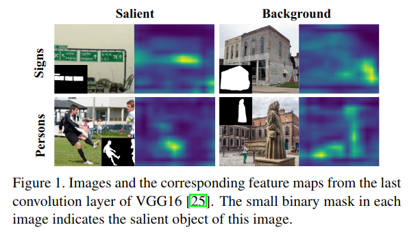

从图上可以看出来, 分类任务训练出来的模型, 最后的特征图中关注的重点对于SD任务而言, 在两列的特征图中不加区分地突出显示符号和人的区域。

> 哪个图"不加区分地突出显示符号和人的区域"?

1. 预训练任务与SD的差异: 由预先训练的特征提取器产生的特征假定用于所有图像。例如，标志和人是图1第一列中的显着对象，而它们属于第二列中的背景。然而，在两列的特征图中不加区分地突出了标志和人的区域。使用这种特征提取器，可以强制预测模型学习将相似特征映射到相反标签，这对于小训练数据集来说是困难的。
2. 显着对象的类别和外观因图像而异，而小的训练数据不足以捕捉多样性. 例如，图1中所示的六个显着对象来自六个不同的类别，并且它们的外观差别很大。因此，可能很难学习统一的检测器来处理各种显着对象。

考虑到显着对象的多样性，我们没有训练直接将图像映射到标签中的深度神经网络（DNN）。相反，我们将DNN训练为一个嵌入函数，以将像素和显著/背景区域的属性映射到度量空间。显着/背景区域的属性被映射为度量空间中的锚点。然后，在该空间中构造最近邻（NN）分类器，将最近的锚点的标签分配给对应的像素。

作为非参数模型，NN分类器可以很好地适应新数据并处理显着对象的多样性。另外，由于分类任务是由NN分类器执行的，因此DNN的目标转向学习从显着/背景区域的属性到嵌入空间中的锚点的一般映射。与直接学习检测不同的显着对象相比，网络更容易学习有限的数据.

> 补充内容: 嵌入(Embedding)
>
> 嵌入意味着将数据转换为特征表示，其中某些属性可以用距离的概念表示。
>
> 例如，针对用于说话者识别的语音信号训练的模型可以允许您将语音片段转换为数字向量，使得来自相同说话者的另一片段与原始向量具有小的距离（例如，欧几里德距离）。或者，不同的嵌入函数可能允许您根据信号中所说的单词转换语音信号。因此，如果在这些片段中使用相同的单词，则在两个语音信号的编码表示之间将获得小的欧几里德距离。另外, 你可能只想学习一种嵌入，它代表语音信号的“情绪”，例如：“快乐”与“悲伤”与“愤怒”等。两个语音信号的编码表示之间的小距离将意味着相似的情绪，反之亦然。
>
> 或者例如，word2vec embeddings, 在一个空间中“映射”一个单词，其中这些单词之间的欧几里德距离代表语义相似性（同样, embedding ~ 为您提供给定单词的数字向量）。因此，如果你使用“德国”的word2vec表示，从中减去“柏林”，并将结果添加到“法国”，你会得到一个矢量, 在欧几里德空间非常接近“巴黎”的嵌入(the embedding for “Paris”)！
>
> 同样，在需要分类成数十万或数百万个类的应用程序中，例如面部识别，一种常见的方法是使用“度量学习”技术（通常是具有所谓的对比或三重丢失的连体CNN(Siamese CNNs with so-called contrastive or triplet loss))，这在测试时允许您在面部的矢量表示上使用最近邻技术！
>
> 另一个介绍:
>
> Embedding在数学上表示一个maping, f: X -> Y， 也就是一个function，其中该函数是injective（就是我们所说的**单射函数**，每个Y只有唯一的X对应，反之亦然）和structure-preserving (**结构保存**，比如在X所属的空间上X1 < X2,那么映射后在Y所属空间上同理 Y1 < Y2)。那么对于word embedding，就是将单词word映射到另外一个空间，其中这个映射具有injective和structure-preserving的特点。


具体地说，我们在图2中显示了我们提出的方法的流程。

在训练期间，DNN具有真实的显着区域和背景区域，其中几个随机选择的像素的标签被翻转，以产生锚点。NN分类器的输出构成了saliency map。DNN可以通过此显着性图和真值之间的损失进行端到端的监督训练。

当在图像上进行测试时，每个图像的显着性图像按照训练的流程来获得，使用的是**现有方法来检测的近似的显著性/背景区域**。尽管近似显着/背景区域不完全正确，但是它通常与真实的显著性/背景区域有着相似的属性。因此，对应的嵌入向量（即锚点）将接近真实的显着/背景区域的向量。

此外，为了产生更好的结果，我们提出了一个迭代测试的方案。NN分类器的结果用于修改锚点，从而产生越来越精确的结果。

> 迭代测试的想法, 如何实现? 在测试的时候, 你的迭代只能使用测试集的图片数据和你预测出来的结果, 不可以在真实值上进行迭代, 那这里的迭代如何片定效果, 如何学习? 这里的进一步迭代测试的操作就是一种后处理手段, 但是如何迭代那? 何时终止迭代?

这里的方法可以看作是一个ZSL问题，其中由现有方法检测到的近似显着/背景区域为未看到的显著性对象提供属性，并且模型从训练数据中学习去*从属性中学习一个特定于图像的分类器来分类此图像的像素*。

对五个数据集的大量实验表明，该方法可以显着提高现有方法的准确性，并且与现有技术方法相比具有优势。

## Related works

Generally, saliency detection methods can be categorized into two streams: top-down and bottom-up saliency. Since our work addresses bottom-up saliency, here we mainly review recent works on bottom-up saliency, meanwhile shortly mention top-down saliency. We also explore the relation between our proposed method and top-down saliency.

### BU

**Bottom-up (BU) saliency** is stimuli-driven(刺激驱动),  where saliency is derived from contrast among visual stimuli(视觉刺激).

Conventional bottom-up saliency detection methods often utilize low-level features and heuristic priors(启发式).

* Jiang et al. [12] formulate saliency detection via an absorbing Markov chain(吸收马尔可夫链<http://www.vartang.com/2013/02/%E5%90%B8%E6%94%B6%E9%A9%AC%E5%B0%94%E5%8F%AF%E5%A4%AB%E9%93%BE/>) on an image graph model, where saliency of each region is defined as its absorbed time from boundary nodes.
* Yang et al. [32] rank the similarity of the image regions with foreground cues or background cues via graph-based manifold ranking(通过基于图的流形排序对图像区域与前景线索或背景线索的相似性进行排序).

Since the conventional methods are not robust in complex scenes neither capable of capturing semantic objects, deep neural networks (DNNs) are introduced to overcome these drawbacks.

* Li et al. [16] train CNNs with fully connected layers to predict saliency value of each superpixel, and to enhance the spatial coherence(空间连贯性) of their saliency results using a refinement method.
* Li et al. [18] propose a FCN trained under the multi-task learning framework for saliency detection.
* Zhang et al. [34] present a generic framework to aggregate multi-level convolutional features for saliency detection.

Although the proposed method is also based on DNNs, **the main difference between ours and these methods is that they learn a general model that directly maps images to labels, while our method learns a general embedding function as well as an image-specific NN classifier**.

### TD

**Top-down (TD) saliency** aims at finding salient regions specified by a task, and is usually formulated as a supervised learning problem.

* Yang and Yang [33] propose a supervised top-down saliency model that jointly learns a Conditional Random Field (CRF) and a discriminative dictionary.
* Gao et al. [9] introduced a top-down saliency algorithm by selecting discriminant features from a pre-defined filter bank(预定义的过滤器库).

### TD+BU

**Integration of TD and BU saliency** has been exploited by some methods.

* Borji [3] combines low-level features and saliency maps of previous bottom-up models with top-down cognitive visual features to predict fixations.
* Tong et al. [26] proposed a top-down learning approach where the algorithm is bootstrapped with training samples generated using a bottom-up model(该算法使用自下而上模型生成的训练样本进行引导) to exploit the strengths of both bottom-up contrast-based saliency models and top-down learning methods.

Our method also can be viewed as an integration of TD and BU saliency. Although both our method and the method of Tonget al. [26] formulate the problem as top-down saliency detection specified by initial saliency maps, there are certain difference between the two.

1. First, Tong’s method trains a strong model via boostrap learning(引导学习) with training samples generated by a weak model. In contrast, our method maps pixels and the approximate salient/background regions into a learned metric space, which is related to zero-shot learning.
2. Second, thanks to deep learning, our method is capable of capturing semantically salient regions and does well on complex scenes, while Tong’s method uses hand-crafted features and heuristic priors, which are less robust.
3. Third, our method produces pixel-level results, while Tong’s method computes saliency value of each image region to assemble a saliency map, which tends to be coarser.

## The Proposed Method


Our method consists of three components:

1. a DNN as an embedding function i.e. the anchor network, that maps pixels and regions of the input image into a learned metric space
2. a nearest neighbor (NN) classifier in the embedding space learned specifically for this image to classify its pixels
3. an iterative testing scheme that utilizes the result of the NN classifier to revise anchors(修改锚点), yielding increasingly more accurate results.

### The anchor network

这部分主要是进行了一个映射的操作. 一个是映射图像中的像素点, 一个是映射图像中的显著性/背景区域.

像素点通过一个DNN建模的嵌入函数, 来映射到一个D维度量空间的向量上.


图像中的显著性/背景区域也同样被DNN映射到了D维度量空间中的向量上, 也就是这里提到的**锚点(anchors)**.


We assume that in the embedding space, all pixels of an image cluster around the corresponding anchors of this image. Then a nearest neighbor classifier can be built specifically for this image by classifying each pixel according to its nearest anchor.
我们假设在嵌入空间中，图像的所有像素都聚集在这个图像的相应锚点周围。然后，通过根据最近的锚对每个像素进行分类，可以为该图像特定地构建最近邻分类器.

感觉可以这样理解: 因为并不知道哪个维度上可以看作是所谓的"embedding space", 所以目的就是去近似逼近这样一个空间的表示. 这也算是深度网络的一个拟合作用的体现, 告诉他应该存在这样一个维度的空间, 是可以满足这样的要求, 给它限制, 让它训练学习, 逐步逼近拟合到这样一个结果上.

为了做出这样的约束, 给定一个概率, 也就是对应的像素x属于显著性/背景区域C的条件概率, 由该测度空间上两个向量的距离d对应的softmax函数表示得到:


这里的目的是要不断的提升属于对应区域的像素被判定归属于该区域的概率, 这里使用梯度上升法:


这里的t是一个指示变量, 类似与指示函数的作用, 等于1的时候, 表示该像素属于实际属于区域1, 也就是显著性区域, 等于0表示属于区域2, 也就是背景区域.

但是这里要注意, 对于锚点而言, 是使用真实标注来转化生成的, 所以在测试的时候, 就得考虑如何处理了. 这里使用的是利用生成的显著性图来进行生成anchors, 这是不准确的.

为了匹配训练和测试条件, 但是又不能改动测试的真值, 只能对训练的流程进行改进. **在训练期间, 当生成anchors时, 以概率p随机翻转每一个像素的标签**. 这种处理额外带来的一个好处是, 一定程度上增加了训练样本的多样性, 有一定的抗过拟合的作用.

下面是算法的流程

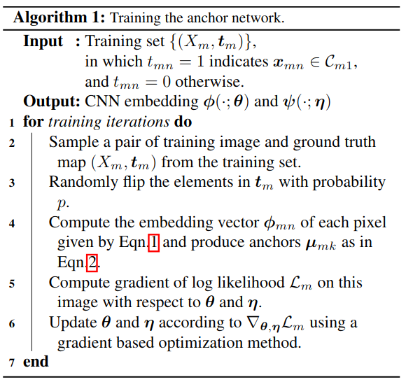

训练需要迭代, 迭代的过程, 就是不断的随机翻转标签, 计算像素和区域锚点的映射向量, 最大化对数似然, 更新参数. 注意上图中真值使用的方法.

### Iterative testing scheme

测试期间生成锚点是个需要注意的问题, 因为真值认为是未知的, 这里就尝试根据 **现有方法生成的显著性图(先验)** 选择的近似的显著性/背景区域来生成锚点(要注意, 本文提出的实际上是一个后处理的方法, 目标是对于现有架构的进一步提升). 这里使用了一个迭代的测试方案使用NN分类器, 来逐渐调整锚点,.

在这个迭代的过程中, 会使用到一个随之不断迭代的先验显著性图(**初始的先验显著性图$Y^{(0)}_m$是由现有的方法生成的**), 流程中使用的先验显著性图, 是通过这个公式迭代计算的:


这里的Y就是迭代中使用的先验显著性图, 被用来选择下一次迭代中的显著性和背景区域. 而且随着迭代不断地开始, 新的结果所占的比例越来越低, 这将确保迭代过程的稳定性.

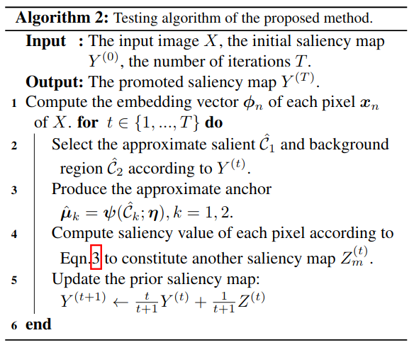

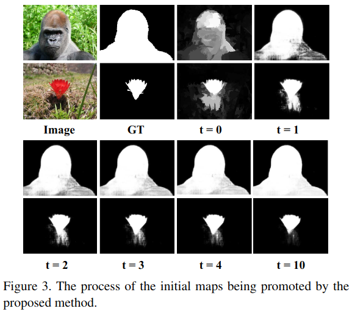

上图展示了提出的方法对于显著性图的不断的优化提升的过程.

这个过程实际上就是先对像素映射向量, 然后开始迭代, 最开始的先验使用的是现有方法生成的**显著性图**, 也就是$Y^{0}$, 利用先验图选择前景背景, 也就是下图中的位置, 进而生成近似的锚点(利用先验图作为类似训练时的真值, 与从网络中提取出来的特征层相乘(实际上是选择了前景与背景区域之后)在送入区域嵌入结构生成锚点).

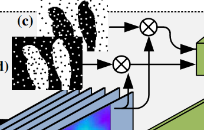

根据公式3, 对每个像素计算其显著性值(也就是属于显著性区域的概率值), 来构建另一个新的显著性图, 利用迭代公式进行迭代计算(相当于是d位置与i位置显著图的合并). 之后按照上图那样送入结构中.

要注意, 这里的迭代次数T是给定的.(这就有点不智能了)

尽管初始的显著性图没能准确的区分出来前景和背景, 但是它通常能部分的区分它们, 因此可以提供关于图像中显著性目标的类别和外观的信息.

例如，在图3的第一张图片中，尽管只有一小部分前景被突出显示，但初始显著性图可以告诉我们前景可能是一只大猩猩，而背景则包含一片绿色。(这应该算是合理推测)

然后，其选定的前景/背景区域应该与真实的前景/背景区域相似，从而导致**相应的锚点与学习到的度量空间中的真实区域相关联**。

因此，方程3给出的最近邻分类可以产生良好的结果。**随着迭代的进展，近似锚点逐渐接近真实锚点，这将导致更好的结果**。这反过来可以提供对锚点的越来越精确的近似，并且产生更准确的结果。

如图3所示，初始显著性图并不吸引人，而迭代修改后的图看起来要好得多。

对于数据较为有限的SD任务, 选择在尝试调整在分类数据集预训练的模型(这里使用ImageNet上预训练过的VGG16), 来拟合为像素嵌入函数和区域嵌入函数, 以实现数据的映射. 由于不再是分类器, 去掉全连接, 只保留特征提取组件, 包含五个卷积块. 并且实际中也使用了BN和ReLU操作.

### Pixel embedding

由于VGG特征提取器本身会导致特征图不断地缩小, 这并不是想要的结果, 因为这里提出的方法是要实现对于输入图像的每个像素来映射一个向量, 需要这个嵌入CNN产生一个具有与输入图像相同分辨率的特征图.

这里采用了两个策略来获取更大的特征图.

1. 移除了最后两个卷积块的池化层, 使用扩张卷积来维持卷积滤波器的感受野
2. 添加亚像素卷积层到每个VGG特征提取器的卷积块后, 来上采样每个卷积块的特征图到输入图像大小.

> 要注意, 这里实际上最后剩下来的只有两个最大池化, 可见代码:

```python
self.proc_feats_list = nn.ModuleList([
    # convtranspose2d=>out_size=(in_size-1)xstride-2xpadding+kernel_size
    nn.Sequential(
        # x4 512卷积块对应的输出
        nn.ConvTranspose2d(dims[0], dims[0], 8, 4, 2),
        nn.Conv2d(dims[0], odims[0], kernel_size=3, padding=1)),
    nn.Sequential(
        # x4 512对应的输出
        nn.ConvTranspose2d(dims[1], dims[1], 8, 4, 2),
        nn.Conv2d(dims[1], odims[1], kernel_size=3, padding=1)),
    nn.Sequential(
        # x4 256对应的输出
        nn.ConvTranspose2d(dims[2], dims[2], 8, 4, 2),
        nn.Conv2d(dims[2], odims[2], kernel_size=3, padding=1)),
    nn.Sequential(
        # x2 128对应的输出
        nn.ConvTranspose2d(dims[3], dims[3], 4, 2, 1),
        nn.Conv2d(dims[3], odims[3], kernel_size=3, padding=1)),

    # 使用亚像素卷积实现上采样 #############################################
    # 不清楚这里为什么放弃了使用亚像素卷积的手段
    # 这里的nn.PixelShuffle(up_scale)便是可以用来实现亚像素卷积的一个类
    # nn.Sequential(
    #     nn.Conv2d(dims[0], odims[0], kernel_size=3, padding=1),
    #     nn.PixelShuffle(4)),
    # nn.Sequential(
    #     nn.Conv2d(dims[1], odims[1], kernel_size=3, padding=1),
    #     nn.PixelShuffle(4)),
    # nn.Sequential(
    #     nn.Conv2d(dims[2], odims[2], kernel_size=3, padding=1),
    #     nn.PixelShuffle(4)),
    # nn.Sequential(
    #     nn.Conv2d(dims[3], odims[3], kernel_size=3, padding=1),
    #     nn.PixelShuffle(2)),

    # x1 64 对应的输出
    nn.Conv2d(dims[4], dims[4], kernel_size=3, padding=1),
])
```

> **Subpixel convolution** is an upsampling strategy originally proposed in [Real-time single im-age and video super-resolution using an efficient sub-pixelconvolutional neural network] for image super-resolution.
>
> 这里也提示了一点, 对于深度学习实现的显著性检测手段, 里面会涉及到分辨率的恢复操作, 也就是所谓的上采样, 由于网络的深层事实上需要更大的感受野, 所以说, 对于往常的池化层不能轻易去除, 而要找到合适的替代, 这里提供了几个思路, **一个是使用扩张卷积替代池化操作, 一个是使用超分辨率重建(本质都是低分辨率重建为高分辨率)的思想**.

为了生成C通道的N倍输入大小的tensor, 亚像素卷积首先通过一般的卷积得到一个$N^2 \times C$通道的与原输入一致大小的tensor. 然后这个tensor被重新调整为C通道的N倍于输入大小的tensor.

---

本小节补充内容:

超分辨率技术（Super-Resolution）是指从观测到的低分辨率图像重建出相应的高分辨率图像，在监控设备、卫星图像和医学影像等领域都有重要的应用价值。SR可分为两类:从多张低分辨率图像重建出高分辨率图像和从单张低分辨率图像重建出高分辨率图像。基于深度学习的SR，主要是基于单张低分辨率的重建方法，即Single Image Super-Resolution (SISR)。

如果做SR(超分辨率)的话，需要将一张低分辨率图像转换成一张高分辨率图像。如果直接用deconvolution作为upscale手段的话，通常会带入过多人工因素进来(有不少论文提到这个)。而sub-pixel conv会大大降低这个风险。Subpixel convolution是一种巧妙的图像及特征图upscale的方法，又叫做pixel shuffle（像素洗牌）, 亚像素卷积操作就是通过生成更多的特征层, 然后利用它们数据的周期性组合, 来实现分辨率的提升.


上图很直观得表达了sub-pixel convolution的做法，前面就是一个普通的CNN网络，到后面彩色部分就是sub-pixel conv的操作了。首先，**如果我想对原图放大3倍，那么我需要生成出3^2=9个same size的特征图。将九个same size的特征图拼成一个X3的大图**，这就是sub-pixel convolution的操作了。这是一种抽样的反思想，如果把一张x3的大图，每隔三个点抽样一个，那就会得到9张低分辨率的图像。于是，如果我们可以通过CNN来获得9张符合分布的低分辨率图像，那么就可以组成一张高分辨率的大图。

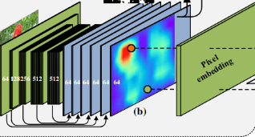

通过在五个卷积块后添加一个亚像素卷积层, 这里会获取5个C通道的特征图, 5个特征图级联, 想成一个5C通道的特征图. 但是直接使用和这个级联的特征图不是最好的选择, 因为不同的卷积块之间有着不同的感受野(区域不同), 为了解决这个问题, 额外添加了两个卷积层来转化这个级联特征图为一个D通道的特征图(特征融合), 其中的每个D维向量就被认为是每个像素所对应的的D维表示.

**文中的实现里, 设定C为64, D为512.**

### Region embedding

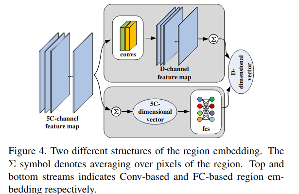

为了简单, 对于两个嵌入操作(像素和区域), 共享相同的特征提取器和亚像素上采样层.

新的层被添加在亚像素卷积层后, 来匹配图片区域的5C通道特征图到一个D维向量.

这里考虑了两种结构:

1. 基于卷积的区域嵌入结构: 5C-channel->Convs->D-channel->channel-wise-average->D-vector
2. 基于全连接的区域嵌入结构 5C-channel->channel-wise-average->5C-vevtor->FC->D-vector

## Experiments

### 评价标准

* PR曲线
* F测度曲线
* F测度得分
* MAE得分

The *precision* of a binary map is defined as the ratio of the number of **salient pixels it correctly labels**, to all salient pixels **in this binary map**. 预测的二值图像中的预测的显著性目标区域标注正确的比例. 就是**预测为真值(预测为显著性区域)中的实际真值(实际的显著性区域)的比例**.

The *recall* value is the ratio ofthe number of correctly labeled salient pixels to all salient pixels in the ground-truth map. **实际真值**中被**正确标出**的比例.


in which TS denotes true salient pixels, DS denotes detected salient pixels by the binary map, and $|·|$ denotes cardinality of a set.

F测度使用下式计算.


曲线的计算按照动态阈值来计算.

Given a saliency map whose intensities are in the rangeof 0 and 1, a series of binary maps can be produced by *thresholding the saliency map with different values in [0,1]*.

Precision and recall values of these binary maps can becomputed according to Eqn. 6. F-measure can be computed according to Eqn. 7.

Plotting the **(precision, recall)** pairs of all the binary maps results in the precision-recall curve, and plotting the **(F-measure, threshold)** pairs results in theF-measure curve.

Also as suggested in [1], we **use twice the mean valueof the saliency maps as the threshold to generate binary maps for computing the F-measure**.

Notice that some works have reported slightly different F-measures using different thresholds. But as far as we know, **twice the mean value isthe most commonly used threshold**.

As complementary to PR curves, mean absolute error(MAE) is used to quantitatively measure the average difference between the saliency map S and the ground truth map G.


MAE indicates how similar a saliency map is compared to the ground truth. It is widely used in different pixel-level prediction tasks such as semantic segmentation and image cropping [22].

### Implementation details

* We train our model on the training set of DUTS dataset.
* As in [20], we augment the training data by horizontal flipping and cropping the images to reduce overfitting.
* The probability $p$ of randomly flipping ground truth when producing anchors during training is **set to 0.05**.
* We comparetwo type of region embedding in Sec.4.4, and **adopt theConv-based one in other experiments**.
* **Adam [14] optimization method** is used for training our model.
* Learning rateis **set to 1e-3**.
* We **do not use a validation set**, and train our model **until its training loss converges**.
* The training process takes almost 16 hours and converges after around 300 kiterations with mini-batch of size 1.

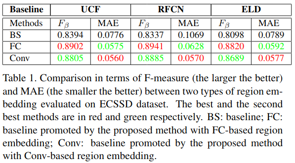

From this comparison we can see that the performance of FC-based and Conv-based region embedding is comparable.

* The FC-based region embedding yields **relatively larger F-measure**
* Conv-based region embedding is **more superior in terms of MAE**

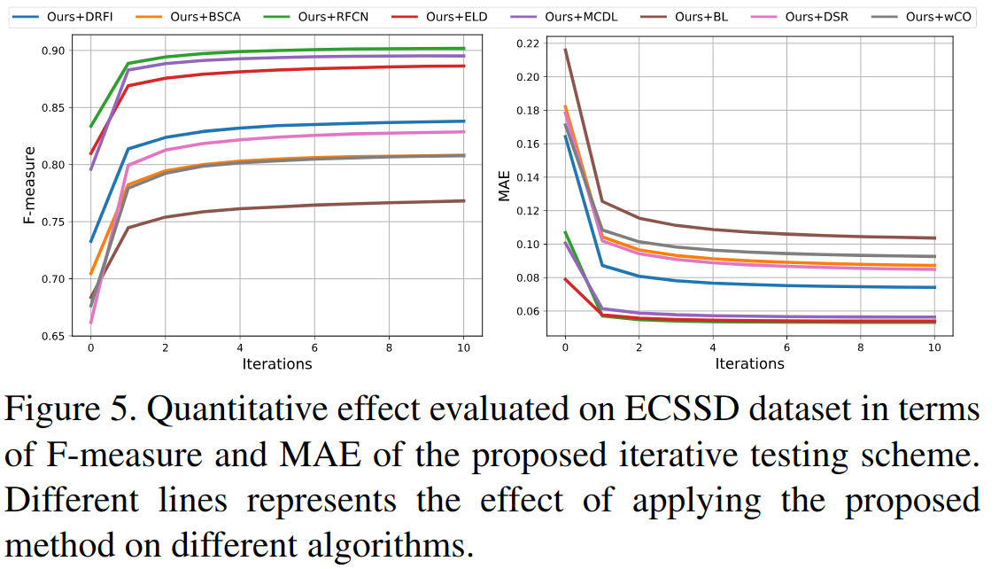

We show the effect of the proposed iterative approximation scheme in Figure 5. As shown in Figure 5, the first iteration improve the F-measure and decrease MAE most significantly. The improvement slows down with iterations, and saturates(饱和) gradually.

### Performance

We apply our method to promote the performance of each baseline method, by usin**g its predicted saliency maps to generate initial anchors** in Eqn.3.

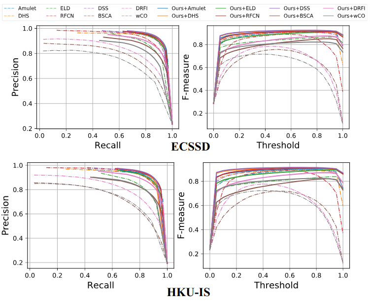

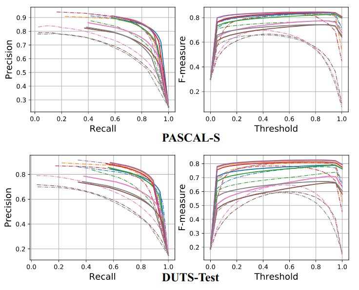

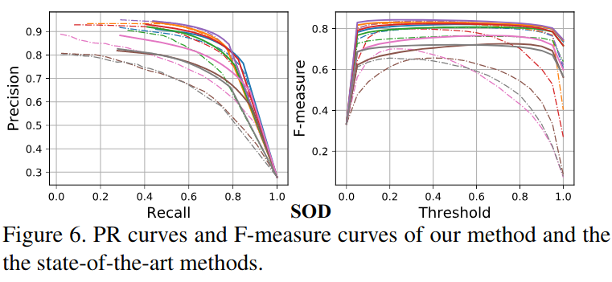

* Figure 6 shows the PR curves of the baseline methods and the one promoted by our method.
* Table 2 shows the F-measure and MAE scores of 8 deep learning based methods and the corresponding promoted results.
* The quantified improvements in F-measure and MAE of applying our method to conventional methods are shown in Table 3.
* As shown in Figure 6, Table 2, and Table 3, our method drastically(大幅) promotes all the baseline methods.

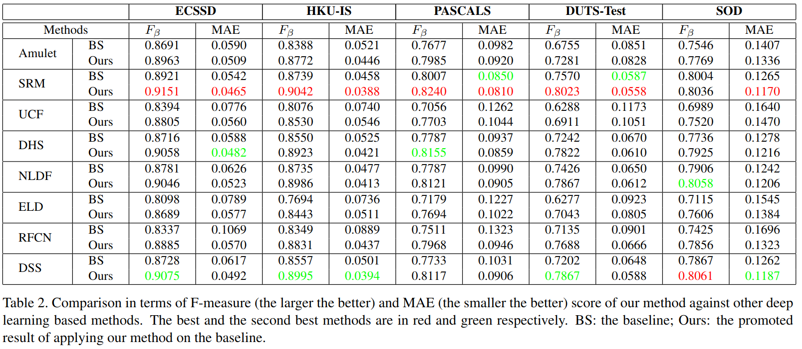


观察数据可知

* 论文提出的方法, 对于已有的深度方法和传统的方法都有提升.
* Notice that the results shown here are obtained by **iterating Alg. 2 only once** for fast testing speed.
* As shown in Sec.4.4, better results can be achieved through iterating Alg. 2 more times.

Figure 7 shows a visual comparison of saliency maps produced by some state-of-the-art methods and the promoted ones by our method.

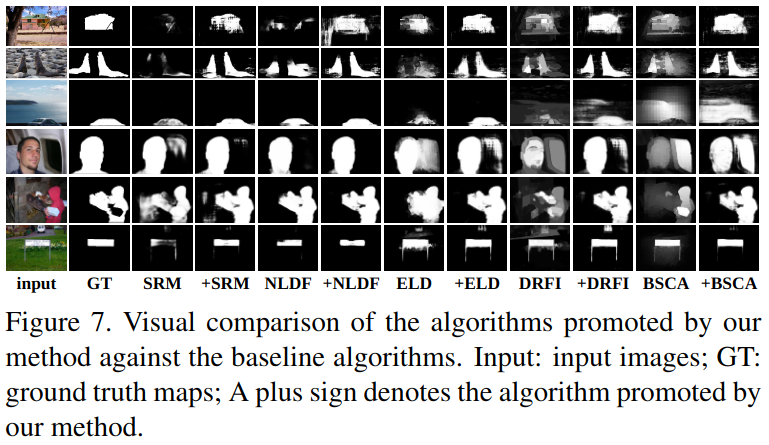

It can be seen that the saliency maps produced by our methods highlight salient regions that are missed by the baselines.

Further, our method can suppress the background regions that are wrongly labeled as salient by the baseline methods(我们的方法可以抑制基线方法错误标记为显着的背景区域。).

## 总结

In this paper, we **propose a novel learning method to promote existing salient object detection methods**.  Extensive experiments on five benchmark datasets show that our method can significantly improve accuracy of existing methods and compares favorably against state-of-the-arts(我们的方法可以显着提高现有方法的准确性，并且与现有最优技术相比具有优势).

## 参考链接

* 零次学习入门: <https://zhuanlan.zhihu.com/p/34656727>
* What is embedding | embedded space | feature embedding in deep neural architectures?: <https://www.quora.com/What-is-embedding-embedded-space-feature-embedding-in-deep-neural-architectures>
* 有谁可以解释下word embedding? - 寒蝉鸣泣的回答 - 知乎: <https://www.zhihu.com/question/32275069/answer/80188672>
* Sub-pixel Convolution(子像素卷积): <https://blog.csdn.net/leviopku/article/details/84975282>
