# Scene Parsing via Dense Recurrent Neural Networks with Attentional Selection(2018)

## 文章要点

1. 使用无向有环图对图像进行建模, 并使用密集连接改进
2. 对无向有环图拆分成有向无环图, 并使用密集连接改进
3. 对密集有向无环图使用RNN
4. 引入了注意力模型改进密集RNN
5. 利用分类网络作为骨架网络

---

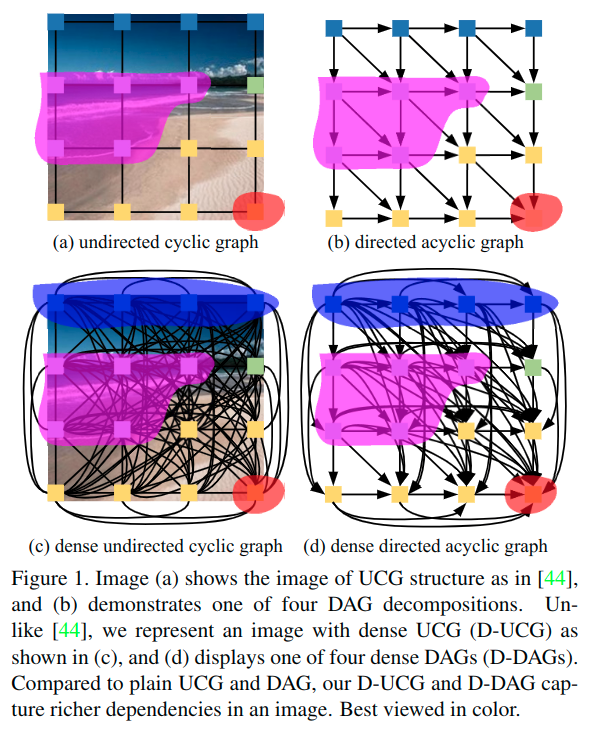

在本文中，我们关注*如何有效地利用图像中丰富的依赖关系并介绍密集的RNN模块*.

我们的方法与先前的RNN方法（例如，DAG结构的RNN和线性结构的RNN或LSTM）不同，其中每个图像单元仅接收来自其有限邻居的依赖性信息并考虑丢弃了有用的依赖关系.

相反，我们建议**在RNN中添加密集路径**以实现直接的远程依赖. 因此，每个图像单元可以直接“看到”整个图像中的依赖性，从而导致更具辨别力的表示. 值得注意的是，密集连接的概念不仅可以用于图形RNN，而且可以很容易地应用于其他线性结构化RNN.

此外，我们**将注意力模型引入密集RNN**. 据我们所知，这项工作首先在RNN中使用注意机制进行场景解析. 我们的注意力模型自动从密集连接中选择图像单元相关的并且约束相关依赖关系，进一步提高其可辨识性.

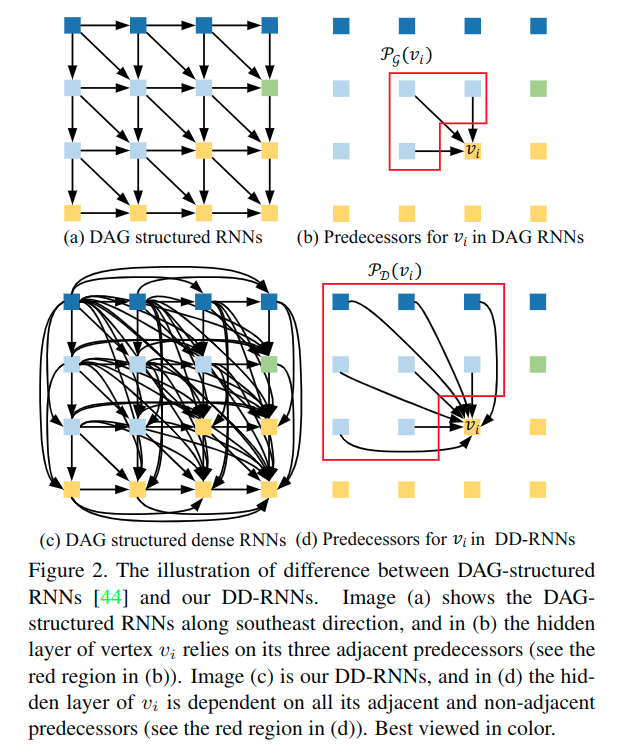

对于a的设计, 容易出现**依赖衰减**的问题, 因为要经过很多的媒介的传递, 才能到达想要的位置. 为了解决这个问题, 这里使用了密集连接, 大量的额外连接, 连接了远处与当前的单元.

这个启发自DenseNet. 这篇论文就是在DAG-RNN的基础上添加了密集连接, 进而可以利用更为丰富的图像单元之间的依赖信息. 这也就是要提出的DD-RNN.

### 计算流程改进

#### 相关参数的定义

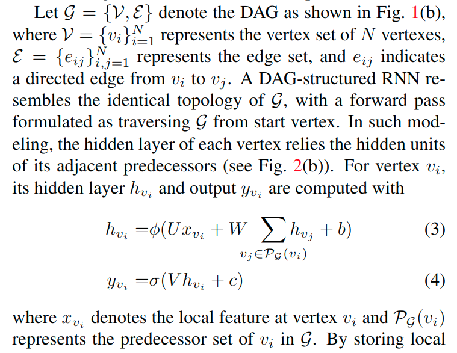

#### 原本密集RNN的计算流程

#### 考虑注意力模型

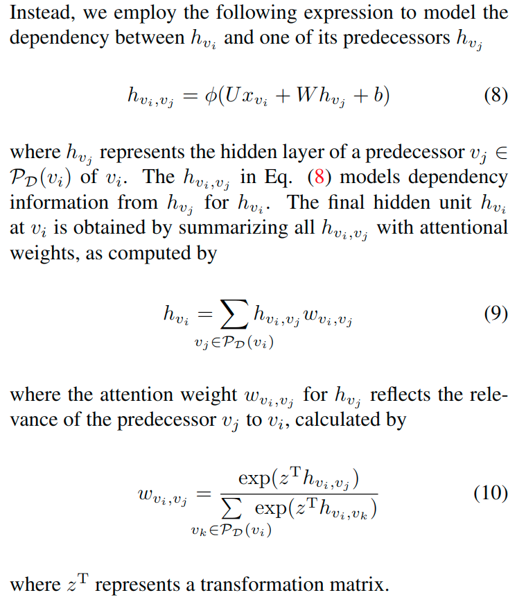

#### 集成到整体后的密集RNN

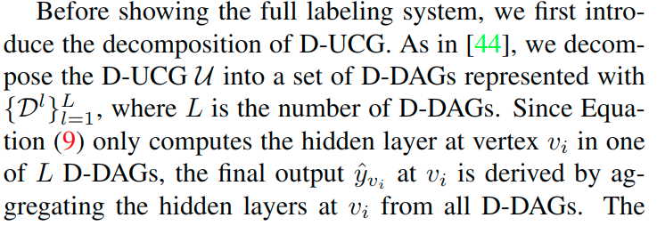

针对多个拆解出来的D-DAG, 尽心如下计算.

## 实际效果

整体的结构图是如下所示的. DD-RNN位于CNN最后的输出的特征图的后面, 进行处理. 之后进行预测, 上采样以及融合的操作.

DD-RNN被用来对于CNN最后的输出图像单元之间的依赖进行建模.

网络使用512x512大小的输入, 输出标签结果也要使用相同的分辨率. 评估的时候, 输出的标签结果要放缩到原始输入的大小.

DD-RNN的输入层, 隐藏层, 输出层, 单元数目都设定为512. 这里的两个非线性函数使用ReLU和softmax函数. 整个网络端到端的使用标准SGD方法来进行训练.

对于全卷积模块, 学习率被初始化为0.0001, 以10周期, 0.9的倍率进行指数衰减.

对于 D-RNN, 学习率初始化为0.01, 并且10周期0.9倍率进行衰减. 训练和测试的批处理大小都设定为1.在50个训练周期后, 汇报了结果.

这个网络使用了MatConvNet在Matlab中实现, 使用单显卡(12G).

Datasets: We test our method on the large-scale PASCAL Context [38], MIT ADE20K [59] and Cityscapes [11].

- The PASCAL Context contains **10,103 images annotated into 540 classes**, where **4,998 images are used for training and the rest for testing**. Similar to other literatures, we only consider **the most frequent 59 classes for evaluation**.
- The recent MIT ADE20K consists of **20,000 images in training set and 2,000 images in validation set**.  There are **total 150 semantics classes** in the dataset.
- The  Cityscapes  contains  **5000  images**  of  street  traffic scene, where **2975 images are used for training, 500 images for validation, and the rest for testing.**  In total, **19 classes are considered for training and evaluation.**

评估的时候, 使用的是mIoU指标.

### 基线比较

使用了两个基础的骨干网络, 一个是VGG-16, 一个是ResNet-101.

用于比较的模型:

* Baseline FCN: 类似于FCN-8s, 但是移除了全连接层.
* FCN+CRF: 在基线模型熵进行了CRF后处理
* FCN+DAG-RNN: 使用DAG-RNN替代论文模型中的DD-RNN
* FCN+DD-RNN: 论文提出的模型

可以比较看出来, 三种方案相对于基线模型都有所提升, 但是相较而言, 本文提出的模型更为有效.

### 在PASCAL Context上的结果比较

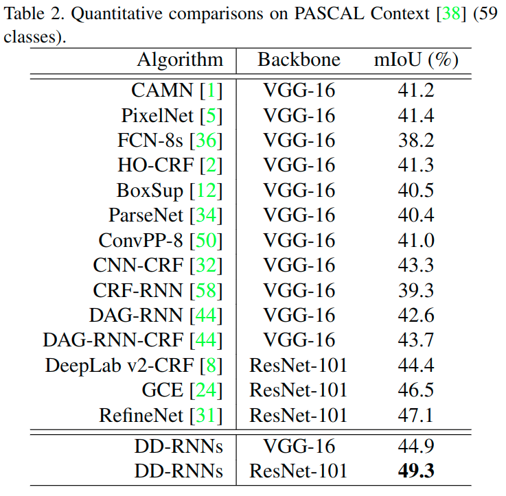

受益于DNN，FCN-8s取得了令人满意的结果，其中mIoU为38.2％. **为了缓解FCN-8中的边界问题，CRF-RNN和DeepLab v2-CRF在CNN中使用CRF等概率图模型**，并分别获得39.3％和39.6％的mIoUs.

其他方法，如CAMN，ParseNet和GCE建议通过引入全局上下文信息来提升性能，并获得41.2％，40.4％和46.5％的mIoU.

尽管有所改进，但这些方法忽略了图像中的长距离依赖，这对于推断出巨大的像素至关重要.

论文的方法使用了DD-RNN, 而且没有使用任何的类别权重策略和后处理. 使用VGG-16时, 和改进主要针对的网络[44]对应的架构(DAG-RNN-CRF)x相比, 性能还是好很多.

通过更深入的ResNet-101，我们实现了49.3％的mIoU，超越了最先进的RefineNet.

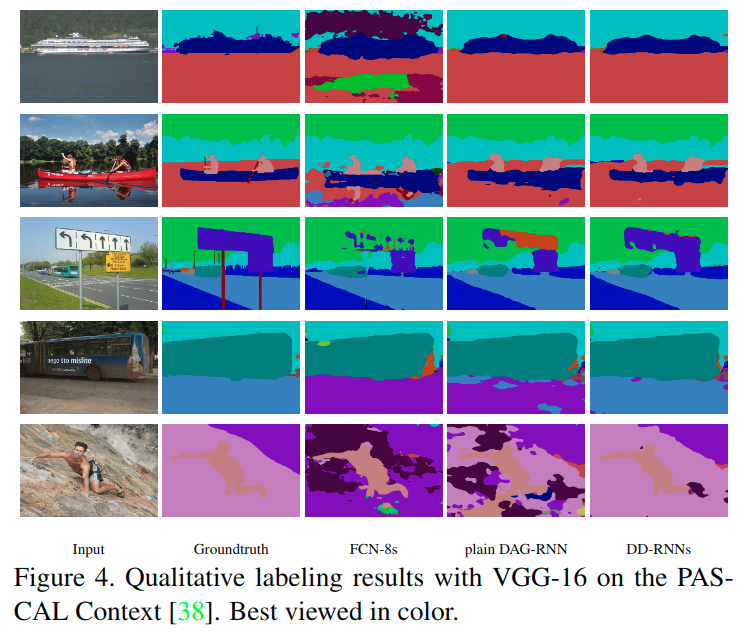

对于这样的结果的解释, 作者认为, 论文模型能够捕获更多的图像中的依赖, 所以可以缓解误分类的情况.

### 在MIT ADE20K上的结果比较

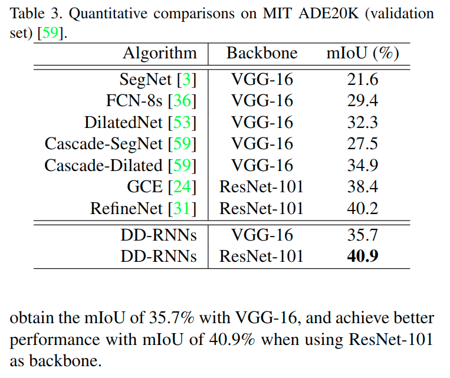

* [53]使用了多尺度的上下文,  提出了空洞卷积并提升了mIoU
* [24]将全局上下文信息嵌入CNN以获得改进, 并且使用ResNet-101提升了性能

尽管这几个方法使用了全局的上下文信息,但是它们忽略了图像的长距离上下文信息. 文章中使用的模型却使用了这一点. 对于两类骨架网络情况下都取得了对应的优秀表现.

### 对于Cityscopes上的结果比较

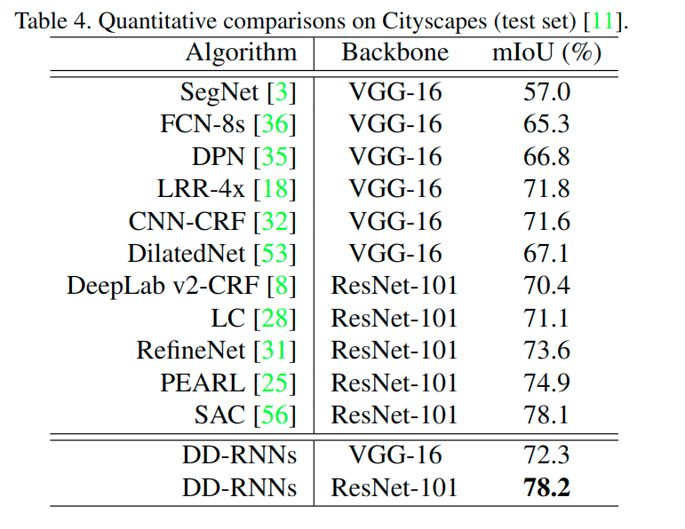

因为图像分辨率很大, 作者把图像进行了分割, 使用多个patch进行了计算. 在获得每个patch的分析结果后, 再对他们进行组合得出原始图像的标签.

在上面的比较中, [35]使用了MRF, 马尔科夫随机场, 来建模高阶CNN, 达到了71.6%的测试效果, DeepLabV2组合了CRF和空洞卷积来使用更多的上下文信息, 获得了70.4%的效果.

## 消融实验

为了探究注意力模型的效果, 通过移除它来进行测试. 除了注意力模型, 其他的部分都是相同的, 例如其他层的参数.

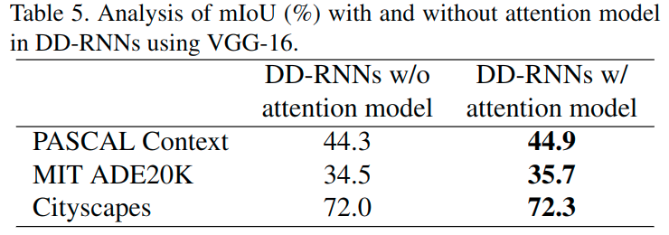

可以看出, 使用注意力模型对于结果的提升有0.6/1.2/0.3.

为了更好的理解注意力模型, 下图展示了学习到的针对特定区域的注意力权重映射.

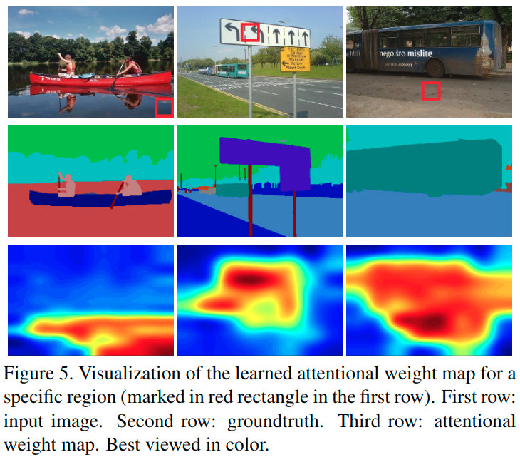

可以看出相关的依赖被增强, 无关的依赖被抑制. 可以看第一列, 对于"水"区域, 最有用的上下文依赖是来自周边和"船", 而不是"树"或者"天", 我们的注意力模型在权重匹配中学习更多地关注相关的依赖, 例如周边的区域和"船".

## 模型复杂度研究

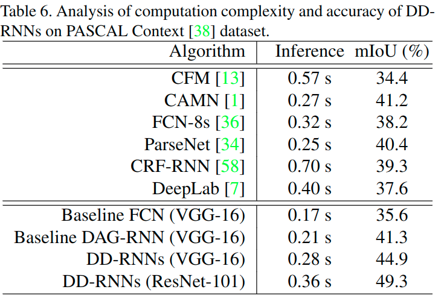

对于实际应用, 场景标记的有效性与准确率是关键的. 上面比较了在PASCAL Context上的前向传播时间和准确率. 比较上述的结果, 可以看出来, 论文的模型效果不错.

## 总结

本文提出了用于场景标记的密集RNN. 与探索有限依赖关系的现有方法不同，我们的DAG结构化密集RNN(DD-RNN)通过图像中的密集连接利用丰富的语境依赖性，这更好地提高了图像单元的判别力.

此外，考虑到不同的依赖并不总是同样有助于识别每个图像单元，我们提出了一种注意力模型，以便为相关的依赖关系分配更多的重要性.

我们与CNN集成，开发了端到端标签系统. PASCAL Context，MIT ADE20K和Cityscapes的广泛实验表明，我们的DD-RNN显着改善了基线并超越了其他最先进的算法，证明了所提出的dense RNN的有效性.

## 参考

DAG-RNN:

论文: https://arxiv.org/abs/1509.00552

代码: https://github.com/FTRobbin/dag-rnn
