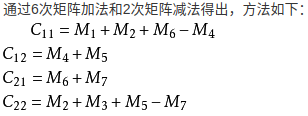
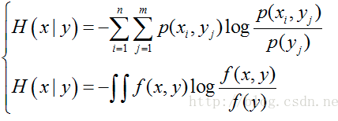
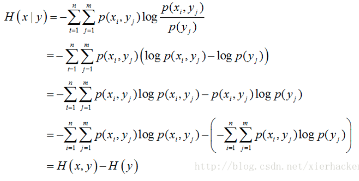
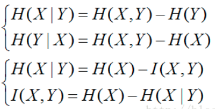

p范数

A class of [vector norms](http://planetmath.org/vectornorm), called a p-norm and denoted $||⋅||_p$, is defined as

$||x||_p=(|x_1|^p+⋯+|x_n|^p)^{1/p} ,p≥1,x∈R^n$

The most widely used are the 1-norm, 2-norm, and ∞∞-norm:

$||x||_1=(|x_1|^1+⋯+|x_n|^1)^{1} $
$||x||_2=\sqrt{(|x_1|^2+⋯+|x_n|^2)^{2} }$
$||x||_∞== max_{1≤i≤n}|x_i|$

## 表示定理（Representer Theorem）

https://www.analyticsindiamag.com/what-is-representer-theorem-in-machine-learning/

## 支持向量机

http://blog.pluskid.org/?page_id=683

http://www.robots.ox.ac.uk/~az/lectures/ml/lect3.pdf

## 记号规则

$log=ln$

$\min_x\max_y f(x,y)$ 表示对于函数$f$而言,变化$y$使得函数值最大,再变化$x$使得函数值最小.

## 次梯度

设f在实数域上是一个凸函数，定义在数轴上的开区间内。这种函数不一定是处处可导的，例如绝对值函数f(x)=|x|f(x)=|x| 。对于下图来说，对于定义域中的任何x0，我们总可以作出一条直线，它通过点(x0, f(x0))，并且要么接触f的图像，要么在它的下方。直线的斜率称为函数的次导数。次导数的集合称为函数f在x0处的次微分。

Rigorously, a *subderivative* of a convex function *f*:*I*→**R** at a point *x*0 in the open interval *I* is a real number *c* such that

for all *x* in *I*. One may show that the [set](https://en.wikipedia.org/wiki/Set_(mathematics)) of subderivatives at *x*0 for a convex function is a [nonempty](https://en.wikipedia.org/wiki/Empty_set) [closed interval](https://en.wikipedia.org/wiki/Closed_interval) [*a*, *b*], where *a* and *b* are the [one-sided limits](https://en.wikipedia.org/wiki/One-sided_limit)

对于所有x，我们可以证明**在点$x_0$ 的次导数的集合是一个非空闭区间$[a,b]$**，其中a和b是单测极限一定存在，且$a<=b$，在$[a,b]$内的所有次导数是f在$x_0$的次微分。

which are guaranteed to exist and satisfy *a* ≤ *b*.

The set [*a*, *b*] of all subderivatives is called the **subdifferential** of the function *f* at *x*0. Since *f* is convex, if its subdifferential at $x_{0}$ contains exactly one subderivative, then *f* is differentiable at $x_{0}$.

当函数在x0处可导时，次微分只有一个点组成，这个点就是函数在x0处的导数。

## 激活函数

## 为什么样本方差（sample variance）的分母是 n-1？

https://www.zhihu.com/question/20099757

## 梯度下降与梯度上升

通常，您使用梯度上升来最大化似然函数，并使用梯度下降来最小化成本函数。梯度下降和上升几乎都是相同的。让我举一个具体的例子，使用一个简单的基于梯度的优化友好算法和一个凹/凸 似然/成本函数：逻辑回归。

您希望在逻辑回归中最大化的似然函数是.

其中“phi”只是sigmoid函数

现在，你想要一个用于梯度上升的concav函数：

类似地，您可以将其写为反向，以获得可通过梯度下降最小化的成本函数。

对于对数似然，您将导出并应用梯度上升，如下所示：

既然你想同时更新所有权重，那就让我们把它写成

现在，应该很明显看到梯度下降更新与上升更新相同，但请记住，我们正在将其制定为“向成本函数的梯度的相反方向迈出一步”

## 矩阵乘法

### Hadamard product(哈达马乘积)

`m x n`矩阵`A = [aij]`与矩阵`B = [bij]`的Hadamard积，记为`A * B` 。新矩阵元素定义为矩阵A、B**对应元素的乘积**`(A * B)ij = aij.bij`。

![{\displaystyle \left[{\begin{array}{ccc}\mathrm {a} _{11}&\mathrm {a} _{12}&\mathrm {a} _{13}\\\mathrm {a} _{21}&\mathrm {a} _{22}&\mathrm {a} _{23}\\\mathrm {a} _{31}&\mathrm {a} _{32}&\mathrm {a} _{33}\end{array}}\right]\circ \left[{\begin{array}{ccc}\mathrm {b} _{11}&\mathrm {b} _{12}&\mathrm {b} _{13}\\\mathrm {b} _{21}&\mathrm {b} _{22}&\mathrm {b} _{23}\\\mathrm {b} _{31}&\mathrm {b} _{32}&\mathrm {b} _{33}\end{array}}\right]=\left[{\begin{array}{ccc}\mathrm {a} _{11}\,\mathrm {b} _{11}&\mathrm {a} _{12}\,\mathrm {b} _{12}&\mathrm {a} _{13}\,\mathrm {b} _{13}\\\mathrm {a} _{21}\,\mathrm {b} _{21}&\mathrm {a} _{22}\,\mathrm {b} _{22}&\mathrm {a} _{23}\,\mathrm {b} _{23}\\\mathrm {a} _{31}\,\mathrm {b} _{31}&\mathrm {a} _{32}\,\mathrm {b} _{32}&\mathrm {a} _{33}\,\mathrm {b} _{33}\end{array}}\right]}](https://wikimedia.org/api/rest_v1/media/math/render/svg/06e3f6abf1511656029ce58b89695b687789aa9c)

### Kronecker product(克罗内克积)

Kronecker积是两个任意大小矩阵间的运算，表示为 `A x B`。如果A是一个 `m x n` 的矩阵，而B是一个 `p x q` 的矩阵，克罗内克积则是一个 `mp x nq` 的矩阵。克罗内克积也称为直积或张量积，以德国数学家利奥波德·克罗内克命名。

### 斯特拉森矩阵乘法

斯特拉森矩阵乘法是1969年斯特拉森利用分治策略并加上一些处理技巧设计出的一种矩阵乘法。设A和B是俩个`n x n`的[矩阵](https://baike.baidu.com/item/%E7%9F%A9%E9%98%B5/18069)，其中n可以写成2的幂。将A和B分别等分成4个小矩阵，此时如果把A和B都当成2x2矩阵来看,每个元素就是一个`（n/2）x（n/2）`矩阵，而A和B的成积就可以写成：

用上述方案解n=2;矩阵乘法；假定施特拉斯矩阵分割方案仅用于n>=8的矩阵乘法，而对于小于8的矩阵直接利用公式计算；n的值越大，斯拉特森方法更方便.

## 对数概率

简单而言就是对概率求对数. 

而对数概率的归一化指的是

也就是所谓的softmax函数的形式.

话说,为什么为什么要对对数概率归一化的表示使用指数和的形式呢?

为什么不使用的形式呢?

一个原因是因为前面的形式在表达交叉熵的时候比较方便.

这里的q表示标签的真实分布.使用对数概率的时候可以去掉指数,进而简化表达.

> https://stats.stackexchange.com/questions/289369/log-probabilities-in-reference-to-softmax-classifier/289447

## 最大似然估计

## 信息论相关

### 熵

信息量(自信息（self-information）): $I(x) = -log_2p(x)$

联合自信息量:$I(x_i,y_i)=-logp(x_i,y_i)$

条件自信息量:$I(y_i|x_i)=-logp(y_i|x_i)$

熵(**整个概率分布对应的信息量的平均值**): (在p分布下面的平均自信息)

> 注意:
>
> 1. 熵只依赖于X的分布,与X的取值无关,因此服从某个分布的X的熵也可以等价于这个分布的熵.
> 2. 定义0log0=0(因为可能出现某个取值概率为0的情况)
> 3. .熵越大,随机变量的**不确定性就越大**(因为之前说了，越是不确定，信息量就越大，要是平均信息量很大，那么也可以代表这个变量的不确定性越大)
>
> 作者：谢小小XH 
> 来源：CSDN 
> 原文：https://blog.csdn.net/xierhacker/article/details/53463567 
> 版权声明：本文为博主原创文章，转载请附上博文链接！

复合熵(联合熵):

条件熵:(表示各种y对应下的x的不确定性)

 

当熵和条件熵中的概率由数据估计(特别是极大似然估计)得到的时候,所对应的熵与条件熵分别称为**经验熵(empirical entropy)**和**经验条件熵(empirical conditional entropy)**

要注意,实际概率有如此规则: $p(x_i, y_i) = p(x_i)p(y_i|x_i)$ ,即乘积的结果表示的是联合分布的情况.

> 联合概率、边际概率、条件概率的关系：
>
> 
>
> 

相对熵又称**互熵**，**交叉熵**，**鉴别信息**，**Kullback熵**，Kullback-Leible散度（即**KL散度**）等。 
设p(x)和q(x)是取值的两个概率概率分布，则p对q的相对熵为: 

在一定程度上面，相对熵可以度量两个随机变量的距离。也常常用相对熵来度量两个随机变量的距离。当两个随机分布相同的时候，他们的相对熵为0，当两个随机分布的差别增大的时候，他们之间的相对熵也会增大。 
但是事实上面，他**并不是一个真正的距离**。因为相对熵是不具有对称性的，即一般来说 

相对熵还有一个性质，就是不为负。 

### 互信息(Mutual Information)

是信息论里一种有用的信息度量，它可以看成是**一个随机变量中包含的关于另一个随机变量的信息量**，或者说是**一个随机变量由于已知另一个随机变量而减少的不确定性**。 

两个随机变量X,Y的互信息，定义为X,Y的联合分布和独立分布乘积的相对熵。 

X的熵减去X和Y的互信息之后，可以得到在Y给定的情况下X的熵。

