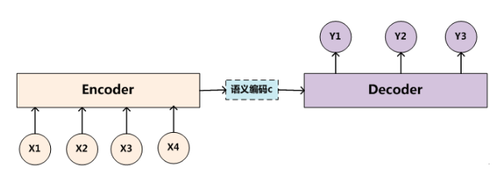

# 深度学习中的注意力机制

> https://blog.csdn.net/qq_40027052/article/details/78421155
>
> https://blog.csdn.net/fendouaini/article/details/78131649
>
> https://zhuanlan.zhihu.com/p/27771046

视觉注意力机制是人类视觉所特有的大脑信号处理机制。人类视觉通过快速扫描全局图像，获得需要重点关注的目标区域，也就是一般所说的注意力焦点，而后对这一区域投入更多注意力资源，以获取更多所需要关注目标的细节信息，而抑制其他无用信息。这是人类利用有限的注意力资源从大量信息中快速筛选出高价值信息的手段，是人类在长期进化中形成的一种生存机制，人类视觉注意力机制极大地提高了视觉信息处理的效率与准确性。

深度学习中的注意力机制从本质上讲和人类的选择性视觉注意力机制类似，核心目标也是从众多信息中选择出对当前任务目标更关键的信息。

## Encoder-Decoder框架

要了解深度学习中的注意力模型，就不得不先谈Encoder-Decoder框架，因为目前大多数注意力模型附着在Encoder-Decoder框架下，当然，其实注意力模型可以看作一种通用的思想，本身并不依赖于特定框架，这点需要注意。

Encoder-Decoder框架可以看作是一种深度学习领域的研究模式，应用场景异常广泛。下图文本处理领域里常用的Encoder-Decoder框架最抽象的一种表示。

文本处理领域的Encoder-Decoder框架可以这么直观地去理解：可以把它看作适合处理由一个句子（或篇章）生成另外一个句子（或篇章）的通用处理模型。对于句子对< Source,Target >，我们的目标是给定输入句子Source，期待通过Encoder-Decoder框架来生成目标句子Target。Source和Target可以是同一种语言，也可以是两种不同的语言。而Source和Target分别由各自的单词序列构成：

Encoder顾名思义就是对输入句子Source进行编码，将输入句子通过非线性变换转化为中间语义表示C：