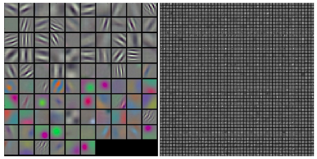
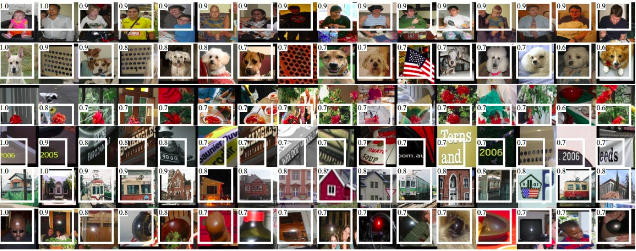
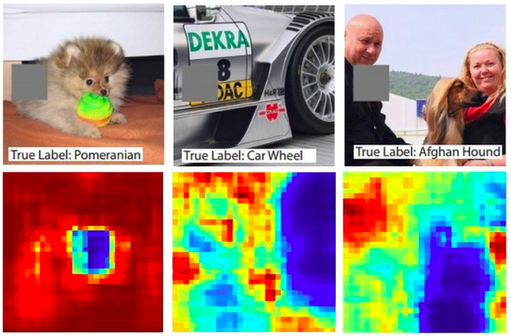

# 网络可视化

> https://blog.csdn.net/bea_tree/article/details/51533648

##  可视化激活值和第一层权重

### 激活值  

最直接的可视化就是展示网络在向前传播时的激活值，ReLU 为激活函数的网络中开始时激活值一般是点状物比较多比较分散，但是当训练后就会比较稀疏集中于局部了. 但是要注意如果有些激活值对很多不同的输入得到的是都全黑, 就可能意味着这是filters工作不正常或者学习速率太高。 

下图是 AlexNet在“看”过一只猫之后第一层卷积层和第五层卷积层的典型展示。每一个activation map 都对应着一些 filter神经元. 可以看出激活值是稀疏（大部分较黑）且分布较集中的. 

### Conv/FC Filters. 

另外一个可视化的方法就是将权重可视化，第一层看原始图像的卷积层的权重weight还比较好理解，但是也可以展示之后几层的权重，一般来说训练较好的权重一般会有比较平滑的展现且没有或很少噪声，如果噪声过大说明模型训练时间还不够或者惩罚因子过小导致过拟合。 

下图是AlexNet典型的第一和第二层卷积层的权重. 可以看出第一层的权重展示很nice很平滑，其中彩色和灰度特征是分别聚集的，这是因为 AlexNet 包含两部分处理流，一部分针对高频的灰度特征一部分针对低频的色彩信息,第二层的权重就没有这么直观的理解了，但是可以看出他依然平滑没有噪声，形状也不错。 

## 寻找最中意的图片

还有一种方法是将大量不同的图片输入网络，寻找哪一张图片可以让网络最激动，得到最大的激励，进而我们就可以知道神经元正在寻找什么样的receptive field，下面这篇文章就做了类似的事情：[Rich feature hierarchies for accurate object detection and semantic segmentation by Ross Girshick et al](http://arxiv.org/abs/1311.2524). 

下面的图片显示 AlexNet的第五个pooling层，要知道第五层的神经元已经是可以看到图片中比较大的局部了. 可以看出有几个是对人的上半身情有独钟，更奇葩的是有些对高光比较感兴趣，那个人头的亮光竟然被打了满分真实满满的爱呀。 

但是ReLU 神经单元似乎不能通过这些告诉我们什么，我们可以认为 multiple ReLU神经元是有些图块的空间偏置向量 下面的文章做了相关的工作[Intriguing properties of neural networks by Szegedy et al](http://arxiv.org/abs/1312.6199).

## 使用t-SNE 嵌入图片

ConvNets逐渐的将不同的图片分类，我们可以将不同的图片嵌入到二维的空间，这样相似的图片就会在一起.有很多嵌入的方法，t-SNE 是很有名的一个。我们可以从ConvNet中抽取cnn codes（例如在AlexNet中是分离器前的4096维向量）代入 t-SNE 得到了二维分布的图片，图片间的距离也可以表现出在ConvNet中认为他们是否相似，下图就是一例，越近的图片在ConvNet的眼里他们长的越像。 

## 挡住部分物体

我们还可以挡住图片的部分内容，看对图片分类结果是否变化，下图中是将图片挡住，看对这类物体分类的概率，概率（置信度）的变化体现在了热力图中。 

可以看出如果挡住小狗的脸就不能分清小狗了（分类置信度降低），这就说明网络对物体还是有比较正确的判断的。

## 其他一些关于将网络可视化的链接

Visualizing the data gradient and friends

Data Gradient.

[Deep Inside Convolutional Networks: Visualising Image Classification Models and Saliency Maps](http://arxiv.org/abs/1312.6034)

DeconvNet.

[Visualizing and Understanding Convolutional Networks](http://arxiv.org/abs/1311.2901)

Guided Backpropagation.

对于一个特定的图像,想要了解并选取神经网络中间层的一些中间神经元,输入图像的哪些部分,隐形了神经网络内部神经元的分值.可以通过显著图来计算神经元的分值,而不是计算相对于图像像素的类的分值,可以计算神经网络中的某些中间值相对于图像像素的梯度,这些值会告诉我们,输入图像中的哪些像素,会影响特定神经元的值.这将使用正常的反向传播.

但是事实上我们可以对这个反向传播进行一定的微调,最终得到一些稍微干净的图像,这来源于上面VUCN论文的传导式反向传播的思想.(这里似乎是用了梯度上升)

[Striving for Simplicity: The All Convolutional Net](http://arxiv.org/abs/1412.6806)

Reconstructing original images based on CNN Codes

[Understanding Deep Image Representations by Inverting Them](http://arxiv.org/abs/1412.0035)

How much spatial information is preserved?

[Do ConvNets Learn Correspondence?](http://papers.nips.cc/paper/5420-do-convnets-learn-correspondence.pdf) (tldr: yes)

Plotting performance as a function of image attributes

[ImageNet Large Scale Visual Recognition Challenge](http://arxiv.org/abs/1409.0575)

Fooling ConvNets

[Explaining and Harnessing Adversarial Examples](http://arxiv.org/abs/1412.6572)

Comparing ConvNets to Human labelers

[What I learned from competing against a ConvNet on ImageNet](http://karpathy.github.io/2014/09/02/what-i-learned-from-competing-against-a-convnet-on-imagenet/)

1. 基于激活值的方法:最近邻/降维/最大化图像块/遮挡
2. 基于梯度的方法:显著图/类可视化/愚弄图像/特征反演
3. 基于乐趣:deepdream/风格迁移