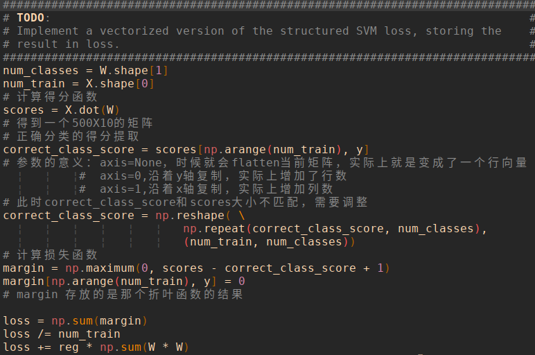
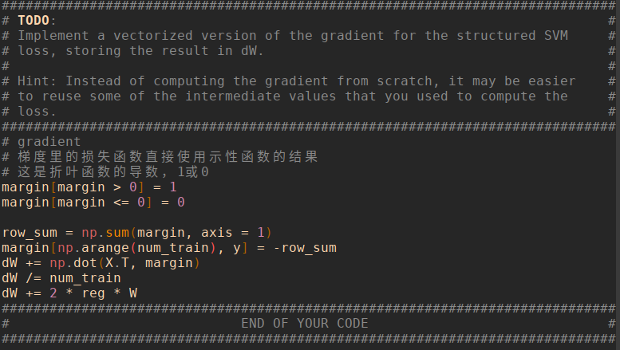
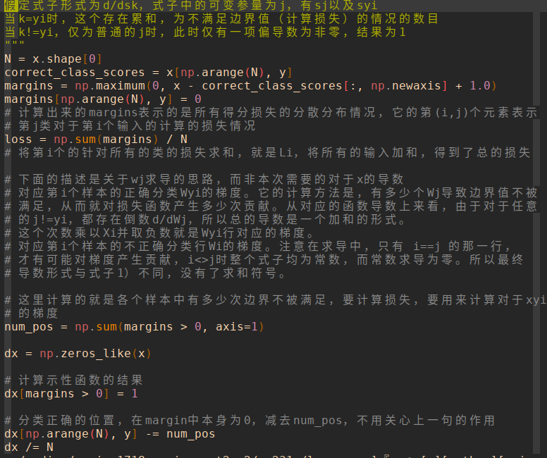
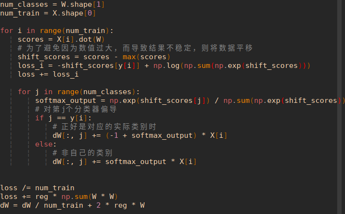
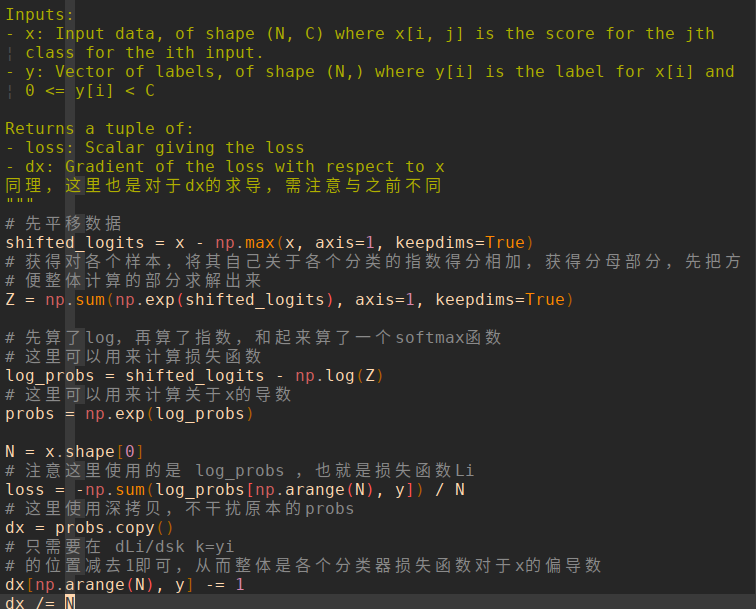

# 线性分类

## k-NN的不足

k-Nearest Neighbor （k-NN）分类器, 该分类器的基本思想是通过将测试图像与训练集带标签的图像进行比较, 来给测试图像打上分类标签. k-Nearest Neighbor分类器存在以下不足：

* 分类器必须*记住*所有训练数据并将其存储起来, 以便于未来测试数据用于比较. 这在存储空间上是低效的, 数据集的大小很容易就以GB计.
* 对一个测试图像进行分类需要和所有训练图像作比较, 算法计算资源耗费高.

**概述**：我们将要实现一种更强大的方法来解决图像分类问题, 该方法可以自然地延伸到神经网络和卷积神经网络上. 这种方法主要有两部分组成：

* 一个是**评分函数(score function)**, 它是原始图像数据到类别分值的映射.
* 另一个是**损失函数(loss function)**, 它是用来量化预测分类标签的得分与真实标签之间一致性的.

该方法可转化为一个最优化问题, 在最优化过程中, 将通过更新评分函数的参数来最小化损失函数值.

## 从图像到标签分值的参数化映射

这个函数将图像的像素值映射为各个分类类别的得分, 得分高低代表图像属于该类别的可能性高低.

举例来说, 在CIFAR-10中, 我们有一个**N**=50000的训练集, 每个图像有**D**=32x32x3=3072个像素, 而**K**=10, 这是因为图片被分为10个不同的类别(狗, 猫, 汽车等). 我们现在定义评分函数为：, 该函数是原始图像像素到分类分值的映射.

在上面的公式中, 假设每个图像数据都被拉长为一个长度为D的列向量, 大小为[D x 1]. 其中大小为[K x D]的矩阵**W**和大小为[K x 1]列向量**b**为该函数的参数(parameters). 还是以CIFAR-10为例, $x_i$就包含了第i个图像的所有像素信息, 这些信息被拉成为一个[3072 x 1]的列向量, **W**大小为[10x3072], **b**的大小为[10x1]. 因此, 3072个数字(原始像素数值)输入函数, 函数输出10个数字(不同分类得到的分值). 参数**W**被称为**权重(weights)**. **b**被称为**偏差向量(bias vector)**, 这是因为它影响输出数值, 但是并不和原始数据$x_i$产生关联. 在实际情况中, 人们常常混用**权重**和**参数**这两个术语.

需要注意的几点：

* 首先, 一个单独的矩阵乘法就高效地并行评估10个不同的分类器(每个分类器针对一个分类), 其中每个类的分类器就是W的一个行向量.
* 注意我们认为输入数据是给定且不可改变的, 但参数**W**和**b**是可控制改变的. 我们的目标就是通过设置这些参数, 使得计算出来的分类分值情况和训练集中图像数据的真实类别标签相符. 在接下来的课程中, 我们将详细介绍如何做到这一点, 但是目前只需要直观地让正确分类的分值比错误分类的分值高即可.
* 该方法的一个优势是训练数据是用来学习到参数**W**和**b**的, 一旦训练完成, 训练数据就可以丢弃, 留下学习到的参数即可. 这是因为一个测试图像可以简单地输入函数, 并基于计算出的分类分值来进行分类.
* 最后, 注意只需要做一个矩阵乘法和一个矩阵加法就能对一个测试数据分类, 这比k-NN中将测试图像和所有训练数据做比较的方法快多了.

> 预告：卷积神经网络映射图像像素值到分类分值的方法和上面一样, 但是映射 *(f)*就要复杂多了, 其包含的参数也更多

## 理解线性分类器

图像实际上就可以看作是一个高维度的点, 也就是特征空间的一个点.

> 分类是实现的区域的一个规划.

**W**的每一行都是一个分类类别的分类器. 对于这些数字的几何解释是：如果改变其中一行的数字, 会看见分类器在空间中对应的直线开始向着不同方向旋转. 而偏差**b**, 则允许分类器对应的直线平移. 需要注意的是, 如果没有偏差, 无论权重如何, 在时分类分值始终为0. 这样所有分类器的线都不得不穿过原点.

> 故而偏差b又被称作截距
>
> 这里的线性分类器评分函数的过程, 有点类似于线性规划.


**将线性分类器看做模板匹配**：

关于权重**W**的另一个解释是**它**的每一行对应着一个分类的模板(有时候也叫作*原型*). 一张图像对应不同分类的得分, 是通过使用内积(也叫*点积*)来比较图像和模板, 然后*找到和哪个模板最相似*. 从这个角度来看, **线性分类器就是在利用学习到的模板, 针对图像做模板匹配**. 从另一个角度来看, 可以认为还是在高效地使用k-NN, 不同的是我们没有使用所有的训练集的图像来比较, 而是每个类别只用了一张图片(这张图片是我们学习到的, 而不是训练集中的某一张), 而且我们会使用(负)内积来计算向量间的距离, 而不是使用L1或者L2距离.


这里展示的是以CIFAR-10为训练集, 学习结束后的权重的例子. 注意, 船的模板如期望的那样有很多蓝色像素. 如果图像是一艘船行驶在大海上, 那么这个模板利用内积计算图像将给出很高的分数. 可以看到马的模板看起来似乎是两个头的马, 这是因为训练集中的马的图像中马头朝向各有左右造成的. 线性分类器将这两种情况融合到一起了. 类似的, 汽车的模板看起来也是将几个不同的模型融合到了一个模板中, 并以此来分辨不同方向不同颜色的汽车. 这个模板上的车是红色的, 这是因为CIFAR-10中训练集的车大多是红色的.

**线性分类器对于不同颜色的车的分类能力是很弱的**, 但是后面可以看到神经网络是可以完成这一任务的. 神经网络可以在它的隐藏层中实现<u>中间神经元来探测不同种类的车</u>(比如绿色车头向左, 蓝色车头向前等). 而下一层的神经元通过<u>计算不同的汽车探测器的权重和</u>, 将这些合并为一个更精确的汽车分类分值.

分类**评分函数**定义为：


分开处理这两个参数(权重参数和偏差参数)有点笨拙, 一般常用的方法是把两个参数放到同一个矩阵中, 同时$x_i$向量就要增加一个维度, 这个维度的数值是常量1, 这就是默认的*偏差维度*. 这样新的公式就简化成下面这样：


**图像数据预处理**：在上面的例子中, 所有图像都是使用的原始像素值(从0到255). 在机器学习中, 对于输入的特征做归一化(normalization)处理是常见的套路. 而在图像分类的例子中, 图像上的每个像素可以看做一个特征. 在实践中, 对每个特征减去平均值来**中心化**数据是非常重要的. 在这些图片的例子中, 该步骤意味着根据训练集中所有的图像计算出一个平均图像值, 然后每个图像都减去这个平均值, 这样图像的像素值就大约分布在[-127, 127]之间了. 下一个常见步骤是, 让所有数值分布的区间变为[-1, 1]. **零均值的中心化**是很重要的, 等我们理解了梯度下降后再来详细解释.

## 损失函数

在上一节定义了从图像像素值到所属类别的评分函数(score function), 该函数的参数是权重矩阵. 在函数中, 数据是给定的, 不能修改. 但是我们可以调整权重矩阵这个参数, 使得评分函数的结果与训练数据集中图像的真实类别一致, 即评分函数在正确的分类的位置应当得到最高的评分(score).

我们将使用**损失函数(Loss Function)**(有时也叫**代价函数 Cost Function**或**目标函数 Objective)**来衡量我们对结果的不满意程度. 直观地讲, 当评分函数输出结果与真实结果之间差异越大, 损失函数输出越大, 反之越小.

### 多类支持向量机损失

损失函数的具体形式多种多样. 首先, 介绍常用的多类支持向量机(SVM)损失函数. SVM的损失函数想要SVM在正确分类上的得分始终比不正确分类上的得分高出一个边界值. 我们可以把损失函数想象成一个人, 这位SVM先生(或者女士)对于结果有自己的品位, 如果某个结果能使得损失值更低, 那么SVM就更加喜欢它.

评分函数输入像素数据, 然后通过公式来计算不同分类类别的分值. 这里我们将分值简写为. 针对第j个类别的得分就是第j个元素：.

针对第i个数据的多类SVM的损失函数定义如下：(所有不正确分类的累加)


$j=y_i$对应的偏导数为$\nabla_{w_{y_i}}L_i=-(\sum_{j \neq y_{i}}1(s_j-s_{y_i}+\Delta>0))x_i$

$j\neq y_i$对应的偏导数为$\nabla_{w_{j}}L_i=1(s_j-s_{y_i}+\Delta>0)x_i$

大体代码如下：

1. 计算损失函数



2. 计算导数关于W



> 要注意, 有时候要求取的是关于s的偏导数, 代码如下：(下面的代码中, 计算了损失函数和关于x的偏导数)
>
> 

**举例**：用一个例子演示公式是如何计算的. 假设有3个分类, 并且得到了分值![s=[13,-7,11]](https://www.zhihu.com/equation?tex=s%3D%5B13%2C-7%2C11%5D). 其中第一个类别是正确类别, 即($j=y_i$). 同时假设是10(后面会详细介绍该超参数). 上面的公式是将**所有不正确分类()加起来**, 所以我们得到两个部分：


可以看到第一个部分结果是0, 这是因为[-7-13+10]得到的是负数, 经过函数处理后得到0. 这一对类别分数和标签的损失值是0, 这是因为正确分类的得分13与错误分类的得分-7的差为20, 高于边界值10. 而**SVM只关心差距至少要大于10, 更大的差值还是算作损失值为0. **虽然正确分类的得分比不正确分类的得分要高(13>11), 但是比10的边界值还是小了, 分差只有2, 这就是为什么损失值等于8.

简而言之, <u>SVM的损失函数想要正确分类类别的分数比不正确类别分数高, 而且至少要高. 如果不满足这点, 就开始计算损失值. 也就是说, 不正确分类分数大于正确分类分数减去delta时, 就开始计算损失. </u>


**多类SVM“想要”正确类别的分类分数比其他不正确分类类别的分数要高, 而且至少高出delta的边界值. **

**如果其他分类分数进入了红色的区域, 甚至更高, 那么就开始计算损失. 如果没有这些情况, 损失值为0. **我们的目标是找到一些权重, 它们既能够让训练集中的数据样例满足这些限制, 也能让总的损失值尽可能地低.

函数, 它常被称为**折叶损失(hinge loss)**. 有时候会听到人们使用平方折叶损失SVM(即L2-SVM), 它使用的是, 将更强烈(平方地而不是线性地)地惩罚过界的边界值. 不使用平方是更标准的版本, 但是在某些数据集中, 平方折叶损失会工作得更好. 可以通过交叉验证来决定到底使用哪个.

*我们对于预测训练集数据分类标签的情况总有一些不满意的, 而损失函数就能将这些不满意的程度量化. *

#### 正则化(Regularization)

**上面损失函数有一个问题. 假设有一个数据集和一个权重集**W**能够正确地分类每个数据(即所有的边界都满足, 对于所有的i都有). 问题在于这个**W**并不唯一：可能有很多相似的**W**都能正确地分类所有的数据. 一个简单的例子：如果**W**能够正确分类所有数据, 即对于每个数据, 损失值都是0. 那么当时, 任何数乘都能使得损失值为0, 因为这个变化将所有分值的大小都均等地扩大了, 所以它们之间的绝对差值也扩大了.

举个例子, 如果一个正确分类的分值和举例它最近的错误分类的分值的差距是15, 对**W**乘以2将使得差距变成30.

换句话说, 我们希望能向某些特定的权重**W**添加一些偏好, 对其他权重则不添加, 以此来消除模糊性. 这一点是能够实现的, 方法是向损失函数增加一个**正则化惩罚(regularization penalty)**部分. 最常用的正则化惩罚是L2范式, L2范式通过对所有参数进行逐元素的平方惩罚来抑制大数值的权重：


上面的表达式中, 将中所有元素平方后求和. 注意正则化函数不是数据的函数, 仅基于权重. 包含正则化惩罚后, 就能够给出完整的多类SVM损失函数了, 它由两个部分组成：**数据损失(data loss)**, 即所有样例的的平均损失, 以及**正则化损失(regularization loss)**. 完整公式如下所示：


将其展开完整公式是：

![L=\frac{1}{N}\sum_i\sum_{j\not=y_i}[max(assets/equation-1536150854827)]+\lambda \sum_k \sum_l W^2_{k,l}](https://www.zhihu.com/equation?tex=L%3D%5Cfrac%7B1%7D%7BN%7D%5Csum_i%5Csum_%7Bj%5Cnot%3Dy_i%7D%5Bmax%280%2Cf%28x_i%3BW%29_j-f%28x_i%3BW%29_%7By_i%7D%2B%5CDelta%29%5D%2B%5Clambda+%5Csum_k+%5Csum_l+W%5E2_%7Bk%2Cl%7D)

其中, 是训练集的数据量. 现在正则化惩罚添加到了损失函数里面, 并用超参数来计算其权重. 该超参数无法简单确定, 需要通过交叉验证来获取.

> 多个样本的损失值是总体的平均值

引入正则化惩罚还带来很多良好的性质, 这些性质大多会在后续章节介绍. 比如引入了L2惩罚后, SVM们就有了**最大边界(max margin)**这一良好性质. 其中最好的性质就是对大数值权重进行惩罚, 可以提升其泛化能力, 因为这就意味着没有哪个维度能够独自对于整体分值有过大的影响.

举个例子, 假设输入向量![x=[1,1,1,1]](https://www.zhihu.com/equation?tex=x%3D%5B1%2C1%2C1%2C1%5D), 两个权重向量![w_1=[1,0,0,0]](https://www.zhihu.com/equation?tex=w_1%3D%5B1%2C0%2C0%2C0%5D), ![w_2=[0.25,0.25,0.25,0.25]](https://www.zhihu.com/equation?tex=w_2%3D%5B0.25%2C0.25%2C0.25%2C0.25%5D). 那么, 两个权重向量都得到同样的内积, 但是的L2惩罚是1.0, 而的L2惩罚是0.25. 因此, **根据L2惩罚来看, 更好, 因为它的正则化损失更小. **从直观上来看, 这是因为的权重值更小且更分散.

既然**L2惩罚倾向于更小更分散的权重向量**, 这就会鼓励分类器最终将所有维度上的特征都用起来, 而<u>不是强烈依赖其中少数几个维度</u>. 在后面的课程中可以看到, **这一效果将会提升分类器的泛化能力, 并避免*过拟合*. **

需要注意的是, 和权重不同, **偏差没有这样的效果, 因为它们并不控制输入维度上的影响强度**. 因此通常只对权重正则化, 而不正则化偏差. 在实际操作中, 可发现这一操作的影响可忽略不计. 最后, 因为正则化惩罚的存在, 不可能在所有的例子中得到0的损失值, 这是因为只有当的特殊情况下, 才能得到损失值为0.

#### 代码实现

```python
def L_i(x, y, W):
    """
	unvectorized version. Compute the multiclass svm loss for a single example (x,y)
    - x is a column vector representing an image (e.g. 3073 x 1 in CIFAR-10)
      with an appended bias dimension in the 3073-rd position (i.e. bias trick)
    - y is an integer giving index of correct class (e.g. between 0 and 9 in CIFAR-10)
    - W is the weight matrix (e.g. 10 x 3073 in CIFAR-10)
    """
  	delta = 1.0 # see notes about delta later in this section
  	scores = W.dot(x) # scores becomes of size 10 x 1, the scores for each class
  	correct_class_score = scores[y]
  	D = W.shape[0] # number of classes, e.g. 10
  	loss_i = 0.0
  	for j in xrange(D): # iterate over all wrong classes
    	if j == y:
      		# skip for the true class to only loop over incorrect classes
      		continue
        # accumulate loss for the i-th example
        loss_i += max(0, scores[j] - correct_class_score + delta)
  	return loss_i

def L_i_vectorized(x, y, W):
  	"""
  	A faster half-vectorized implementation. half-vectorized
  	refers to the fact that for a single example the implementation contains
  	no for loops, but there is still one loop over the examples (outside this function)
  	"""
  	delta = 1.0
  	scores = W.dot(x)
  	# compute the margins for all classes in one vector operation
  	margins = np.maximum(0, scores - scores[y] + delta)
  	# on y-th position scores[y] - scores[y] canceled and gave delta. We want
  	# to ignore the y-th position and only consider margin on max wrong class
  	margins[y] = 0
  	loss_i = np.sum(margins)
  	return loss_i

def L(X, y, W):
  	"""
  	fully-vectorized implementation :
  	- X holds all the training examples as columns (e.g. 3073 x 50,000 in CIFAR-10)
 	- y is array of integers specifying correct class (e.g. 50,000-D array)
  	- W are weights (e.g. 10 x 3073)
  	"""
  	# evaluate loss over all examples in X without using any for loops
  	# left as exercise to reader in the assignment
```

还有, 对训练集中数据做出**准确分类预测和让损失值最小化这两件事是等价**的.

#### 设置Delta

超参数在绝大多数情况下设为都是安全的.

超参数和看起来是两个不同的超参数, 但实际上他们一起控制同一个权衡：即**损失函数中的数据损失和正则化损失之间的权衡**.

理解这一点的关键是要知道, 权重的大小对于分类分值有直接影响(当然对他们的差异也有直接影响)：当我们将中值缩小, 分类分值之间的差异也变小, 反之亦然. 因此, 不同分类分值之间的边界的具体值(比如或)从某些角度来看是没意义的, 因为权重自己就可以控制差异变大和缩小. 也就是说, **真正的权衡是我们允许权重能够变大到何种程度**(通过正则化强度来控制).

### 二元支持向量机

它对于第i个数据的损失计算公式是：

> 注意, 这里的max的第二项是一个三项的乘法

其中, $C$是一个超参数, 并且. 可以认为本章节介绍的SVM公式包含了上述公式, 上述公式是多类支持向量机公式只有两个分类类别的特例. 也就是说, 如果我们要分类的类别只有两个, 那么公式就化为二元SVM公式. 这个公式中的和多类SVM公式中的都控制着同样的权衡, 而且它们之间的关系是.

**备注：在初始形式中进行最优化**. 如果在本课程之前学习过SVM, 那么对kernels, duals, SMO算法等将有所耳闻. 在本课程(主要是神经网络相关)中, 损失函数的最优化的始终在非限制初始形式下进行. 很多这些损失函数从技术上来说是不可微的(比如当时, 函数就不可微分), 但是在实际操作中并不存在问题, 因为通常可以使用次梯度.

**备注：其他多类SVM公式**. 需要指出的是, 本课中展示的多类SVM只是多种SVM公式中的一种. 另一种常用的公式是*One-Vs-All*(OVA)SVM, 它针对每个类和其他类训练一个独立的二元分类器. 还有另一种更少用的叫做*All-Vs-All*(AVA)策略. 我们的公式是按照[Weston and Watkins 1999 (pdf)](https://link.zhihu.com/?target=https%3A//www.elen.ucl.ac.be/Proceedings/esann/esannpdf/es1999-461.pdf)版本, 比OVA性能更强(在构建有一个多类数据集的情况下, 这个版本可以在损失值上取到0, 而OVA就不行. 感兴趣的话在论文中查阅细节). 最后一个需要知道的公式是Structured SVM, 它将正确分类的分类分值和非正确分类中的最高分值的边界最大化. 理解这些公式的差异超出了本课程的范围. 本课程笔记介绍的版本可以在实践中安全使用, 而被论证为最简单的OVA策略在实践中看起来也能工作的同样出色(在 Rikin等人2004年的论文[In Defense of One-Vs-All Classification (pdf)](https://link.zhihu.com/?target=http%3A//www.jmlr.org/papers/volume5/rifkin04a/rifkin04a.pdf)中可查).

### Softmax分类器

SVM是最常用的两个分类器之一, 而另一个就是**Softmax分类器, **它的损失函数与SVM的损失函数不同. 对于学习过二元逻辑回归分类器的读者来说, Softmax分类器就可以理解为逻辑回归分类器面对多个分类的一般化归纳.

SVM将输出作为每个分类的评分(因为无定标, 所以难以直接解释). 与SVM不同, Softmax的输出(归一化的分类概率)更加直观, 并且从概率上可以解释, 这一点后文会讨论. 在Softmax分类器中, 函数映射保持不变, 但将这些评分值视为每个分类的未归一化的对数概率, 并且将*折叶损失(hinge loss)*替换为**交叉熵损失**(**cross-entropy loss)**. 公式如下：


或等价的

​											 

总的损失可以记为：$L=\frac{1}{N}\sum_iL_i$

其中$L_i$表示**第i个样本**对于整个分类器转换后的损失

> 第二个式子求导计算的时候更为简便, 可以参考下面的公式, 注意, 对于$j$的限定, 是针对分母的微分项而言, 分子不受干扰.
>
>
> $$
> L = \frac{1}{N}\sum_i(L_i) \\
> \frac{\partial L_i}{\partial W_j} = \frac{\partial (-W_{y_i}x_i+log(\sum_j e^{W_j x_i}))}{\partial W_j}\\
> =-x_i+(\sum_j e^{W_j x_i})^{-1}e^{W_{j}x_i}x_i (if\ j = y_i) \\
> or\\
> =(\sum_j e^{W_j x_i})^{-1}e^{W_{j}x_i}x_i (if\ j \neq y_i)
> $$
>



在上式中, 使用来表示分类评分向量中的第j个元素. 和之前一样, 整个数据集的损失值是数据集中所有样本数据的损失值的均值与正则化损失之和.

> 有时要关于x, 也就是这里的f求偏导数, 所以要小心, 使用的公式也变了：
> $$
> \frac{\partial L_i}{\partial f_k} = \\
> -1 + \frac{e^{f_{y_i}}}{\sum_j e^{f_j}} => k=y_i \\
> \frac{e^{f_{y_i}}}{\sum_j e^{f_j}} => k!=y_i
> $$
> 可以使用如下方法：
>
> 

其中函数被称作**softmax(柔性最大值) 函数**：其输入值是一个向量, 向量中元素为任意实数的评分值(中的, 也就是$z_j=\theta_j^Tx$), 函数对其进行压缩, 输出一个向量, 其中每个元素值在0到1之间, 且所有元素之和为1.

**信息理论视角**：在“真实”分布和估计分布之间的*交叉熵*定义如下：


因此, Softmax分类器所做的就是最小化在估计分类概率(就是上面的$q(x)$=)和“真实”分布($p(x)=l(y^{(i)}=j)$)之间的交叉熵($D_{KL}(p||q)$), 在这个解释中, “真实”分布就是所有概率密度都分布在正确的类别上(比如：![p=[0,...1,...,0]](https://www.zhihu.com/equation?tex=p%3D%5B0%2C...1%2C...%2C0%5D)中在的位置就有一个单独的1).

还有, 既然交叉熵可以写成熵和相对熵(Kullback-Leibler divergence), 并且delta函数的熵$H(p)$是0, 那么就能等价的看做是对两个分布之间的相对熵做最小化操作. 换句话说, 交叉熵损失函数“想要”预测分布的所有概率密度都在正确分类上.

> **Kullback-Leibler差异(Kullback-Leibler Divergence)**也叫做相对熵(Relative Entropy), 它衡量的是相同事件空间里的两个概率分布的差异情况.

**概率论解释**：先看下面的公式：


可以解释为是给定图像数据, 以为参数, 分配给正确分类标签的归一化概率.

为了理解这点, 请回忆一下Softmax分类器将**输出向量中的评分值解释为没有归一化的对数概率**. 那么以这些数值做指数函数的幂就得到了没有归一化的概率, 而除法操作则对数据进行了归一化处理, 使得这些概率的和为1.

从概率论的角度来理解, 我们就是在最小化正确分类的负对数概率, 这可以看做是在进行*最大似然估计*(MLE).

该解释的另一个好处是, 损失函数中的正则化部分可以被看做是权重矩阵的高斯先验, 这里进行的是最大后验估计(MAP)而不是最大似然估计. 提及这些解释只是为了让读者形成直观的印象, 具体细节就超过本课程范围了.

> 这里并不理解, 为何可以看作是高斯先验？为何进行的是最大后验估计？最大后验估计最大似然估计如何判断？

**实操事项：数值稳定. **

编程实现softmax函数计算的时候, 中间项和因为存在指数函数, 所以数值可能非常大. 除以大数值可能导致数值计算的不稳定, 所以学会使用归一化技巧非常重要. 如果在分式的分子和分母都乘以一个常数, 并把它变换到求和之中, 就能得到一个从数学上等价的公式：


的值可自由选择, 不会影响计算结果, 通过使用这个技巧可以提高计算中的数值稳定性. 通常将设为. 该技巧简单地说, <u>就是应该将向量中的数值进行平移, 使得最大值为0</u>. 代码实现如下：

```python
f = np.array([123, 456, 789])
# 例子中有3个分类, 每个评分的数值都很大
p = np.exp(f) / np.sum(np.exp(f))
# 不妙：数值问题, 可能导致数值爆炸

# 那么将f中的值平移到最大值为0：
f -= np.max(f) # f becomes [-666, -333, 0]
p = np.exp(f) / np.sum(np.exp(f)) # 现在OK了, 将给出正确结果
```

**让人迷惑的命名规则**：精确地说, SVM分类器使用的是*折叶损失(hinge loss)*, 有时候又被称为*最大边界损失(max-margin loss)*. Softmax分类器使用的是*交叉熵损失(corss-entropy loss)*. Softmax分类器的命名是从*softmax函数*那里得来的, softmax函数将原始分类评分变成正的归一化数值, 所有数值和为1, 这样处理后交叉熵损失才能应用. 注意从技术上说“softmax损失(softmax loss)”是没有意义的, 因为softmax只是一个压缩数值的函数. 但是在这个说法常常被用来做简称.

### SVM&Softmax


针对一个数据点, SVM和Softmax分类器的不同处理方式的例子. 两个分类器都计算了同样的分值向量**f**(本节中是通过矩阵乘来实现).

**不同之处**在于对**f**中分值的解释：

* SVM分类器将它们看做是分类评分, 它的损失函数<u>鼓励正确的分类(本例中是蓝色的类别2)的分值比其他分类的分值高出至少一个边界值</u>.
* Softmax分类器将这些数值看做是每个分类没有归一化的**对数概率**, <u>鼓励正确分类的归一化的对数概率变高, 其余的变低</u>.

SVM的最终的损失值是1.58, Softmax的最终的损失值是0.452, 但要注意这两个数值没有可比性. **只在给定同样数据, 在同样的分类器的损失值计算中, 它们才有意义. **

* Softmax分类器**为每个分类提供了“可能性**”：SVM的计算是无标定的, 而且难以针对所有分类的评分值给出直观解释.
* Softmax分类器则不同, 它**允许我们计算出对于所有分类标签的可能性**.

举个例子, 针对给出的图像, SVM分类器可能给你的是一个[12.5, 0.6, -23.0]对应分类“猫”, “狗”, “船”. 而softmax分类器可以计算出这三个标签的”可能性“是[0.9, 0.09, 0.01], 这就让你能看出对于不同分类准确性的把握. 为什么我们要在”可能性“上面打引号呢？这是因为可能性分布的集中或离散程度是由正则化参数λ直接决定的, λ是你能直接控制的一个输入参数. 举个例子, 假设3个分类的原始分数是[1, -2, 0], 那么softmax函数就会计算：

![[1,-2,0]\to[e^1,e^{-2},e^0]=[2.71,0.14,1]\to[0.7,0.04,0.26]](https://www.zhihu.com/equation?tex=%5B1%2C-2%2C0%5D%5Cto%5Be%5E1%2Ce%5E%7B-2%7D%2Ce%5E0%5D%3D%5B2.71%2C0.14%2C1%5D%5Cto%5B0.7%2C0.04%2C0.26%5D)

现在, 如果正则化参数λ更大, 那么权重W就会被惩罚的更多, 然后他的权重数值就会更小. 这样算出来的分数也会更小, 假设小了一半吧[0.5, -1, 0], 那么softmax函数的计算就是：

![[0.5,-1,0]\to[e^{0.5},e^{-1},e^0]=[1.65,0.73,1]\to[0.55,0.12,0.33]](https://www.zhihu.com/equation?tex=%5B0.5%2C-1%2C0%5D%5Cto%5Be%5E%7B0.5%7D%2Ce%5E%7B-1%7D%2Ce%5E0%5D%3D%5B1.65%2C0.73%2C1%5D%5Cto%5B0.55%2C0.12%2C0.33%5D)

现在看起来, 概率的分布就更加分散了. (更为均匀)

还有, 随着正则化参数λ不断增强, 权重数值会越来越小, 最后输出的概率会接近于**均匀分布**.

> 这也算是指数函数的特性

这就是说, softmax分类器算出来的概率最好是看成一种对于分类正确性的自信. 和SVM一样, 数字间相互比较得出的大小顺序是可以解释的, 但其绝对值则难以直观解释.

**在实际使用中, SVM和Softmax经常是相似的**：通常说来, 两种分类器的表现差别很小, 不同的人对于哪个分类器更好有不同的看法. 相对于Softmax分类器, SVM更加“局部目标化(local objective)”, 这既可以看做是一个特性, 也可以看做是一个劣势. 考虑一个评分是[10, -2, 3]的数据, 其中第一个分类是正确的. 那么一个SVM()会看到正确分类相较于不正确分类, 已经得到了比边界值还要高的分数, 它就会认为损失值是0. SVM对于数字个体的细节是不关心的：如果分数是[10, -100, -100]或者[10, 9, 9], 对于SVM来说没设么不同, 只要满足超过边界值等于1, 那么损失值就等于0.

对于softmax分类器, 情况则不同. 对于[10, 9, 9]来说, 计算出的损失值就远远高于[10, -100, -100]的. 换句话来说, softmax分类器对于分数是永远不会满意的：正确分类总能得到更高的可能性, 错误分类总能得到更低的可能性, 损失值总是能够更小. 但是, SVM只要边界值被满足了就满意了, 不会超过限制去细微地操作具体分数. 这可以被看做是SVM的一种特性. 举例说来, 一个汽车的分类器应该把他的大量精力放在如何分辨小轿车和大卡车上, 而不应该纠结于如何与青蛙进行区分, 因为区分青蛙得到的评分已经足够低了.

> 这里要注意, 对于softmax和svm最后的预测的时候, 也都是按照评分输出的结果来确定, 取最大分值来制指定分类.

## 小结

总结如下：

* 定义了从图像像素映射到不同类别的分类评分的评分函数. 在本节中, 评分函数是一个基于权重**W**和偏差**b**的线性函数.
* 与kNN分类器不同, **参数方法**的优势在于一旦通过训练学习到了参数, 就可以将训练数据丢弃了. 同时该方法对于新的测试数据的预测非常快, 因为只需要与权重**W**进行一个矩阵乘法运算.
* 介绍了偏差技巧, 让我们能够将偏差向量和权重矩阵合二为一, 然后就可以只跟踪一个矩阵.
* 定义了损失函数(介绍了SVM和Softmax线性分类器最常用的2个损失函数). 损失函数能够衡量给出的参数集与训练集数据真实类别情况之间的一致性. 在损失函数的定义中可以看到, 对训练集数据做出良好预测与得到一个足够低的损失值这两件事是等价的.

现在我们知道了如何基于参数, 将数据集中的图像映射成为分类的评分, 也知道了两种不同的损失函数, 它们都能用来衡量算法分类预测的质量. 但是, 如何高效地得到能够使损失值最小的参数呢？这个求得最优参数的过程被称为最优化, 将在下节课中进行介绍.
